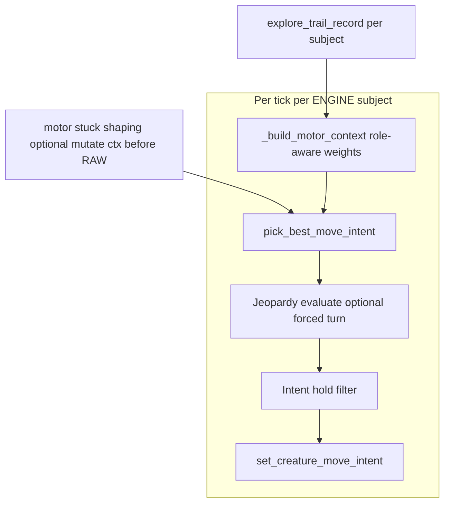

# Unified creature motor plan (iteration)

This extends the earlier herbivore vs carnivore comparison with **one ENGINE scripted pipeline** and **role-specific weights**, addressing symmetry (flee vs close), shared behaviors (trail, stuck, jeopardy, smoothing), and **solid-aware anticipation**.

## Goals

1. **Symmetric threats:** Herbivore flees predators via `mobs` distance/closing costs + jeopardy; carnivore should **close on prey** via the **same structural channel** where possible (not only `food_seek_targets`), so tuning one axis mirrors the other.
2. **Shared exploration:** Wandering/coverage behavior should apply to **all** ENGINE creatures when no stronger objective dominates—not only herbivores.
3. **Shared trail recording:** `_explore_trail_record` every tick for **every** scripted ENGINE subject—not only `prey`.
4. **Shared stuck detection:** Run `_motor_stuck_track_mob` (rename to `_motor_stuck_track_body` if applied to `CharacterBody2D`) for **all** subjects; keep tuning separate via config weights. Acknowledge current predator stuck tuning may still fail until symmetry/obstacle terms improve—track as regression tests + playtest.
5. **Predator jeopardy:** Run the same **`evaluate_jeopardy_tick` / `pick_forced_turn`** machinery for carnivores. Today duel has **no rival predator**, but pass **`ctx["mobs"]`** (other `RigidBody2D` in `mobs`, excluding self) so behavior is ready when multi-predator ships. Add **`weight_jeopardy_*`** (or role-specific multipliers) so rival-predator response strength is tunable independently from prey-facing pursuit (defaults chosen so solo-duel impact is negligible).
6. **Intent smoothing:** Carnivores use **`_IntentHoldScr.filtered_intent`** like herbivores, with **role-based hold ticks** (`scripted_intent_hold_physics_ticks`, `explore_intent_hold_extra_ticks`, optional carnivore overrides). Refactor `_physics_process` into **one post-motor chain**: raw intent → jeopardy override (either role, parameterized) → intent hold → `set_creature_move_intent`.
7. **Solid anticipation (new motor terms):** Use awareness-gated static geometry so predators **channel prey toward obstacles/corners** and prey **use obstacles as shields**.

---

## Architecture: one pipeline, weighted intents

**Role coefficients** (from `creature_definition`, groups, or motor_params overrides):

| Concept | Herbivore-style | Carnivore-style |
|--|--|--|
| Primary threat samples | Entries in `mobs` (predators) | Prey positions as **first-class pursuit samples** (see below) + optional rival predators in `mobs` |
| Food / energy targets | Plants in `food_seek_targets` | Same list semantics; prey continues to contribute positions there for seek cost |
| Jeopardy threat list | `ctx["mobs"]` | `ctx["mobs"]` **excluding self** (rival predators); optionally include **prey-only jeopardy disabled**—rival predators only |
| Exploration | Enabled when hunger/objective gates say so | Same gates—do **not** zero exploration solely because prey exists; blend weights instead (below) |

---

## 1. Pursuit symmetry: prey in the `mobs` cost channel

**Issue:** [`cost_at_prediction`](creature/motor/cardinal_avoidance.gd) applies `weight_dist` / `weight_closing` only to `ctx["mobs"]`. Herbivores see carnivores there; carnivores do not see prey.

**Approach:**

- Build a **`prey_as_motor_samples`** array (same dictionary shape as `_motor_mobs_array` entries: `position`, `velocity`, `cost_scale`) from **`prey`** group nodes in awareness (reuse gates similar to [`_prey_positions_for_predator_motor`](AI_int_lib/ai_driver.gd); include velocity from prey body when available).
- **Merge into `ctx["mobs"]` for carnivores only**, OR add **`ctx["pursuit_targets"]`** and extend [`cost_at_prediction`](creature/motor/cardinal_avoidance.gd) with **`weight_pursuit_dist`** / **`weight_pursuit_closing`** (negative sign vs predator avoidance—implement as separate accumulation block so herbivore flee weights stay positive repulsion semantics).

Prefer **`pursuit_targets` + inverted weights** over polluting flee semantics inside mixed `mobs` arrays—clearer tuning for “inverse of herbivore.”

**Config:** `weight_pursuit_dist`, `weight_pursuit_closing`, `weight_pursuit_dist_sq` (names TBD), merged in [`game_config_merge.gd`](AI_int_lib/game_config_merge.gd).

---

## 2. Exploration / coverage for carnivores (and blending)

**Issue:** [`_build_motor_context`](AI_int_lib/ai_driver.gd) sets idle/turn/trail exploration weights only when `food_targets.is_empty()`. Any visible prey makes `food_targets` non-empty → **exploration stack off**.

**Approach:**

- Replace binary gate with **blended strengths:**
  - `w_explore_blend = lerpf(1.0, explore_when_primary_goal_weight, pursuit_urgency)` where `pursuit_urgency` derives from distance to prey, calorie ratio, or a dedicated “hunt urgency” curve.
  - Always attach **non-zero** exploration weights when `motor_exploration_always_enabled` (default true) scaled by blend.
- **`pick_best_move_intent`** ([`cardinal_avoidance.gd`](creature/motor/cardinal_avoidance.gd)): replace `food_targets.is_empty()` guards on idle/turn/trail/expand with **`mob_threat_high`** AND **`exploration_suppression`** driven by context keys (e.g. `explore_gate_empty_food_only` deprecated).

---

## 3. Explore trail: common + **per-subject buffers**

**Issue:** [`_explore_trail_centers`](AI_int_lib/ai_driver.gd) is **one global array**. Recording every creature into it makes agents repel **each other’s** paths.

**Approach:**

- Replace with **`Dictionary[int, Array]`** keyed by **`PhysicsBody2D.get_instance_id()`** (or parallel arrays on driver).
- **`_explore_trail_record(body_id, world, motor_p)`** appends only that creature’s deque.
- **`_build_motor_context`** passes **`trail_for_motor = trails.get(body_id, []).duplicate()`** (still omit active cell tail as today).
- **`_explore_trail_reset`** clears entire dict on round reset.

---

## 4. Stuck detection: universal + ctx mutation order

- Move stuck block **before** `pick_best_move_intent` for **all** ENGINE subjects (not only `mobs`).
- Keep `_motor_stuck_track_*` keyed by instance id (already).
- Carnivore-specific **`motor_stuck_allow_expand_hint`** becomes **`motor_stuck_expand_hint_roles`** or numeric weight multiplier by role.

---

## 5. Jeopardy for predators (future-proof weights)

**Today:** [`jeopardy_forced_turn.gd`](creature/motor/jeopardy_forced_turn.gd) reads **`mobs`**; [`evaluate_jeopardy_tick`](creature/motor/jeopardy_forced_turn.gd) detects forward-cone imminent threat and **`pick_forced_turn`** picks a **flee-style** cardinal away from threat mob.

**For carnivores:**

- Pass **`ctx["mobs"]`** that includes **rival predators only** (exclude self—already done in `_motor_mobs_array` when subject is carnivore). Prey remains **not** in `mobs`, so duel solo predator sees empty threat list → **no jeopardy fire** until rivals exist.
- Add **`jeopardy_weight_rival_predator`** (default `1.0`) applied inside evaluation or tune **`jeopardy_forced_turn_ticks`** per role via merged motor_params (`jeopardy_forced_turn_ticks_predator` optional).

**Optional extension:** Separate **`_jeopardy_state`** per creature instance id (today single `_jeopardy_forced_turn_state` may collide when multiple ENGINE herbivores exist).

---

## 6. Intent smoothing: unify for carnivores

- After jeopardy (same ordering as prey), apply **`filtered_intent`** with `hold_ticks` from hunger/exploration modifiers + optional **`intent_hold_ticks_predator`**.
- Ensure jeopardy branch resets hold state consistently (`Callable(_IntentHoldScr, &"reset_state")`—already on forced turn for prey).

---

## 7. Solid object anticipation (all creatures)

**Existing:** [`_static_obstacles_for_motor`](AI_int_lib/ai_driver.gd) collects **`obstacles`** group `StaticBody2D` rectangles; [`cost_at_prediction`](creature/motor/cardinal_avoidance.gd) treats them as **repulsive** via `weight_obstacle` / `_add_mob_cost_terms`.

**New behaviors:**

### Prey (shield / corner escape)

- **Occlusion bonus:** For each cardinal prediction, compute segment **creature_center → predator_center** vs nearest obstacle edge; reward moves that **increase** obscured fraction or **minimum predator-to-self clearance subject to obstacle blocking** (cheap approximation: dot toward obstacle normal away from predator).
- **Corner affinity when chased:** When predator within `awareness_radius` and closure positive, add cost reduction for headings that move toward **concave vertices** or **narrow openings** ahead (requires obstacle decomposition or sampling obstacle corners within cone).

### Predator (channel toward traps)

- **Pin geometry:** Prefer predictions such that **prey lies deeper inside pocket** formed by predator approach direction + nearest large static AABB—e.g. maximize **`proj(prey_rel, toward_obstacle)`** minus predator flank clearance penalty.
- **Implementation sketch:** Awareness-filter obstacles (distance + cone). For top-K obstacle corners or face midpoints within radius, add **`weight_predator_obstacle_pin`** × score(prediction, prey_pos, obstacle_sample, predator_vel).

### Plumbing

- **v1 geometry scope (maintainer choice):** Extend obstacle ingestion beyond rectangles to **`RectangleShape2D`**, **`CapsuleShape2D`**, and **`ConvexPolygonShape2D`** under `obstacles` group `StaticBody2D` nodes:
  - **Rectangles:** existing center + half extents → corners + inward/outward normals for flank scoring.
  - **Capsules:** axis-aligned sampling or analytic closest-point queries from predicted footprint / creature → predator ray; expose **segment spine + radius** plus a small set of **sample points** along the capsule boundary within awareness for corner/pin heuristics.
  - **Convex polygons:** polygon vertices in global space + edge normals; occlusion / pin scores use edge segments (same ray–segment utilities as rects).
- Centralize in **`motor_obstacle_geometry.gd`** (pure helpers): build **`StaticObstacleSample`** dicts `{ points[], normals[], bounds_rect, shape_kind }` once per obstacle node; **`AiDriver`** filters samples into **`aware_static_samples`** by distance/cone vs creature.
- Extend **`ctx`** with **`aware_static_samples`** filtered once per tick per creature—avoid scanning full tree inside inner cardinal loop.
- Add strategic scoring on **`CardinalAvoidance`** or **`motor_obstacle_strategy.gd`** for testability.
- **Unit tests:** deterministic layouts per shape kind + mocked predator/prey positions asserting cardinal ranking shifts toward barrier lane / shield moves.

---

## 8. Files likely touched

| Area | Files |
|--|--|
| Pipeline / symmetry | [`AI_int_lib/ai_driver.gd`](AI_int_lib/ai_driver.gd), [`creature/motor/cardinal_avoidance.gd`](creature/motor/cardinal_avoidance.gd) |
| Jeopardy state isolation | [`creature/motor/jeopardy_forced_turn.gd`](creature/motor/jeopardy_forced_turn.gd), [`AI_int_lib/ai_driver.gd`](AI_int_lib/ai_driver.gd) |
| Config defaults | [`AI_int_lib/game_config_merge.gd`](AI_int_lib/game_config_merge.gd), [`game_config.json`](game_config.json) |
| Tests | [`tests/run_all.gd`](tests/run_all.gd) — pursuit symmetry, per-body trails, jeopardy idle rival, obstacle bias sanity |

---

## 9. Risks / sequencing

1. **Per-body trails + blended exploration** first—low risk, fixes obvious fairness bugs.
2. **Pursuit channel (`pursuit_targets`)**—major behavior change; tune weights against duel metrics.
3. **Unified jeopardy + intent hold for carnivore**—watch oscillation; may need lower hold ticks for predators.
4. **Obstacle anticipation**—geometry-heavy v1 includes rect + capsule + convex polygon ingestion; capsule/polygon paths need extra regression tests vs rectangle-only baseline.

---

## 10. Doc policy note

Feature specs remain authoritative only when cited by maintainer; this file is **implementation planning** under `.cursor/plans/`. Promoting behaviors into **`Project_Docs/Draft_Features/`** can happen after scope freeze.
