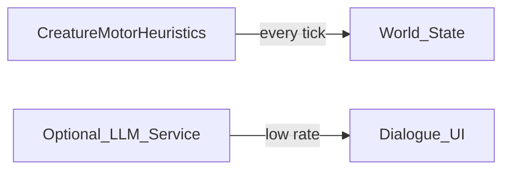

# Dodge the Creeps — Design doc (agent-friendly)

> Fill each section before implementation. Keep bullets concrete enough that an agent can open the right files and know when it is done.

---

## 1. Phase summary

**Phase name:** AI / LLM integration — **conversation & non-motor** scope

**One-line objective:** Record project intent: **TinyLlama (or successor) remote inference stays in the repo** for optional **dialogue, narration, or rare high-level decisions**—not as the **primary motor cortex** for creatures the world must simulate at scale.

**Out of scope (explicit non-goals):**  
- Replacing `player.gd` / future creature steering with per-tick LLM calls for core locomotion (tabled).  
- Training or fine-tuning models inside Godot.

---

## 2. Context for agents

**Repo / project root:** `{projectHome}/dodge-the-creeps`

**Engine & version:** Godot 4.6.2

**Main scenes / entry:** `AiDriver` autoload; see [DtC_AI_INT_PLAN.md](DtC_AI_INT_PLAN.md) and [Completed_Features/DtC_AI_INT_PLAN.md](Completed_Features/DtC_AI_INT_PLAN.md) for what shipped.

**Key scripts (paths):**  
- `AI_int_lib/ai_driver.gd`, inference client config, `system_prompt.txt`.

**Existing patterns to follow:**  
- [`.cursor/rules/AGENTS.md`](../.cursor/rules/AGENTS.md)  
- Do **not** delete working inference code; new gameplay AI should live in **heuristic / utility / BT** modules per [VISION_WORLD_BUILDER_PLAN.md](VISION_WORLD_BUILDER_PLAN.md).

---

## 3. Requirements

### Must have (policy)

- Any new feature plan that adds “creature AI” defaults to **non-LLM** controllers unless this doc (or a child plan) explicitly approves LLM use for that subsystem.

### Should have

- When re-enabling LLM for dialogue: separate prompts and **grammar** from movement tokens.

### Nice to have

- Budget: max tokens / max calls per real-time minute per player.

---

## 4. Technical design

### Architecture / data flow

### Scene & file changes

| Action | Path | Notes |
|--------|------|-------|
| preserve | `AI_int_lib/*` | Keep for future conversation experiments |

### Dependencies

- Remote `llama-server` or compatible (existing POC).

---

## 5. Implementation plan (ordered)

1. **Current:** Table motor use of LLM; keep dodge POC playable with human or scripted AI.  
2. **Future:** Add `DialogueController` that calls inference with chat template—not `ai_driver` movement path.  
3. Optional: **hybrid** where script picks safe move set and LLM picks among 2–3 options (still document rate limits).

---

## 6. Acceptance criteria

- [ ] World/creature feature plans reference this policy when discussing AI.  
- [ ] No accidental regression: removing `AiDriver` autoload is **not** required for new ecology phases.

---

## 7. Risks & mitigations

| Risk | Mitigation |
|------|------------|
| Contributors assume LLM is required for NPCs | Link this doc from VISION + AGENTS index |

---

## 8. Testing / verification

- Existing AI integration tests remain as regression suite when LLM path is touched.

---

## 9. Open questions

- <<Question: Single shared HTTP client vs per-subsystem queues?>>

---

## 10. Changelog (this phase)

| Date | Change |
|------|--------|
| 2026-05-11 | Documented tabled motor use; preserve code for future dialogue. |
