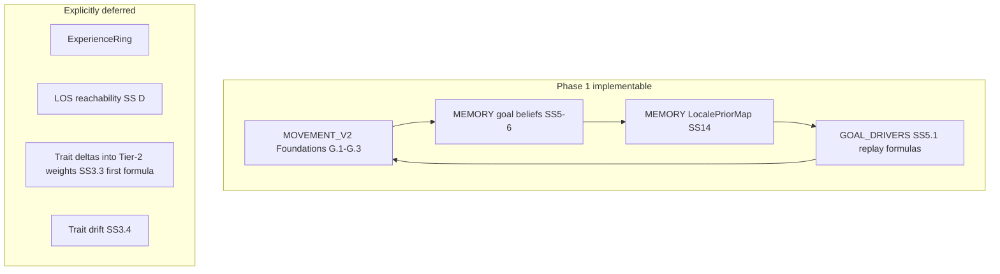

# Pre-implementation review: goal drivers, memory, movement V2

## Verdict

The three drafts are **coherent enough to start phased implementation** aligned with [CREATURE_MOVEMENT_V2.md §B.3](Project_Docs/Draft_Features/CREATURE_MOVEMENT_V2.md) (movement Foundations → goal memory → tune). **Phase-1 locale priors** ([CREATURE_MEMORY.md §14](Project_Docs/Draft_Features/CREATURE_MEMORY.md)) and **strategy-class replay** ([CREATURE_GOAL_DRIVERS.md §5.1](Project_Docs/Draft_Features/CREATURE_GOAL_DRIVERS.md)) are largely **Resolved**.

**Do not treat the stack as contract-frozen** until the items in **Blockers** and **High-impact ambiguities** below are either resolved in docs or explicitly scoped in the implementing PR (per AGENTS.md ambiguity protocol).

---

## Blockers (resolve or scope before learning-layer code)

| Gap | Where | Why it blocks |
|-----|--------|----------------|
| **Tag validation / pack extension** | [GOAL_DRIVERS §5.1](Project_Docs/Draft_Features/CREATURE_GOAL_DRIVERS.md) — only remaining `<<Question>>` | Storage and emitters need **allowlist + extension rules** (reject vs strip unknown ids, pack table shape). |
| **`GoalKind` type + Tier-2 mapping** | Scattered (`GoalKind.shelter`, write-gate “danger/shelter”, no enum in code) | Write gates, row keys, and tests need a **single enum or string contract** mapping **Avoid hostiles / Find food / Find mate / shelter** (e.g. flee outcome → `GoalKind` for priors). [GOAL_DRIVERS §4](Project_Docs/Draft_Features/CREATURE_GOAL_DRIVERS.md) rolls categories to Tier-2 but not to storage ids. |
| **`context_hash` phase-1 numerics** | [MEMORY §2.1, §14](Project_Docs/Draft_Features/CREATURE_MEMORY.md) — “grid cell *candidate*”; overlay detail “locks with implementation” | Without **cell size, origin, clamp, awareness alignment** for **Find food**, two implementations will not share buckets. |
| **LocalePriorMap row shape vs multi-modality writes** | [MEMORY §14 normalization](Project_Docs/Draft_Features/CREATURE_MEMORY.md) says `(GoalKind, context_hash[, modality])` but salient writes carry **tag sets** | Unclear: **one row per hash** with embedded modality stats vs **one row per (hash, modality_tag)**. Slot B reads stats from **highest `modality_strength` tag’s row** ([GOAL_DRIVERS §5.1](Project_Docs/Draft_Features/CREATURE_GOAL_DRIVERS.md)) — implies **per-modality rows**; reconcile with aggregate wording. |
| **Salient-write emitter ownership** | [GOAL_DRIVERS §5.1 episode write](Project_Docs/Draft_Features/CREATURE_GOAL_DRIVERS.md) | Who sets **`modality_tags[]`** at outcome — `ai_driver`, memory module, motor post-mortem? **`modality_tags` required when emitter knows** — define “knows” and default when empty. |
| **`believed_goal_source_bias` blend math** | [MEMORY §14 projection](Project_Docs/Draft_Features/CREATURE_MEMORY.md) — hybrid centroid + `weight_coarse_sector_goal_bias` | Missing: **neighbor radius**, **top-N buckets**, **weights for vector vs 8-way sectors**, and how cardinal scorer consumes the struct (additive cost terms vs tier weight). |
| **`locale_prior_strength` / `replay_weight`** | [GOAL_DRIVERS combine](Project_Docs/Draft_Features/CREATURE_GOAL_DRIVERS.md) — `prior_base = locale_prior_strength(...)`; `replay_weight = prior_base * (1 + replay_delta/100)` **or** additive per §A.3.1 | Motor integration path is **forked in prose** — pick one for phase 1. |
| **Starter radii** | [MOVEMENT_V2 §A.3.1](Project_Docs/Draft_Features/CREATURE_MOVEMENT_V2.md) — `believed_goal_hotspot_near_radius_px`, `believed_goal_seek_escalate_radius_px` **TBD** | Escalate/hotspot behavior is specified logically but **not tunable** without defaults in [MEMORY §10](Project_Docs/Draft_Features/CREATURE_MEMORY.md). |

---

## High-impact ambiguities (can ship with PR-documented choices)

### GOAL_DRIVERS

- **First trait → Tier-2 formula** ([§3.3](Project_Docs/Draft_Features/CREATURE_GOAL_DRIVERS.md)): scale is resolved; **concrete per-trait mapper** is explicitly “add beside merge” — V2 checklist allows stub ([MOVEMENT_V2 §G.3](Project_Docs/Draft_Features/CREATURE_MOVEMENT_V2.md)).
- **`external_urgency`**: required for near-±100 Slot A; no numeric definition (jeopardy flag? hunger band? bitmask).
- **Tuning constants** (`k`, `n_sat`, `n_min`, `w_fit`/`w_store`, bell breakpoints): documented as **first-pass** — fine for impl if exposed as `creature_motor` keys.
- **`current_fit` per modality**: table is qualitative ([§5.1 Slot B](Project_Docs/Draft_Features/CREATURE_GOAL_DRIVERS.md)); **`fight` stub 0** — OK if documented.
- **Write-time pole inference** ([§5.1 table](Project_Docs/Draft_Features/CREATURE_GOAL_DRIVERS.md)): branches like `squeeze_commit` → `individual` **or** `community` need **deterministic rules** at write time.
- **Map/ring disagree predicate** ([Action 3](Project_Docs/Draft_Features/CREATURE_GOAL_DRIVERS.md)): tunable thresholds — **N/A phase 1** (ring deferred) but keep out of phase-1 tests.

### CREATURE_MEMORY

- **MVP escape hatch** ([§4 `<<Comment>>`](Project_Docs/Draft_Features/CREATURE_MEMORY.md)): **counters-only** `LocalePriorMap` vs full EWMA/tags — pick phase-1 MVP in PR or resolve in doc to avoid building full Slot B before movement is stable.
- **`last_used_time`**: “write **or** replay consult” — document one rule ([§14 decay](Project_Docs/Draft_Features/CREATURE_MEMORY.md)).
- **Belief vs prior TTL**: correctly **independent** — good; implementers must not conflate `goal_memory_*` with `locale_prior_*`.
- **`goal_memory_precise_radius_px` ~1000 px** ([§10](Project_Docs/Draft_Features/CREATURE_MEMORY.md)): starter in merge comments — **playtest tuning**, not a logic bug, but name “precise” is misleading; note in PR.
- **Threat-response pass** ([§14 escalation](Project_Docs/Draft_Features/CREATURE_MEMORY.md)): ordering is clear (local priors → then Avoid hard-win); **no algorithm** for how priors bias cardinals during threat pass — needs a thin spec or “phase 1: modality match only affects replay_rank_score, not flee” scope.

### CREATURE_MOVEMENT_V2

- **`preserve_seek_blend_smoothness` semantics** ([§A.3.1](Project_Docs/Draft_Features/CREATURE_MOVEMENT_V2.md) — TBD).
- **`SeekCandidate` relevance** ([§A.2](Project_Docs/Draft_Features/CREATURE_MOVEMENT_V2.md)): “top active concern” needs a **single source of truth** in `MotorContext` (tier weights vs hunger vs jeopardy).
- **LOS** ([§D](Project_Docs/Draft_Features/CREATURE_MOVEMENT_V2.md)): **interim distance+cone** acknowledged — shelter/squeeze credibility and `return_home` / `hide_stealth` fits depend on follow-up.
- **`believed_goal_*` in §G.3 checklist** vs [§A.3.1 Comment](Project_Docs/Draft_Features/CREATURE_MOVEMENT_V2.md) “may omit” — reconcile: **stub keys + zero bias** in Foundations PR is enough.

---

## Doc hygiene (non-blocking but causes agent drift)

Stale text still references **`<<Question>>` Actions 1–3** as open while GOAL_DRIVERS §5.1 Actions 2–3 are **Resolved**:

- [CREATURE_MEMORY.md](Project_Docs/Draft_Features/CREATURE_MEMORY.md) header (L5), §2.1 (L78), §2.2 (L82), §8.1 (L210), §14 intro (L297)
- [CREATURE_MOVEMENT_V2.md §A.3.1](Project_Docs/Draft_Features/CREATURE_MOVEMENT_V2.md) (L104)

Minor inconsistency: §2.1 bullet still says **`ExperienceRing` (optional phase-1)** (L52) while §14 defers ring — align to **future phase only**.

[GOAL_DRIVERS §6 table](Project_Docs/Draft_Features/CREATURE_GOAL_DRIVERS.md) still says MEMORY “§14 storage/tuning **questions**” — update to “mostly Resolved; validation + context_hash numerics open.”

---

## What is ready (no further design pass required)

| Area | Status |
|------|--------|
| Motivation tree Tier-1/2 | Resolved — [GOAL_DRIVERS §2](Project_Docs/Draft_Features/CREATURE_GOAL_DRIVERS.md), mirrored in MOVEMENT_V2 §A.3 |
| Trait scale, UI convention, application order | Resolved — §3 |
| Preserve vs Find bands | Resolved — MOVEMENT_V2 §A.3.1 (thresholds; blend knob semantics open) |
| `SeekCandidate` single ingress | Resolved — MOVEMENT_V2 §A.2 |
| `creature_motor` merge / dev vs ship profiles | Resolved — MOVEMENT_V2 §A.1 |
| Belief tiers precise/coarse/TTL/promotion | Resolved — MEMORY §5, MOVEMENT_V2 §C/F |
| Outcome → `reward_scalar`, write gates, `insufficient_yield` | Resolved — MEMORY §14 |
| LocalePriorMap decay/eviction | Resolved — MEMORY §14 + §10 keys |
| Escalation vs acute threat ordering | Resolved — MEMORY §14 + MOVEMENT_V2 §A.3.1 |
| Strategy-class two families, Slot A/B, top-3, multiply, confidence | Resolved — GOAL_DRIVERS §5.1 |
| `action_tag` | Excised — unified tag sets |
| ExperienceRing | Deferred — phase 1 map-only |
| Phasing order | Resolved — MOVEMENT §B.3 = MEMORY §4 |

---

## Recommended doc pass before implementation (small, high leverage)

1. **Resolve GOAL_DRIVERS Action 1 validation** — core allowlist location (`game_config_merge` vs resource), pack extension JSON shape, unknown-tag policy.
2. **Add `GoalKind` appendix** (one table): Tier-2 leaf ↔ storage enum ↔ first `context_hash` overlay (food grid only in phase 1).
3. **Lock phase-1 `context_hash` for Find food** — cell size px, world origin, include/exclude Z if 3D façade.
4. **Lock LocalePriorMap storage schema** — per `(GoalKind, context_hash, modality_tag)` row fields matching §14 + §5.1 confidence.
5. **One paragraph: `believed_goal_source_bias` + `replay_weight`** — data types and cardinal integration (point to `cardinal_avoidance.gd` ctx keys).
6. **Defaults for hotspot/escalate radii** in MEMORY §10 (even if wide, e.g. 200/600 px starters).
7. **Sweep stale `<<Question>>` Actions 1–3` references** in MEMORY + MOVEMENT_V2 headers.

---

## Suggested implementation slices (for planning only)

| Slice | Docs | Code touchpoints |
|-------|------|------------------|
| **A — Foundations** | MOVEMENT_V2 §G.1–G.3 | `game_config_merge.gd`, `ai_driver.gd` SeekCandidate builder, `cardinal_avoidance.gd`, pack `creature_motor` |
| **B — Goal beliefs** | MEMORY §5–6, §10 | `_goal_belief`, `goal_source_memory.gd` stub, merge remembered into `SeekCandidate` |
| **C — LocalePriorMap MVP** | MEMORY §14, GOAL_DRIVERS §5.1 write path | Salient outcome hook, map store, project `believed_goal_source_bias`; tags optional in MVP if counters-only |
| **D — Full replay** | GOAL_DRIVERS §5.1 formulas | Slot A/B, confidence, trait order in replay pick |
| **E — Deferred** | Ring, disagree merge, trait drift, LOS | Do not implement until docs reopened |

---

## Out of scope for this review (other docs)

- [CREATURE_MODEL_PLAN.md](Project_Docs/Draft_Features/CREATURE_MODEL_PLAN.md) `hunger` stored vs derived — MEMORY §11 says **derived**; keep consistent at vitals impl.
- Combat, mate systems, crush/ecology — correctly marked deferred in GOAL_DRIVERS §3.1 / §3.4.
