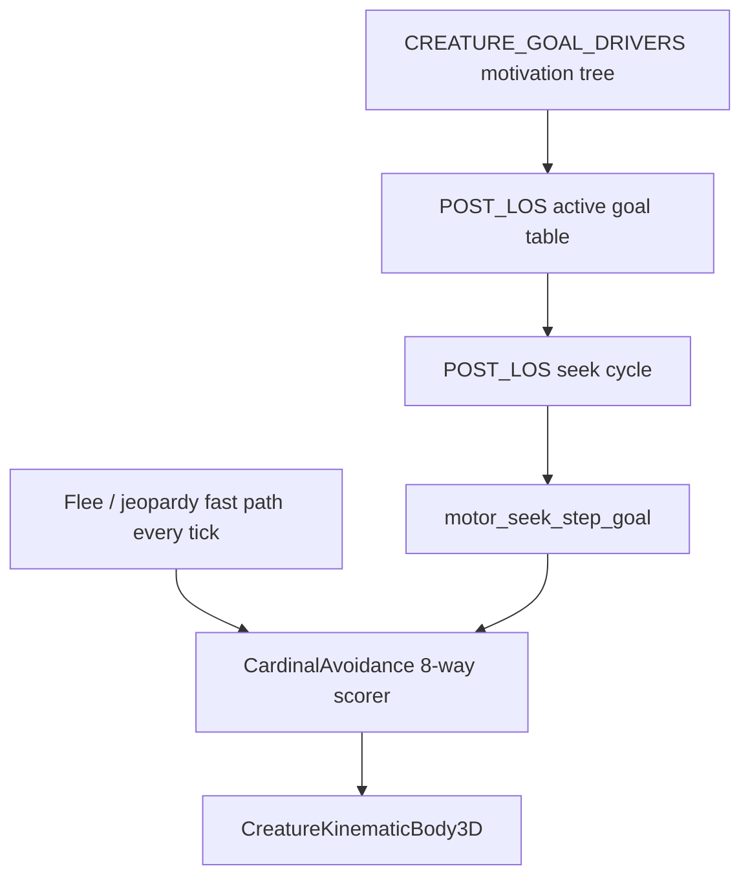

# POST_LOS movement — navigation / seek planner (draft)

> **Archived (2026-06-20 — V3 refactor Step 1):** Superseded by **[CREATURE_MOVEMENT_V3.md](../Draft_Features/CREATURE_MOVEMENT_V3.md)** §§2–3, §7, §10 (goal table, seek cycle, execution). Parent was [CREATURE_MOVEMENT_V2.md](CREATURE_MOVEMENT_V2.md) (also archived). **Snapshot** — drift expected. Not authoritative unless a task explicitly cites this archive.
>
> **Parent roadmap (archived):** [CREATURE_MOVEMENT_V2.md](CREATURE_MOVEMENT_V2.md) — superseded by **[CREATURE_MOVEMENT_V3.md](../Draft_Features/CREATURE_MOVEMENT_V3.md)** §§2–3, §7, §10.
>
> **Sibling contracts (archived paths):** motivation tree — [../Draft_Features/CREATURE_GOAL_DRIVERS.md](../Draft_Features/CREATURE_GOAL_DRIVERS.md); beliefs — [../Draft_Features/CREATURE_MEMORY.md](../Draft_Features/CREATURE_MEMORY.md); Observation stat — [../Definitive_Features/CREATURE_ATTRIBUTES_USAGE.md](../Definitive_Features/CREATURE_ATTRIBUTES_USAGE.md) §3.5.
>
> **Tier:** Draft (tier II) — decision trees below are normative intent; §§2–7 add implementable contracts. §§2.2, 3.3, 4.1, 4.4 design questions resolved (design round 4); 4.5c explore/backtrack unblocked.

---

## 1. Architectural placement (three layers)

POST_LOS **does not replace** [`cardinal_avoidance.gd`](../../creature/motor/cardinal_avoidance.gd). It sits **above** execution and **below** motivation.



| Layer | Owner doc | Cadence |
|-------|-----------|---------|
| Motivation / Tier-2 | [CREATURE_GOAL_DRIVERS.md](CREATURE_GOAL_DRIVERS.md) | Slow loop (every **n** ticks) + salient writes on outcomes |
| POST_LOS planner | **This file** | Slow loop (every **n** ticks) for goal table + path replan; **step execution** every physics tick |
| Cardinal motor | [CREATURE_MOVEMENT_V2.md](CREATURE_MOVEMENT_V2.md) §A.2 | Every physics tick |
| Acute threat | [CREATURE_MOVEMENT_V2.md](CREATURE_MOVEMENT_V2.md) §A.2.3 | **Every tick** — bypasses planner |

**Today (pre–Phase 4.5):** per-tick `dominant_tier2_leaf` + `motor_seek_goal_pos` + reactive escape overrides in [`ai_driver.gd`](../../AI_int_lib/ai_driver.gd). POST_LOS consolidates path/stuck decisions those overrides approximate.

---

## 2. Decision trees (normative intent)

### 2.1 Top-level movement tree

```
      -------------------
      | Is active goal  |
      | location known? |
      -------------------
          no |  | Yes
          ___    ___
          |        |
          V        V
      --------  ----------------
      | Seek |  | Is there  a  |
      --------  | clear path   |
                | to the goal? |
                ----------------
                  yes | | no
                ______   ______
                |              |
                V              V
          ------------    -----------------
          | move to  |    | Calculate     |
          | the goal |    | optimal steps |
          ------------    -----------------
                                  |
                                  V
                            ------------------
                            | Make the first |
                            | step the new   |
                            | active goal.   |
                            ------------------
```

### 2.2 Goal consideration cadence

Every **n** physics ticks, the zone of awareness is re-evaluated and **goal consideration** runs on new observations.

- **n** is derived from the creature's **Observation** attribute — higher Observation ⇒ **more frequent** replans ([CREATURE_ATTRIBUTES_USAGE.md §3.5](../Definitive_Features/CREATURE_ATTRIBUTES_USAGE.md)).
- Maintain an **active goal table** (goals + weights). Empty table ⇒ no movement / rest model if applicable.
- **Goal consideration** weighs all candidate goals. When a goal decomposes into steps, the earliest unaccomplished step is the **primary step** for that goal. If another goal's weight exceeds the incumbent, discard the step chain.

**Resolved — goal consideration vs Tier-2 dominance (4.5b):**

- **Goal consideration replaces** per-tick `derive_dominant_tier2_leaf` for motor goal selection once the active goal table lands ([CREATURE_MOVEMENT_V2.md](CREATURE_MOVEMENT_V2.md) §A.2.3). Between replan ticks, the **incumbent primary step** from the table drives `motor_seek_goal_pos`; the dominant leaf is **not** re-derived every physics tick.
- **Fast-path bypass (every tick):** flee / `tactic_jeopardy_egress` (live today). **Combat (future):** taking an attack action triggers **fight/flight immediately**, same bypass class as flee — planner and frozen goal table do not compete with acute combat response.

**Resolved — combat fast-path signal:** Use a **dedicated combat fast-path flag** (`tactic_fight_active` or successor — stub exists in [`motor_tactic_classifier.gd`](../../creature/motor/motor_tactic_classifier.gd)) so fight/flight is unambiguous — do **not** infer combat response from damage events, ambient `acute_threat`, or generic hostile-in-awareness alone.

- **Set:** Raised when the creature **takes an attack action** (combat state machine — not damage intake alone). Not implemented until combat lands.
- **Clear:** Defined with combat implementation; release triggers the same post-response goal-consideration contract as flee exit where applicable.
- **Goal-table contract:** Same as flee / `tactic_jeopardy_egress` — **freeze** the active goal table during combat response (weights, `step_chain`, `step_index` preserved); run a **full goal-consideration round** after release before resuming step execution.

### 2.3 Seek cycle tree

```
          --------
          | Seek |
          --------
              |
              V
      -----------------
      | Is this seek  |
      | part of a     |
      | larger goal?  |
      -----------------
        yes|    | no
        ----    -------------------------
        |                               |
        V                               |
    -------------                       |
    | Is goal   |                       |
    | target in |                       |
    | sight?    |                       |
    -------------                       |
    yes|      | No                      |
    ---       -------------------       |
    |                            |      |
    V                            V      V
  -----------               -----------------------
  | Is the  |               | Is there a visible  |
  | path    | <----------   | pattern that        |
  | clear?  |           |   | matches believed    |
  -----------           |   | goal targets?       |
  yes|     | No         |   -----------------------
  ----     ----------   |     yes |     | no
  |                 |   -----------     ---------
  V                 V                           |
------------  -------------------               V
| Go there |  | Is there enough |         -------------------------
------------  | information to  |         | Are there unexplored  |
              | calculate a     |         | locations in the      |
              | multistep clear |         | zone of awareness     |
              | path?           |         | with a clear path?    |
              -------------------         -------------------------
                yes |         | no                yes |         | no
                -----         --------                V         -------------
                |                     |             ---------------         |
                V                     V             | Go there    |         V
      ---------------------   -------------------   | and restart |   ---------------------
      | Generate the      |   | Pick path with  |   | Seek cycle  |   | Is there an area  |
      | path. Make first  |   | highest weight  |   ---------------   | behind that opens |
      | step the          |   | for getting     |                     | clear paths to    |
      | active goal.      |   | around blocker. |                     | unexplored areas? |
      ---------------------   -------------------                     --------------------
                |                      |                                 yes |      | no
                V                      V                                ------      -------
          ------------          ---------------                         |                 |
          | Go there |          | Go there    |                         V                 V
          ------------          | and restart |                   ---------------   ---------------
                                | Seek cycle  |                   | Go there    |   | backtrack   |
                                ---------------                   | and restart |   | and restart |
                                                                  | Seek cycle  |   | Seek cycle  |
                                                                  ---------------   ---------------
```

---

## 3. Data structures

### 3.1 `ActiveGoal`

| Field | Type | Role |
|-------|------|------|
| `goal_kind` | `String` | Engine `GoalKind` id ([CREATURE_GOAL_DRIVERS.md §4.1](CREATURE_GOAL_DRIVERS.md)) |
| `weight` | `float` | Goal consideration score this replan tick |
| `ultimate_pos` | `Vector3` | World target (prey, bush, remembered belief, patrol anchor) |
| `step_chain` | `PackedVector3Array` | Multistep path waypoints; empty = direct seek |
| `step_index` | `int` | Index of current step in `step_chain` |
| `source` | `String` | `live` \| `belief` \| `locale_prior` \| `explore` \| `backtrack` |

### 3.2 `StepPlan` (per-tick output to motor)

| Field | Type | Role |
|-------|------|------|
| `ultimate_goal` | `Vector3` | Original target before decomposition |
| `step_goal` | `Vector3` | Cardinal pull target this tick (first nav waypoint or ultimate) |
| `step_mode` | `String` | `direct` \| `navmesh` \| `detour_weighted` \| `explore` \| `backtrack` \| `none` |
| `path_valid` | `bool` | Multistep chain available when direct path blocked |

### 3.3 Replan scheduler

| Key | Default | Consumer |
|-----|---------|----------|
| `post_los_replan_base_ticks` | **8** | [`seek_planner.gd`](../../creature/motor/seek_planner.gd) `observation_replan_interval_ticks` |
| Observation input | `stat_observation` | Base stat only until observation pools land ([SHARED_STATTOPOINT_PLAN.md](SHARED_STATTOPOINT_PLAN.md)) |

**Resolved — Observation input:** `curr_point_observ` / `max_point_observ` pool impact is **deferred**. Pilot and 4.5b use **`stat_observation`** from the body definition. Default **`stat_observation = 10`** when stats are not fully wired (median / neutral on the replan curve).

**Formula (pilot — subject to tuning):**

Piecewise curve with **10 = neutral** (scale **1.0** ⇒ `post_los_replan_base_ticks`):

```text
if stat_observation <= 10:
  scale = lerp(2.0, 1.0, stat_observation / 10.0)
else:
  scale = lerp(1.0, 0.5, (stat_observation - 10.0) / 90.0)
n = max(1, round(post_los_replan_base_ticks * scale))
```

Higher Observation ⇒ smaller **n** ⇒ more frequent goal/path replans. At `stat_observation = 10`, `n = post_los_replan_base_ticks` (default **8**).

**Resolved — sub-10 Observation (pilot):** Clamp `stat_observation` to a **minimum of 10** for replan-curve input until stat pools land. The sub-10 branch (scale up to **2.0×**, slower replans) is **unreachable** until the clamp is removed.

**Resolved — stat-pool clamp removal:** When `curr_point_observ` / `max_point_observ` pools ship ([SHARED_STATTOPOINT_PLAN.md](SHARED_STATTOPOINT_PLAN.md)), **remove** the ≥10 clamp so sub-10 Observation uses the slower scale branch. **10** remains the **neutral curve anchor** (scale **1.0**), not a permanent authoring floor.

---

## 4. Algorithms (Phase 4.5 scope)

### 4.1 Clear-path test

**Resolved — pilot target (4.5a → 4.5b):** clear-path requires **both**:

1. **LoS ray** from creature eye to goal centroid — same threshold as live ingest (**>60%** occluded = blocked) via [`line_of_sight.gd`](../../creature/motor/line_of_sight.gd).
2. **Capsule / corridor sweep** along the direct approach — static AABB footprint test in the spirit of [`_predator_hunt_chase_blocked`](../../AI_int_lib/ai_driver.gd) / `_GeomScr.chase_segment_blocked_by_aabbs` (creature half-extents vs `static_obstacles`).

**Squeeze-fit stub:** when the corridor test encounters a **squeeze** cell ([`environment_cell_data.gd`](../../environment/environment_cell_data.gd) `can_enter(creature_size)`), planner may treat the path as clear only after a **skill-check hook** (misjudgement within defined squeeze parameters). Stub the hook in 4.5b; full stat-driven roll deferred.

**Resolved — squeeze misjudgement stat:** **`stat_observation`** drives squeeze corridor misjudgement once wired (not Dexterity, Wit, or a dedicated motor gene).

**Resolved — squeeze skill-check behavior:** Apply only when corridor width is within a **margin band** around the creature's fit threshold (pilot: **±5%** of the applicable cell dimension — tune in playtest). The check returns a **correct or incorrect** sizing estimate:

- Fail when the gap is **too small** ⇒ reports **large enough to squeeze** (planner treats path clear; creature commits and may get stuck).
- Fail when the gap is **large enough** ⇒ reports **too small** (planner treats corridor blocked; forces detour).

**Resolved — squeeze 4.5b stub:** Stub always returns **correct sizing** (no random misjudgement in 4.5b). Validates corridor + hook wiring in tests before enabling margin band + Observation-driven roll.

**Resolved — headless clear-path:** When `motor_los_ctx.enabled` is false (no `space_state`), **still run** the static AABB corridor sweep. LoS-only fallback applies only where raycast is unavailable; corridor geometry must be testable headless. Navmesh decomposition still requires a valid map RID (duel mains always have `space_state` + nav).

### 4.2 Multistep path

When direct path is **not** clear:

1. **Navmesh** — if map RID is valid: `NavigationServer3D.map_get_path(map, from, to, optimize=true)` ([`nav_path_hint.gd`](../../environment/nav_path_hint.gd)). If `path.size() >= 2`, set `step_goal = path[1]` (first waypoint after start); `step_mode = navmesh`.
2. **Static-obstacle detour** — when navmesh path is empty or map RID invalid: reuse weighted detour picker [`_predator_obstructed_hunt_intent`](../../AI_int_lib/ai_driver.gd) (or extracted equivalent); `step_mode = detour_weighted`.
3. Expose on `MotorContext`: `motor_seek_ultimate_goal`, `motor_seek_goal_pos` (= step), `motor_seek_planner_mode`.

**Resolved:** multistep is **navmesh-first, static detour fallback** — not navmesh-only.

**Resolved — navmesh vs static detour when both valid:** **Navmesh wins** in 4.5b (use navmesh step when both produce a valid step). Retain **score-both-pick-highest** behind `creature_motor` key **`post_los_detour_score_competition`** (default **false**) if playtest shows navmesh-first is insufficient.

**Pack gate (pilot):** `post_los_seek_planner_enabled` in `creature_motor` (default **false** in spine; fox duel pack enables for playtest).

**Shipped v0 (4.5a):** LoS-only clear-path + navmesh first step only ([`seek_planner.gd`](../../creature/motor/seek_planner.gd)). Capsule sweep, squeeze stub, and static detour land in **4.5b**.

### 4.3 Explore / backtrack (deferred past pilot)

| Branch | Existing primitive | POST_LOS target |
|--------|-------------------|-----------------|
| Unexplored + clear path | `explore_coverage_cell`, `_predator_coverage_seek_hint` | Seek cycle "unexplored locations" branch |
| Weighted detour around blocker | `_predator_obstructed_hunt_intent`, `seek_occlusion_step_cost` | "Pick path with highest weight" branch |
| Backtrack | [`blocked_approach_memory.gd`](../../creature/motor/blocked_approach_memory.gd) | Explicit backtrack + restart seek cycle |

**Resolved — backtrack v1:** use **blocked-approach TTL memory** only ([`BlockedApproachMemory`](../../creature/motor/blocked_approach_memory.gd) — `record` / `active_dir` / `is_backtrack_step`). No position stack in v1. If playtest shows persistent stuck loops, revisit a **position stack** for explicit backtrack targets.

### 4.4 Fast vs slow loop contract

| Event | Cadence | Bypass planner? |
|-------|---------|-----------------|
| Flee / `tactic_jeopardy_egress` | Every tick | **Yes** — existing flee locks |
| Combat attack (future) | Every tick | **Yes** — fight/flight immediate |
| Starvation override (Tier-2 priority 0) | Every tick | No — but seek target may change per tick via hunger |
| Goal table + path replan | Every **n** ticks | — |
| Step execution toward `step_goal` | Every tick | No — cardinal scorer consumes `motor_seek_goal_pos` |

**Resolved — flee vs goal table:**

- During flee / jeopardy egress, the **active goal table freezes** (weights, `step_chain`, `step_index` preserved — not cleared).
- On escape, run a **full goal-consideration round** before resuming step execution; the frozen incumbent may no longer be valid.

**Resolved — flee / jeopardy egress exit:** End on **goal-consideration cadence** (not distance-from-threat, TTL, or flee-lock expiry alone). Each consideration tick while flee/egress is active:

1. Perform a **quick 180° facing change** so the awareness cone covers the rear arc.
2. Re-scan the **zone of awareness** for hostiles.
3. If **no mob** satisfies the flee-entry hostile predicate (`in_awareness` + panic footprint — §4.4 below), release flee/egress and run the post-escape goal-consideration round.

**Resolved — flee exit 180° scan:** Reuse existing [`jeopardy_forced_turn.gd`](../../creature/motor/jeopardy_forced_turn.gd) machinery (`pick_forced_turn` / scored 8-way turn) for the rear-arc facing snap on consideration ticks while flee/egress is active — not a new POST_LOS-specific facing snap.

**Resolved — flee exit hostile predicate:** Same predicate as flee **entry** — predator **visible in awareness** (`in_awareness`) **and** within **panic footprint** distance (`gate_dist <= herbivore_flee_panic_radius`; see [`_herbivore_flee_panic_active`](../../AI_int_lib/ai_driver.gd)). After the 180° rear scan, release flee/egress only when **no** mob satisfies that predicate in the updated awareness cone.

**Resolved — cardinal weights between replans:** Between replan ticks (non-flee), cardinal motor weights **continue to reflect the incumbent goal's Tier-2 leaf** from the last consideration round — not species-default pull weights alone.

---

## 5. Code map (Phase 4.5)

| Module | Role | Status |
|--------|------|--------|
| [`creature/motor/seek_planner.gd`](../../creature/motor/seek_planner.gd) | `resolve_step_goal`, `direct_path_clear`, `observation_replan_interval_ticks` | **Pilot (4.5a)** — LoS + navmesh |
| [`environment/nav_path_hint.gd`](../../environment/nav_path_hint.gd) | `first_waypoint_world` — nav polyline first step | **Pilot** |
| [`AI_int_lib/ai_driver.gd`](../../AI_int_lib/ai_driver.gd) | `_build_motor_context` wires step goal; future goal table + replan tick | **Pilot** |
| `creature/motor/post_los_goal_table.gd` | Active goal table + consideration | **4.5b** |
| [`cardinal_avoidance.gd`](../../creature/motor/cardinal_avoidance.gd) | Unchanged execution scorer | Live |
| [`goal_visibility_latch.gd`](../../creature/motor/goal_visibility_latch.gd) | Seek cycle "target in sight?" stability | Live — fold into seek cycle 4.5b |

### 5.1 MotorContext keys (pilot)

| Key | Type | Meaning |
|-----|------|---------|
| `motor_seek_goal_pos` | `Vector3` | Step goal for cardinal pull (may differ from ultimate) |
| `motor_seek_ultimate_goal` | `Vector3` | Original seek target before planner decomposition |
| `motor_seek_planner_mode` | `String` | `direct` \| `navmesh` \| `detour_weighted` \| `none` |
| `post_los_seek_planner_enabled` | `bool` | Pack flag — gate pilot path |
| `post_los_detour_score_competition` | `bool` | When **true**, score navmesh vs static detour and pick highest; default **false** (navmesh wins) |

### 5.2 Overrides to retire (incremental — Phase 4.5d)

After pilot proves out in playtest + headless tests, deprecate in batches:

1. `_predator_latched_obstructed_hunt_intent` when `motor_seek_planner_mode == navmesh` or `detour_weighted`
2. Duplicate occlusion flank when planner owns detour
3. Species-specific pinch/patrol escape pickers as explore/backtrack branches land

Do not delete overrides until [CREATURE_GOALS_PLAYTEST_LOG.md](../Completed_Features/CREATURE_GOALS_PLAYTEST_LOG.md) rows for south-wall pinch + mid-field obstructed hunt regress green with planner enabled.

---

## 6. Phase 4.5 exit criteria

Tracked in [CREATURE_MOVEMENT_V2.md §G.5.2.5](CREATURE_MOVEMENT_V2.md).

**Pilot (4.5a — obstructed seek, LoS + navmesh):**

- [x] `seek_planner.gd` + `nav_path_hint.first_waypoint_world` shipped
- [x] `ai_driver` sets `motor_seek_ultimate_goal` / step goal when `post_los_seek_planner_enabled`
- [x] Headless tests: `_test_seek_planner_replan_interval`, `_test_seek_planner_resolve_disabled_and_no_los`, `_test_nav_path_hint_first_waypoint_invalid_map`
- [x] Fox pack enables pilot flag
- [ ] Playtest row logged — editor re-run pending

**4.5b (next — per resolved §§2–4):**

- [ ] Observation replan scheduler wired (`stat_observation` clamped ≥10, piecewise curve §3.3)
- [ ] Active goal table replaces per-tick `derive_dominant_tier2_leaf`
- [ ] Clear-path: LoS + capsule corridor sweep + squeeze skill-check stub (margin band §4.1)
- [ ] Multistep: navmesh-first + `_predator_obstructed_hunt_intent` fallback; `post_los_detour_score_competition` default false
- [ ] Flee freezes goal table; post-escape consideration on no-hostile scan + 180° rear check (§4.4)
- [ ] Backtrack via `BlockedApproachMemory` TTL
- [ ] Incumbent Tier-2 leaf drives cardinal weights between replan ticks

**Follow-on (4.5c–d):** explore/backtrack tree branches, override retirement — unblocked after design round 4 (§§2.2, 3.3, 4.1, 4.4 resolved).

---

## 7. Playtest symptoms → POST_LOS mapping

| Symptom ([CREATURE_GOALS_PLAYTEST_LOG.md](../Completed_Features/CREATURE_GOALS_PLAYTEST_LOG.md)) | Current patch | POST_LOS branch |
|----|-----|-----|
| Fox N–S oscillation at south-wall boulder | `pinch_esc`, latched escape | Multistep path or weighted detour |
| Fox NE corner / off-playfield | 8-way rim tangent, corner latch | Clear path + step toward interior |
| Rabbit torn N boulder / S food | Occlusion flank + food latch | Goal table weight + path to primary step |
| Fox never reaches opposite rim | Patrol coverage, trail repulsion | Explore unexplored + clear path |
| Cone-edge prey flicker | `goal_visibility_latch` | Seek cycle "target in sight?" |

---

## 8. Changelog

| Date | Change |
|------|--------|
| 2026-06-10 | **Phase 4.5 spec:** architectural placement, data structures, pilot algorithms, code map, `<<Question>>` / `<<Comment>>` for first design round; parent link to CREATURE_MOVEMENT_V2. |
| 2026-06-11 | **Design round 2:** resolved goal consideration vs Tier-2 dominance, Observation input + piecewise curve, clear-path capsule + squeeze stub, navmesh + static detour, backtrack TTL memory, flee table freeze; split 4.5a shipped scope from 4.5b; new `<<Question>>` for combat signal, squeeze stat, detour priority, flee escape, motor weights, headless corridor sweep. |
| 2026-06-12 | **Design round 3:** incorporated comment answers — combat dedicated flag (partial), Observation clamp ≥10, squeeze Observation stat + margin misjudgement, headless AABB sweep, navmesh-wins + `post_los_detour_score_competition`, flee exit via 180° + no-hostile scan, incumbent Tier-2 leaf for cardinal weights; new questions for combat flag lifecycle, stat-pool clamp removal, squeeze 4.5b stub, flee 180° machinery, hostile predicate. |
| 2026-06-12 | **Design round 4:** resolved remaining questions — combat flag set on attack action + flee-equivalent table freeze; remove Observation clamp when stat pools ship; squeeze stub returns correct sizing in 4.5b; flee exit reuses `jeopardy_forced_turn.gd`; flee exit hostile predicate matches entry (`in_awareness` + panic footprint). 4.5c unblocked. |
