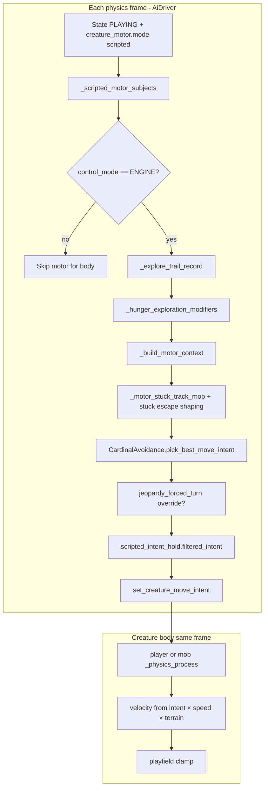

# Creature movement (2D duel / ENGINE motor)

> **Superseded for 3D production (2026-06):** Production motor runs on [`main_3d.gd`](../../main_3d.gd) with unified **`CharacterBody3D`** duel templates ([`creature_kinematic_body_3d.gd`](../../creature/capabilities/creature_kinematic_body_3d.gd)). This file is a **historical 2D inventory** (`player.gd` / `mob.gd` era). **Active ENGINE motor design and implementation:** [CREATURE_MOVEMENT_V3.md](../Draft_Features/CREATURE_MOVEMENT_V3.md) (§7 planner / explore / debug).
>
> **Tier III contract — inventory of legacy 2D behavior.** This doc maps **where** movement was decided, **what** weights exist, and **every carnivore vs herbivore fork** in the pre-3D code path. It is intentionally verbose for refactor planning. **Do not** treat §10+ V3 pointers as a second motor spec — implement from **V3**.
>
> **Drift policy:** When code and this file disagree, **code wins** until this doc is updated in the same change set.
>
> **Related (reference only — not authoritative unless cited):** [MOB_AVOIDANCE_PLAN.md](../Completed_Features/MOB_AVOIDANCE_PLAN.md), [OBJECT_AVOIDANCE_PLAN.md](../Completed_Features/OBJECT_AVOIDANCE_PLAN.md), [CREATURE_GOALS.md](../Completed_Features/CREATURE_GOALS.md), [HUNGER_AND_EATING.md](../Completed_Features/HUNGER_AND_EATING.md).

---

## 1. Executive summary

| Layer | Role (3D production — see banner) |
|-------|------|
| **Intent producers** | `AiDriver` (scripted 8-way motor), human input, LLM tokens (`UP`/`DOWN`/`LEFT`/`RIGHT` — cardinals only today) |
| **Intent storage** | `creature_move_intent` on [`creature_kinematic_body_3d.gd`](../../creature/capabilities/creature_kinematic_body_3d.gd) (**Body** child) |
| **Physics application** | **`CharacterBody3D.move_and_slide`** on all duel species (**D4** — no rigid mob fork) |
| **Motor planner** | `creature/motor/cardinal_avoidance.gd` — scores **9 candidates** (8-way + idle), picks minimum cost |
| **Driver orchestration** | `AI_int_lib/ai_driver.gd` — context build, stuck/jeopardy/hold, per-body state |

**Legacy 2D rows below (§2–§13):** `player.gd` / `mob.gd` intent storage; `CharacterBody2D` vs `RigidBody2D` physics split.

**Move vs not-move:** A creature **stands still** when final intent is `Vector2.ZERO`. There is no separate “movement enabled” flag in ENGINE mode beyond `control_mode == ENGINE` and round/session state.

---

## 2. End-to-end pipeline (scripted ENGINE duel)

**Entry conditions (all required for scripted motor on a body):**

1. `AiDriver` state `PLAYING` (or CPU round equivalent).
2. Merged `creature_motor.mode == "scripted"` (`_creature_motor_mode()`).
3. Body `control_mode == ENGINE` (`player.engine_control_as_int()` / `mob.engine_control_as_int()`).
4. Body in `_registered_creatures` (duel) or fallback `_creature`.

**Duel bootstrap:** `main.gd` → `register_creature(Player)`, `register_creature(_duel_carnivore)`, `sync_duel_control_modes()`.

---

## 3. Control modes — who sets intent?

| Mode | Set by | Read in | Movement when intent zero |
|------|--------|---------|---------------------------|
| **HUMAN** | Keyboard (`move_*` actions) | `player._read_move_intent()` | Stops (`velocity = 0`) |
| **ENGINE** | `AiDriver._physics_process` | `player` / `mob` | Stops (player); mob keeps **last heading** speed if intent zero (see §8) |
| **AI** | LLM completion tokens via `_apply_action_token` | `player` only today | Same as ENGINE on player |

| File | Notes |
|------|-------|
| [`player.gd`](../../player.gd) | `ControlMode` enum; groups: `player`, `herbivores`, `prey`, `creatures` |
| [`mob.gd`](../../mob.gd) | `control_mode` int; groups: `mobs`, `creatures`; default diet **CARNIVORE** |
| [`AI_int_lib/ai_driver.gd`](../../AI_int_lib/ai_driver.gd) | `sync_duel_control_modes()`, `playing_control_mode_int_for_motor_mode_string()` |

**LLM path:** `_apply_action_token` sets cardinal intent on `_primary_creature` only — **not** the unified duel loop for carnivore.

---

## 4. Motor decision — 8-way candidates and winner selection

**File:** [`creature/motor/cardinal_avoidance.gd`](../../creature/motor/cardinal_avoidance.gd) — `pick_best_move_intent(ctx)` (class name retained for compatibility).

### 4.1 Candidates

| Count | Directions |
|-------|------------|
| **9** | N, NE, E, SE, S, SW, W, NW (+Y = N), then **idle** |

All ENGINE scripted modes (seek, flee, explore, patrol) share the same candidate set.

Unit step vectors are normalized; predicted center = `creature_position + dir.normalized() × creature_speed × lookahead_sec`.

**Shared 8-way table:** [`creature/motor/eight_way_directions.gd`](../../creature/motor/eight_way_directions.gd) — sector order matches [`believed_goal_sector.gd`](../../creature/motor/believed_goal_sector.gd) indices so coarse memory bias aligns with diagonal steps.

### 4.2 Evaluation order (tie-breaking)

| Mechanism | Config key | Location |
|-----------|------------|----------|
| Fixed order | `deterministic_tie_order: true` or `shuffle_tie_break: false` | `evaluation_order_from_ctx()` — N→NE→…→NW, ZERO |
| Shuffled directions | `shuffle_tie_break: true` (default) | Fisher–Yates on 8 dirs; idle always last |
| Shuffle seed | `tie_shuffle_seed` | `AiDriver`: `_physics_ticks ^ instance_id ^ position hash` |
| Cost jitter | `motor_intent_cost_chaos` | Uniform ± amplitude per candidate after all costs (`motor_chaos_seed`) |

**Winner:** Lowest total cost; first in evaluation order wins ties (before chaos, ties are exact).

### 4.3 Explore gating (when exploration terms apply)

Inside `pick_best_move_intent`:

- `allow_explore = (exploration_blend_multiplier > 0) AND NOT mob_threat_high`
- `mob_threat_high` when nearest mob within `interior_env_near_mob_px` (footprint distance).
- **Stuck exception:** `motor_stuck_allow_expand_hint` allows expanding hint even under mob threat (herbivore + carnivore-with-prey branches).

Exploration terms gated by `allow_explore` (unless noted):

- `weight_explore_idle_penalty` — penalize idle
- `weight_explore_turn_bias` — reward continuing `creature_facing` / last move
- `weight_explore_trail_repulsion` — retread penalty
- `weight_expanding_explore_hint` — dot bonus toward hint vector

---

## 5. Cost terms (per predicted position)

**Core function:** `CardinalAvoidance.cost_at_prediction()` (also `cost_at_prediction_aware()` for tests).

For each candidate step direction `d`, predicted center = `creature_position + d.normalized() × speed × lookahead_sec` (§4.1).

| # | Term | Sign | Formula (conceptual) | Context keys | Default source |
|---|------|------|----------------------|--------------|----------------|
| 1 | **Out of bounds** | + huge | `penalty_oob` if footprint outside `bounds_min`/`bounds_max` | `penalty_oob`, `bounds_*`, `creature_half_extents` | `game_config_merge` |
| 2 | **Mob repulsion** | + | Σ `cost_scale × (w_dist/ dist + w_dist_sq/dist² + w_close×closing/dist)` per mob in awareness | `mobs`, `weight_dist`, `weight_dist_sq`, `weight_closing`, `distance_eps`, awareness keys | merged motor |
| 3 | **Pursuit pull** | − | Same as mob terms but **subtracted** for `pursuit_targets` | `pursuit_targets`, `weight_pursuit_*` | predator only in context |
| 4 | **Static obstacles** | + | Mob-style repulsion on obstacle AABB centers | `static_obstacles`, `weight_obstacle` | geom cache; predator boost |
| 5 | **Interior posture** | + | Distance of predicted center from playfield center | `weight_interior` × hunger `interior_mul` | merged motor |
| 6 | **Edge clearance** | + | `weight_edge / margin_to_bounds` | `weight_edge` × hunger `edge_mul` | merged motor |
| 7 | **Environment grid** | + | Solid blocking or slow-cell penalty | `interior_env_motor_active`, `weight_interior_env_solid/slow`, `environment_grid`, `creature_size` | player ENGINE only active flag |
| 8 | **Food seek** | + | `weight × distance` to nearest ready food/prey point | `food_seek_targets`, `weight_seek_ready_food`, imminent gating | `AiDriver` scales by hunger |
| 9 | **Unready food avoid** | + | Σ `weight / dist` to depleted bushes | `unready_food_avoid_targets`, `weight_avoid_unready_food` | herbivore awareness |
| 10 | **Strategic obstacles** | −/+ | Shield (prey) / pin (predator) via sample points | `aware_obstacle_samples`, `strategic_*`, `weight_obstacle_shield_prey`, `weight_obstacle_pin_predator` | [`motor_obstacle_strategy.gd`](../../creature/motor/motor_obstacle_strategy.gd) |
| 11 | **Explore idle** | + on idle | Add `weight_explore_idle_penalty` if `d == ZERO` | only if `allow_explore` | scaled by hunger + blend |
| 12 | **Explore turn bias** | − on aligned steps | `−weight × max(0, d·facing)` | `creature_facing` | scaled |
| 13 | **Expanding explore hint** | − | `−weight × max(0, d·hint)` | `expanding_explore_hint` | stuck + baseline hint |
| 14 | **Trail repulsion** | + | Inverse dist to prior cell centers | `explore_trail_centers`, `weight_explore_trail_repulsion` | `AiDriver` trail |
| 15 | **Cost chaos** | ± | `randf_range(−chaos, +chaos)` | `motor_intent_cost_chaos`, `motor_chaos_seed` | merged motor |
| 16 | **Seek backtrack** | + | `weight × max(0, −d·last_move)` | `weight_seek_backtrack`, `creature_last_move_direction`, `motor_seek_filter_wall_hits` | seek only |

**Seek wall filter:** When `motor_seek_filter_wall_hits` is true, candidate steps whose **lookahead** pose drives **into** a playfield edge or static AABB are **skipped** (tangential / parallel motion near walls remains eligible). See `CardinalAvoidance.step_blocked_into_wall()`.

**Awareness gating (mobs, pursuit, food plants):** Samples outside `awareness_radius` (+ forward cone `awareness_cone_extra` when within `awareness_cone_half_angle_deg`) do not contribute.

**Imminent mob gating (food seek):** If any mob center within `food_seek_imminent_mob_radius_px` of footprint at **current** or **predicted** pose, food seek weight/cost is zeroed (`effective_food_seek_weight`, `food_seek_cost_at_prediction`).

---

## 6. Configuration — where weights live

| Source | Path | Role |
|--------|------|------|
| **Defaults** | [`AI_int_lib/game_config_merge.gd`](../../AI_int_lib/game_config_merge.gd) → `default_creature_motor_params()` | Full key set when JSON missing |
| **User overrides** | `user://game_config.json` → `creature_motor` | Merged by `GameConfig` autoload |
| **Repo sample** | [`game_config.json`](../../game_config.json) | Partial; many keys fall back to defaults |
| **Runtime context** | `AiDriver._build_motor_context()` | Per-tick scaled weights (hunger, pursuit urgency, stuck, predator boost) |

### 6.1 Full default key list (`creature_motor`)

Keys from `default_creature_motor_params()` (values = code defaults; user JSON may override):

| Key | Default | Used for |
|-----|---------|----------|
| `mode` | `"scripted"` | `scripted` vs LLM motor |
| `lookahead_sec` | `0.15` | Prediction horizon |
| `weight_dist` | `0.45` | Mob inverse distance |
| `weight_dist_sq` | `55.0` | Mob crowding |
| `weight_closing` | `1.05` | Closing velocity toward creature |
| `penalty_oob` | `1e7` | Bounds violation |
| `distance_eps` | `6.0` | Distance floor |
| `creature_half_extent_x/y` | `13.5` / `30.5` | Motor footprint (overridden by capsule on body) |
| `scripted_intent_hold_physics_ticks` | `8` | Intent stickiness (prey default) |
| `shuffle_tie_break` | `true` | Cardinal shuffle |
| `motor_intent_cost_chaos` | `3.05` | Tie-break jitter |
| `weight_interior` | `0.65` | Center-seeking |
| `weight_edge` | `0.48` | Wall margin |
| `awareness_radius` | `1500.0` | Sense disk (JSON often lowers to ~200) |
| `awareness_cone_extra` | `3000.0` | Forward cone reach add-on |
| `awareness_cone_half_angle_deg` | `45.0` | Cone half-angle |
| `awareness_memory_ticks` | `3` | Ghost mob memory depth |
| `awareness_memory_weight` | `0.35` | Ghost/gated mob cost scale |
| `awareness_memory_horizon_sec` | `0.0` | Predict ahead for ghosts (derived from ticks if 0) |
| `weight_obstacle` | `1.25` | Static AABB repulsion scale |
| `vegetation_blocking_forage_clearance_px` | `92.0` | **Prey:** strip shrub geom near food targets |
| `weight_obstacle_predator_boost` | `1.55` | **Predator:** multiply `weight_obstacle` |
| `interior_env_near_mob_px` | `70.0` | Suppress explore when mob this close |
| `weight_interior_env_solid` | `8000.0` | Grid solid cell |
| `weight_interior_env_slow` | `4.0` | Grid slow cell |
| `hunger_explore_interior_scale_min` | `0.16` | Low hunger → weaker center pull |
| `hunger_explore_edge_scale_min` | `0.16` | Low hunger → weaker edge repulsion |
| `hunger_explore_hold_scale_min` | `0.2` | Low hunger → shorter intent hold |
| `hunger_explore_urgency_power` | `1.25` | Hunger curve shape |
| `calorie_baseline_drain_per_sec` | `1.0` | Vitals |
| `calorie_cost_per_px_moved` | `0.002` | Vitals |
| `predator_prey_meal_calories` | `5` | Contact meal (not motor) |
| `weight_seek_ready_food` | `16.0` | Pull to ready bushes |
| `weight_seek_backtrack` | `14.0` | Penalize reversing `last_move_direction` during seek |
| `food_seek_imminent_mob_radius_px` | `100.0` | Disable seek when mob close |
| `jeopardy_forced_turn_ticks` | `5` | Prey jeopardy streak |
| `weight_avoid_unready_food` | `5.5` | Repel locked/depleted bushes |
| `food_avoid_unready_scale_when_ready_target` | `0.35` | Scale down unready avoid when also seeking ready |
| `weight_explore_idle_penalty` | `10.5` | Anti-idle explore |
| `weight_explore_turn_bias` | `0.14` | Momentum bias |
| `explore_intent_hold_extra_ticks` | `5` | **Prey:** extra hold when no food targets |
| `explore_coverage_cell_px` | `52.0` | Trail grid cell size |
| `explore_trail_max_cells` | `96` | Trail buffer cap |
| `weight_explore_trail_repulsion` | `2.35` | Retread cost |
| `expanding_explore_base_physics_ticks` | `36` | Expanding sweep segment length |
| `weight_expanding_explore_hint` | `0.12` | Baseline sweep bias |
| `weight_seek_prey` | `22.0` | **Predator:** floor seek toward prey positions |
| `motor_stuck_escape_ticks` | `8` | Stuck detection threshold |
| `motor_stuck_move_epsilon_px` | `1.25` | Displacement epsilon |
| `motor_stuck_prey_pull_scale` | `1.5` | **Predator stuck:** boost food_seek |
| `weight_stuck_escape_explore` | `2.2` | **Predator stuck, no prey:** explore hint |
| `weight_stuck_escape_explore_when_chasing` | `0.95` | **Predator stuck, prey visible** |
| `motor_stuck_turn_bias_scale` | `0.25` | **Predator stuck, no prey** |
| `motor_stuck_idle_penalty_scale` | `2.5` | **Predator stuck, no prey** |
| `motor_stuck_prey_expand_floor` | `0.95` | **Prey stuck:** explore hint floor |
| `motor_stuck_prey_idle_scale` | `1.35` | **Prey stuck** |
| `motor_stuck_prey_turn_scale` | `1.2` | **Prey stuck** |
| `motor_exploration_always_enabled` | `true` | Blend explore while chasing |
| `exploration_blend_min_when_engaged` | `0.28` | Min explore multiplier at full pursuit urgency |
| `weight_pursuit_dist` | `0.42` | Pursuit inverse dist |
| `weight_pursuit_closing` | `0.95` | Pursuit closing |
| `weight_pursuit_dist_sq` | `38.0` | Pursuit crowding |
| `jeopardy_forced_turn_ticks_predator` | `5` | Carnivore rival jeopardy |
| `jeopardy_weight_rival_predator` | `1.0` | Scales predator jeopardy ticks |
| `intent_hold_ticks_predator` | `6` | Carnivore intent hold |
| `weight_obstacle_shield_prey` | `28.0` | Prey: reward cover between self and threat |
| `weight_obstacle_pin_predator` | `22.0` | Predator: reward obstacles along prey vector |
| `carnivore_explore_rotate_physics_ticks` | `36` | Legacy alias of `expanding_explore_base_physics_ticks` |

---

## 7. AiDriver tools and state (orchestration)

**File:** [`AI_int_lib/ai_driver.gd`](../../AI_int_lib/ai_driver.gd)

| Tool / state | Storage | Purpose |
|--------------|---------|---------|
| **Explore trail record** | `_explore_trail_centers_by_body`, `_explore_trail_last_cell_by_body` | Coarse grid (`explore_coverage_cell_px`); appends cell center; drops last cell before motor; cap `explore_trail_max_cells` |
| **Mob history ghosts** | `_mob_hist`, `_mob_ids_ever_observed` | Despawned mob predicted positions at `awareness_memory_weight` |
| **Obstacle geom cache** | `_motor_obstacle_aabbs`, `_motor_obstacle_samples` | Once per physics tick via `_refresh_motor_obstacle_cache_if_needed()` |
| **Stuck tracker** | `_motor_stuck_ticks`, `_motor_stuck_last_pos` | Nonzero intent + displacement &lt; epsilon → escape shaping |
| **Intent hold** | `_scripted_intent_hold_state_by_body` | Challenger must persist `hold_ticks` ([`scripted_intent_hold.gd`](../../creature/motor/scripted_intent_hold.gd)) |
| **Jeopardy** | `_jeopardy_forced_turn_state_by_body` | Forward-cone threat streak → forced turn ([`jeopardy_forced_turn.gd`](../../creature/motor/jeopardy_forced_turn.gd)) |
| **Hunger explore modifiers** | computed per tick | Scales `weight_interior`, `weight_edge`, hold duration |
| **Registered creatures** | `_registered_creatures` | Duel bodies for motor loop |
| **Goal-target belief** | `_goal_belief` (design-comment block / stub in [`ai_driver.gd`](../../AI_int_lib/ai_driver.gd); keys **`goal_memory_*`**) | **Not implemented** |

### 7.1 Context build (`_build_motor_context`)

**Inputs sampled each tick per body:**

| Input | Method / source |
|-------|-----------------|
| Position, speed, facing | Body fields; capsule overrides half extents |
| Playfield bounds | `screen_size` or viewport fallback |
| Mobs | `_motor_mobs_array()` — group `mobs`, excludes self |
| Food ready / unready | `_motor_food_plants_in_awareness_by_readiness()` — group `food_plants` |
| Prey positions | `_prey_positions_for_predator_motor()` — group `prey` (**predator only**) |
| Pursuit targets | `_pursuit_targets_for_predator()` — dicts with velocity (**predator only**) |
| Imminent mobs | `_motor_imminent_mob_positions(exclude_body)` |
| Static obstacles | Cached AABBs + samples; **prey** forage filter |
| Strategic positions | Nearest mob (prey) or nearest prey (predator) |
| Exploration blend | `exploration_blend_multiplier` from distance to nearest threat/prey |

**Post-process in physics loop (before `pick_best_move_intent`):**

- Stuck escape overrides on `ctx` (see §9).
- Jeopardy may replace `raw_intent` entirely.
- Intent hold filters `raw_intent` → `intent`.

### 7.2 Obstacle geometry

**File:** [`creature/motor/motor_obstacle_geometry.gd`](../../creature/motor/motor_obstacle_geometry.gd)

| Source | Group / tree | Shapes |
|--------|--------------|--------|
| Rocks | `obstacles` | Rect, capsule, convex, **circle** |
| Shrubs | `food_plants` → child `StaticBody2D` | Includes solid + open shrub blockers |

**Prey-only filter:** `_filter_obstacle_geom_for_forage()` removes AABBs/samples within `vegetation_blocking_forage_clearance_px` of **ready** `food_seek_targets`.

**Predator-only boost:** `weight_obstacle_ctx = weight_obstacle × weight_obstacle_predator_boost`.

### 7.3 Expanding 8-way explore

**File:** [`creature/motor/expanding_cardinal_explore.gd`](../../creature/motor/expanding_cardinal_explore.gd)

- Sweep order N → NE → … → NW; dwell `base × 2^cycle` per **eight-leg** cycle.
- `Explore.pick_cardinal(base_ticks, physics_tick, phase_seed)` → unit hint vector (8-way).
- Used when **stuck** (both diets) and as weak baseline via `weight_expanding_explore_hint`.

### 7.4 Jeopardy forced turn

**File:** [`creature/motor/jeopardy_forced_turn.gd`](../../creature/motor/jeopardy_forced_turn.gd)

- Triggers when incumbent continues toward forward-cone mob within `food_seek_imminent_mob_radius_px` for `required_ticks`.
- `pick_forced_turn()` re-scores **8-way** candidates (separate from main cost) to pick escape heading.
- Resets intent hold state when fired.

### 7.5 Scripted intent hold

**File:** [`creature/motor/scripted_intent_hold.gd`](../../creature/motor/scripted_intent_hold.gd)

- New direction must win for `hold_physics_ticks` consecutive ticks.
- Idle incumbent → immediate adoption of new intent.
- Hunger scales hold via `hold_mul`.

### 7.6 Seek stationary look (8-way)

**File:** [`creature/motor/seek_stationary_look.gd`](../../creature/motor/seek_stationary_look.gd)

- When no-goal patrol lock holds **idle** but creature is **actively seeking** (`_creature_actively_seeking_patrol`), rotates `creature_facing` through **8 headings** (N→NE→…→NW) without translation.
- Dwell per heading: `seek_stationary_look_segment_physics_ticks` (default 9 physics ticks).
- After each rotation, `_rescan_and_patch_goal_ctx` may promote a sensed target and resume 8-way movement via §4.1.

### 7.7 No-goal patrol lock (8-way)

**File:** [`creature/motor/no_goal_patrol_lock.gd`](../../creature/motor/no_goal_patrol_lock.gd)

- When `motor_has_active_goal` is false, picks a random **8-way** direction or idle, holds for `motor_no_goal_patrol_lock_sec`.
- Blocked-direction filter uses the same step probe as the main motor.

---

## 8. Physics application (after intent)

### 8.1 Herbivore — `player.gd` (`CharacterBody2D`)

| Step | Behavior |
|------|----------|
| Read intent | `_read_move_intent()` — ENGINE/AI use `creature_move_intent` |
| Speed | `speed` (default 400) × `EnvironmentGridBaked` multiplier at position |
| Move | `velocity = intent × target_speed`; `move_and_slide()` |
| Clamp | `PlayfieldClamp.clamp_position` on footprint |
| Facing | Updates `last_move_direction` when velocity &gt; 1 px |
| Food | `bush_food.gd` area → `add_calories_from_food` (not motor) |
| Defeat | Mob hitbox → predation; starvation → hide |

**Interior env motor:** `interior_env_motor_active` is `true` only when `control_mode == ENGINE` on player.

### 8.2 Carnivore — `mob.gd` (`RigidBody2D`)

| Step | Behavior |
|------|----------|
| ENGINE | `linear_velocity = heading × (_spawn_cruise_speed × terrain_mult)` |
| Intent zero | **Still moves:** `heading` falls back to `_last_heading` (not idle in practice) |
| Clamp | Playfield clamp on position |
| Legacy cruise | Non-ENGINE uses spawn velocity + `wall_slide_pick` (not duel ENGINE path) |
| Meal | Player hit → `add_calories_from_prey` |

<<Comment: ENGINE carnivore with zero intent continuing at last heading is a major “stuck sliding” contributor — document for refactor.>>

### 8.3 Playfield clamp

**File:** [`creature/capabilities/playfield_clamp.gd`](../../creature/capabilities/playfield_clamp.gd) — shared by player and mob.

### 8.4 Duel 3D kinematic — `creature_kinematic_body_3d.gd` (`CharacterBody3D`)

| Step | Behavior |
|------|----------|
| Read intent | `_read_move_intent()` — ENGINE/AI use `creature_move_intent` |
| Wall slide | `_engine_heading_with_wall_slide` — heading redirected along playfield edges (same helpers as §8.3) |
| Move | `apply_horizontal_move_intent` → `move_and_slide()` on XZ; gravity on Y |
| Clamp | **`_clamp_playfield_position`** — `PlayfieldClamp.clamp_position` on footprint **after** move (row 55 safety net) |
| Rim intent sanitize | **`_predator_playfield_outward_intent_ok`** + **`_predator_sanitize_rim_playfield_intent`** in [`ai_driver.gd`](../../AI_int_lib/ai_driver.gd) — rejects outward rim headings when `edge_m < edge_band × 1.05`; tangential slide allowed (row 56); recovery via **`_predator_rim_sanitize_recovery_intent`** when sanitize would zero non-zero raw |
| Scope | ENGINE and AI control modes only (human control unchanged) |

**File:** [`creature/capabilities/creature_kinematic_body_3d.gd`](../../creature/capabilities/creature_kinematic_body_3d.gd)

---

## 9. Carnivore vs herbivore — code fork inventory

Identification in code uses **Godot groups**, not `CreatureDefinition.FeedingMode` directly in the motor loop:

| Role | Typical node | Groups |
|------|--------------|--------|
| **Herbivore (prey)** | `Player` | `prey`, `herbivores`, `player` |
| **Carnivore (predator)** | Duel `mob` | `mobs` (not in `prey`) |

`get_feeding_mode()` / `DietRegistry` affect **eating policy**, not cardinal costs directly.

### 9.1 Fork table (`AiDriver` + motor)

| Location | Herbivore (`prey`) | Carnivore (`mobs` ∧ ¬`prey`) |
|----------|-------------------|------------------------------|
| `_build_motor_context` — append prey to `food_seek_targets` | No | Yes — `_prey_positions_for_predator_motor` |
| `_build_motor_context` — `pursuit_targets` + `weight_pursuit_*` | Zeros / empty | Populated |
| `_build_motor_context` — `weight_seek` floor | `weight_seek_ready_food` × hunger only | Also `max(..., weight_seek_prey)` when prey visible |
| `_build_motor_context` — `exploration_blend_multiplier` nearest threat | Distance to **mobs** in `mobs_arr` | Distance to **prey_pts** |
| `_build_motor_context` — obstacle geom | `_filter_obstacle_geom_for_forage` | Full geom + `weight_obstacle_predator_boost` |
| `_build_motor_context` — `strategic_threat_pos` | Nearest mob | `ZERO` |
| `_build_motor_context` — `strategic_prey_pin_pos` | `ZERO` | Nearest prey |
| `_build_motor_context` — `weight_obstacle_shield_prey` | Active (default 28) | 0 |
| `_build_motor_context` — `weight_obstacle_pin_predator` | 0 | Active (default 22) |
| `_physics_process` — stuck escape | `motor_stuck_prey_*`, `motor_stuck_allow_expand_hint` | `motor_stuck_prey_pull_scale`, different explore weights when `food_seek_targets` empty vs not |
| `_physics_process` — jeopardy `required_ticks` | `jeopardy_forced_turn_ticks` | `jeopardy_forced_turn_ticks_predator × jeopardy_weight_rival_predator` |
| `_physics_process` — intent hold base | `scripted_intent_hold_physics_ticks` + extra when no food | `intent_hold_ticks_predator` |
| `_motor_imminent_mob_positions` | Includes all mobs | Excludes self (carnivore body) |
| `_motor_mobs_array` | Other mobs as threats | Same; self skipped |
| Awareness overlay | Mob samples under Player child | Prey circles via `get_debug_carnivore_prey_snapshot` |

### 9.2 Fork table (body scripts)

| Location | Herbivore | Carnivore |
|----------|-----------|-----------|
| Physics type | `CharacterBody2D` + `move_and_slide` | `RigidBody2D` + `linear_velocity` |
| Default diet | `HERBIVORE` | `CARNIVORE` |
| Calorie gain | `add_calories_from_food` (plants) | `add_calories_from_prey` (player contact) |
| Starvation win | Herbivore loses (emit `hit`) | Carnivore loses → `starvation_carn_herb_win` |
| Zero intent behavior | Full stop | Continues on `_last_heading` |
| `interior_env_motor_active` in context | true when ENGINE | false (mob is not `CharacterBody2D` check on player enum) |

### 9.3 Diet / intake (not motor, but role-specific)

**File:** [`creature/capabilities/diet_registry.gd`](../../creature/capabilities/diet_registry.gd)

| Mode | `plant_groups` | `prey_groups` |
|------|----------------|---------------|
| HERBIVORE | `food_plants` | `[]` |
| CARNIVORE | `[]` | `player`, `herbivores`, `prey` |

### 9.4 Legacy / unused carnivore-only motor

| File | Status |
|------|--------|
| [`creature/motor/carnivore_pursuit.gd`](../../creature/motor/carnivore_pursuit.gd) | **Not called by `AiDriver`**; pursuit folded into `CardinalAvoidance` + `food_seek_targets` / `pursuit_targets`. Still unit-tested. |

---

## 10. Sensing — what populates targets (legacy 2D)

| Sense | Group | Gate | Consumers |
|-------|-------|------|-----------|
| Predators / rivals | `mobs` (`RigidBody2D`) | Awareness radius + cone; memory ghosts | `mobs` cost, jeopardy, imminent gating |
| Prey | `prey` | Same gate | `food_seek_targets`, `pursuit_targets`, seek floor |
| Food plants | `food_plants` | Same gate; readiness via `is_pickup_ready_for_motor()` | ready → seek; unready → avoid |
| Obstacles | `obstacles` + plant static bodies | Sample points filtered by awareness radius | repulsion + strategy |
| Environment grid | `Main.environment_grid` | Cell at predicted point | player ENGINE interior cost |

**V3 ENGINE motor (3D duel):** Zone geometry, planner explore/rim behavior, F9/F10 debug, and headless logging rules live in [CREATURE_MOVEMENT_V3.md §7.3 / §7.7](../Draft_Features/CREATURE_MOVEMENT_V3.md) — not duplicated here.

---

## 11. Tests touching movement

**File:** [`tests/run_all.gd`](../../tests/run_all.gd)

| Test area | Covers |
|-----------|--------|
| `_test_cardinal_avoidance` | Costs, ties, shuffle, chaos, food seek, awareness |
| `_test_seek_diagonal_intent` | 8-way food seek + threat repulsion |
| `_test_seek_wall_filter_and_backtrack` | Seek wall-hit rejection + backtrack penalty |
| `_test_seek_stationary_look` | 8-way awareness sweep while blocked |
| `_test_explore_idle_when_no_pickup` | Idle penalty |
| `_test_explore_trail_repulsion_motor` | Trail cost |
| `_test_jeopardy_forced_turn` | Jeopardy |
| `_test_carnivore_pursuit_intent` | Legacy `CarnivorePursuit` |
| `_test_carnivore_prey_awareness_gating` | Prey collection |
| `_test_diet_registry` | Herbivore vs carnivore policy |

Run: `godot --path . --headless -s res://tests/run_all.gd`

**V3 motor tests:** See [CREATURE_MOVEMENT_V3.md §12.2 6c](../Draft_Features/CREATURE_MOVEMENT_V3.md) for `_test_motor_planner_explore_*` and stack planner gates.

---

## 12. Known gaps / refactor pressure (from playtest)

| Issue | Mechanism |
|-------|-----------|
| Carnivore slides into bushes | Obstacle geom + ENGINE velocity; no slide/raycast on ENGINE mob path |
| Identical paths | Symmetric costs + shared tick seeds (mitigated partially by `motor_intent_cost_chaos` + per-body shuffle seed) |
| “Stuck” carnivore still moving | Zero intent does not stop mob ENGINE motion |
| Food memory | Designed in comments / `CREATURE_MEMORY.md`; **not wired** |
| LLM motor | Tokens on primary creature only; duel carnivore always scripted |
| `wall_slide_pick.gd` | Used in mob **legacy** cruise, not ENGINE duel |

---

## 13. File index (movement-related)

| Path | Role |
|------|------|
| `AI_int_lib/ai_driver.gd` | Orchestration, context, state |
| `AI_int_lib/game_config_merge.gd` | Default motor params |
| `creature/motor/cardinal_avoidance.gd` | 8-way planner + costs (legacy class name) |
| `creature/motor/eight_way_directions.gd` | Shared N→NW unit vectors + best-align helper |
| `creature/motor/no_goal_patrol_lock.gd` | Random 8-way + idle patrol hold |
| `creature/motor/seek_stationary_look.gd` | 8-way facing sweep while seek-blocked |
| `creature/motor/motor_obstacle_geometry.gd` | Scene obstacle harvest |
| `creature/motor/motor_obstacle_strategy.gd` | Shield / pin |
| `creature/motor/expanding_cardinal_explore.gd` | Sweep hint |
| `creature/motor/scripted_intent_hold.gd` | Intent smoothing |
| `creature/motor/jeopardy_forced_turn.gd` | Forced flee turn |
| `creature/motor/carnivore_pursuit.gd` | Legacy pursuit |
| `creature/motor/wall_slide_pick.gd` | Legacy mob cruise |
| `player.gd` / `mob.gd` | Intent consumption + physics |
| `main.gd` | Duel registration |
| `assets/plants/bush_food.gd` | Food readiness + eating |
| `creature/capabilities/diet_registry.gd` | Diet groups |
| `creature/capabilities/playfield_clamp.gd` | Bounds |
| `creature/awareness_debug_overlay.gd` | Debug draw |

---

## 14. Maintenance

- Update this file when adding/removing a cost term, config key, or group-based fork **in the legacy 2D inventory sections (§2–§9)**.
- **V3 ENGINE motor** behavior, debug, and acceptance tests → [CREATURE_MOVEMENT_V3.md](../Draft_Features/CREATURE_MOVEMENT_V3.md) only; link from here, do not duplicate.
- Trim §5–§9 once legacy 2D paths are fully retired from production.

---

## 15. Changelog

| Date | Change |
|------|--------|
| 2026-07-05 | Banner → V3 authority; removed duplicated V3 debug/planner prose from §10; §11/§14 point to V3 §7 / §12.2. |
| 2026-06-08 | Supersession banner for 3D production; §1 executive summary notes 3D paths; debug overlay → `awareness_debug_overlay_3d.gd` (M3). |
