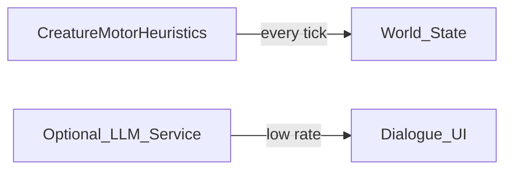

# Hunter Killer — AI conversation scope (agent-friendly)

> Fill each section before implementation. Keep bullets concrete enough that an agent can open the right files and know when it is done.

---

## 1. Phase summary

**Phase name:** AI / LLM integration — **conversation & non-motor** scope

**One-line objective:** Record project intent: LLM-driven creature **movement/motor control is retired** (code removed 2026-09-23, not tabled). TinyLlama-style remote inference remains a possible **future** addition for optional **dialogue, narration, or rare high-level decisions** — but the movement-era inference code (`ai_action_tokens.gd`, `bundled_inference_launcher.gd`, `system_prompt.txt`, `inference_client` config) has been deleted, so any dialogue LLM work starts fresh rather than reusing it.

**Out of scope (explicit non-goals):**  
- Replacing `player.gd` / future creature steering with per-tick LLM calls for core locomotion (**retired**, not tabled — the code path no longer exists).  
- Training or fine-tuning models inside Godot.

---

## 2. Context for agents

**Repo / project root:** `{projectHome}/hunter-killer` (directory containing `project.godot`).

**Engine & version:** Godot 4.6.2

**Main scenes / entry:** `AiDriver` autoload; see [Completed_Features/DtC_AI_INT_PLAN.md](../Completed_Features/DtC_AI_INT_PLAN.md) for what shipped.

**Key scripts (paths):**  
- `AI_int_lib/ai_driver.gd` (ENGINE round orchestration only — the movement-era inference client config and `system_prompt.txt` were **deleted** 2026-09-23 and no longer exist).

**Existing patterns to follow:**  
- [`.cursor/rules/AGENTS.md`](../../.cursor/rules/AGENTS.md)  
- The "do not delete working inference code" guidance is **moot** — the movement-LLM inference code has already been removed. New gameplay AI lives in **heuristic / utility / V3 motor** modules per [VISION_WORLD_BUILDER_PLAN.md](VISION_WORLD_BUILDER_PLAN.md); a future dialogue LLM would be a fresh build, not a revival of the deleted code.

---

## 3. Requirements

### Must have (policy)

- Any new feature plan that adds “creature AI” defaults to **non-LLM** controllers unless this doc (or a child plan) explicitly approves LLM use for that subsystem.

### Should have

- When re-enabling LLM for dialogue: separate prompts and **grammar** from movement tokens.

### Nice to have

- Budget: max tokens / max calls per real-time minute per player.

---

## 4. Technical design

### Architecture / data flow

### Scene & file changes

| Action | Path | Notes |
|--------|------|-------|
| done — removed | `AI_int_lib/ai_action_tokens.gd`, `AI_int_lib/bundled_inference_launcher.gd`, `AI_int_lib/system_prompt.txt`, `inference_client` config block | Movement-LLM code deleted 2026-09-23; not preserved |
| kept | `AI_int_lib/ai_driver.gd` | ENGINE round ("CPU Player") orchestration only — no inference client remains |

### Dependencies

- None currently. A future dialogue LLM would need to reintroduce a remote `llama-server` (or compatible) client from scratch — the prior POC client code no longer exists in the repo.

---

## 5. Implementation plan (ordered)

1. **Done (2026-09-23):** Motor use of LLM **retired** — code removed; dodge/duel round is human or scripted (ENGINE/V3 motor) only. This is a closed decision, not a tabled one.  
2. **Future:** Add `DialogueController` that calls inference with chat template — a fresh build, not a revival of the deleted `ai_driver` movement path.  
3. Optional: **hybrid** where script picks safe move set and LLM picks among 2–3 options (still document rate limits) — would also require new inference-client code.

---

## 6. Acceptance criteria

- [ ] World/creature feature plans reference this policy when discussing AI.  
- [x] No accidental regression: removing `AiDriver` autoload is **not** required for new ecology phases — confirmed 2026-09-23: `AiDriver` stays (ENGINE round / "CPU Player" state machine, creature registry, V3 orchestration); only its LLM inference half was deleted.

---

## 7. Risks & mitigations

| Risk | Mitigation |
|------|------------|
| Contributors assume LLM is required for NPCs | Link this doc from VISION + AGENTS index |

---

## 8. Testing / verification

- The movement-LLM HTTP/inference code path no longer exists, so there is no motor-LLM regression suite to run. If/when a dialogue LLM is built, it gets its own test coverage from scratch.

---

## 9. Open questions

- <<Question: Single shared HTTP client vs per-subsystem queues? — moot for now; the HTTP client was removed with the motor-LLM code 2026-09-23. Revisit only if/when a dialogue LLM is implemented.>>

---

## 10. Changelog (this phase)

| Date | Change |
|------|--------|
| 2026-09-23 | LLM-driven movement control **retired** (closed, not tabled): `ai_action_tokens.gd`, `bundled_inference_launcher.gd`, `system_prompt.txt`, and `inference_client` config deleted from `AI_int_lib/`; `AiDriver` HTTP/inference signals and methods removed. `AiDriver` itself, the ENGINE round ("CPU Player") state machine, and V3 motor orchestration are unaffected and remain in place. Future dialogue/narration LLM work (§1, §5 item 2) is unaffected in principle but would need new inference-client code. |
| 2026-05-11 | Documented tabled motor use; preserve code for future dialogue. |
