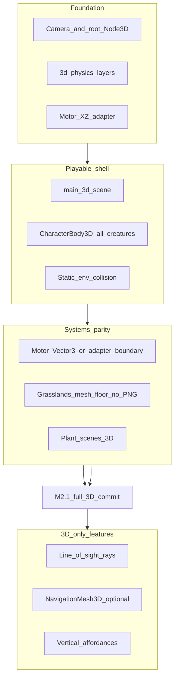

# Hunter Killer — Convert to 3D (migration umbrella)

> **Purpose:** Umbrella spec for moving the **playable application** from the current **2D playfield** to a **3D ship target**. Creature capability/templates are **not** duplicated here — see [CREATURE_3D_ARCHITECTURE.md](CREATURE_3D_ARCHITECTURE.md). **Index:** [PROJECT_DOC_INDEX.md](../PROJECT_DOC_INDEX.md).
>
> **Tier:** Draft (tier II) — product choices for this migration are recorded in §4; child plans may still use `<<Question>>` / `<<Comment>>`.

---

## 1. Phase summary

**Phase name:** 2D → 3D migration

**One-line objective:** Ship a **3D playfield** with **behavioral parity** for the duel loop (herbivore vs carnivore, food, obstacles, ENGINE motor), then enable **3D-only** perception and environment features deferred while the game ran in 2D.

**Out of scope (explicit non-goals for v1 migration):**

- MMO / networking ([VISION_WORLD_BUILDER_PLAN.md](VISION_WORLD_BUILDER_PLAN.md)).
- Full plant ecology ([PLANT_ECOLOGY_PLAN.md](PLANT_ECOLOGY_PLAN.md)).
- Replacing ENGINE motor with LLM-driven movement ([AI_INT_CONVERSATION_SCOPE_PLAN.md](AI_INT_CONVERSATION_SCOPE_PLAN.md)).
- Big-bang `res://` repo layout ([REPO_LAYOUT_PLAN.md](REPO_LAYOUT_PLAN.md)) unless coordinated in a separate change.
- Implementing line-of-sight, navmesh, or volumetric crush in the **same** milestone as the baseline 3D shell (§5 — separate phases).

---

## 2. Context for agents

**Repo / project root:** Directory containing `project.godot`.

**Engine & version:** Godot **4.6.x** (match `project.godot`); **Forward Plus** renderer and **Jolt** 3D physics already configured.

**Main scenes / entry (today):** [`main_3d.tscn`](../../main_3d.tscn) + [`main_3d.gd`](../../main_3d.gd) — `run/main_scene` in `project.godot`.

**Autoloads (unchanged initially):** `GameConfig`, `OLog`, `AiDriver`.

### 2.1 As-is snapshot (3D production — post-M2.1)

| Area | Production (verified against code) |
|------|-------------------------------------|
| **Main loop** | [`main_3d.tscn`](../../main_3d.tscn) — `Node3D` root, dual camera modes (**D1**), grasslands playfield, ENGINE duel + HUD |
| **Creatures** | [`creature_herbivore_kinematic_3d.tscn`](../../creature/templates/creature_herbivore_kinematic_3d.tscn) / [`creature_carnivore_kinematic_3d.tscn`](../../creature/templates/creature_carnivore_kinematic_3d.tscn) — [`creature_kinematic_body_3d.gd`](../../creature/capabilities/creature_kinematic_body_3d.gd), horizontal **`Vector3`** intent |
| **Control modes** | [`creature_control_mode.gd`](../../creature/capabilities/creature_control_mode.gd) — shared HUMAN / ENGINE / AI ints (no `player.gd` dependency) |
| **Obstacles** | 3D boulders via [`playfield_perimeter_boulders.gd`](../../environment/playfield_perimeter_boulders.gd) + interior rocks; motor XZ AABB collection in [`motor_obstacle_geometry.gd`](../../creature/motor/motor_obstacle_geometry.gd) |
| **Motor / AI** | [`ai_driver.gd`](../../AI_int_lib/ai_driver.gd) + [`cardinal_avoidance.gd`](../../creature/motor/cardinal_avoidance.gd) — **`Vector3`** motor plane; awareness = radius + forward cone (**no rays**) per [CREATURE_MOVEMENT_V2.md §E](CREATURE_MOVEMENT_V2.md) |
| **Environment** | Grasslands mesh floor (**§3.7**); optional open [`EnvironmentGridBaked`](../../environment/environment_grid_baked.gd) over playfield XZ AABB |
| **Physics config** | [`project.godot`](../../project.godot) — **`3d_physics/layer_*`** only (bits 1, 2, 4, 8) |
| **Plants** | [`solid_shrub_3d.tscn`](../../assets/plants/solid_shrub/solid_shrub_3d.tscn) / [`open_shrub_3d.tscn`](../../assets/plants/open_shrub/open_shrub_3d.tscn) + [`bush_food_3d.gd`](../../assets/plants/bush_food_3d.gd) |
| **Legacy 2D** | **Removed in M2.1** — `main.tscn`, `player`/`mob`, `obstacle_field`, `Use-2d` flag, `bootstrap_main` |

### 2.2 Authoritative child docs (link; do not restate)

| Topic | Doc |
|-------|-----|
| **3D creature capabilities & templates** | [CREATURE_3D_ARCHITECTURE.md](CREATURE_3D_ARCHITECTURE.md) |
| **Motor refactor, awareness cone, LoS policy** | [CREATURE_MOVEMENT_V2.md](CREATURE_MOVEMENT_V2.md) (§D–§E) |
| **Memory, occlusion boundary** | [CREATURE_MEMORY.md §7.4](CREATURE_MEMORY.md) |
| **Environment / layer contract** | [ENVIRONMENT_MODEL_PLAN.md](../Definitive_Features/ENVIRONMENT_MODEL_PLAN.md) — promote **§6** to 3D when layers ship |
| **2D motor inventory (until superseded)** | [CREATURE_MOVEMENT.md](../Definitive_Features/CREATURE_MOVEMENT.md) |
| **Backlog parking lot** | [ENHANCEMENT_BACKLOG_PLAN.md](../ENHANCEMENT_BACKLOG_PLAN.md) — Perception & awareness |

### 2.3 Migration dependency graph

---

## 3. Migration workstreams

Ordered checklist. Each item: **what changes**, **key paths**, **acceptance hint**.

### 3.1 Rendering & scene root

- **What:** Production entry [`main_3d.tscn`](../../main_3d.tscn) (**D2**): `Node3D` root, `WorldEnvironment`, `DirectionalLight3D`, **`Camera3D` with session-selected framing (**D1**)**. `run/main_scene` points here directly (no bootstrap router).
- **What:** **Playfield root** instantiates the imported grasslands scene from [`h-k-grasslands.blend`](../../assets/locations/grasslands/h-k-grasslands.blend) ([`h-k-grasslands.blend.import`](../../assets/locations/grasslands/h-k-grasslands.blend.import)) — mesh collision + contours define the walkable floor (**D5**; **no** PNG kind-grid terrain).
- **What:** Keep [`hud.tscn`](../../hud.tscn) as Control overlay.
- **Acceptance:** Scene loads; default idle camera is top-down over the full playfield; HUD still works.

### 3.2 Coordinate & input contract

- **Normative (already in 3D kinematic code):** Motor “compass” maps to **world XZ**; **Y** = vertical ([`creature_kinematic_body_3d.gd`](../../creature/capabilities/creature_kinematic_body_3d.gd)).
- **Normative:** **Single adapter** at body boundary ([CREATURE_3D_ARCHITECTURE.md §4](CREATURE_3D_ARCHITECTURE.md)) — not per-species scatter.
- **Input:** Camera-relative forward/strafe on the human **Start** path only (**D1** — over-the-shoulder third-person); map WASD to XZ on the ground plane. **AI Player** uses top-down spectator framing (no human input).
- **Acceptance:** Human input and ENGINE intent both move creatures on the ground plane; **Y locked** for v1 (**D6** — ground-only).

### 3.3 Actor bodies & scenes

- **What:** **Both** duel creatures use **`CharacterBody3D` + `move_and_slide`** via [`creature_kinematic_body_3d.gd`](../../creature/capabilities/creature_kinematic_body_3d.gd) (**D4**): herbivore [`creature_herbivore_kinematic_3d.tscn`](../../creature/templates/creature_herbivore_kinematic_3d.tscn); carnivore [`creature_carnivore_kinematic_3d.tscn`](../../creature/templates/creature_carnivore_kinematic_3d.tscn). Legacy 2D `player.tscn` / `mob.tscn` **deleted in M2.1**.
- **What:** Retire `Area2D`-only locomotion; keep overlap as child **`Area3D`** for pickup / hit ([OBJECT_AVOIDANCE_PLAN.md §5.1](../Completed_Features/OBJECT_AVOIDANCE_PLAN.md)).
- **What:** [`playfield_clamp.gd`](../../creature/capabilities/playfield_clamp.gd) — **auto-compute** motor bounds from the **playfield root** mesh AABB (grasslands import); motor uses **XZ** edges only (**D6**).
- **Acceptance:** Collisions, eating, mob hit, starvation paths still fire.

### 3.4 Physics layers

- **What:** Mirror [ENVIRONMENT_MODEL_PLAN.md §6](../Definitive_Features/ENVIRONMENT_MODEL_PLAN.md) into **`3d_physics/layer_*`**: `world_static`, `player`, `mob`, `plant_mob_block`.
- **What:** Update [`solid_shrub`](../../assets/plants/solid_shrub/) / [`open_shrub`](../../assets/plants/open_shrub/) to 3D collision; preserve Food A vs Food B mask story.
- **Acceptance:** Player walks static + calorie areas; mob blocked by rocks and open-shrub shell; player not blocked by `plant_mob_block`.

### 3.5 Obstacles & static environment

- **What:** 3D boulders (`StaticBody3D` + imported [`h-k-boulder1.blend`](../../assets/environment/obstacle_boulder/h-k-boulder1.blend) collision — **D9**) replace legacy [`obstacle_field.tscn`](../../obstacle_field.tscn) (**deleted M2.1**).
- **What:** Place **boulders along the grasslands playfield AABB perimeter** so creatures cannot walk or slide off the mesh edge (complements motor clamp; physical backstop).
- **What:** [`motor_obstacle_geometry.gd`](../../creature/motor/motor_obstacle_geometry.gd) collects **3D** static shapes projected on XZ (M2.1: 2D collectors removed).
- **Acceptance:** Cardinal motor still avoids rocks; perimeter boulders block egress; no regression in squeeze / edge penalties vs 2D baseline.

### 3.6 Motor & AiDriver

- **Historical (M0–M1):** `Vector2` motor plane with XZ adapter at the body boundary — superseded by M2 full **`Vector3`** motor (**D3**).
- **M2.1:** Remove `Node2D` / `PhysicsBody2D` branches from [`motor_plane.gd`](../../creature/motor/motor_plane.gd), [`motor_obstacle_geometry.gd`](../../creature/motor/motor_obstacle_geometry.gd), and [`ai_driver.gd`](../../AI_int_lib/ai_driver.gd). **Keep** XZ `Vector2` for motor bounds (`bounds_min` / `bounds_max`) — not “2D production.”
- **Production:** `MotorContext`, `SeekCandidate`, `ThreatSample`, `CardinalAvoidance` use horizontal `Vector3`; [`awareness_debug_overlay_3d.gd`](../../creature/awareness_debug_overlay_3d.gd) on kinematic templates.
- **What:** [`motor_target_builder.gd`](../../creature/motor/motor_target_builder.gd) food scans use `global_position` from 3D nodes.
- **What:** Carnivore pursuit stays on unified seek path ([CREATURE_MOVEMENT_V2.md §A.2](CREATURE_MOVEMENT_V2.md)).
- **Acceptance:** ENGINE duel: forage, flee, pursuit, obstacle detour; **both creatures keep seeking and do not remain stuck between objects for at least 30 seconds** in the standard duel test scene (§7).

### 3.7 Playfield floor & environment (no PNG terrain)

- **What (D5 — normative):** **Do not** use PNG palette / kind-grid terrain authoring for the 3D playfield. The **floor** is the imported grasslands mesh from [`h-k-grasslands.blend`](../../assets/locations/grasslands/h-k-grasslands.blend) ([`h-k-grasslands.blend.import`](../../assets/locations/grasslands/h-k-grasslands.blend.import)): its **collision mesh** and **3D contours** define walkable bounds and surface shape.
- **What:** Optional **NavigationMesh** bake on the grasslands floor is allowed; Godot 3D tile tools and `res://art/env/` PNG bake paths are **out of scope** for this migration.
- **What:** When [`EnvironmentGridBaked`](../../environment/environment_grid_baked.gd) is still needed for interior-env motor nudges, v1 may use a **default open grid** sized to the playfield root XZ AABB — not a PNG-derived kind map.
- **What:** Mesh footprint / per-cell slowdown sampling beyond center-cell is follow-up ([ENVIRONMENT_MODEL §11](../Definitive_Features/ENVIRONMENT_MODEL_PLAN.md)).
- **Acceptance:** Creatures walk on grasslands mesh collision; no dependency on palette PNG terrain for the 3D main path.

### 3.8 Plants & food

- **What:** 3D meshes + `StaticBody3D` / `Area3D` calorie pickup; preserve hunger semantics.
- **What:** [`bush_food_3d.gd`](../../assets/plants/bush_food_3d.gd) proximity rules for capsule vs bush collision (legacy `bush_food.gd` **deleted M2.1**).
- **Acceptance:** Solid vs open shrub blocking unchanged; player calorie pickup works.

### 3.9 Assets & import

- **What:** Follow [ASSET_MANAGEMENT_PLAN.md §5.2](../Completed_Features/ASSET_MANAGEMENT_PLAN.md) — in-repo `.blend` sources (**D9**), glTF at import, shared `StandardMaterial3D`, collision at import.
- **Note:** HUD may use 2D Control/sprites; **no** 2D playfield bodies in production.

### 3.10 Tests & CI

- **What:** [`tests/run_all.gd`](../../tests/run_all.gd) — 3D template smoke, headless motor tests, integration fixtures on kinematic templates + `bush_food_3d` (M2.1: no `player.tscn` / `mob.tscn` / `obstacle_field.tscn` / `duel_3d_m0`).
- **What:** Standard ENGINE duel harness: [`main_3d.tscn`](../../main_3d.tscn) (retired `duel_3d_m0`).
- **Acceptance:** CI / local `run_all` green.

### 3.11 Documentation promotion triggers

- When **3d** layers ship: update **Definitive** [ENVIRONMENT_MODEL_PLAN.md §6](../Definitive_Features/ENVIRONMENT_MODEL_PLAN.md) (2D table → 3D or dual table).
- When motor runs on 3D main: [CREATURE_MOVEMENT_V2.md](CREATURE_MOVEMENT_V2.md) supersedes [CREATURE_MOVEMENT.md](../Definitive_Features/CREATURE_MOVEMENT.md) inventory.
- **M4 final step:** After backlog PRs land, reconcile **every doc in §2.2** plus the promotion targets above against **implemented 3D code** (scene paths, `project.godot` layer names, motor APIs, deprecated 2D-only scenes) — same pass as the **M4** milestone row in §6.

---

## 4. Resolved decisions

Agents implement from this table; do not override without maintainer update.

| ID | Topic | Decision |
|----|--------|----------|
| **D1** | **Camera** | **Session-selected perspective framing** in [`main_3d.gd`](../../main_3d.gd): **HUD AI Player** → **top-down** over the full playfield AABB (spectator / both ENGINE); **HUD Start** → **over-the-shoulder third-person** following the human herbivore. Human input is camera-relative on XZ. **First-person** human view in a later phase. |
| **D2** | **Migration strategy** | **3D only.** `run/main_scene` → [`main_3d.tscn`](../../main_3d.tscn) directly. **No** `Use-2d` flag, **no** [`bootstrap_main.tscn`](../../bootstrap_main.tscn) router, **no** runtime fallback to 2D production scenes. Legacy 2D shell removed in **M2.1**. |
| **D3** | **Motor typing** | **Adapter first** (`Vector2` motor → XZ at body boundary) for M0–M1 if needed; **full horizontal `Vector3` motor** required before migration is complete (M2 / §7). |
| **D4** | **Creature physics (duel)** | **All duel creatures** (herbivore + carnivore) use **`CharacterBody3D` + `move_and_slide`** via [creature_kinematic_body_3d.gd](../../creature/capabilities/creature_kinematic_body_3d.gd). Carnivore template: **`creature_carnivore_kinematic_3d.tscn`**. Rigid 3D carnivore stub **removed** (M2.1). |
| **D5** | **Terrain authoring** | **Grasslands mesh import only** for v1 floor (see §3.7). Optional **NavigationMesh** bake on that mesh. **No** PNG kind-grid / `res://art/env/` palette terrain for the 3D playfield. Godot 3D tile tools are **later** work. |
| **D6** | **Vertical gameplay v1** | **Ground-only** (Y locked; no jump/climb/shelf gameplay). Vertical affordances and multi-level spaces come in a later phase. |
| **D7** | **Unit space** | Godot 3D has **no built-in physical unit** — positions and physics use **abstract world units** (same as 2D). Community convention is **1 unit ≈ 1 meter** so gravity and glTF/Blender exports feel correct. **Project norm for 3D:** treat **1 Godot unit = 1 meter**; **rename** `*_px` config keys to neutral names (e.g. `*_world`, `*_m`) as keys are touched during migration; numeric tuning may stay 1:1 initially if playfield scale matches. See [CREATURE_MODEL_PLAN.md §Basic info](CREATURE_MODEL_PLAN.md). |
| **D8** | **LLM snapshot** | **Out of scope** for this migration ([AI_INT_CONVERSATION_SCOPE_PLAN.md](AI_INT_CONVERSATION_SCOPE_PLAN.md)). Serialize 3D positions for LLM when that plan ships — not a blocker for ENGINE duel parity. |
| **D9** | **Art source storage** | **In-repo `.blend`** sources (Godot import → glTF/mesh at runtime). Canonical paths: |
| **D10** | **Playfield bounds** | **Auto-compute** motor / clamp bounds from the **playfield root** node (grasslands import). Perimeter **`h-k-boulder1`** rocks on the grasslands AABB edges prevent falling off the mesh. Motor bounds use **XZ** only (**D6**). |
| **D11** | **Motor parity tolerance** | In the standard ENGINE duel test scene, **both** herbivore and carnivore **continue seeking** (forage / flee / pursuit as appropriate) and **do not remain stuck** between obstacles for **≥ 30 seconds** continuous simulated time. Document scene path and repro steps in the M2 PR. |

**D9 — art source paths (`res://`):**

| Asset | Source path(s) |
|-------|----------------|
| Fox | `assets/creatures/fox/fox.blend` |
| Rabbit | `assets/creatures/rabbit/rabbit.blend` |
| Boulder | `assets/environment/obstacle_boulder/h-k-boulder1.blend` |
| Playfield | `assets/locations/grasslands/h-k-grasslands.blend` |
| Bush (open shrub) | `assets/plants/open_shrub/bush.blend`, `assets/plants/open_shrub/bush_ready.blend` |
| Shrub (solid shrub) | `assets/plants/solid_shrub/h-k-shrub.blend`, `assets/plants/solid_shrub/h-k-shrub_ready.blend` |

---

## 5. Godot 3D capabilities unlocked (deferred)

**Enabled after baseline 3D shell (§6 M1–M2).** Do not bundle into the first migration PR unless a child plan explicitly scopes it.

| Capability | Why 2D lacked it | Hunter Killer touchpoints |
|------------|------------------|---------------------------|
| **Line of sight (physics rays)** | No depth/occluders; cone + distance only | [CREATURE_MOVEMENT_V2 §E.2](CREATURE_MOVEMENT_V2.md), [CREATURE_MEMORY §7.4](CREATURE_MEMORY.md), `SeekCandidate` / `occluded`, [ENHANCEMENT_BACKLOG](../ENHANCEMENT_BACKLOG_PLAN.md) |
| **Occlusion-aware awareness** | Rect obstacles ≠ vision blockers | Tier-2 hostile detection, ghost memory confidence |
| **Stealth / hide behind cover** | No volumetric cover | [CREATURE_GOAL_DRIVERS §5.1.4](CREATURE_GOAL_DRIVERS.md) — Slot B `current_fit` LoS matchers |
| **NavigationMesh3D** | Cardinal motor only | Optional mob detour ([ENVIRONMENT_MODEL §8](../Definitive_Features/ENVIRONMENT_MODEL_PLAN.md)) |
| **Height / stacking / volumetric crush** | Planar grid only | `crush_weight`, multi-layer palettes ([ENVIRONMENT_MODEL](../Definitive_Features/ENVIRONMENT_MODEL_PLAN.md)) |
| **Mesh footprint sampling** | Center-cell only | Sustained-slow / passible probes ([ENVIRONMENT_MODEL §11](../Definitive_Features/ENVIRONMENT_MODEL_PLAN.md)) |
| **Vertical affordances** | Flat plane | Jump (kinematic), burrow/climb hooks ([CREATURE_MODEL_PLAN.md](CREATURE_MODEL_PLAN.md)) |
| **3D debug & gizmos** | `Node2D` draw | Awareness overlay, threat cones in world space |
| **Lighting / shadows** | Flat sprites | Future stealth readability — not spec’d yet |
| **Spatial audio** | 2D pan only | Duel tension, threat direction |
| **Skeleton animation** | `Sprite2D` | `CreatureDefinition.variant_scene` |
| **Silhouette vs unexplored FOV** | Single interior motor bucket | [ENVIRONMENT_MODEL §11](../Definitive_Features/ENVIRONMENT_MODEL_PLAN.md) / OBJECT carry-forward |

### 5.1 Line of sight — implementation sketch (post-shell)

When 3D colliders exist:

- Use `PhysicsRayQueryParameters3D` from **eye height** (creature) to target centroid or visibility point.
- **Mask:** `world_static` + occluder / obstacle groups aligned with motor static collection.
- Integrate into [`motor_target_builder.gd`](../../creature/motor/motor_target_builder.gd) awareness gate and future `SeekCandidate.line_of_sight_clear` / `occluded` ([CREATURE_MOVEMENT_V2 §D](CREATURE_MOVEMENT_V2.md)).
- Pair with **semantic** env factors when grid-only truth fails ([CREATURE_MEMORY §7.4](CREATURE_MEMORY.md)).

---

## 6. Phased implementation plan

| Milestone | Scope |
|-----------|--------|
| **M0** | 3D test scene + duel using existing templates; ENGINE motor → XZ adapter | **Done (2026-06-05):** [`tests/scenes/duel_3d_m0.tscn`](../../tests/scenes/duel_3d_m0.tscn), [`motor_plane.gd`](../../creature/motor/motor_plane.gd), [`set_creature_move_intent`](../../creature/capabilities/creature_kinematic_body_3d.gd) on 3D bodies, [`creature_carnivore_kinematic_3d.tscn`](../../creature/templates/creature_carnivore_kinematic_3d.tscn), AiDriver 3D registry + motor-plane reads. |
| **M1** | `main_3d` default (`Use-2d` false) — perspective camera, grasslands mesh playfield, auto bounds, perimeter boulders, 3D layer table, static rocks/plants as 3D bodies | **Done (2026-06-05):** [`bootstrap_main.tscn`](../../bootstrap_main.tscn), [`main_3d.tscn`](../../main_3d.tscn), [`GameConfig.use_2d`](../../game_config.gd), [`playfield_bounds_3d.gd`](../../environment/playfield_bounds_3d.gd), [`playfield_perimeter_boulders.gd`](../../environment/playfield_perimeter_boulders.gd), 3D plant scenes + [`motor_obstacle_geometry.gd`](../../creature/motor/motor_obstacle_geometry.gd) XZ projection, `3d_physics/layer_*` in [`project.godot`](../../project.godot). |
| **M2** | Motor parity on XZ — full **`Vector3` motor** (**D3**), food/mobs/obstacles, goal memory sync; 3D awareness debug | **Done (2026-06-05):** [`motor_plane.gd`](../../creature/motor/motor_plane.gd) Vector3-native API; motor stack + [`ai_driver.gd`](../../AI_int_lib/ai_driver.gd) ctx/intent; [`awareness_debug_overlay_3d.gd`](../../creature/awareness_debug_overlay_3d.gd) on kinematic templates; 3D wall slide in [`creature_kinematic_body_3d.gd`](../../creature/capabilities/creature_kinematic_body_3d.gd). Standard duel: [`main_3d.tscn`](../../main_3d.tscn) — ENGINE round, F9 awareness overlay. |
| **M2.1** | **Full 3D commit** — remove `Use-2d` / bootstrap router; delete 2D production shell; slim motor/AiDriver to 3D-only; extract [`creature_control_mode.gd`](../../creature/capabilities/creature_control_mode.gd); migrate `run_all` to 3D fixtures; retire `duel_3d_m0`; drop `2d_physics/layer_*` | **Done (2026-06-06):** `run/main_scene` → `main_3d.tscn`; deleted `main`/`player`/`mob`/`obstacle_field`/2D plants/`bootstrap_main`; 3D-only [`motor_plane.gd`](../../creature/motor/motor_plane.gd) + [`motor_obstacle_geometry.gd`](../../creature/motor/motor_obstacle_geometry.gd); tests on kinematic templates + `bush_food_3d`. |
| **M3** | Promote definitive docs (2D deprecation absorbed by M2.1) |
| **M4** | Backlog features (LoS, navmesh, vertical crush) as **separate** plans / PRs; **final step:** reconcile all docs cited in §2.2 and §3.11 against the **implemented 3D code** (paths, layer tables, motor inventory, deprecation notes) so tier II/III docs match production |

---

## 7. Acceptance criteria (migration complete)

- [x] `run/main_scene` loads a **3D** root; human + ENGINE duel playable end-to-end (M1–M2.1).
- [ ] **D11:** In the standard ENGINE duel test scene ([`main_3d.tscn`](../../main_3d.tscn)), both creatures **seek continuously** and **do not stay stuck** between obstacles for **≥ 30 s** (document scene path and steps in the M2 PR).
- [x] `project.godot` lists **`3d_physics/layer_*`** mirroring hunger / obstacle semantics in [ENVIRONMENT_MODEL §6](../Definitive_Features/ENVIRONMENT_MODEL_PLAN.md) (M1).
- [x] Ship build has **no** production reliance on `CharacterBody2D` / `Path2D` / `Use-2d` / `bootstrap_main` (M2.1).
- [ ] [`tests/run_all.gd`](../../tests/run_all.gd) green; 3D template smoke included.

---

## 8. Resolved follow-ups (archived)

| Topic | Resolution |
|-------|------------|
| **Motor param scale (D7)** | Open — `*_px` config keys may rename opportunistically; grasslands-scale tuning ongoing. |
| **3D obstacle geometry** | **Done (M1–M2.1):** XZ-projected 3D static collection only. |
| **3D wall-slide** | **Done (M2):** ENGINE bodies use 3D ray + playfield slide in [`creature_kinematic_body_3d.gd`](../../creature/capabilities/creature_kinematic_body_3d.gd). |
| **Standard duel scene** | **Done (M1):** [`main_3d.tscn`](../../main_3d.tscn); `duel_3d_m0` retired (M2.1). |
| **LLM snapshot (D8)** | **Deferred:** [`AiDriver._build_snapshot_blob`](../../AI_int_lib/ai_driver.gd) stubbed; 3D serialization ships with [AI_INT_CONVERSATION_SCOPE_PLAN.md](AI_INT_CONVERSATION_SCOPE_PLAN.md). |

---

## 9. Changelog

| Date | Change |
|------|--------|
| 2026-06-04 | Initial umbrella draft: as-is snapshot, workstreams, decisions D1–D9, deferred 3D capabilities, milestones M0–M4. |
| 2026-06-05 | Resolved §4 D1–D9 from maintainer comments; D7 unit convention; D9 art path table; workstream cross-refs updated. |
| 2026-06-05 | **M0 shipped:** `MotorPlane` XZ adapter, kinematic `set_creature_move_intent`, `creature_carnivore_kinematic_3d.tscn`, AiDriver 3D body registry, [`tests/scenes/duel_3d_m0.tscn`](../../tests/scenes/duel_3d_m0.tscn); §8 follow-up comments. |
| 2026-06-05 | **D2** `Use-2d` GameConfig flag (default/missing → 3D); **D10** playfield root AABB + perimeter boulders; **D11** 30 s no-stuck seek parity; §3.7 no PNG terrain / grasslands import floor; **D4** carnivore kinematic template; **M4** doc reconciliation step. |
| 2026-06-05 | **M1 shipped:** `bootstrap_main` → `main_3d` default; grasslands playfield + auto XZ bounds; perimeter/interior boulders; 3D physics layers; `solid_shrub_3d` / `open_shrub_3d`; kinematic duel shell with HUD. |
| 2026-06-05 | **M2 shipped:** Full horizontal `Vector3` motor (D3); goal memory + 3D food/mob/threat ingress; `awareness_debug_overlay_3d` on kinematic templates; 3D wall-slide on ENGINE bodies; tests updated for Vector3 fixtures. |
| 2026-06-06 | **M2.1 shipped:** **D2** revised to 3D-only (`run/main_scene` → `main_3d.tscn`; removed `Use-2d`, `bootstrap_main`, 2D production scenes); `creature_control_mode.gd`; 3D-only motor adapters; `run_all` on 3D fixtures; retired `duel_3d_m0`; **M3** rescoped to doc promotion only. |
| 2026-06-06 | **D1** revised: dual camera — top-down full playfield on **AI Player**; over-the-shoulder third-person on **Start** (human herbivore). |
