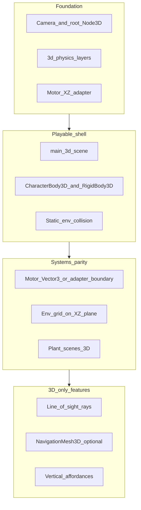

# Hunter Killer — Convert to 3D (migration umbrella)

> **Purpose:** Umbrella spec for moving the **playable application** from the current **2D playfield** to a **3D ship target**. Creature capability/templates are **not** duplicated here — see [CREATURE_3D_ARCHITECTURE.md](CREATURE_3D_ARCHITECTURE.md). **Index:** [PROJECT_DOC_INDEX.md](../PROJECT_DOC_INDEX.md).
>
> **Tier:** Draft (tier II) — `<<Question>>` / `<<Comment>>` expected until maintainers resolve decisions in §4.

---

## 1. Phase summary

**Phase name:** 2D → 3D migration

**One-line objective:** Ship a **3D playfield** with **behavioral parity** for the duel loop (herbivore vs carnivore, food, obstacles, ENGINE motor), then enable **3D-only** perception and environment features deferred while the game ran in 2D.

**Out of scope (explicit non-goals for v1 migration):**

- MMO / networking ([VISION_WORLD_BUILDER_PLAN.md](VISION_WORLD_BUILDER_PLAN.md)).
- Full plant ecology ([PLANT_ECOLOGY_PLAN.md](PLANT_ECOLOGY_PLAN.md)).
- Replacing ENGINE motor with LLM-driven movement ([AI_INT_CONVERSATION_SCOPE_PLAN.md](AI_INT_CONVERSATION_SCOPE_PLAN.md)).
- Big-bang `res://` repo layout ([REPO_LAYOUT_PLAN.md](REPO_LAYOUT_PLAN.md)) unless coordinated in a separate change.
- Implementing line-of-sight, navmesh, or volumetric crush in the **same** milestone as the baseline 3D shell (§5 — separate phases).

---

## 2. Context for agents

**Repo / project root:** Directory containing `project.godot`.

**Engine & version:** Godot **4.6.x** (match `project.godot`); **Forward Plus** renderer and **Jolt** 3D physics already configured.

**Main scenes / entry (today):** [`main.tscn`](../../main.tscn) + [`main.gd`](../../main.gd) — `run/main_scene` in `project.godot`.

**Autoloads (unchanged initially):** `GameConfig`, `OLog`, `AiDriver`.

### 2.1 As-is snapshot (verified against code)

| Area | Today (2D production) | 3D already started |
|------|------------------------|-------------------|
| **Main loop** | `Path2D` mob spawn, `TextureRect` background, duel spawns in **viewport pixel** space | Not wired to 3D main |
| **Player** | [`player.gd`](../../player.gd) — `CharacterBody2D`, `Vector2` intent, `move_and_slide()` | — |
| **Mob** | [`mob.gd`](../../mob.gd) — `RigidBody2D`, ENGINE sets `linear_velocity` | — |
| **Obstacles** | [`obstacle_field.tscn`](../../obstacle_field.tscn) — `StaticBody2D` + `RectangleShape2D` | Motor collects AABB rects only ([HUNTER_KILLER_FIELD_AND_PERCEPTION_PLAN.md](../Completed_Features/HUNTER_KILLER_FIELD_AND_PERCEPTION_PLAN.md)) |
| **Motor / AI** | [`ai_driver.gd`](../../AI_int_lib/ai_driver.gd) + [`cardinal_avoidance.gd`](../../creature/motor/cardinal_avoidance.gd) — heavy **`Vector2`** usage; awareness = radius + forward cone (**no rays**) per [CREATURE_MOVEMENT_V2.md §E](CREATURE_MOVEMENT_V2.md) | — |
| **Environment** | [`EnvironmentGridBaked`](../../environment/environment_grid_baked.gd) from 2D palette PNG; **center-cell** sampling ([ENVIRONMENT_MODEL_PLAN.md §11](../Definitive_Features/ENVIRONMENT_MODEL_PLAN.md)) | Height / volumetric crush **deferred** |
| **Physics config** | [`project.godot`](../../project.godot) — **2d** layer names (bits 1, 2, 4, 8) | **No** `3d_physics/layer_*` table yet |
| **Creature stack** | 2D bodies in `player.tscn` / `mob.tscn` | Parallel: [`creature_root_3d.gd`](../../creature/creature_root_3d.gd), templates, [`creature_kinematic_body_3d.gd`](../../creature/capabilities/creature_kinematic_body_3d.gd) (**XZ intent, gravity on Y**) — [CREATURE_3D_ARCHITECTURE.md](CREATURE_3D_ARCHITECTURE.md) |
| **Product intent** | [ASSET_MANAGEMENT_PLAN.md §5.1–5.2](../Completed_Features/ASSET_MANAGEMENT_PLAN.md): **2D is transitional**; **3D before release** | glTF storage policy still open there |

### 2.2 Authoritative child docs (link; do not restate)

| Topic | Doc |
|-------|-----|
| **3D creature capabilities & templates** | [CREATURE_3D_ARCHITECTURE.md](CREATURE_3D_ARCHITECTURE.md) |
| **Motor refactor, awareness cone, LoS policy** | [CREATURE_MOVEMENT_V2.md](CREATURE_MOVEMENT_V2.md) (§D–§E) |
| **Memory, occlusion boundary** | [CREATURE_MEMORY.md §7.4](CREATURE_MEMORY.md) |
| **Environment / layer contract** | [ENVIRONMENT_MODEL_PLAN.md](../Definitive_Features/ENVIRONMENT_MODEL_PLAN.md) — promote **§6** to 3D when layers ship |
| **2D motor inventory (until superseded)** | [CREATURE_MOVEMENT.md](../Definitive_Features/CREATURE_MOVEMENT.md) |
| **Backlog parking lot** | [ENHANCEMENT_BACKLOG_PLAN.md](../ENHANCEMENT_BACKLOG_PLAN.md) — Perception & awareness |

### 2.3 Migration dependency graph

---

## 3. Migration workstreams

Ordered checklist. Each item: **what changes**, **key paths**, **acceptance hint**.

### 3.1 Rendering & scene root

- **What:** New `Main3D` (or replace [`main.tscn`](../../main.tscn)): `Node3D` root, `WorldEnvironment`, `DirectionalLight3D`, `Camera3D`.
- **What:** Replace `TextureRect` playfield art with ground mesh / terrain or orthographic “table” mesh.
- **What:** Keep [`hud.tscn`](../../hud.tscn) as Control overlay.
- **Acceptance:** Scene loads; camera frames duel playfield; HUD still works.

### 3.2 Coordinate & input contract

- **Normative (already in 3D kinematic code):** Motor “compass” maps to **world XZ**; **Y** = vertical ([`creature_kinematic_body_3d.gd`](../../creature/capabilities/creature_kinematic_body_3d.gd)).
- **Normative:** **Single adapter** at body boundary ([CREATURE_3D_ARCHITECTURE.md §4](CREATURE_3D_ARCHITECTURE.md)) — not per-species scatter.
- **Input:** `move_up` / `move_down` → **−Z / +Z** or camera-relative forward — see **D1** / input row in §4.
- **Acceptance:** Human input and ENGINE intent both move creatures on the ground plane without Y drift in v1 unless **D6** chooses otherwise.

### 3.3 Actor bodies & scenes

- **What:** Migrate [`player.tscn`](../../player.tscn) / [`mob.tscn`](../../mob.tscn) to 3D templates ([`creature_herbivore_kinematic_3d.tscn`](../../creature/templates/creature_herbivore_kinematic_3d.tscn), [`creature_carnivore_rigid_3d.tscn`](../../creature/templates/creature_carnivore_rigid_3d.tscn)) or inline `CharacterBody3D` / `RigidBody3D` with shared capability nodes.
- **What:** Retire `Area2D`-only locomotion; keep overlap as child **`Area3D`** for pickup / hit ([OBJECT_AVOIDANCE_PLAN.md §5.1](../Completed_Features/OBJECT_AVOIDANCE_PLAN.md)).
- **What:** [`playfield_clamp.gd`](../../creature/capabilities/playfield_clamp.gd) — viewport AABB → **world bounds** volume.
- **Acceptance:** Collisions, eating, mob hit, starvation paths still fire.

### 3.4 Physics layers

- **What:** Mirror [ENVIRONMENT_MODEL_PLAN.md §6](../Definitive_Features/ENVIRONMENT_MODEL_PLAN.md) into **`3d_physics/layer_*`**: `world_static`, `player`, `mob`, `plant_mob_block`.
- **What:** Update [`solid_shrub`](../../assets/plants/solid_shrub/) / [`open_shrub`](../../assets/plants/open_shrub/) to 3D collision; preserve Food A vs Food B mask story.
- **Acceptance:** Player walks static + calorie areas; mob blocked by rocks and open-shrub shell; player not blocked by `plant_mob_block`.

### 3.5 Obstacles & static environment

- **What:** Replace [`obstacle_field.tscn`](../../obstacle_field.tscn) rectangles with `StaticBody3D` + `BoxShape3D` / `ConcavePolygonShape3D` (or CSG).
- **What:** `AiDriver._static_obstacles_for_motor` — extend from `RectangleShape2D` AABBs to **3D AABB projected on XZ** (or dedicated motor occluder group).
- **Acceptance:** Cardinal motor still avoids rocks; no regression in squeeze / edge penalties vs 2D baseline.

### 3.6 Motor & AiDriver

- **Phase A (minimal):** Keep `Vector2` motor plane; convert at `AiDriver` → body via adapter (`Vector2(x, y)` → `Vector3(x, 0, z)`).
- **Phase B (optional):** `MotorContext`, `SeekCandidate`, `ThreatSample`, `CardinalAvoidance` use horizontal `Vector3`; [`awareness_debug_overlay.gd`](../../creature/awareness_debug_overlay.gd) → `Node3D` debug draw or `ImmediateMesh`.
- **What:** [`motor_target_builder.gd`](../../creature/motor/motor_target_builder.gd) food scans use `global_position` from 3D nodes.
- **What:** Carnivore pursuit stays on unified seek path ([CREATURE_MOVEMENT_V2.md §A.2](CREATURE_MOVEMENT_V2.md)).
- **Acceptance:** ENGINE duel: forage, flee, pursuit, obstacle detour within documented tolerance.

### 3.7 Environment grid

- **What:** Logical cell grid on **XZ**: `origin_world` as `Vector3`; `cell_size` in world units; bake from image **or** future heightmap ([ENVIRONMENT_MODEL §11](../Definitive_Features/ENVIRONMENT_MODEL_PLAN.md)).
- **What:** v1 keeps **center-cell** `can_enter` / slowdown; mesh overlap sampling is follow-up.
- **Acceptance:** `can_enter` and `movement_speed_multiplier` behave as in 2D for same authored kind map projected on XZ.

### 3.8 Plants & food

- **What:** 3D meshes + `StaticBody3D` / `Area3D` calorie pickup; preserve hunger semantics.
- **What:** [`bush_food.gd`](../../assets/plants/bush_food.gd) proximity rules for capsule vs bush collision.
- **Acceptance:** Solid vs open shrub blocking unchanged; player calorie pickup works.

### 3.9 Assets & import

- **What:** Follow [ASSET_MANAGEMENT_PLAN.md §5.2](../Completed_Features/ASSET_MANAGEMENT_PLAN.md) — glTF, shared `StandardMaterial3D`, collision at import.
- **Note:** Mixed 2D UI / sprites acceptable during transition.

### 3.10 Tests & CI

- **What:** Extend [`tests/run_all.gd`](../../tests/run_all.gd) — 3D template smoke + headless motor tests with adapter.
- **What:** SubViewport or dedicated 3D test scene for physics integration ([CREATURE_3D_ARCHITECTURE.md §5](CREATURE_3D_ARCHITECTURE.md)).
- **Acceptance:** CI / local `run_all` green.

### 3.11 Documentation promotion triggers

- When **3d** layers ship: update **Definitive** [ENVIRONMENT_MODEL_PLAN.md §6](../Definitive_Features/ENVIRONMENT_MODEL_PLAN.md) (2D table → 3D or dual table).
- When motor runs on 3D main: [CREATURE_MOVEMENT_V2.md](CREATURE_MOVEMENT_V2.md) supersedes [CREATURE_MOVEMENT.md](../Definitive_Features/CREATURE_MOVEMENT.md) inventory.

---

## 4. Outstanding decisions

Use `<<Question: …>>` until resolved. Agents must **not** guess product choices here.

| ID | Topic | Options / notes |
|----|--------|-----------------|
| **D1** | **Camera** | Orthographic top-down (2D-like readability) vs perspective third-person vs fixed isometric |
| **D2** | **Migration strategy** | Parallel `main_3d.tscn` + feature flag vs in-place replace `run/main_scene` |
| **D3** | **Motor typing** | Adapter-only (`Vector2` motor + XZ adapter) vs full `Vector3` motor refactor before 3D main |
| **D4** | **Carnivore physics** | Keep `RigidBody3D` chase vs migrate to `CharacterBody3D` + `move_and_slide` |
| **D5** | **Terrain authoring** | Retain PNG **kind grid on XZ** vs mesh/CSG + optional navmesh bake vs Godot 4.x 3D tile tools |
| **D6** | **Vertical gameplay v1** | Ground-only (Y locked) vs jump/climb/shelves (kinematic already has gravity/jump hooks) |
| **D7** | **Unit space** | Keep `awareness_*` “px” keys as world meters 1:1 vs rename config to meters |
| **D8** | **LLM snapshot** | How to serialize 3D positions / relations in `AiDriver` snapshot ([HUNTER_KILLER_FIELD_AND_PERCEPTION_PLAN.md](../Completed_Features/HUNTER_KILLER_FIELD_AND_PERCEPTION_PLAN.md)) — separate from ENGINE motor |
| **D9** | **Art source storage** | In-repo glTF vs LFS vs external ([ASSET_MANAGEMENT §5.2](../Completed_Features/ASSET_MANAGEMENT_PLAN.md)) |

<<Comment: Default recommendation for D3 — Phase A adapter first to unblock M0–M1; Phase B only if adapter debt blocks LoS or env sampling.>>

---

## 5. Godot 3D capabilities unlocked (deferred)

**Enabled after baseline 3D shell (§6 M1–M2).** Do not bundle into the first migration PR unless a child plan explicitly scopes it.

| Capability | Why 2D lacked it | Hunter Killer touchpoints |
|------------|------------------|---------------------------|
| **Line of sight (physics rays)** | No depth/occluders; cone + distance only | [CREATURE_MOVEMENT_V2 §E.2](CREATURE_MOVEMENT_V2.md), [CREATURE_MEMORY §7.4](CREATURE_MEMORY.md), `SeekCandidate` / `occluded`, [ENHANCEMENT_BACKLOG](../ENHANCEMENT_BACKLOG_PLAN.md) |
| **Occlusion-aware awareness** | Rect obstacles ≠ vision blockers | Tier-2 hostile detection, ghost memory confidence |
| **Stealth / hide behind cover** | No volumetric cover | [CREATURE_GOAL_DRIVERS §5.1.4](CREATURE_GOAL_DRIVERS.md) — Slot B `current_fit` LoS matchers |
| **NavigationMesh3D** | Cardinal motor only | Optional mob detour ([ENVIRONMENT_MODEL §8](../Definitive_Features/ENVIRONMENT_MODEL_PLAN.md)) |
| **Height / stacking / volumetric crush** | Planar grid only | `crush_weight`, multi-layer palettes ([ENVIRONMENT_MODEL](../Definitive_Features/ENVIRONMENT_MODEL_PLAN.md)) |
| **Mesh footprint sampling** | Center-cell only | Sustained-slow / passible probes ([ENVIRONMENT_MODEL §11](../Definitive_Features/ENVIRONMENT_MODEL_PLAN.md)) |
| **Vertical affordances** | Flat plane | Jump (kinematic), burrow/climb hooks ([CREATURE_MODEL_PLAN.md](CREATURE_MODEL_PLAN.md)) |
| **3D debug & gizmos** | `Node2D` draw | Awareness overlay, threat cones in world space |
| **Lighting / shadows** | Flat sprites | Future stealth readability — not spec’d yet |
| **Spatial audio** | 2D pan only | Duel tension, threat direction |
| **Skeleton animation** | `Sprite2D` | `CreatureDefinition.variant_scene` |
| **Silhouette vs unexplored FOV** | Single interior motor bucket | [ENVIRONMENT_MODEL §11](../Definitive_Features/ENVIRONMENT_MODEL_PLAN.md) / OBJECT carry-forward |

### 5.1 Line of sight — implementation sketch (post-shell)

When 3D colliders exist:

- Use `PhysicsRayQueryParameters3D` from **eye height** (creature) to target centroid or visibility point.
- **Mask:** `world_static` + occluder / obstacle groups aligned with motor static collection.
- Integrate into [`motor_target_builder.gd`](../../creature/motor/motor_target_builder.gd) awareness gate and future `SeekCandidate.line_of_sight_clear` / `occluded` ([CREATURE_MOVEMENT_V2 §D](CREATURE_MOVEMENT_V2.md)).
- Pair with **semantic** env factors when grid-only truth fails ([CREATURE_MEMORY §7.4](CREATURE_MEMORY.md)).

---

## 6. Phased implementation plan

| Milestone | Scope |
|-----------|--------|
| **M0** | 3D test scene + duel using existing templates; ENGINE motor → XZ adapter |
| **M1** | Replace or parallel `main` — camera, bounds, 3D layer table, static rocks/plants as 3D bodies |
| **M2** | Motor parity on XZ (food, mobs, obstacles, goal memory sync); 3D awareness debug |
| **M3** | Promote definitive docs; deprecate 2D-only production scenes |
| **M4** | Backlog features (LoS, navmesh, vertical crush) as **separate** plans / PRs |

---

## 7. Acceptance criteria (migration complete)

- [ ] `run/main_scene` loads a **3D** root; human + ENGINE duel playable end-to-end.
- [ ] Herbivore forage + carnivore pursuit match 2D behavior within tolerance (document test scene / steps in PR).
- [ ] `project.godot` lists **`3d_physics/layer_*`** mirroring hunger / obstacle semantics in [ENVIRONMENT_MODEL §6](../Definitive_Features/ENVIRONMENT_MODEL_PLAN.md).
- [ ] Ship build has **no** production reliance on `CharacterBody2D` / `Path2D` mob path for the main duel.
- [ ] [`tests/run_all.gd`](../../tests/run_all.gd) green; 3D template smoke included.

---

## 8. Changelog

| Date | Change |
|------|--------|
| 2026-06-04 | Initial umbrella draft: as-is snapshot, workstreams, decisions D1–D9, deferred 3D capabilities, milestones M0–M4. |
