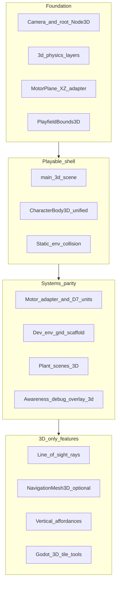

# Hunter Killer — Convert to 3D (migration umbrella)

> **Purpose:** Umbrella spec for the **2D → 3D playfield migration**. Production entry is **3D** ([`main_3d.tscn`](../../main_3d.tscn)). Creature capability/templates are **not** duplicated here — see [CREATURE_3D_ARCHITECTURE.md](CREATURE_3D_ARCHITECTURE.md). **Index:** [PROJECT_DOC_INDEX.md](../PROJECT_DOC_INDEX.md).
>
> **Tier:** Draft (tier II) — living doc; resolved decisions in §4.

---

## 1. Phase summary

**Phase name:** 2D → 3D migration

**One-line objective:** Ship a **3D playfield** with **behavioral parity** for the duel loop (herbivore vs carnivore, food, obstacles, ENGINE motor), then enable **3D-only** perception and environment features deferred while the game ran in 2D.

**Out of scope (explicit non-goals for v1 migration):**

- MMO / networking ([VISION_WORLD_BUILDER_PLAN.md](VISION_WORLD_BUILDER_PLAN.md)).
- Full plant ecology ([PLANT_ECOLOGY_PLAN.md](PLANT_ECOLOGY_PLAN.md)).
- Replacing ENGINE motor with LLM-driven movement ([AI_INT_CONVERSATION_SCOPE_PLAN.md](AI_INT_CONVERSATION_SCOPE_PLAN.md)).
- Big-bang `res://` repo layout ([REPO_LAYOUT_PLAN.md](REPO_LAYOUT_PLAN.md)) unless coordinated in a separate change.
- Implementing line-of-sight, navmesh, or volumetric crush in the **same** milestone as the baseline 3D shell (§5 — separate phases).
- **Vertical gameplay** (jump, climb, shelves) — **D6**; later enhancement.
- **Production terrain authoring** via Godot 4.x 3D tile tools — **D5** follow-on; current mesh/grid is dev/test scaffolding only.

---

## 2. Context for agents

**Repo / project root:** Directory containing `project.godot`.

**Engine & version:** Godot **4.6.x** (match `project.godot`); **Forward Plus** renderer and **Jolt** 3D physics configured.

**Main scenes / entry (today):** [`main_3d.tscn`](../../main_3d.tscn) + [`main_3d.gd`](../../main_3d.gd) — `run/main_scene` in `project.godot`.

**Removed (no longer in tree):** `main.tscn`, `main.gd`, `player.tscn`, `player.gd`, `mob.tscn`, `mob.gd`, `obstacle_field.tscn`.

**Autoloads:** `GameConfig`, `OLog`, `AiDriver`.

### 2.1 As-is snapshot (verified against code)

| Area | 3D production (current) | Convert debt remaining |
|------|-------------------------|-------------------------|
| **Main loop** | [`main_3d.gd`](../../main_3d.gd) — grasslands `.blend` playfield (fallback floor box), ENGINE/HUMAN duel, HUD overlay, perspective camera (`TOP_DOWN` / `OVER_SHOULDER`) | — |
| **Playfield bounds** | [`PlayfieldBounds3D`](../../environment/playfield_bounds_3d.gd) — XZ bounds from playfield root collision AABB (mesh fallback) — **D10** | — |
| **Creatures** | Unified **`CharacterBody3D` + `move_and_slide`** for all species — [`creature_herbivore_kinematic_3d.tscn`](../../creature/templates/creature_herbivore_kinematic_3d.tscn), [`creature_carnivore_kinematic_3d.tscn`](../../creature/templates/creature_carnivore_kinematic_3d.tscn) — **D4** | — |
| **Obstacles / plants** | Perimeter/interior boulders; [`solid_shrub_3d`](../../assets/plants/solid_shrub/solid_shrub_3d.tscn) / [`open_shrub_3d`](../../assets/plants/open_shrub/open_shrub_3d.tscn); [`MotorObstacleGeometry`](../../creature/motor/motor_obstacle_geometry.gd) | — |
| **Motor / AI** | [`MotorPlane`](../../creature/motor/motor_plane.gd) XZ adapter; [`ai_driver.gd`](../../AI_int_lib/ai_driver.gd) on `PhysicsBody3D`; [`TerrainMotor`](../../creature/motor/terrain_motor.gd) ground conforming; awareness = radius + forward cone (**no LoS rays**) | — |
| **Environment grid** | [`main_3d.gd`](../../main_3d.gd) `_create_default_open_grid()` — procedural flat all-open grid in world meters; [`PlayfieldGroundSampler`](../../environment/playfield_ground_sampler.gd) for sculpted terrain elevation | **D5:** dev scaffold only; PNG kind bake and 3D tile pipeline deferred |
| **Physics config** | [`project.godot`](../../project.godot) — **`3d_physics/layer_*`**: `world_static`, `player`, `mob`, `plant_mob_block`; promoted to [ENVIRONMENT_MODEL §6](../Definitive_Features/ENVIRONMENT_MODEL_PLAN.md) | — |
| **Debug** | [`awareness_debug_overlay_3d.gd`](../../creature/awareness_debug_overlay_3d.gd) on **both** duel templates (herbivore: live + ghost mob samples; carnivore: prey in reach) | — |
| **Tests** | 3D template smoke, predation contact, playfield bounds, 3D-only motor/awareness fixtures in [`tests/run_all.gd`](../../tests/run_all.gd) | — |

### 2.2 Authoritative child docs (link; do not restate)

| Topic | Doc |
|-------|-----|
| **3D creature capabilities & templates** | [CREATURE_3D_ARCHITECTURE.md](CREATURE_3D_ARCHITECTURE.md) — unified kinematic **D4** |
| **Motor refactor, awareness cone, LoS policy** | [CREATURE_MOVEMENT_V2.md](CREATURE_MOVEMENT_V2.md) (§D–§E) — active design; supersedes 2D inventory |
| **Memory, occlusion boundary** | [CREATURE_MEMORY.md §7.4](CREATURE_MEMORY.md) |
| **Environment / layer contract** | [ENVIRONMENT_MODEL_PLAN.md](../Definitive_Features/ENVIRONMENT_MODEL_PLAN.md) — **§6 3D layers** |
| **2D motor inventory (historical)** | [CREATURE_MOVEMENT.md](../Definitive_Features/CREATURE_MOVEMENT.md) |
| **Backlog parking lot** | [ENHANCEMENT_BACKLOG_PLAN.md](../ENHANCEMENT_BACKLOG_PLAN.md) — Perception & awareness; 3D tile tools (D5) |

### 2.3 Migration dependency graph

### 2.4 Implementation status (milestones & workstreams)

**Milestones**

| Milestone | Status | Key paths / notes |
|-----------|--------|-------------------|
| **M0** | **Done** | `MotorPlane`; 3D templates; headless tests in `run_all.gd` |
| **M1** | **Done** | `main_3d.tscn`; 3D layers; plants/obstacles; **D10** bounds |
| **M2** | **Done** | Motor parity on XZ; D7 unit rename; 3D-only `run_all.gd` fixtures |
| **M3** | **Done** | Rigid stub removed; §3.11 doc promotion; `run_all.gd` 3D-only fixtures |
| **M4** | **Partial** | **Done:** LoS (combined gate), navmesh cardinal hint, footprint ≥25%, movement_impact merge. **Out of scope:** D5 tile authoring (separate project). **Deferred:** vertical crush. |

**Workstreams** — see §3 for detail; summary: **3.1–3.6, 3.8–3.11 Done**; **3.7 Partial**.

### 2.5 Intentional drift / lessons learned

Gaps between this doc’s **2026-06-04** draft and today’s code. Many reflect **testing lessons**, not accidental bugs.

| Gap | Code today | Likely intent | Tracking |
|-----|------------|---------------|----------|
| **Env grid vs terrain mesh** | Procedural open grid + separate `PlayfieldGroundSampler` | **D5:** dev/test scaffold; not production tile pipeline | §3.7 Partial |
| **TerrainMotor vs D6** | Elevation costs + ground snap on sculpted mesh | **Ground conforming** in scope; **vertical gameplay** out | D6 |
| **Vector2 motor plane** | `MotorPlane`, `PlayfieldClamp`, `EnvironmentGridBaked.origin_world: Vector2` | **D3 Phase A:** deliberate adapter boundary | Not unit debt |
| **LLM snapshot** | `_build_snapshot_blob()` returns `""` | **D8:** deferred; may scrap entirely | Not migration blocker |
---

## 3. Migration workstreams

Ordered checklist. **Status:** Done / Partial / Open.

### 3.1 Rendering & scene root — **Done**

- **What:** [`main_3d.tscn`](../../main_3d.tscn): `Node3D` root, `WorldEnvironment`, `DirectionalLight3D`, `Camera3D`.
- **What:** Dev playfield: grasslands `.blend` mesh + fallback `StaticBody3D` floor (**D5** interim).
- **What:** [`hud.tscn`](../../hud.tscn) Control overlay unchanged.
- **Acceptance:** Scene loads; camera frames duel playfield; HUD works. **Met.**

### 3.2 Coordinate & input contract — **Done**

- **Normative:** Motor compass → **world XZ**; **Y** = vertical ([`creature_kinematic_body_3d.gd`](../../creature/capabilities/creature_kinematic_body_3d.gd)).
- **Normative:** Single adapter — [`MotorPlane`](../../creature/motor/motor_plane.gd) — not per-species scatter (**D3** Phase A).
- **Input:** `move_up` / `move_down` → **−Z / +Z** on ground plane; over-shoulder mode uses camera-relative intent (**D1**).
- **Acceptance:** Human input and ENGINE intent move creatures on the ground plane. **Met** (ground conforming on sculpted mesh; **D6** excludes jump/climb).

### 3.3 Actor bodies & scenes — **Done**

- **What:** Production duel uses [`creature_herbivore_kinematic_3d.tscn`](../../creature/templates/creature_herbivore_kinematic_3d.tscn) and [`creature_carnivore_kinematic_3d.tscn`](../../creature/templates/creature_carnivore_kinematic_3d.tscn). **No species physics fork** — all **`CharacterBody3D` + `move_and_slide`** (**D4**).
- **What:** Overlap via child **`Area3D`** (MobHitbox, calorie pickup) — [OBJECT_AVOIDANCE_PLAN §5.1](../Completed_Features/OBJECT_AVOIDANCE_PLAN.md).
- **What:** [`playfield_clamp.gd`](../../creature/capabilities/playfield_clamp.gd) — motor-plane `Vector2` API for XZ world bounds from **D10**.
- **What:** [`awareness_debug_overlay_3d.gd`](../../creature/awareness_debug_overlay_3d.gd) on **both** templates under `Body`.
- **Acceptance:** Collisions, eating, mob hit, starvation paths fire. **Met.**

### 3.4 Physics layers — **Done**

- **What:** `3d_physics/layer_*` in [`project.godot`](../../project.godot): `world_static`, `player`, `mob`, `plant_mob_block`.
- **What:** [`solid_shrub_3d`](../../assets/plants/solid_shrub/solid_shrub_3d.tscn) / [`open_shrub_3d`](../../assets/plants/open_shrub/open_shrub_3d.tscn) with Food A vs Food B mask story.
- **Acceptance:** Player walks static + calorie areas; mob blocked by rocks and open-shrub shell. **Met.**

### 3.5 Obstacles & static environment — **Done**

- **What:** Boulders as `StaticBody3D`; [`PlayfieldPerimeterBoulders`](../../environment/playfield_perimeter_boulders.gd).
- **What:** [`MotorObstacleGeometry`](../../creature/motor/motor_obstacle_geometry.gd) — 3D bodies projected to motor XZ; collected from scene tree by `AiDriver`.
- **Acceptance:** Cardinal motor avoids rocks; squeeze / edge penalties within tolerance. **Met.**

### 3.6 Motor & AiDriver — **Done**

- **Phase A (done):** `Vector2` motor plane via **`MotorPlane`**; `AiDriver` drives `PhysicsBody3D` only.
- **Phase B (done):** [`awareness_debug_overlay_3d.gd`](../../creature/awareness_debug_overlay_3d.gd) on both duel bodies; motor internals still use motor-plane `Vector2` in places (optional full `Vector3` refactor deferred).
- **What:** [`motor_target_builder.gd`](../../creature/motor/motor_target_builder.gd) food scans require `Node3D` positions.
- **What:** [`terrain_motor.gd`](../../creature/motor/terrain_motor.gd) — ground conforming on sculpted playfield (**D6**); chase blocking uses XZ-projected AABB segments, not LoS rays.
- **D7 (done):** motor/config distances use world units — no `px` in identifiers, config keys, or comments.
- **Acceptance:** ENGINE duel: forage, flee, pursuit, obstacle detour. **Met.**

### 3.7 Environment grid — **Partial (dev scaffold)**

- **What (today):** [`main_3d.gd`](../../main_3d.gd) `_create_default_open_grid()` — flat all-open logical grid on XZ in **world meters**; center-cell `can_enter` / slowdown.
- **What (not convert goal):** PNG kind bake on XZ from 2D palette era.
- **What (later — D5):** Godot 4.x **3D tile tools** for production terrain + kind authoring.
- **Acceptance:** Grid API works for duel; production authoring pipeline **deferred**.

### 3.8 Plants & food — **Done**

- **What:** 3D shrub scenes + [`bush_food_3d.gd`](../../assets/plants/bush_food_3d.gd) calorie pickup.
- **Acceptance:** Solid vs open shrub blocking; player calorie pickup. **Met.**

### 3.9 Assets & import — **Done**

- **What:** Dev `.blend`/glTF in grasslands, boulders, creatures per [ASSET_MANAGEMENT §5.2](../Completed_Features/ASSET_MANAGEMENT_PLAN.md).
- **Normative:** **D9** — art sources live **in-repo** under [`assets/`](../../assets/), alongside the other files that define each asset (not LFS or external-only storage).

### 3.10 Tests & CI — **Done**

- **Done:** 3D template load, predation contact, playfield bounds, HUD motor-body resolve, and legacy motor/awareness tests ported to 3D fixtures in [`tests/run_all.gd`](../../tests/run_all.gd).
- **Acceptance:** CI / local `run_all` green on 3D-only fixtures. **Met.**

### 3.11 Documentation promotion triggers — **Done**

- **3D layers shipped:** [ENVIRONMENT_MODEL_PLAN.md §6](../Definitive_Features/ENVIRONMENT_MODEL_PLAN.md) updated to **`3d_physics`** table.
- **Motor on 3D main:** [CREATURE_MOVEMENT_V2.md](CREATURE_MOVEMENT_V2.md) is active design; [CREATURE_MOVEMENT.md](../Definitive_Features/CREATURE_MOVEMENT.md) marked **2D historical** with supersession banner.
- [CREATURE_3D_ARCHITECTURE.md](CREATURE_3D_ARCHITECTURE.md) §3 reflects **D4** (unified kinematic templates only).

---

## 4. Decisions

Resolved items are **normative**.

| ID | Topic | Resolution |
|----|--------|------------|
| **D1** | **Camera** | **Resolved (interim):** Perspective **top-down** for ENGINE/AI duel + **over-shoulder** for human play ([`main_3d.gd`](../../main_3d.gd) `CameraMode`). Orthographic/isometric remain future options. |
| **D2** | **Migration strategy** | **Resolved:** In-place `run/main_scene` → `main_3d.tscn` (no parallel feature flag). |
| **D3** | **Motor typing** | **Resolved:** Phase A — [`MotorPlane`](../../creature/motor/motor_plane.gd) adapter (`Vector2` motor plane ↔ XZ world). Phase B full `Vector3` motor refactor **optional**. |
| **D4** | **Creature physics** | **Resolved:** **No species fork.** All creatures use **`CharacterBody3D` + `move_and_slide`**. Rigid-body path **abandoned**; stub is cleanup debt only. |
| **D5** | **Terrain authoring** | **Resolved (interim):** Current grasslands mesh + procedural open env grid + hand-placed props = **dev/testing scaffolding**. **Later enhancement:** Godot 4.x **3D tile tools** for production terrain. |
| **D6** | **Vertical gameplay** | **Resolved for this convert:** **Ground-only gameplay** — no jump, climb, shelves, or vertical affordances. **Ground conforming** (walk on sculpted mesh via ground rays / `TerrainMotor`) **is in scope**. Vertical gameplay = later enhancement. |
| **D7** | **Unit space** | **Resolved:** **Meters** for player-facing distances; generic **game units** for motor/config internals. **Convert exit:** code must **not** refer to `px` (identifiers, config keys, comments). **Done (M2).** |
| **D8** | **LLM snapshot** | **Deferred / likely dropped.** LLM integration deferred; may be scrapped entirely. `_build_snapshot_blob()` stub acceptable; **not** a migration-complete requirement. |
| **D9** | **Art source storage** | **Resolved:** **In-repo** under [`assets/`](../../assets/), alongside the other files that define each asset (not LFS or external-only storage). See [ASSET_MANAGEMENT §5.2](../Completed_Features/ASSET_MANAGEMENT_PLAN.md). |
| **D10** | **Playfield bounds** | **Resolved:** [`PlayfieldBounds3D.xz_bounds_from_playfield_root`](../../environment/playfield_bounds_3d.gd) — collision AABB from playfield root; mesh AABB fallback; motor clamp/spawn use XZ `min` / `max` / `size`. |

---

## 5. Godot 3D capabilities unlocked (deferred)

**Enabled after baseline 3D shell (§6 M1–M2).** Do not bundle into the first migration PR unless a child plan explicitly scopes it.

| Capability | Why 2D lacked it | Hunter Killer touchpoints |
|------------|------------------|---------------------------|
| **3D tile terrain authoring** | 2D PNG palette | **D5 follow-on** — Godot 4.x tile tools; replaces dev grasslands scaffold |
| **Line of sight (physics rays)** | No depth/occluders; cone + distance only | [CREATURE_MOVEMENT_V2 §E.2](CREATURE_MOVEMENT_V2.md), [CREATURE_MEMORY §7.4](CREATURE_MEMORY.md), `SeekCandidate` / `occluded`, [ENHANCEMENT_BACKLOG](../ENHANCEMENT_BACKLOG_PLAN.md) |
| **Occlusion-aware awareness** | Rect obstacles ≠ vision blockers | Tier-2 hostile detection, ghost memory confidence |
| **Stealth / hide behind cover** | No volumetric cover | [CREATURE_GOAL_DRIVERS §5.1.4](CREATURE_GOAL_DRIVERS.md) — Slot B `current_fit` LoS matchers |
| **NavigationMesh3D** | Cardinal motor only | Optional mob detour ([ENVIRONMENT_MODEL §8](../Definitive_Features/ENVIRONMENT_MODEL_PLAN.md)) |
| **Height / stacking / volumetric crush** | Planar grid only | `crush_weight`, multi-layer palettes ([ENVIRONMENT_MODEL](../Definitive_Features/ENVIRONMENT_MODEL_PLAN.md)) |
| **Mesh footprint sampling** | Center-cell only | Sustained-slow / passible probes ([ENVIRONMENT_MODEL §11](../Definitive_Features/ENVIRONMENT_MODEL_PLAN.md)) |
| **Vertical affordances** | Flat plane | Jump, burrow, climb — **D6** later enhancement |
| **3D debug & gizmos** | `Node2D` draw | [`awareness_debug_overlay_3d.gd`](../../creature/awareness_debug_overlay_3d.gd) — **shipped on both duel templates** |
| **Lighting / shadows** | Flat sprites | Directional shadows on 3D main; future stealth readability not spec’d |
| **Spatial audio** | 2D pan only | Duel tension, threat direction |
| **Skeleton animation** | `Sprite2D` | `CreatureDefinition.variant_scene` |
| **Silhouette vs unexplored FOV** | Single interior motor bucket | [ENVIRONMENT_MODEL §11](../Definitive_Features/ENVIRONMENT_MODEL_PLAN.md) / OBJECT carry-forward |

### 5.1 Line of sight — M4 normative (shipped)

- **Rays:** [`line_of_sight.gd`](../../creature/motor/line_of_sight.gd) — `PhysicsRayQueryParameters3D`, mask **`world_static` (layer 1)**.
- **Eye height:** optional `creature_motor.los_eye_height` in pack; default **`0.9 × collision_capsule_height`** (synced with `creature_size` via [`creature_kinematic_body_3d.gd`](../../creature/capabilities/creature_kinematic_body_3d.gd)).
- **Target:** centroid / AABB center.
- **Gate:** **combined** distance + cone + LoS in [`motor_target_builder.gd`](../../creature/motor/motor_target_builder.gd); **`>60%` occluded = blocked** for live ingest.
- **Ghosts / memory:** persist when occluded (object permanence); LoS gates **live** refresh only.
- **Deferred:** semantic env factors ([CREATURE_MEMORY §7.4](CREATURE_MEMORY.md)); stealth/observation skill checks ([ENHANCEMENT_BACKLOG_PLAN.md](../ENHANCEMENT_BACKLOG_PLAN.md)).

### 5.2 NavigationMesh3D — M4 normative (shipped)

- **`NavigationRegion3D`** baked in [`main_3d.gd`](../../main_3d.gd); agent radius = max duel `collision_capsule_radius`.
- **Integration:** cardinal **hint** only ([`nav_path_hint.gd`](../../environment/nav_path_hint.gd) + [`cardinal_avoidance.gd`](../../creature/motor/cardinal_avoidance.gd)); all **ENGINE** creatures; `navmesh_hint_enabled` / `navmesh_hint_weight` in `creature_motor`.

---

## 6. Phased implementation plan

| Milestone | Status | Scope |
|-----------|--------|--------|
| **M0** | **Done** | 3D templates + `MotorPlane`; headless duel tests in `run_all.gd` |
| **M1** | **Done** | `main_3d` production entry — camera, **D10** bounds, 3D layers, static rocks/plants |
| **M2** | **Done** | Motor parity on XZ; D7 unit rename; 3D-only `run_all.gd` fixtures |
| **M3** | **Done** | Rigid stub cleanup; definitive doc promotion (§3.11); `run_all.gd` 3D-only fixtures |
| **M4** | **Partial** | LoS + nav hint + footprint + merge **shipped**; D5 **separate project**; crush **deferred** |

---

## 7. Acceptance criteria (migration complete)

- [x] `run/main_scene` loads a **3D** root; human + ENGINE duel playable end-to-end (`main_3d.tscn`).
- [x] Herbivore forage + carnivore pursuit on unified **`CharacterBody3D`** bodies (headless: `_test_creature_3d_predation_contact` in `run_all.gd`).
- [x] `project.godot` lists **`3d_physics/layer_*`** mirroring hunger / obstacle semantics.
- [x] Ship build has **no** production reliance on removed 2D duel scenes (`CharacterBody2D` / `Path2D` mob path).
- [x] **Both** duel templates include [`awareness_debug_overlay_3d.gd`](../../creature/awareness_debug_overlay_3d.gd) under `Body`.
- [x] **D7:** No `px` in identifiers, config keys, or comments across motor, env, creature, and AI paths.
- [x] [`tests/run_all.gd`](../../tests/run_all.gd) green with **3D-only** fixtures (no removed 2D scenes).

**Not required for migration complete (D8):** LLM 3D perception snapshot.

---

## 8. Changelog

| Date | Change |
|------|--------|
| 2026-06-04 | Initial umbrella draft: as-is snapshot, workstreams, decisions D1–D9, deferred 3D capabilities, milestones M0–M4. |
| 2026-06-08 | Restored living doc after implementation drift: 3D production snapshot (M0–M1 done, M2 partial); resolved D1–D10 (**D9:** in-repo under `assets/`); §2.4 status + §2.5 intentional drift; unified kinematic bodies (D4); dev terrain scaffold (D5); awareness overlay on both templates; §3.9 Done; acceptance scorecard updated. |
| 2026-06-08 | **M2 complete:** D7 unit rename (no `px` in motor/env/creature/AI paths); `run_all.gd` migrated to 3D-only fixtures; §3.6 / §3.10 Done. |
| 2026-06-08 | **M3 complete:** Deleted `creature_rigid_body_3d` stub; synthetic boundary AABB tests; §3.11 doc promotion (ENVIRONMENT_MODEL §6, CREATURE_MOVEMENT supersession, CREATURE_3D_ARCHITECTURE D4). |
| 2026-06-08 | **M4 partial:** LoS combined gate (`line_of_sight.gd`), navmesh cardinal hint, footprint ≥25%, movement_impact merge, creature size↔capsule sync; D5 out of scope; crush deferred. |
