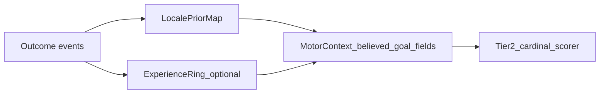

# Hunter Killer — Creature memory (agent-friendly)

> **Purpose:** **Authoritative working spec** for **creature memory** — what an agent **stores** and **updates** so it can pursue [CREATURE_MODEL_PLAN.md](CREATURE_MODEL_PLAN.md) **goals** (survival, reproduction, trait-shaped priorities). Memory is **not** a telemetry dump of every seen object.

> **Motor / motivation alignment (read first):** **[CREATURE_GOAL_DRIVERS.md](CREATURE_GOAL_DRIVERS.md)** — motivation tree Tier-1/2, **`CreatureDefinition`** traits, habitual **`believed_goal_*`** modulation (strategy-class **`<<Question>>`** Actions **1–3**). **[CREATURE_MOVEMENT_V2.md](CREATURE_MOVEMENT_V2.md)** — unified scripted motor, **`SeekCandidate`** ingress, **`creature_motor`** pack merge, **Preserve vs Find** thresholds (**§A.3.1**), phasing (ENGINE movement Foundations **before** full memory wiring). **This doc:** **what** to remember and how beliefs / locale priors feed **`MotorContext`** (**§§2, 10**).

**Location:** `Draft_Features/` while design stabilizes; **promote** to `Definitive_Features/` when contract vs code (see [PROJECT_DOC_INDEX.md](../PROJECT_DOC_INDEX.md)). **Live code notes:** [`ai_driver.gd`](../../AI_int_lib/ai_driver.gd) (**`_goal_belief`** design block), [`game_config_merge.gd`](../../AI_int_lib/game_config_merge.gd).

---

## 1. Phase summary

**Phase name:** Creature memory (**goal-generalized** beliefs + success patterns)

**One-line objective:** Specify **salient world beliefs** (§2) that reuse **one** memory schema for multiple **goals** (food, mates, **finding shelter**, etc.), with **precise** vs **coarse** tiers, **TTL-based coarse eviction**, **re-awareness promotion** to precise, optional **goal-type payloads** (§5–6), hooks that **modulate Tier-2 behavior** consistently with **[CREATURE_GOAL_DRIVERS.md](CREATURE_GOAL_DRIVERS.md)** + [CREATURE_MOVEMENT_V2.md §A.3.1](CREATURE_MOVEMENT_V2.md), **successful outcome patterns** (**§2.1**) projecting into **`MotorContext`** **`believed_goal_*`** (CREATURE_MOVEMENT_V2 §A.3.1) with **trait-scaled replay** (**§2.2** → **GOAL_DRIVERS §5**), and **§14 open decisions** until learning-layer knobs are settled.

**Explicit non-authority:** **Which** entities count as **`SeekCandidate` / consumable_now / food_candidate** vs **friend/foe** is governed by **`CreatureDefinition`** + ingestion policy ([CREATURE_MOVEMENT_V2.md §A.2 — `feeding_mode` / DietRegistry posture](CREATURE_MOVEMENT_V2.md)). **Memory** stores **belief records** keyed by stable instance ids **where applicable** and **does not** restate predator/omnivore/herbivore branching.

**Out of scope (explicit non-goals):**

- Full utility-AI or MMO-scale persistence.  
- Replacing live sensory awareness with memory-only (**memory merges after / augments live sense**, same story as movement doc §C port).  
- Gender / full `CreatureStats` field catalog (**[CREATURE_MODEL_PLAN.md](CREATURE_MODEL_PLAN.md)**).  
- Full **LoS/occlusion wiring** this round (**§7.4** deferral note; **movement Foundations** path may remain distance + cone until LoS lands — see CREATURE_MOVEMENT_V2 §D–E).

---

## 2. What memory is (conceptual contract)

Creature memory holds **three** cooperating layers, all keyed to **[CREATURE_MODEL_PLAN.md](CREATURE_MODEL_PLAN.md) Goals and motivational priorities** and routed through the **motivation tree** (**[CREATURE_GOAL_DRIVERS.md §2](CREATURE_GOAL_DRIVERS.md)**):

| Layer | Role |
|-------|------|
| **Salient world facts** | Structured beliefs (positions, tiers, payloads, freshness) about **things that matter to active goals**. |
| **Goals and motivational priorities** | Runtime snapshot of Tier-2 **what matters now** — acute hunger/threat/find-mate/evasion urgencies that **prioritize which belief subsets** fuse into **`SeekCandidate` / threat samples**. Same Tier-2 leaves as **[CREATURE_GOAL_DRIVERS.md §2](CREATURE_GOAL_DRIVERS.md)**. |
| **Successful outcome patterns** | Compact records of **action → outcome links** (“leading a predator toward a weaker prey source paid off”; “this squeeze pocket repeatedly broke LoS”; “this nook held for nesting”) so **later decisions can reuse**. |

**Linkage to motivation traits:** **`CreatureDefinition`** trait axes (−100…+100), application order, and **survival-plan** narrative — **[CREATURE_GOAL_DRIVERS.md §3](CREATURE_GOAL_DRIVERS.md)**. Memory writes **signals** Tier-2 mappers consume (**`believed_goal_*`**, **`believed_goal_source_bias`** — CREATURE_MOVEMENT_V2 §A.3.1); **how traits scale habitual replay** — **[CREATURE_GOAL_DRIVERS.md §5](CREATURE_GOAL_DRIVERS.md)** + **§2.2** below. **Future trait drift** — still **[CREATURE_GOAL_DRIVERS.md §3.4](CREATURE_GOAL_DRIVERS.md)** boundary until a learning pass exists; successful patterns must stay **GoalKind-agnostic** (**no forked memory silos**).

### 2.1 Success patterns — locale priors vs experience traces (resolved naming)

Reserve the word **belief** for **salient world facts** (tiered targets, payloads — table row 1). Success-pattern records use distinct names:

| Name | Meaning |
|------|---------|
| **Experience trace** (episodic backend) | A compact **event**: **`(GoalKind, context_hash)`** + optional context snippet + **`modality_tags[]` / `pole_facet_tags[]` / `outcome_envelope`** (same salient-write shape as **[CREATURE_GOAL_DRIVERS.md §5.1](CREATURE_GOAL_DRIVERS.md)**) + scalar outcome (+ decay / TTL). Typically a **bounded ring buffer** per creature / per `GoalKind`. **No separate `action_tag` field** — excised (**§14**). |
| **Locale prior** (aggregated backend) | **Aggregates** keyed by **`(GoalKind, context_hash)`** — e.g. visit counts, EWMA reward estimate, **last_success_time**, plus per-modality **`attempt_count` / `success_count` / `success_delta`** for **[CREATURE_GOAL_DRIVERS.md §5.1](CREATURE_GOAL_DRIVERS.md)** Slot B **confidence**. One row = “how this patch behaved for goal G,” not oracle world truth. |

**Framework contract:** **two optional backends → one façade** consumed by scripted motor (**[CREATURE_MOVEMENT_V2.md §A.3.1 — Believed goal source / habitual locales](CREATURE_MOVEMENT_V2.md)**):

1. **`LocalePriorMap`** — writes/reads hashed aggregates → projects into **`believed_goal_source_bias`** (+ hotspot / escalate radii: **`believed_goal_hotspot_near_radius_px`**, **`believed_goal_seek_escalate_radius_px`** — §10).
2. **`ExperienceRing`** (optional phase-1) — bounded episodic traces for **novelty / retry** (“try improbable again later”); merges into the **same** façade-only signals so Tier-2 **does not** fork (**§14** knobs: ring size, ε sampling, eviction).

**Façade fusion (when both backends active):** agree → **one** motor input; disagree → **[CREATURE_GOAL_DRIVERS.md §5.1 — Action 3 backend merge](CREATURE_GOAL_DRIVERS.md)** (`change_stability` sign, then stable **`tie_key`** odd/even).

**Tick-time flow:**



**Phasing:**

- **Default phase-1 path:** **`LocalePriorMap`** (counters/EWMA + decay); aligns with CREATURE_MOVEMENT_V2 §A.3.1 and keeps per-tick projection cheap.
- **`ExperienceRing`:** **Deferred — future phase** (**§14**). Phase 1 = **`LocalePriorMap` only**; episodic ring, ε sampling, and ring eviction **not** in current scope.
- **Do not** use the label **belief tags** for success patterns — avoids colliding with **belief records** (instance-target memory, §§5–6).

**`context_hash` (concept):** coarse situation fingerprint. Composite key **`(GoalKind, …)`** with **per-`GoalKind` overlays** (**spatial / fingerprint layering — resolved in §14**): e.g. uniform **grid cell** for foraging, squeeze/nest **fingerprints** for **`GoalKind.shelter`**, etc. — **not** one global spatial hash pasted onto every goal. Keep definitions at **consistent higher-order layering** (**goal ordinal / tier**) so composite **third-order** goals can reuse **the same scheme** (§14 row and example therein). Phase-1 *candidate*: **grid cell** for nutrition overlays; sibling keys layered by goal author. **Strategy-class tags**, **`<<Question>>` Actions 1–3**, and trait replay modulation — **[CREATURE_GOAL_DRIVERS.md §5](CREATURE_GOAL_DRIVERS.md)**. Other §14 knobs (normalization, gates, …) stay open where marked. Optional tags paired with **`context_hash`** feed **`believed_goal_*`** once **Actions 1–3** **`Resolved:`** there.

### 2.2 Trait-mediated replay (**context_hash × motivation traits`)

**Canonical narrative:** illustrative **`explorer_builder`** tension table, strategy-class **`Resolved`** prose + **`<<Question>>` Actions 1–3** — **[CREATURE_GOAL_DRIVERS.md §5](CREATURE_GOAL_DRIVERS.md)**.

**This file (data path):** **`LocalePriorMap`** / **`ExperienceRing`** (**§2.1**) → **`believed_goal_source_bias`** (**[CREATURE_MOVEMENT_V2.md §A.3.1](CREATURE_MOVEMENT_V2.md)**). Trait scalar semantics (**−100…+100**, spawn-fixed today): **[CREATURE_GOAL_DRIVERS.md §3](CREATURE_GOAL_DRIVERS.md)**.

**Principle:** **`context_hash`** situation class × traits scales **reapplication** without branching **`SeekCandidate` ingress**.

**Backend tuning:** **§14** — reward shaping, write gates, decay, projection geometry (**Resolved**); **`ExperienceRing`** deferred (**§14**).

**Future:** learned trait drift orthogonal (**GOAL_DRIVERS §3.4**); **one** Tier-2 façade for food / mate / shelter / evasion proofs (**§2 table**).
---

## 3. Goal-aligned categories

Memory categories **rollup** to Tier-2 leaves (**[CREATURE_GOAL_DRIVERS.md §4](CREATURE_GOAL_DRIVERS.md)**). **That section** defines category ↔ Tier-2 semantics; **this table** adds implementation phasing:

| Category | Tier-2 / goals | This phase vs later |
|----------|----------------|---------------------|
| **Nutrition (“find food”)** | **Find food** | **Implement first** alongside the movement-memory phase (**§§4–5**); payloads may include **anticipated calories**. |
| **Mates / reproduction** | **Find mate** | **Reuse same memory schema + config keys** (see **`goal_*`** list in §10); mating-specific payloads when systems land (e.g. estrous, lineage id). |
| **Danger / hostiles** | **Avoid hostiles** | Outline + unify with **ThreatSample**/jeopardy; coarse/precise can mirror goal rules where “last hostile position” cues exist. Dedicated schema refinement **later** if needed — **still no diet archetypes**. |
| **Finding shelter** (supersedes legacy “ambient hiding §” wording) | Survival, reproduction (safe birth sites) | **Design in §7** — **squeeze / perceived fit**, hostile size comparison, remembered **bolt-holes**, future nest sites. Separate from standalone “ambient hide minigame.” |

**Cross-category mechanic:** **`context_hash`** replay weighting scaled by **`CreatureDefinition` motivation traits** (**§2.2**, **[CREATURE_GOAL_DRIVERS.md §5](CREATURE_GOAL_DRIVERS.md)**) applies **GoalKind-agnostically** (nutrition → mates → evasion) unless a future mapping table restricts a tag to one category.

---

## 4. Implementation order (requirements)

**Approved phasing mirrors [CREATURE_MOVEMENT_V2.md §B.3 — Implementation order — maintainer-approved phasing](CREATURE_MOVEMENT_V2.md):**

1. **ENGINE scripted movement Foundations** — unified **`creature_motor`**, single **`MotorContext`** + **`SeekCandidate[]`** builder (**§G** checklist in CREATURE_MOVEMENT_V2); **avoid** coupling heavy persistence memory into **that same merge** unless glue is negligible.  

2. **Predator–prey calorie path + locomotion calorie cost** (nutritional motor truth called out cross-doc) remains a **credibility prerequisite** wherever **predator-style foraging parity** overlaps memory UX — cite implementing phase when deferring (**CREATURE_MOVEMENT_V2 §B.3 bullet 1** + historical CREATURE_MODEL notes).

3. **Phase — generalized goal-memory (this doc)** — implement **§5 rules** (+ optional payloads), merge **remembered ∪ live** inside **one façade** (CREATURE_MOVEMENT_V2 **§A.2** semantic). Tune after integration; **movement correctness wins** until memory stabilization (**CREATURE_MOVEMENT_V2 §B.3 bullets 3–4**).

4. **Danger / mates / full evasion** — extend tables as systems land (**same abstraction** wherever possible).

<<Comment: If §2 “success patterns” outruns code capacity, implement **`LocalePriorMap`** minimally as **counters-only** (“times **`context_hash`** yielded payoff for **`GoalKind`**) feeding **`believed_goal_source_bias`**; defer **`ExperienceRing`** (**§2.1**).>>

---

## 5. Goal-target memory tiers (canonical — food is first concrete goal)

**Design goal:** remember **meaningful targets** after they leave immediate awareness — **without omniscient seek**. Schema is **goal-type agnostic**: `GoalKind` discriminator + shared tier rules + optional **`GoalPayload`**.

### 5.1 Precise tier

| Target class | Representation in **Precise** | Notes |
|--------------|------------------------------|-------|
| **Stationary** (e.g. bush, fixed nest landmark) | **Exact** last-known world position (**`Vector2` / Vector3 façade**) + frozen **consumability / affordance snapshots** consistent with **`consumable_now` freeze** (**CREATURE_MOVEMENT_V2 §C**) until live refresh | Belief keyed by **`instance_id`** where stable (**`bush_food.gd`** pattern). |
| **Moving** (e.g. herbivore, fleeing mate, relocating hostile) | **Small credibility disk** centered on **last known position**: radius **`goal_memory_moving_last_known_radius_px`** (**initial default aligns with experimentation** — CREATURE_MOVEMENT_V2 §F suggested **≈50 px** as starting scalar; clamp **≤ `goal_memory_precise_radius_px`** unless design promotes an exception) | Prey velocities / ghosts may layer on same pattern (**mob_hist** analogue). |

Enter **Precise** when the creature holds a fresh belief **and** distance-from-believed-target rules place the entry inside the **precision envelope** (**§5.4** thresholds).

### 5.2 Coarse tier

**Condition:** remembered, **outside** precise envelope, **still within** **`goal_memory_forget_radius_px`** (or LRU / global policies **not superseding** TTL below).

**Representation:** unchanged egocentric model — **8-way sector recomputed each tick** from **`last_world_pos − creature_pos`**: **N, NE, E, SE, S, SW, W, NW** (**45°** sectors; **`+Y = N`** matching `ai_driver` notes). Weak cardinal bias / LLM cues — **not** a bogus map-fixed compass.

### 5.3 Coarse → forgotten (TTL in coarse state)

| Rule | Specification |
|------|---------------|
| **Coarse TTL** | While an entry stays **continuously** in **Coarse** (never promoted to Precise nor purged by distance LRU), enforce **`goal_memory_coarse_ttl_sec`** since **entered coarse** (**default ~15** s to start — tune in-play). Counter **resets** when promoted or dropped from coarse. |

### 5.4 Re-awareness: Coarse → Precise

When a remembered entity **re-enters the creature’s active zone of sensory awareness** (**same definition** as scripted motor fusion — CREATURE_MOVEMENT_V2 Foundations), **drop it from coarse-only treatment** — **snap to Precise**: refresh position/affordance from live scanner, freeze snapshots per refresh rules (**§5.1 stationaries** unchanged).

<<Comment: LRU cap (`goal_memory_max_entries`) interacts with TTL — evict weakest/oldest globally when bursting; document tie-break vs coarse TTL ordering in implementing PR?>>

---

## 6. Optional goal payloads (`GoalPayload`)

Type-specific blobs **orthogonal** to tier geometry:

| Goal kind | Example payload fields |
|-----------|-------------------------|
| **Nutrition / food** | `anticipated_calories` (estimate from memory or last sensory read), ripeness-ish flags mirrored from **`consumable_now`**. |
| **Mate** | Compatibility / courtship cues when designed (size bracket, hormonal flag, lineage avoid list). |
| **Finding shelter** (`GoalKind.shelter`) | `estimated_squeeze_body_size`, `estimated_hostile_size`, `confidence` (**§7**) — qualitative “fit” not raw editor truth unless skill maxed (**future progression**). |

Payloads attach to belief entries; **routing** ignores unknown fields gracefully.

---

## 7. Finding shelter (refactor from “ambient hiding” prose)

**Authoritative squeeze / passage semantics:** [Definitive_Features/ENVIRONMENT_MODEL_PLAN.md](../Definitive_Features/ENVIRONMENT_MODEL_PLAN.md) — **`passible`**, **`fit_size`**, **Mode A** squeeze.

### 7.1 Goal framing

Treat **bolt-holes**, **squeeze pockets**, future **birthing nests** as **`GoalKind.shelter`** records — same **tier / TTL / coarse** rules (**§5**). **Shelter/rest comfort** modulation (*reward safe recovery*) aligns with CREATURE_MOVEMENT motivation tree commentary once rest vitals tie in.

### 7.2 Size comparison (skills — not authoritative editor reads)

Creature decisions **never** consume **oracle** **`fit_size` / hostile collider extents** blindly at skill floor. Instead compare:

- **`estimated_squeeze_capability`** (**creature-relative** squeeze/clearance skill — parameterized elsewhere; improves with progression).  
- **`estimated_hostile_body_size`** (threat profiling skill / last sighting).

**Decision sketch — creature seeking shelter:** propose retreat toward a candidate passage only if **`estimated squeeze passage ≥ hostile estimate − margin`** (margin & transforms **implementation detail** anchored to ENVIRONMENT MODEL fields without exposing truths for free).

**Symmetric skill (hostile-facing, inverse framing):** a hostile agent uses the **same class of estimate** (`estimated_squeeze_capability` lane — **“can I squeeze / fit?”**) **inverted** toward **prediction**: **would typical prey / this target treat this pocket as viable shelter?** and **does my estimate say I fit as well?** Reasoning stays **belief- and skill-bounded** (no free **`fit_size`**). Examples: bias **committing** pursuit, **waiting at an egress**, or **blocking** when both prey-shelter plausibility and self-fit signatures read high; bias **backing off**, **routing around**, or **deprioritizing** chase when refuge reads **reachable for prey** **but too tight for self** — avoiding wasted pursuit into squeezes the hostile cannot exploit.

### 7.3 Last-known fleeing targets (**moving prey / hiding creature** symmetry)

Until predicted pathing for occupants inside squeeze cavities exists, **moving goal targets** fleeing into cover use the **moving** precise-disk rule (**§5.1** row “Moving”) — i.e., **same `goal_memory_moving_last_known_radius_px`** policy applied to last seen **bolt-hole egress** hosts.

<<Comment: Later “estimated actions inside cavity” consumes partial observability + occlusion model — defer to post-LoS backlog.>>

### 7.4 Line of sight (scope boundary)

**Explicitly out-of-scope — this authoring round.**

**Near-term posture:** Leverage whatever **Godot 3D** offers for **persistent bodies/occluders** (physics rays, occlusion queries — details TBD in implementation spike). Supplement with **semantic factors owned by Environment / Plant / prop bodies** when grid-only truth fails (**ENVIRONMENT MODEL** extensions).

**Skills cross-link:** Future **skill-based actions** SHOULD include **hide / stealth** verbs that mutate **effective LoS footprint** (**CREATURE_MOVEMENT_V2 Tier-2 / future action layer**) — coordinated with occlusion backlog (**[ENHANCEMENT_BACKLOG_PLAN.md](../ENHANCEMENT_BACKLOG_PLAN.md)** *Line of sight / occlusion*).

---

## 8. Context for agents (**GOAL_DRIVERS → MOVEMENT_V2 → this file**)

### 8.1 Read order

1. **[CREATURE_GOAL_DRIVERS.md](CREATURE_GOAL_DRIVERS.md)** — motivation tree Tier-1/2, **`CreatureDefinition`** traits, habitual **`believed_goal_*`** modulation (**§5**, strategy-class **`<<Question>>`**).
2. **[CREATURE_MOVEMENT_V2.md](CREATURE_MOVEMENT_V2.md)** — **`SeekCandidate`**, **`creature_motor`** merge, Preserve vs Find (**§A.3.1**), phased acceptance (**§G**).
3. **This file** — belief lifecycle + payload tiers (**§§5–6**); success-pattern backends (**§2.1**); projection + **§14** storage/tuning (**backend rows Resolved**; **`ExperienceRing`** deferred).
4. **[ENVIRONMENT_MODEL_PLAN.md](../Definitive_Features/ENVIRONMENT_MODEL_PLAN.md)** — geometry truths.

### 8.2 Key scripts / hooks (today’s breadcrumbs)

| Area | Paths / notes |
|------|----------------|
| Awareness split / motor food | [`AI_int_lib/ai_driver.gd`](../../AI_int_lib/ai_driver.gd) — `_motor_food_plants_in_awareness_by_readiness`, `_build_motor_context`; future generalized `_goal_belief_*` façade. |
| Config merge spine | [`AI_int_lib/game_config_merge.gd`](../../AI_int_lib/game_config_merge.gd) — commented **`goal_*`** placeholders (**§10**); pack overlay via **`creature_motor`** (**CREATURE_MOVEMENT_V2 §A.1**). |
| Cardinal costs | [`creature/motor/cardinal_avoidance.gd`](../../creature/motor/cardinal_avoidance.gd). |
| Stationary flora anchor | [`assets/plants/bush_food.gd`](../../assets/plants/bush_food.gd) — **`global_position`**, **`instance_id`**. |

---

## 9. Resolved carry-forwards (**CREATURE_MOVEMENT_V2 §F** echoed + generalized)

| Topic | Resolution |
|-------|-------------|
| **Coarse landmarks** | **Egocentric** coarse sectors (**now**); map-fixed anchors **defer** unless revisit. |
| **Forget policy combo** | **Union** — **`goal_memory_forget_radius_px`**, TTL since last **in-awareness observation** (**global freshness**, still useful), **`goal_memory_coarse_ttl_sec` while coarse-only** (**§5.3**), session reset, LRU **`goal_memory_max_entries`** — tune together in play (**CREATURE_MOVEMENT_V2 §F** spirit). |

---

## 10. Planned config keys (`goal_*` + `believed_goal_*`)

Prefer **dual home**: authoritative defaults in **`default_creature_motor_params()`** / **`creature_motor` pack JSON** overlays when keys are tuning-adjacent; global merge MAY retain fallbacks mirrored in **`game_config_merge.gd`** comments.

**Policy:** **`food_memory_*` / `_food_belief` / `believed_food_*` identifiers are deprecated** throughout **code** and active **Draft/Definitive** docs. Implement only **`goal_*`** / **`_goal_belief`** (**no parser aliases**, **no transitional save-key bridges** unless a maintainer mandates a dedicated migration spike). *[Completed_Features/](../Completed_Features/)* snapshots may lag.

| Planned key | Role |
|-------------|------|
| `goal_memory_precise_radius_px` | Tier boundary — precise vs coarse (**~1000 px** starter in commented merge defaults). Stationary beliefs use exact coords inside envelope. |
| `goal_memory_moving_last_known_radius_px` | **Moving** credible disk (**clamp ≤ `goal_memory_precise_radius_px`** unless waived). Starter **≈50 px** per CREATURE_MOVEMENT_V2 §F. |
| `goal_memory_forget_radius_px` | Beyond → hard drop / LRU candidate. |
| `goal_memory_coarse_ttl_sec` | Forget after **N seconds continuously coarse** (**starter ~15**). |
| `goal_memory_ttl_sec` | Time since last live observation TTL (orthogonal to coarse-only timer). |
| `goal_memory_max_entries` | LRU cap. |
| `weight_seek_remembered_goal` | Motor weight bridging precise merge into **`SeekCandidate`**. |
| `weight_coarse_sector_goal_bias` | Egocentric 8-way weak bias (coarse tier). |

**Belief / habitual locale stubs** (**CREATURE_MOVEMENT_V2 §A.3.1**): **`believed_goal_hotspot_near_radius_px`**, **`believed_goal_seek_escalate_radius_px`**, motor field **`believed_goal_source_bias`**. Nutritional hotspots may ship first — keys stay **goal-generic** so mates / nests / evasion stacks reuse wiring.

**LocalePriorMap decay / eviction** (**§14 Resolved** — mirrors in **`game_config_merge.gd`** / pack merge; not belief keys):

| Planned key | Role |
|-------------|------|
| `locale_prior_max_buckets` | LRU cap on **`LocalePriorMap`** rows per creature (**default 100**). |
| `locale_prior_idle_evict_base_sec` | Base idle time before bucket eligible for eviction (**default 10**). |
| `locale_prior_idle_evict_per_attempt_sec` | Added idle seconds per **`attempt_count`** beyond first (**default 1**): **`idle_evict_sec = base + (attempt_count - 1) * per_attempt`**. |
| `locale_prior_ewma_alpha` | Soft decay on **`success_delta`** / **`stored_strength`** while row remains (**tune in play**). |

---

## 11. Cross-ported resolutions (CREATURE_MODEL §9 & related)

- **Hunger — derived (resolved vs [CREATURE_MODEL_PLAN.md](CREATURE_MODEL_PLAN.md) §9):** Treat **`hunger` / satiation** as **derived**, not authoritative stored vitals alongside **`current_calories`**. Persist **canonical** **`current_calories`** and **capacity / needs** thresholds the model owns; **each tick** (or wherever vitals gate motor) derive a **ratio or %**, then feed **rules** and **weight / factor adjusts** — e.g. rest vs forage bands, **hungry-enough-to-hunt**, satiation unlocking **mate / explore / other Tier-2** mixes. Avoid a redundant persisted **`hunger`** scalar unless a save format or foreign API mandates a mirrored field.
- **Food deep inside squeeze cavities (resolved):** **Finding** those resources (e.g. **food bushes** beyond naive range/visibility) **should require exploration**, not instant goal telegraphy. Exploration outcomes **seed locale priors** (**§2.1**) and **belief entries** (**§§5–6**) as usual. Successful **persistent** use fits an **ecological niche** pattern — e.g. **living/foraging chiefly in predator-excluding squeeze** — expressible as **`GoalKind` + overlay `context_hash`** (**§14**) and habitual **`believed_goal_*`** replay (**§2.2**) without a bespoke branch. Distance-only vs LoS stubs stay secondary to **[CREATURE_MOVEMENT_V2.md §D interim](CREATURE_MOVEMENT_V2.md)** posture during implementation (**reaffirm in memory PR**).

---

## 12. Dependencies

- **[CREATURE_MOVEMENT_V2.md](CREATURE_MOVEMENT_V2.md)** — motor/motivation **primary**.  
- [CREATURE_MODEL_PLAN.md](CREATURE_MODEL_PLAN.md) — vitals naming; motivations.  
- [Draft_Features/PLANTS_PLAN.md](PLANTS_PLAN.md), [Draft_Features/PLANT_ECOLOGY_PLAN.md](PLANT_ECOLOGY_PLAN.md) — plant fields.  
- [Definitive_Features/ENVIRONMENT_MODEL_PLAN.md](../Definitive_Features/ENVIRONMENT_MODEL_PLAN.md) — **`passible`**, **`fit_size`**, occlusion hooks.  

---

## 13. Acceptance criteria (when implementing)

- [ ] **Phasing respected:** ENGINE movement Foundations (**CREATURE_MOVEMENT_V2 §G.2**) green before heavy belief merge regressions (**§G.4** there).  
- [ ] Precise merges respect **consumable_now** freeze / payload freeze until live refresh (**CREATURE_MOVEMENT_V2 §C**).  
- [ ] Stationary beliefs = **exact** coords in precise envelope; movers = disk radius policy (**§5.1**) — **no coarse phantom vectors** surfaced as micromanaged GPS.  
- [ ] Coarse TTL (**§5.3**) + re-awareness promotion (**§5.4**) covered by deterministic tests **if feasible**.  
- [ ] **`goal_*`** / **`believed_goal_*`** keys documented in **`game_config_merge.gd`** and pack authoring when wired (**§10 — no deprecated `food_memory_*` in active codepaths**).  
- [ ] **`SeekCandidate` unify** regression check post-memory — predator/prey ingestion **already** routed through single list (**§A.2**).  
- [ ] Predator locomotion prerequisites before claiming predator memory parity (**§4 bullet 2**).  
- [ ] Future LoS / stealth alignment notes trace to ENVIRONMENT backlog + **`GoalKind.shelter`**.  
- [ ] **Learning layer (§2.1 / §14):** **`LocalePriorMap`** → **`believed_goal_*`** façade is gated and tunable — or **defer** with explicit MVP (**counters-only**, §4 note) recorded in changelog / implementing PR once §14 rows settle or are waived.

---

## 14. Outstanding design decisions (success patterns & motor façade)

Resolve **before** treating learning-layer code as contract-frozen. Keep the **`<<Question: …>>` markers** plus table until replaced with terse **Resolved:** prose in-line or beside each row ([.cursor/rules/AGENTS.md](../../.cursor/rules/AGENTS.md)). Cross-links: **§§2.1–2.2**, [CREATURE_MOVEMENT_V2.md §A.3.1](CREATURE_MOVEMENT_V2.md), **[CREATURE_GOAL_DRIVERS.md §5](CREATURE_GOAL_DRIVERS.md)** (strategy-class **`Resolved`** + **`<<Question>>` Actions **1–3**).

**Strategy-class tags & trait × habitual replay:** Authoritative **`Resolved`** prose (**tag set**, **per-family top-3** strength ranking, cross-family multiply, **map/ring façade merge**) — **[CREATURE_GOAL_DRIVERS.md §5 — Habitual replay modulation](CREATURE_GOAL_DRIVERS.md)** (**Actions 1–3 Resolved**). **§14 below** = projection geometry, gates, reward shaping — not duplicated there.

**Resolved (**`context_hash` — overlays & layering**):** **`LocalePriorMap` / episodic backends** SHOULD use **`(GoalKind, overlay…)`**, i.e. **per `GoalKind`** spatial regimes and fingerprint payloads (grid cell vs squeeze/nest keys, …) rather than **one global uniform grid** pasted onto every motivation. Normalize **definitions at a consistent higher-order level** (**goal ordinal / tier** — taxonomy **TBD**): when a **third-order composite goal** appears (example: behaviors that **“crush” less plentiful sources** — spend effort removing or collapsing **economically worse** patches — **to make room / attention for more plentiful ones**, i.e. **reshape local resource layout**), **`context_hash` compositor rules** SHOULD **reuse that same layering discipline** so **prior aggregates and episodic replay** (**§§2.1–2.2**) do not fork into bespoke hash stacks **per whim**. Per-overlay detail (cell size, origin, clamp-to-playfield, alignment to awareness envelopes) locks with implementation as each **`GoalKind` / overlay ships.

**Resolved (Outcome → reward shaping — phase 1):** **`LocalePriorMap`** / **`ExperienceRing`** updates use **boolean / tiered** **`outcome_envelope`** only — no Δ-calorie or per-goal magnitude scalars in this pass. Aligns with **[CREATURE_GOAL_DRIVERS.md §5](CREATURE_GOAL_DRIVERS.md)** episode write (**`outcome_envelope`**: success tier, damage/jeopardy, goal delta stub) and Slot B **`success_count`** / **`success_delta`** (**§5.1**).

**Tier → scalar (normative phase-1):**

| Tier | `reward_scalar` | `success_count` | Notes |
|------|-----------------|-----------------|--------|
| **Failure** | **−1** | no increment | Includes aborted / harmful outcome |
| **Neutral / unknown** | **0** | no increment | No write gate pass → no row update |
| **Success** | **+1** | increment | Default “tactic worked for dominant **`GoalKind`**”; optional **`insufficient_yield`** flag (still Success tier — low-calorie bush, **`Find food`** still active) |
| **Near-death / high jeopardy** | **−1** (or dedicated **failure**) | no increment | Matches GOAL_DRIVERS modality **suppression** channel; feeds map/ring **disagree** predicate |

```text
success_count += 1   when tier is Success
success_rate  = success_count / max(attempt_count, 1)
success_delta = EWMA_alpha * reward_scalar    // reward_scalar ∈ { -1, 0, +1 }
stored_strength blend uses success_rate / visit pattern (Action 2 bell path)
```

**Normalization (phase-1):** One aggregate row per **`(GoalKind, context_hash[, modality])`** — goals do **not** share one EWMA. **At most one salient write per goal-outcome episode** (**write gates** below); distinct **`GoalKind`** only when dominance rules allow separate completed outcomes in the same tick (rare). Per-**`GoalKind`** buckets, not calorie scaling.

<<Comment: **Future optimization** — after playtest, reconsider: **Δ calories** (nutrition-rich signal), **per-`GoalKind` scalar** maps (escape vs food), **multi-goal composite magnitudes**, **hybrid** (tier for counts + bounded magnitude for EWMA), and **per-goal write caps**. Experience should show whether boolean tiers are enough or magnitude/domination needs tighter shaping.>>

**Resolved (Write gates — phase 1):** Controls **when** **`LocalePriorMap`** / **`ExperienceRing`** may update — memory is **not** a telemetry dump (§1 **Purpose**). **Salience = goal priority at outcome**, not proximity alone.

**Tier-2 dominance (primary gate):** Write only when the outcome matches the **Tier-2 leaf that owned pursuit at outcome resolution** → **`GoalKind`**.

| Scenario | Write? |
|----------|--------|
| **`Find food` dominant**, successful eat | **Yes** → nutrition |
| **`Find mate` dominant**, food in front + `hunger > 0`, eats opportunistically | **No** — mate still owned pursuit; not “accomplishing find food” |
| Hunger high enough **`Find food` wins over `Find mate`** at bite time | **Yes** → nutrition only |
| **`Find mate` dominant**, threat → flee | **Yes** → danger/shelter **`GoalKind`** when **Avoid hostiles** owns outcome (**[CREATURE_GOAL_DRIVERS.md §3](CREATURE_GOAL_DRIVERS.md)** hard-win) |
| **Fleeing** (Avoid dominant), sees mate | **No** mate write — incidental; not a realistic “find mate” pattern |
| **Neutral** tier | **No** (outcome shaping) |

**One write per goal outcome:** **At most one** salient success-pattern write per **completed goal-outcome episode** per creature per tick. Primary limit on **writes/sec**; optional global ceiling (**~1–2/sec** in **`creature_motor`**) is a **safety valve** only.

**Same-goal continuation (replaces per-bucket cooldown as primary policy):** While the **same Tier-2 leaf** stays active, pursuing **the next target of that goal** (e.g. second bush while still **`Find food`**, more food in sight after first success) is **one goal activity** — **no second write**.

**Exception — low-yield food:** Bush consumed but **insufficient calories** to end **`Find food`** / switch goals → **one write** with **Success** tier + **`outcome_envelope.insufficient_yield = true`** (still **`reward_scalar +1`**; replay/confidence may treat as weak patch later).

**Per-bucket cooldown:** **Deferred** unless playtest shows spam; same-goal continuation + one-per-outcome should suffice.

**Resolved (LocalePriorMap decay / eviction — phase 1):** **`LocalePriorMap`** (success-pattern aggregates) is **separate from belief records** (§§5–6). **No parity requirement** with **`goal_memory_*` TTL / forget radius** — tune independently.

**Not a ring buffer:** **`LocalePriorMap`** uses **hashed aggregate rows** only; **`ExperienceRing`** remains the optional episodic backend (**§2.1**) with its own eviction rules.

**Soft decay (in-row):** While a bucket remains allocated, apply **EWMA decay** each tick (or on read) to **`success_delta`** and blended **`stored_strength`** — values **fade** without immediate delete. Tunable **`locale_prior_ewma_alpha`** (**§10**). Outcome tier history (**`success_count`**, **`attempt_count`**) stays until eviction.

**Hard eviction (two factors):** Eligibility uses **time since last use** and **`attempt_count`** — **outcome-agnostic for eviction priority** (one successful try still evicts before a hundred tries).

```text
idle_evict_sec = locale_prior_idle_evict_base_sec + (attempt_count - 1) * locale_prior_idle_evict_per_attempt_sec
// defaults: base=10, per_attempt=1  →  attempt_count=1 → 10s idle; attempt_count=100 → 109s idle
```

- **`last_used_time`** updates on **write** or **replay consult** (implementation picks one; document both in PR if they diverge).
- When **`now - last_used_time > idle_evict_sec`**, bucket is **eligible for removal** (subject to LRU cap below).
- **Low `attempt_count`** → **shorter** idle window → **forgotten sooner** than high-traffic patches.

**LRU cap:** **`locale_prior_max_buckets`** per creature (**default 100** — tune in play). When at cap, **evict eligible** bucket with worst **`(idle_age / max(attempt_count, 1))`** first; if none idle-eligible, evict **lowest `attempt_count`** then **oldest `last_used`**.

**Beliefs (§5):** **`goal_memory_coarse_ttl_sec`**, **`goal_memory_forget_radius_px`**, **`goal_memory_max_entries`** apply to **instance belief targets** only — not locale prior rows.

**Resolved (`believed_goal_source_bias` projection — phase 1):** **Hybrid** habitual geometry + existing coarse-sector channel.

1. **`LocalePriorMap`** → weighted neighbor blend (centroid-style attraction from top **`replay_rank_score`** buckets near the creature) for **`believed_goal_source_bias`** direction / strength.
2. **Blend** with **`weight_coarse_sector_goal_bias`** (**§10**) — same **8-way egocentric sector** weak bias used for **coarse belief** tier (**CREATURE_MOVEMENT_V2 §F**); habitual locales **do not** spoof precise-tier seek.

**Façade shape (phase-1 contract):** **`MotorContext.believed_goal_source_bias`** = directional habitual pull (scalar or unit vector) **plus** per-sector weights aligned to coarse belief sectors — one projection path into scripted cardinal scorer (**[CREATURE_MOVEMENT_V2.md §A.3.1](CREATURE_MOVEMENT_V2.md)**).

**Resolved (escalation vs acute threat — phase 1):** **[CREATURE_MOVEMENT_V2.md §A.3.1](CREATURE_MOVEMENT_V2.md)** hotspot / escalate radii interact with **threat** as follows:

| Signal | Behavior |
|--------|----------|
| **Inside `believed_goal_hotspot_near_radius_px`** | Bias toward known good patches (dominant seek leaf). |
| **Outside hotspot, inside `believed_goal_seek_escalate_radius_px`** | Elevate urgency for **dominant Tier-2 seek** (e.g. **Find food**) when no familiar locale — **escalate role** active. |
| **New acute threat** | **Do not** instantly **release** escalate/hotspot evaluation into blind flee. **First:** run **threat-response** pass using **local `LocalePriorMap`** (modalities **`flee_retreat`**, **`hide_stealth`**, **`fight`** when implemented) — **locale resources** (squeeze, cover, bolt-holes) inform **flight vs hold vs fight**. |
| **After threat-response pass** | **Avoid hostiles** hard-win (**[CREATURE_GOAL_DRIVERS.md §3](CREATURE_GOAL_DRIVERS.md)**) may apply if jeopardy remains acute — not on the first threat frame alone. |

**Regression:** **Empty map + threat** (no shelter priors) vs **hotspot-rich + threat** (strong **`hide_stealth` / `squeeze_commit`** priors) — escalate must not behave as if no local memory exists while threat evaluation runs.

**Deferred — `ExperienceRing` (future phase):** **Not** in phase-1 implementation. **`LocalePriorMap`** alone feeds **`believed_goal_*`**; backend map/ring merge (**GOAL_DRIVERS §5.1**) applies when ring ships. Each trace carries the **same strategy-class tag set** as map salient writes (**§5.1** episode write) — no parallel vocabulary. Revisit: cap per **`GoalKind`**, **ε** sampling, FIFO vs merge eviction — **§14** table row.

**Resolved (excised — `action_tag`):** **Do not** introduce a separate episodic **`action_tag`** enum or motor-intent ordinal snapshot field. Tactic memory (“which approach in this situation”) is **`modality_tags[]`** + Slot B / per-modality map stats (**GOAL_DRIVERS §5.1**); personality color is **`pole_facet_tags[]`** + Slot A. Legacy examples (`retreat`, `commit_cardinal`, `stalk`) map to **modality ids** (e.g. **`flee_retreat`**, **`squeeze_commit`**, **`hide_stealth`**) or new modalities via **Action 1** pack extension — not a second ontology.

| Topic | Why it matters | Starter options |
|-------|----------------|-----------------|
| **context_hash** | Defines **“same situation”** for aggregates; resolution vs RAM vs designer legibility | **Per `GoalKind` overlays** (grid cell, squeeze/nest fingerprint, …); **`GoalKind` + goal-order / tier** keep composite third-order goals on **the same compositing discipline**; cell size / origin / clamp / awareness alignment **per overlay** (see §2.1, resolved paragraph above) |
| **Outcome → reward** | Priors need a bump rule when events land | **Resolved (phase 1):** tiered **`outcome_envelope`** → **`reward_scalar ∈ {-1,0,+1}`**; **`success_count`** on success tier; **`success_delta`** = EWMA of scalar; separate rows per **`GoalKind`**. **Future:** Δ calories, per-goal scalars, composites (**<<Comment>>** under Resolved prose above) |
| **Write gates** | Prevents per-tick noise from filling LocalePriorMap | **Resolved (phase 1):** dominant Tier-2 at outcome → **`GoalKind`**; **one write per goal outcome**; same-goal multi-target = no second write; **Success + `insufficient_yield`** for low-calorie bush; Avoid override; optional max-writes/sec safety valve |
| **Prior decay / forget** | When locale prior buckets fade / drop | **Resolved (phase 1):** soft EWMA in-row; idle evict **`10 + (attempt_count-1)s`**; LRU **`locale_prior_max_buckets`** default **100**; **not** belief TTL parity |
| **believed_goal_source_bias geometry** | Single projection path into MotorContext | **Resolved:** hybrid centroid-style habitual pull + **`weight_coarse_sector_goal_bias`** (**§10**) |
| **Escalation vs threat** | **“No hotspot”** urgency vs survival ordering | **Resolved:** threat → **local prior threat-response** first; escalate role not instant-abandoned; Avoid hard-win **after** evaluation pass |
| **ExperienceRing** | Novelty / retry versus engineering cost | **Deferred — future phase** (**§2.1**); traces reuse **§5.1** tag sets; phase 1 = **`LocalePriorMap` only** |
| **`action_tag` (excised)** | Avoid duplicate tactic vocabulary | **Resolved:** no separate field; **`modality_tags[]` / `pole_facet_tags[]`** only (**GOAL_DRIVERS §5.1**) |
| **trait × context_hash replay** | Same remembered prior, different **personality** on reapply (**§2.2**) | **Semantics + Actions 1–3:** **[CREATURE_GOAL_DRIVERS.md §5](CREATURE_GOAL_DRIVERS.md)** (**tag set**, top-3, multiply, map/ring merge **`Resolved`**); **§14** rows above = projection / gates / reward; future **learned trait drift** — **GOAL_DRIVERS §3.4** |

**Cross-cutting discipline:** GoalKind parity across §§5–6, MotorContext, and **`goal_*` / `believed_goal_*`** (**§10**) — mates / nests / evasion reuse the **same** façade (**§2 third-layer invariant:** no forked memory silos).

---

## 15. Changelog

| Date | Change |
|------|--------|
| 2026-05-18 | **§14 Resolved (excised):** **`action_tag`** removed — episodic/map salient writes use **GOAL_DRIVERS §5.1** tag sets only; §2.1 experience-trace row updated. |
| 2026-05-18 | **§14 Resolved:** **`believed_goal_source_bias`** hybrid + coarse-sector blend; **escalation vs threat** (local priors before Avoid hard-win); **ExperienceRing deferred** future phase. |
| 2026-05-18 | **§14 Resolved:** **LocalePriorMap decay/eviction** — soft EWMA; idle **`10+(attempt_count-1)s`**; LRU cap **100**; separate from belief forget; **`locale_prior_*`** keys in §10. |
| 2026-05-18 | **§14 Resolved:** **Write gates** — Tier-2 dominance at outcome, one write per goal outcome, same-goal continuation, **`insufficient_yield`** on Success; mate+snack / flee+mate examples. |
| 2026-05-18 | **§14 Resolved:** **Outcome → reward shaping** phase-1 = tiered boolean / **`reward_scalar {-1,0,+1}`**; **`<<Comment>>`** defers Δ calories, per-goal scalars, composites until playtest. |
| 2026-05-18 | **§2.1 / §14:** GOAL_DRIVERS Action 3 backend merge **Resolved** (agree→once; disagree→`change_stability`; parity **tie_key** odd→map, even→ring). |
| 2026-05-18 | **§14 pointer:** GOAL_DRIVERS Action 3 aggregation **Resolved** (top-3 @ 1.0/0.2/0.2). |
| 2026-05-17 | **Three-way split:** new hub **[CREATURE_GOAL_DRIVERS.md](CREATURE_GOAL_DRIVERS.md)** — motivation tree §2, traits §3, habitual replay §5 (**strategy-class `<<Question>>`** Actions **1–3**). **§2** / **§3** / **§14** retarget there; **§14** = backends only. **CREATURE_MODEL_PLAN** §4Goals link updated. |
| 2026-05-17 | **§14:** strategy-class → §A.4 replay split into **Actions 1–3** (canonical vocabulary; **per-tag §A.4** mapping; **dominant-tag** selection) with three scoped **`<<Question>>`** markers; **§2.1**, **§2.2**, §14 decision table synced. |
| 2026-05-17 | **§11** deep-in-squeeze food: **exploration-gated** discovery; predator-excluding-squeeze niche via priors **`context_hash`** + **`believed_goal_*`**. **§14** **`context_hash` overlays:** **per `GoalKind`** + higher-order reuse for composite goals (**§14 Resolved** prose). **§2.1** `context_hash` concept synced. **§11** retitled **Resolutions**. **§14** **strategy class:** **tag set** (not minimal enum) for replay variability + design intent (**§15** next row: aggregation **Resolved**). |
| 2026-05-17 | **§14 Resolved:** strategy-class **multi-tag aggregation** — **dominant tag** full contribution, non-dominant tags **strongly attenuated**; **double-counting bounded**; optional **caps** on tag count and/or max secondary impact if tuning requires. **`<<Question>>`** now: canonical vocabulary, **per-tag → §A.4** table, **dominant-tag tie-break**. **§2.1** / **§2.2** / §14 table synced. |
| 2026-05-16 | **§2.2 Trait-mediated replay:** **`context_hash` / strategy-class** × **`CreatureDefinition` §A.4 traits** scales **reapplication** of locale priors into **`believed_goal_*`** (Builder vs Explorer example); **future** learned trait drift **orthogonal** to tick replay. **§3** cross-category pointer; **§14** question + table row (**trait × context_hash replay**). **§8.1** read order. **CREATURE_MOVEMENT_V2** §A.3.1 bullets synced. |
| 2026-05-16 | **Success patterns §2.1:** **LocalePriorMap** vs **ExperienceRing** (dual optional backends → **`MotorContext` `believed_goal_*`** façade, CREATURE_MOVEMENT_V2 §A.3.1). Resolved **belief tags** wording; forbid overloading **belief**. **§14** Outstanding design-decision table + **`<<Question>>`** markers; **§15** changelog renumber from former §14. **§§4, 8, 13** cross-links refreshed. |
| 2026-05-16 | **Code/doc rename:** authoritative identifiers **`goal_memory_*`**, **`weight_seek_remembered_goal`**, **`weight_coarse_sector_goal_bias`**, **`believed_goal_*`**, stubs **`_goal_belief`** / **`goal_source_memory.gd`** (`ai_driver.gd`, `game_config_merge.gd`, `cardinal_avoidance.gd`). **§10:** no **`food_memory_*`** aliases policy. **`CREATURE_MOVEMENT_V2.md`** synced (dual-author note, §§A–G). **`CREATURE_MOVEMENT.md` (Definitive)** table row updated. |
| 2026-05-16 | **Align with CREATURE_MOVEMENT_V2:** motor doc as **primary agent context**; remove **diet archetype / predator-herb.memory emphasis** duplicate — defer classification to **`feeding_mode`/`SeekCandidate`**. Memory = **facts + motivations + successful patterns**; modulation of Tier-2 + future learning hook. |
| 2026-05-16 | **Goal-generalized tiers:** stationary exact vs mover disk ≤ `goal_memory_precise_radius_px` / `goal_memory_moving_last_known_radius_px`; **coarse TTL** (**`goal_memory_coarse_ttl_sec`** ~15); **coarse eviction on re-awareness** → precise; **`goal_*` config keys**. Optional **GoalPayload** (calories, mate cues, squeeze estimates). |
| 2026-05-16 | **Finding shelter** (then “evasion & nesting”) refactor — skills-based size estimation vs hostiles; LoS deferral explicit; phased implementation order synced **§B.3**. |
| 2026-05-15 | *(historical)* Goal-aligned framing with diet archetypes / food-first prerequisites — superseded May 2026 alignment pass. |
