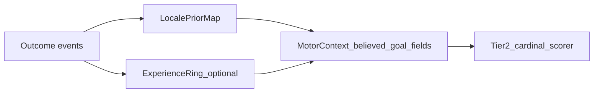

# Hunter Killer — Creature memory (agent-friendly)

> **Purpose:** **Authoritative working spec** for **creature memory** — what an agent **stores** and **updates** so it can pursue [CREATURE_MODEL_PLAN.md](CREATURE_MODEL_PLAN.md) **goals** (survival, reproduction, trait-shaped priorities). Memory is **not** a telemetry dump of every seen object.

> **Motor / motivation alignment (read first):** **[CREATURE_GOAL_DRIVERS.md](CREATURE_GOAL_DRIVERS.md)** — motivation tree Tier-1/2, **`GoalKind`** registry (**§4.1**), **`CreatureDefinition`** traits, habitual **`believed_goal_*`** modulation (**§5.1** strategy-class tags — **Actions 1–3 Resolved**). **[CREATURE_MOVEMENT_V2.md](CREATURE_MOVEMENT_V2.md)** — unified scripted motor, **`SeekCandidate`** ingress, **`creature_motor`** + **`strategy_class_tags`** + **`goal_kinds`** pack merge (**§A.1**), **Preserve vs Find** thresholds (**§A.3.1**), phasing (ENGINE movement Foundations **before** full memory wiring). **This doc:** **what** to remember and how beliefs / locale priors feed **`MotorContext`** (**§§2, 10**).

**Location:** `Draft_Features/` while design stabilizes; **promote** to `Definitive_Features/` when contract vs code (see [PROJECT_DOC_INDEX.md](../PROJECT_DOC_INDEX.md)). **Live code notes:** [`ai_driver.gd`](../../AI_int_lib/ai_driver.gd) (**`_goal_belief`** design block), [`game_config_merge.gd`](../../AI_int_lib/game_config_merge.gd).

---

## 1. Phase summary

**Phase name:** Creature memory (**goal-generalized** beliefs + success patterns)

**One-line objective:** Specify **salient world beliefs** (§2) that reuse **one** memory schema for multiple **goals** (food, mates, **finding shelter**, etc.), with **precise** vs **coarse** tiers, **TTL-based coarse eviction**, **re-awareness promotion** to precise, optional **goal-type payloads** (§5–6), hooks that **modulate Tier-2 behavior** consistently with **[CREATURE_GOAL_DRIVERS.md](CREATURE_GOAL_DRIVERS.md)** + [CREATURE_MOVEMENT_V2.md §A.3.1](CREATURE_MOVEMENT_V2.md), **successful outcome patterns** (**§2.1**) projecting into **`MotorContext`** **`believed_goal_*`** (CREATURE_MOVEMENT_V2 §A.3.1) with **trait-scaled replay** (**§2.2** → **GOAL_DRIVERS §5**). **LocalePriorMap** contract — **§14** (row schema **§14.2**, projection **§14.1**, threat pass **§14.3**).

**Explicit non-authority:** **Which** entities count as **`SeekCandidate` / consumable_now / food_candidate** vs **friend/foe** is governed by **`CreatureDefinition`** + ingestion policy ([CREATURE_MOVEMENT_V2.md §A.2 — `feeding_mode` / DietRegistry posture](CREATURE_MOVEMENT_V2.md)). **Memory** stores **belief records** keyed by stable instance ids **where applicable** and **does not** restate predator/omnivore/herbivore branching.

**Phase-1 scope (resolved — May 2026):**

| Ships | Stub / deferred |
|-------|-----------------|
| **`find_food`** + **`avoid_hostiles`** LocalePriorMap (write, consult, replay) | **`shelter`**, **`find_mate`**, pack **`extra_goal_kinds`** — registry only; no salient writes |
| **`_goal_belief`** for stationary **`food_plants`** (**§5.5**) | Moving belief targets (prey, mobs) |
| **`outcome_envelope`** + per-GoalKind hooks (**§14.4**) | **`ExperienceRing`**, Δ-calorie reward shaping |

**Out of scope (explicit non-goals):**

- Full utility-AI or MMO-scale persistence.  
- Replacing live sensory awareness with memory-only (**memory merges after / augments live sense**, same story as movement doc §C port).  
- Gender / full `CreatureStats` field catalog (**[CREATURE_MODEL_PLAN.md](CREATURE_MODEL_PLAN.md)**).  
- Full **LoS/occlusion wiring** this round (**§7.4** deferral note; **movement Foundations** path uses **§E.1 hybrid radius + forward cone** until LoS lands — see CREATURE_MOVEMENT_V2 §D–E).

---

## 2. What memory is (conceptual contract)

Creature memory holds **three** cooperating layers, all keyed to **[CREATURE_MODEL_PLAN.md](CREATURE_MODEL_PLAN.md) Goals and motivational priorities** and routed through the **motivation tree** (**[CREATURE_GOAL_DRIVERS.md §2](CREATURE_GOAL_DRIVERS.md)**):

| Layer | Role |
|-------|------|
| **Salient world facts** | Structured beliefs (positions, tiers, payloads, freshness) about **things that matter to active goals**. |
| **Goals and motivational priorities** | Runtime snapshot of Tier-2 **what matters now** — acute hunger/threat/find-mate/evasion urgencies that **prioritize which belief subsets** fuse into **`SeekCandidate` / threat samples**. Same Tier-2 leaves as **[CREATURE_GOAL_DRIVERS.md §2](CREATURE_GOAL_DRIVERS.md)**. |
| **Successful outcome patterns** | Compact records of **action → outcome links** (“leading a predator toward a weaker prey source paid off”; “this squeeze pocket repeatedly broke LoS”; “this nook held for nesting”) so **later decisions can reuse**. |

**Linkage to motivation traits:** **`CreatureDefinition`** trait axes (−100…+100), application order, and **survival-plan** narrative — **[CREATURE_GOAL_DRIVERS.md §3](CREATURE_GOAL_DRIVERS.md)**. Memory writes **signals** Tier-2 mappers consume (**`believed_goal_*`**, **`believed_goal_source_bias`** — CREATURE_MOVEMENT_V2 §A.3.1); **how traits scale habitual replay** — **[CREATURE_GOAL_DRIVERS.md §5](CREATURE_GOAL_DRIVERS.md)** + **§2.2** below. **Future trait drift** — still **[CREATURE_GOAL_DRIVERS.md §3.4](CREATURE_GOAL_DRIVERS.md)** boundary until a learning pass exists; successful patterns must stay **GoalKind-agnostic** (**no forked memory silos**).

### 2.1 Success patterns — locale priors vs experience traces (resolved naming)

Reserve the word **belief** for **salient world facts** (tiered targets, payloads — table row 1). Success-pattern records use distinct names:

| Name | Meaning |
|------|---------|
| **Experience trace** (episodic backend) | A compact **event**: **`(GoalKind, context_hash)`** + optional context snippet + **`modality_tags[]` / `pole_facet_tags[]` / `outcome_envelope`** (same salient-write shape as **[CREATURE_GOAL_DRIVERS.md §5.1](CREATURE_GOAL_DRIVERS.md)**) + scalar outcome (+ decay / TTL). Typically a **bounded ring buffer** per creature / per `GoalKind`. **No separate `action_tag` field** — excised (**§14**). |
| **Locale prior** (aggregated backend) | **Aggregates** keyed by **`(GoalKind, context_hash)`** — e.g. visit counts, EWMA reward estimate, **last_success_time**, plus per-modality **`attempt_count` / `success_count` / `success_delta`** for **[CREATURE_GOAL_DRIVERS.md §5.1](CREATURE_GOAL_DRIVERS.md)** Slot B **confidence**. One row = “how this patch behaved for goal G,” not oracle world truth. |

**Framework contract:** **two optional backends → one façade** consumed by scripted motor (**[CREATURE_MOVEMENT_V2.md §A.3.1 — Believed goal source / habitual locales](CREATURE_MOVEMENT_V2.md)**):

1. **`LocalePriorMap`** — writes/reads hashed aggregates → projects into **`believed_goal_source_bias`** (+ hotspot / escalate radii: **`believed_goal_hotspot_near_radius_px`**, **`believed_goal_seek_escalate_radius_px`** — §10).
2. **`ExperienceRing`** (**deferred — future phase only**) — bounded episodic traces for **novelty / retry** (“try improbable again later”); merges into the **same** façade-only signals so Tier-2 **does not** fork (**§14** knobs: ring size, ε sampling, eviction). Phase 1 = **`LocalePriorMap` only**.

**Façade fusion (when both backends active):** agree → **one** motor input; disagree → **[CREATURE_GOAL_DRIVERS.md §5.1 — Action 3 backend merge](CREATURE_GOAL_DRIVERS.md)** (`change_stability` sign, then stable **`tie_key`** odd/even).

**Tick-time flow:**



**Phasing:**

- **Default phase-1 path:** **`LocalePriorMap`** (counters/EWMA + decay); aligns with CREATURE_MOVEMENT_V2 §A.3.1 and keeps per-tick projection cheap.
- **`ExperienceRing`:** **Deferred — future phase** (**§14**). Phase 1 = **`LocalePriorMap` only**; episodic ring, ε sampling, and ring eviction **not** in current scope.
- **Do not** use the label **belief tags** for success patterns — avoids colliding with **belief records** (instance-target memory, §§5–6).

**`context_hash` (concept):** coarse situation fingerprint. **`LocalePriorMap`** row key includes **`GoalKind`**, **`context_hash`**, and **`modality_tag`** (**§14**). **`context_hash`** values are produced by **per-`GoalKind` overlays** (**spatial / fingerprint layering — resolved in §14**): e.g. uniform **grid cell** for **`find_food`**, squeeze/nest **fingerprints** for **`shelter`** (deferred numerics), etc. — **not** one global spatial hash pasted onto every goal. **Phase-1 `find_food` numerics — Resolved:** **§2.1.1** below. **Strategy-class tags** — **[CREATURE_GOAL_DRIVERS.md §5.1](CREATURE_GOAL_DRIVERS.md)** (**Resolved**).

#### 2.1.1 `find_food` — `grid_cell` compositor (phase-1 resolved)

**Scope:** **`find_food`** and **`avoid_hostiles`** use **`grid_cell`** compositors in phase 1 (**§2.1.1**, **§2.1.2**). **`shelter`**, **`find_mate`**, pack **`extra_goal_kinds`**, and other overlays **defer** numerics until their write paths ship.

| Parameter | Phase-1 choice |
|-----------|----------------|
| **Cell size** | Reuse merged **`creature_motor.explore_coverage_cell_px`** (default **52** in [`game_config_merge.gd`](../../AI_int_lib/game_config_merge.gd)); same floor division as explore trail in [`ai_driver.gd`](../../AI_int_lib/ai_driver.gd). **`cell_px = max(16, explore_coverage_cell_px)`**. |
| **Origin** | **World `Vector2.ZERO`** — **not** [`EnvironmentGridBaked.origin_world`](../../environment/environment_grid_baked.gd) (terrain grid may use a different origin). |
| **Anchor** | **Dominant food `SeekCandidate` world position at outcome** (the resource patch), **not** creature body position — patch-centric locale memory. |
| **Out of bounds** | **Reject entire salient write** (no clamp-to-edge). When **`EnvironmentGridBaked`** is valid, require anchor cell indices **`cell_x`, `cell_y`** ∈ **`[0, cell_width) × [0, cell_height)`** under this compositor. If env grid is missing/invalid at outcome, **reject** salient write. |
| **Hash input** | **Includes `GoalKind`** wire id **and** grid indices (redundant with row’s **`GoalKind`** column — intentional for stable lookup / tests). |

**Cell indices** (anchor = food **`SeekCandidate`** position **`p`**):

```text
cell_x = floor(p.x / cell_px)
cell_y = floor(p.y / cell_px)
```

**`context_hash` value** (phase-1 — Godot `hash` on deterministic payload; impl may use equivalent stable mix):

```text
context_hash = hash([goal_kind_wire_id, cell_x, cell_y])
```

- **`goal_kind_wire_id`**: e.g. `&"find_food"` (**[CREATURE_GOAL_DRIVERS.md §4.1](CREATURE_GOAL_DRIVERS.md)**).
- Return **sentinel / failure** from compositor when OOB → caller **skips** persist (**no** `LocalePriorMap` row update).

**Replay consult:** Recompute **`context_hash`** with the **same** rules from the **current** dominant food **`SeekCandidate`** anchor, or **nearest eligible** seek target when the consult path differs from the dominant anchor (e.g. dominant bush occluded / out of cone but another eligible food candidate is nearer).

**2D only:** Phase-1 façade is **XY**; no Z term in bucket id.

**Implementation hook (code PR):** `context_hash_for_find_food(goal_kind, anchor: Vector2, motor_p, env_grid) -> int` (or `-1` = reject).

#### 2.1.2 `avoid_hostiles` — `grid_cell` compositor (phase-1 resolved)

Same numerics as **§2.1.1** except **anchor** = **creature body position at outcome**. **`context_hash_for_avoid_hostiles(...)`**.

### 2.2 Trait-mediated replay (**context_hash × motivation traits**) (**context_hash × motivation traits`)

**Canonical narrative:** illustrative **`explorer_builder`** tension table, strategy-class tag vocabulary + validation + replay formulas — **[CREATURE_GOAL_DRIVERS.md §5.1](CREATURE_GOAL_DRIVERS.md)** (**Actions 1–3 Resolved**).

**This file (data path):** **`LocalePriorMap`** / **`ExperienceRing`** (**§2.1**) → **`believed_goal_source_bias`** (**[CREATURE_MOVEMENT_V2.md §A.3.1](CREATURE_MOVEMENT_V2.md)**). Trait scalar semantics (**−100…+100**, spawn-fixed today): **[CREATURE_GOAL_DRIVERS.md §3](CREATURE_GOAL_DRIVERS.md)**; **code consumption map (tier III):** **[CREATURE_TRAIT_USAGE.md](../Definitive_Features/CREATURE_TRAIT_USAGE.md)**.

**Principle:** **`context_hash`** situation class × traits scales **reapplication** without branching **`SeekCandidate` ingress**.

**Backend tuning:** **§14** — reward shaping, write gates, decay, projection geometry (**Resolved**); **`ExperienceRing`** deferred (**§14**).

**Future:** learned trait drift orthogonal (**GOAL_DRIVERS §3.4**); **one** Tier-2 façade for food / mate / shelter / evasion proofs (**§2 table**).
---

## 3. Goal-aligned categories

Memory categories **rollup** to Tier-2 leaves (**[CREATURE_GOAL_DRIVERS.md §4](CREATURE_GOAL_DRIVERS.md)**). **That section** defines category ↔ Tier-2 semantics; **this table** adds implementation phasing:

| Category | Tier-2 / goals | This phase vs later |
|----------|----------------|---------------------|
| **Nutrition (“find food”)** | **Find food** | **Implement first** alongside the movement-memory phase (**§§4–5**); payloads may include **anticipated calories**. |
| **Mates / reproduction** | **Find mate** | **Reuse same memory schema + config keys** (see **`goal_*`** list in §10); mating-specific payloads when systems land (e.g. estrous, lineage id). |
| **Danger / hostiles** | **Avoid hostiles** | Outline + unify with **ThreatSample**/jeopardy; coarse/precise can mirror goal rules where “last hostile position” cues exist. Dedicated schema refinement **later** if needed — **still no diet archetypes**. |
| **Finding shelter** (supersedes legacy “ambient hiding §” wording) | Survival, reproduction (safe birth sites) | **Design in §7** — **squeeze / perceived fit**, hostile size comparison, remembered **bolt-holes**, future nest sites. Separate from standalone “ambient hide minigame.” |

**Cross-category mechanic:** **`context_hash`** replay weighting scaled by **`CreatureDefinition` motivation traits** (**§2.2**, **[CREATURE_GOAL_DRIVERS.md §5](CREATURE_GOAL_DRIVERS.md)**) applies **GoalKind-agnostically** (nutrition → mates → evasion) unless a future mapping table restricts a tag to one category.

---

## 4. Implementation order (requirements)

**Approved phasing mirrors [CREATURE_MOVEMENT_V2.md §B.3 — Implementation order — maintainer-approved phasing](CREATURE_MOVEMENT_V2.md):**

1. **ENGINE scripted movement Foundations** — unified **`creature_motor`**, single **`MotorContext`** + **`SeekCandidate[]`** builder (**§G** checklist in CREATURE_MOVEMENT_V2); **avoid** coupling heavy persistence memory into **that same merge** unless glue is negligible.  

2. **Predator–prey calorie path + locomotion calorie cost** (nutritional motor truth called out cross-doc) remains a **credibility prerequisite** wherever **predator-style foraging parity** overlaps memory UX — cite implementing phase when deferring (**CREATURE_MOVEMENT_V2 §B.3 bullet 1** + historical CREATURE_MODEL notes).

3. **Phase — generalized goal-memory (this doc)** — implement **§5 rules** (+ optional payloads), merge **remembered ∪ live** inside **one façade** (CREATURE_MOVEMENT_V2 **§A.2** semantic). Tune after integration; **movement correctness wins** until memory stabilization (**CREATURE_MOVEMENT_V2 §B.3 bullets 3–4**).

4. **Danger / mates / full evasion** — extend tables as systems land (**same abstraction** wherever possible).

**Resolved (phase-1 LocalePriorMap MVP):** **Full row stats** per **§14** normalization (**`attempt_count`**, **`success_count`**, **`success_delta`**, **`stored_strength`**, EWMA decay, strategy-class tags at write) — **not** counters-only. Row fields — **§14.2**. **`ExperienceRing`** remains deferred (**§2.1**).

---

## 5. Goal-target memory tiers (canonical — food is first concrete goal)

**Design goal:** remember **meaningful targets** after they leave immediate awareness — **without omniscient seek**. Schema is **goal-type agnostic**: `GoalKind` discriminator + shared tier rules + optional **`GoalPayload`**.

### 5.1 Precise tier

| Target class | Representation in **Precise** | Notes |
|--------------|------------------------------|-------|
| **Stationary** (e.g. bush, fixed nest landmark) | **Exact** last-known world position (**`Vector2` / Vector3 façade**) + frozen **consumability / affordance snapshots** consistent with **`consumable_now` freeze** (**CREATURE_MOVEMENT_V2 §C**) until live refresh | Belief keyed by **`instance_id`** where stable (**`bush_food.gd`** pattern). |
| **Moving** (e.g. herbivore, fleeing mate, relocating hostile) | **Small credibility disk** centered on **last known position**: radius **`goal_memory_moving_last_known_radius_px`** (**initial default aligns with experimentation** — CREATURE_MOVEMENT_V2 §F suggested **≈50 px** as starting scalar; clamp **≤ `goal_memory_precise_radius_px`** unless design promotes an exception) | Prey velocities / ghosts may layer on same pattern (**mob_hist** analogue). |

Enter **Precise** when the creature holds a fresh belief **and** distance-from-believed-target rules place the entry inside the **precision envelope** (**§5.4** thresholds).

### 5.2 Coarse tier

**Condition:** remembered, **outside** precise envelope, **still within** **`goal_memory_forget_radius_px`** (or LRU / global policies **not superseding** TTL below).

| **Representation:** unchanged egocentric model — **8-way sector recomputed each tick** from **`last_world_pos − creature_pos`**: **N, NE, E, SE, S, SW, W, NW** (**45°** sectors; **`+Y = N`** matching `ai_driver` notes). Weak **8-way step** bias / LLM cues — **not** a bogus map-fixed compass.

### 5.3 Coarse → forgotten (TTL in coarse state)

| Rule | Specification |
|------|---------------|
| **Coarse TTL** | While an entry stays **continuously** in **Coarse** (never promoted to Precise nor purged by distance LRU), enforce **`goal_memory_coarse_ttl_sec`** since **entered coarse** (**default ~15** s to start — tune in-play). Counter **resets** when promoted or dropped from coarse. |

### 5.4 Re-awareness: Coarse → Precise

When a remembered entity **re-enters the creature’s active zone of sensory awareness** — **same definition** as scripted motor live ingest (**[CREATURE_MOVEMENT_V2.md §E.1](CREATURE_MOVEMENT_V2.md)** — hybrid **`awareness_radius`** disk plus forward **`awareness_cone_extra`** wedge; default **`awareness_forward_cone_only = false`**), **drop it from coarse-only treatment** — **snap to Precise**: refresh position/affordance from live scanner, freeze snapshots per refresh rules (**§5.1 stationaries** unchanged).

**Resolved (LRU vs coarse TTL — phase 1):** When **`goal_memory_max_entries`** is exceeded, **LRU eviction wins** over waiting for coarse TTL. Evict the entry with **lowest merge use count**; tie-break **least recently merged** into motor context (**§5.5**). Coarse TTL and global **`goal_memory_ttl_sec`** still apply on non-LRU paths.

### 5.5 `_goal_belief` — instance memory implementation (phase-1 resolved)

**Purpose:** Remember **specific instances** (this bush) after they leave awareness. Complements **`LocalePriorMap`** (patch habits). **Phase-1 scope:** stationary **`food_plants`** (`goal_kind = find_food`, `is_moving = false`).

**Phase E (resolved — moving beliefs):** same **`_goal_belief`** table; **no** parallel **`_predator_prey_memory_*`** store. Key = target **`instance_id`** (prey mob, hostile mob, bush).

**Storage:** **`_goal_belief_by_body`** on **`AiDriver`** — per-hunter **`instance_id`** → belief rows (**GB-S2** retired). Row key = remembered target **`instance_id`**.

#### Entry schema

| Field | Type | When set | Used for |
|-------|------|----------|----------|
| **`instance_id`** | int / `StringName` | First sighting | Dictionary key |
| **`goal_kind`** | wire id | First sighting | Phase 1: `find_food` |
| **`tier`** | `PRECISE` \| `COARSE` | Maintenance | Motor merge path |
| **`last_world_pos`** | `Vector2` | Sync + frozen OOA | Precise seek; coarse sector anchor |
| **`last_observed_ms`** | int | Live sighting | **`goal_memory_ttl_sec`** |
| **`coarse_entered_ms`** | int | Precise→Coarse | **`goal_memory_coarse_ttl_sec`** |
| **`consumable_now`** | bool (frozen) | Last live read | Ready vs unready merge |
| **`merge_use_count`** | int | Each motor merge | LRU eviction score |
| **`last_merged_ms`** | int | Each motor merge | LRU tie-break |
| **`anticipated_calories`** | float (optional) | Last live read | **Stub** — stored on entry; **not** used by motor merge / seek scoring (§6) |
| **`is_moving`** | bool | First sighting / live sync | **Phase E:** `true` for prey / fleeing hostiles; `false` for bushes |
| **`last_velocity`** | `Vector2` | Live moving sync | Ghost pursuit + intercept (**§5.5 Phase E**) |
| **`ghost_strength`** | float 0.4…1.0 | Motor merge sample | Age decay within mover TTL (replaces predator-only strength) |

**Do not store** egocentric sector in the entry — recompute each tick (**§5.2**).

#### Phase E — moving goal beliefs (resolved design)

| Decision | Resolution |
|----------|------------|
| **Migrate predator memory** | **`_predator_prey_memory_*` → `_goal_belief`** rows keyed by **prey `instance_id`**; retire parallel predator-only dict. |
| **`avoid_hostiles` priority** | **Live acute threat** or **precise remembered `avoid_hostiles`** within envelope **blocks** remembered **prey** chase merge (all bodies, including predators). Revisit when **combat** ships (`fight` may outweigh `flee_retreat`). |
| **Salient / locale anchor (Q3)** | **Belief row:** **`last_world_pos` = target last seen center.** **`LocalePriorMap` `context_hash` unchanged:** `find_food` → food/patch anchor at outcome; `avoid_hostiles` → **creature body** at outcome. Future prey-kill salient → **prey position at outcome**. |
| **Motor merge shape (Q4)** | **A + D:** one **`SeekCandidate`** (`is_moving`, `source = memory_precise`) + **`pursuit_targets`** `{position, velocity, cost_scale}` per remembered mover. **Light C:** optional **`ghost_intercept_pos = last_world_pos + last_velocity × goal_memory_ghost_horizon_sec`** (default **~0.4 s**) as a second pursuit hint — **no** full disk sampling in Phase E. |
| **Ghost velocity (Q5)** | **`last_velocity`** stored at sync; merged into pursuit + intercept. |

**Implementation notes:** Centroid only at merge (disk radius **`goal_memory_moving_last_known_radius_px`** documents uncertainty; not sampled on cardinal grid in E). Mover TTL: **`goal_memory_mover_ttl_sec`** with fallback **`predator_prey_memory_sec`** then **`goal_memory_ttl_sec`**.

#### Functions

##### `_goal_belief_reset() -> void`

- **When:** **Per creature spawn** (**GB-R1**) **and** same lifecycle as **`_mob_hist` reset** (round/session boundaries) **and** when a tracked **goal episode completes** (optional hygiene).
- **Effect:** `_goal_belief.clear()`.

##### `_goal_belief_sync_from_scene(live_food: Dictionary) -> void`

- **When:** After live awareness ingest, before maintenance/merge.
- **Input:** Awareness pass returns **`{ "ready": [{pos, instance_id, …}, …], "unready": […] }`** — **`instance_id` required** for sync (**phase-1**). Entries **without** a stable **`instance_id`** (`0` / missing) are **skipped** — **no** nearest-bush resolve in phase-1. Optional **`anticipated_calories`** copied when the live plant node exposes **`current_calories`** ([`motor_target_builder.gd`](../../creature/motor/motor_target_builder.gd)).
- **Effect:** Upsert seen entries → **`PRECISE`**, refresh pos, freeze **`consumable_now`**, bump **`last_observed_ms`**.

##### `_goal_belief_maintain(creature_pos: Vector2, now_ms: int, motor_p: Dictionary) -> void`

- Precise→Coarse when distance **>** `goal_memory_precise_radius_px` but **≤** forget radius.
- Evict on coarse TTL, global TTL, forget radius.
- **LRU at cap:** evict **lowest `merge_use_count`**; tie **least recently merged** (**GB-M1**, **GB-M2**).

##### `_goal_belief_merge_into_motor_context(ctx: Dictionary, creature_pos: Vector2, motor_p: Dictionary) -> void`

- **Precise:** append to `food_seek_targets` / `unready_food_targets` scaled by **`weight_seek_remembered_goal`** — **max 25** remembered precise merges per tick (**GB-MG2**).
- **Coarse:** increment **`believed_goal_source_bias.sector_weights[8]`**; normalize so **max sector weight = 1.0** (**GB-MG1**).
- **Dedupe:** **skip** belief merge if **`instance_id` already in live awareness lists** (**GB-MG3**).
- Increment **`merge_use_count`** / **`last_merged_ms`** on each merged entry.

**LocalePriorMap:** `_goal_belief` does **not** write locale priors; consumption outcomes still call **`goal_source_memory.try_salient_write`**.

---

## 6. Optional goal payloads (`GoalPayload`)

Type-specific blobs **orthogonal** to tier geometry:

| Goal kind | Example payload fields |
|-----------|-------------------------|
| **Nutrition / food** | `anticipated_calories` (estimate from memory or last sensory read), ripeness-ish flags mirrored from **`consumable_now`**. |
| **Mate** | Compatibility / courtship cues when designed (size bracket, hormonal flag, lineage avoid list). |
| **Finding shelter** (`shelter`) | `estimated_squeeze_body_size`, `estimated_hostile_size`, `confidence` (**§7**) — qualitative “fit” not raw editor truth unless skill maxed (**future progression**). Wire id — **[CREATURE_GOAL_DRIVERS.md §4.1](CREATURE_GOAL_DRIVERS.md)**. |

Payloads attach to belief entries; **routing** ignores unknown fields gracefully.

**Phase-1 stub — `anticipated_calories` (shipped):** When awareness ingest includes **`anticipated_calories`** (from plant **`current_calories`** at last live sighting), **`_goal_belief_sync_from_scene`** persists it on the belief row. **`_goal_belief_merge_into_motor_context`** and cardinal scoring **ignore** this field until a future enhancement (per-target yield bias, Preserve band hints, etc.). See [ENHANCEMENT_BACKLOG_PLAN.md](../ENHANCEMENT_BACKLOG_PLAN.md) — *Remembered seek weighting* is a separate deferred item.

---

## 7. Finding shelter (refactor from “ambient hiding” prose)

**Authoritative squeeze / passage semantics:** [Definitive_Features/ENVIRONMENT_MODEL_PLAN.md](../Definitive_Features/ENVIRONMENT_MODEL_PLAN.md) — **`passible`**, **`fit_size`**, **Mode A** squeeze.

### 7.1 Goal framing

Treat **bolt-holes**, **squeeze pockets**, future **birthing nests** as **`shelter`** goal-kind records — same **tier / TTL / coarse** rules (**§5**). **Shelter/rest comfort** modulation (*reward safe recovery*) aligns with CREATURE_MOVEMENT motivation tree commentary once rest vitals tie in.

### 7.2 Size comparison (skills — not authoritative editor reads)

Creature decisions **never** consume **oracle** **`fit_size` / hostile collider extents** blindly at skill floor. Instead compare:

- **`estimated_squeeze_capability`** (**creature-relative** squeeze/clearance skill — parameterized elsewhere; improves with progression).  
- **`estimated_hostile_body_size`** (threat profiling skill / last sighting).

**Decision sketch — creature seeking shelter:** propose retreat toward a candidate passage only if **`estimated squeeze passage ≥ hostile estimate − margin`** (margin & transforms **implementation detail** anchored to ENVIRONMENT MODEL fields without exposing truths for free).

**Symmetric skill (hostile-facing, inverse framing):** a hostile agent uses the **same class of estimate** (`estimated_squeeze_capability` lane — **“can I squeeze / fit?”**) **inverted** toward **prediction**: **would typical prey / this target treat this pocket as viable shelter?** and **does my estimate say I fit as well?** Reasoning stays **belief- and skill-bounded** (no free **`fit_size`**). Examples: bias **committing** pursuit, **waiting at an egress**, or **blocking** when both prey-shelter plausibility and self-fit signatures read high; bias **backing off**, **routing around**, or **deprioritizing** chase when refuge reads **reachable for prey** **but too tight for self** — avoiding wasted pursuit into squeezes the hostile cannot exploit.

### 7.3 Last-known fleeing targets (**moving prey / hiding creature** symmetry)

Until predicted pathing for occupants inside squeeze cavities exists, **moving goal targets** fleeing into cover use the **moving** precise-disk rule (**§5.1** row “Moving”) — i.e., **same `goal_memory_moving_last_known_radius_px`** policy applied to last seen **bolt-hole egress** hosts.

<<Comment: Later “estimated actions inside cavity” consumes partial observability + occlusion model — defer to post-LoS backlog.>>

### 7.4 Line of sight (scope boundary)

**Explicitly out-of-scope — this authoring round** (movement Foundations + memory phase 1).

**Future implementation (resolved):** **Godot 3D** physics **ray** queries against persistent bodies/occluders when LoS lands (**[CREATURE_MOVEMENT_V2.md §D–E](CREATURE_MOVEMENT_V2.md)** deferred). Supplement with **semantic factors** owned by Environment / Plant / prop bodies when grid-only truth fails (**ENVIRONMENT MODEL** extensions).

**Skills cross-link:** Future **skill-based actions** SHOULD include **hide / stealth** verbs that mutate **effective LoS footprint** (**CREATURE_MOVEMENT_V2 Tier-2 / future action layer**) — coordinated with occlusion backlog (**[ENHANCEMENT_BACKLOG_PLAN.md](../ENHANCEMENT_BACKLOG_PLAN.md)** *Line of sight / occlusion*).

---

## 8. Context for agents (**GOAL_DRIVERS → MOVEMENT_V2 → this file**)

### 8.1 Read order

1. **[CREATURE_GOAL_DRIVERS.md](CREATURE_GOAL_DRIVERS.md)** — motivation tree Tier-1/2, **`CreatureDefinition`** traits, habitual **`believed_goal_*`** modulation (**§5.1** strategy-class tags).
2. **[CREATURE_MOVEMENT_V2.md](CREATURE_MOVEMENT_V2.md)** — **`SeekCandidate`**, **`creature_motor`** merge, Preserve vs Find (**§A.3.1**), phased acceptance (**§G**).
3. **This file** — belief lifecycle + payload tiers (**§§5–6**); success-pattern backends (**§2.1**); projection + **§14** storage/tuning (**backend rows Resolved**; **`ExperienceRing`** deferred).
4. **[ENVIRONMENT_MODEL_PLAN.md](../Definitive_Features/ENVIRONMENT_MODEL_PLAN.md)** — geometry truths.

### 8.2 Key scripts / hooks (today’s breadcrumbs)

| Area | Paths / notes |
|------|----------------|
| Awareness split / motor food | [`AI_int_lib/ai_driver.gd`](../../AI_int_lib/ai_driver.gd) — `_motor_food_plants_in_awareness_by_readiness`, `_build_motor_context`; **`_goal_belief_*`** (**§5.5**); **`goal_source_memory.gd`** salient hooks (**§14.4**). Live zone geometry — **[CREATURE_MOVEMENT_V2.md §E.1](CREATURE_MOVEMENT_V2.md)**. |
| Config merge spine | [`AI_int_lib/game_config_merge.gd`](../../AI_int_lib/game_config_merge.gd) — commented **`goal_*`** placeholders (**§10**); pack overlay via **`creature_motor`** (**CREATURE_MOVEMENT_V2 §A.1**). |
| Cardinal costs | [`creature/motor/cardinal_avoidance.gd`](../../creature/motor/cardinal_avoidance.gd). |
| Stationary flora anchor | [`assets/plants/bush_food.gd`](../../assets/plants/bush_food.gd) — **`global_position`**, **`instance_id`**. |

---

## 9. Resolved carry-forwards (**CREATURE_MOVEMENT_V2 §F** echoed + generalized)

| Topic | Resolution |
|-------|-------------|
| **Coarse landmarks** | **Egocentric** coarse sectors (**now**); map-fixed anchors **defer** unless revisit. |
| **Forget policy combo** | **Union** — **`goal_memory_forget_radius_px`**, TTL since last **in-awareness observation** (**global freshness**, still useful), **`goal_memory_coarse_ttl_sec` while coarse-only** (**§5.3**), session reset, LRU **`goal_memory_max_entries`** — tune together in play (**CREATURE_MOVEMENT_V2 §F** spirit). |

---

## 10. Planned config keys (`goal_*` + `believed_goal_*`)

Prefer **dual home**: authoritative defaults in **`default_creature_motor_params()`** / **`creature_motor` pack JSON** overlays when keys are tuning-adjacent; global merge MAY retain fallbacks mirrored in **`game_config_merge.gd`** comments.

**Policy:** **`food_memory_*` / `_food_belief` / `believed_food_*` identifiers are deprecated** throughout **code** and active **Draft/Definitive** docs. Implement only **`goal_*`** / **`_goal_belief`** (**no parser aliases**, **no transitional save-key bridges** unless a maintainer mandates a dedicated migration spike). *[Completed_Features/](../Completed_Features/)* snapshots may lag.

| Planned key | Default (phase-1) | Role / tuning |
|-------------|-------------------|---------------|
| `goal_memory_precise_radius_px` | **1000** | Inside → precise tier can merge exact coords into seek |
| `goal_memory_moving_last_known_radius_px` | **50** | Moving targets — credibility disk (documentary in E; merge uses centroid) |
| `goal_memory_mover_ttl_sec` | **10** (fallback `predator_prey_memory_sec`) | Moving belief TTL |
| `goal_memory_ghost_horizon_sec` | **0.4** | Light-C intercept: `pos + vel × horizon` |
| `goal_memory_forget_radius_px` | **2400** | Beyond → evict (LRU candidate) |
| `goal_memory_coarse_ttl_sec` | **15** | Forget after N seconds continuously coarse |
| `goal_memory_ttl_sec` | **45** | Forget since last **live** observation (matches [`game_config_merge.gd`](../../AI_int_lib/game_config_merge.gd) / [`goal_belief_memory.gd`](../../creature/motor/goal_belief_memory.gd)) |
| `goal_memory_max_entries` | **25** | LRU cap; eviction = lowest **`merge_use_count`**, tie least recently merged |
| `weight_seek_remembered_goal` | **8.0** | Scales cardinal **seek pull** toward **precise** remembered bush positions (merged into `food_seek_targets`). **~0.5×** default **`weight_seek_ready_food`** (16): remembered targets nudge direction but **weaker than live in-cone food**. **Raise** → chases stale GPS harder (may ignore fresher live cues). **Lower** → memory barely affects pathing. |
| `weight_coarse_sector_goal_bias` | **3.0** | Scales **`sector_weights[s]`** in motor cost (**§14.1**). Multiplies egocentric 8-way bias from **coarse** beliefs only. **0** = off. **Raise** → stronger weak turn toward “food was that way” without exact coords. Keep **well below** live seek weights so coarse bias stays a hint. |

**Wire defaults:** Uncomment / set in **`default_creature_motor_params()`** in [`game_config_merge.gd`](../../AI_int_lib/game_config_merge.gd) (**GB-10**).

**Belief / habitual locale** (**CREATURE_MOVEMENT_V2 §A.3.1**, projection **§14.1**):

| Planned key | Default (phase-1) | Role |
|-------------|-------------------|------|
| `believed_goal_hotspot_near_radius_px` | **250** | **Hotspot** and **`locale_prior_projection_radius_px`** — one knob. Rows within radius feed centroid. |
| `believed_goal_seek_escalate_radius_px` | **1000** | Outside hotspot, ≤ this radius → escalate dominant Tier-2 seek (**§14**). |
| `weight_believed_goal_pull` | **6.4** | Scales habitual **vector** attraction (**§14.1**); **0.4×** **`weight_seek_ready_food`** (16). |
| `locale_prior_pull_w_norm` | **3.0** | Denominator for **`pull_mag`** centroid scaling (**§14.1**). |
| `locale_prior_ewma_alpha` | **0.15** | Per-tick soft decay on in-row **`success_delta`** / **`stored_strength`**. |
| `locale_prior_write_blend` | **0.35** | Per-write lerp for **`stored_strength`** toward **`success_rate`** (**§14.2**). |
| `salient_write_max_per_sec` | **100** | Per-creature safety valve on salient writes/sec (**§14**). |
| `believed_goal_source_bias` | — | **`MotorContext`** façade: **`pull_dir`**, **`pull_mag`**, **`sector_weights[8]`** — not a config scalar. |

**LocalePriorMap row fields (phase-1 — §14.1):** persist **`cell_x`**, **`cell_y`** at salient write (from §2.1.1 compositor); optional **`anchor_world`** mirror for debug. **Required** for centroid projection — **`context_hash` alone is not invertible**.

**LocalePriorMap decay / eviction** (**§14 Resolved** — mirrors in **`game_config_merge.gd`** / pack merge; not belief keys):

| Planned key | Default (phase-1) | Role |
|-------------|-------------------|------|
| `locale_prior_max_buckets` | **100** | LRU cap on **`LocalePriorMap`** rows per creature. |
| `locale_prior_idle_evict_base_sec` | **10** | Base idle time before bucket eligible for eviction. |
| `locale_prior_idle_evict_per_attempt_sec` | **1** | Added idle sec per **`attempt_count`** beyond first: **`idle_evict_sec = base + (attempt_count - 1) * per_attempt`**. |

**Replay / Slot B formula keys** (authoritative defaults **`default_creature_motor_params()`** only — **[CREATURE_GOAL_DRIVERS.md §5.1.2](CREATURE_GOAL_DRIVERS.md)**): `replay_bell_k`, `replay_w_fit`, `replay_w_store`, `replay_n_sat`, `replay_n_min`, `urgency_boost_linear_slope`, `replay_urgency_slot_b_min`. Omit from pack JSON unless overriding.

| **Preserve / Find blend** (**[CREATURE_MOVEMENT_V2.md §A.3.1](CREATURE_MOVEMENT_V2.md)**): `preserve_bias_food_floor`, `seek_priority_food_ceiling`, `preserve_seek_blend_smoothness` (default **0.5**), **`starvation_override_food_ceiling`** (default **0.10**), **`escape_reversal_window_sec`** (default **1.0** — AH-7 reversal window). Defaults in **`default_creature_motor_params()`** only.

---

## 11. Cross-ported resolutions (CREATURE_MODEL §9 & related)

- **Hunger — derived (resolved vs [CREATURE_MODEL_PLAN.md](CREATURE_MODEL_PLAN.md) §9):** Treat **`hunger` / satiation** as **derived**, not authoritative stored vitals alongside **`current_calories`**. Persist **canonical** **`current_calories`** and **capacity / needs** thresholds the model owns; **each tick** (or wherever vitals gate motor) derive a **ratio or %**, then feed **rules** and **weight / factor adjusts** — e.g. rest vs forage bands, **hungry-enough-to-hunt**, satiation unlocking **mate / explore / other Tier-2** mixes. Avoid a redundant persisted **`hunger`** scalar unless a save format or foreign API mandates a mirrored field.
- **Food deep inside squeeze cavities (resolved):** **Finding** those resources (e.g. **food bushes** beyond naive range/visibility) **should require exploration**, not instant goal telegraphy. Exploration outcomes **seed locale priors** (**§2.1**) and **belief entries** (**§§5–6**) as usual. Successful **persistent** use fits an **ecological niche** pattern — e.g. **living/foraging chiefly in predator-excluding squeeze** — expressible as **`GoalKind` + overlay `context_hash`** (**§14**) and habitual **`believed_goal_*`** replay (**§2.2**) without a bespoke branch. Distance-only vs LoS stubs stay secondary to **[CREATURE_MOVEMENT_V2.md §D](CREATURE_MOVEMENT_V2.md)** phase-1 deferral.

---

## 12. Dependencies

- **[CREATURE_MOVEMENT_V2.md](CREATURE_MOVEMENT_V2.md)** — motor/motivation **primary**.  
- [CREATURE_MODEL_PLAN.md](CREATURE_MODEL_PLAN.md) — vitals naming; motivations.  
- [Draft_Features/PLANTS_PLAN.md](PLANTS_PLAN.md), [Draft_Features/PLANT_ECOLOGY_PLAN.md](PLANT_ECOLOGY_PLAN.md) — plant fields.  
- [Definitive_Features/ENVIRONMENT_MODEL_PLAN.md](../Definitive_Features/ENVIRONMENT_MODEL_PLAN.md) — **`passible`**, **`fit_size`**, occlusion hooks.  

---

## 13. Acceptance criteria (when implementing)

- [x] **Phasing respected:** ENGINE movement Foundations (**CREATURE_MOVEMENT_V2 §G.2**) green before heavy belief merge regressions (**§G.4** there).  
- [x] Precise merges respect **consumable_now** freeze / payload freeze until live refresh (**CREATURE_MOVEMENT_V2 §C**).  
- [x] Stationary beliefs = **exact** coords in precise envelope; movers = disk radius policy (**§5.1**) — **no coarse phantom vectors** surfaced as micromanaged GPS.  
- [x] Coarse TTL (**§5.3**) + re-awareness promotion (**§5.4**) covered by deterministic tests **if feasible** (`_test_goal_belief_coarse_ttl`).  
- [x] **`goal_*`** / **`believed_goal_*`** keys documented in **`game_config_merge.gd`** and pack authoring when wired (**§10 — no deprecated `food_memory_*` in active codepaths**).  
- [x] **`SeekCandidate` unify** regression check post-memory — predator/prey ingestion **already** routed through single list (**§A.2**).  
- [x] Predator locomotion prerequisites before claiming predator memory parity (**§4 bullet 2**) — prey meal + movement calorie burn wired (`mob.gd`, `player.gd`, `creature_motor` keys).  
- [ ] Future LoS / stealth alignment notes trace to ENVIRONMENT backlog + **`shelter`** `GoalKind` — **deferred**.  
- [x] **Learning layer (§2.1 / §14):** **`LocalePriorMap`** MVP = **full row stats** (**§4**, **§14.2**) → **`believed_goal_*`** façade; write gates + projection **§14.1** + threat scope **§14.3**.

---

## 14. Success patterns & motor façade (phase-1 contract)

**Phase-1 learning layer** contracts below are **Resolved** unless marked deferred. Strategy-class replay — **[CREATURE_GOAL_DRIVERS.md §5.1](CREATURE_GOAL_DRIVERS.md)** (**Actions 1–3 Resolved**). **`<<Comment: …>>`** markers remain only for **future optimization** (e.g. Δ-calorie reward shaping), not open blockers.

**Strategy-class tags & trait × habitual replay:** Authoritative **`Resolved`** prose (**tag set**, **per-family top-3** strength ranking, cross-family multiply, **map/ring façade merge**) — **[CREATURE_GOAL_DRIVERS.md §5 — Habitual replay modulation](CREATURE_GOAL_DRIVERS.md)** (**Actions 1–3 Resolved**). **§14 below** = projection geometry, gates, reward shaping — not duplicated there.

**Resolved (**`context_hash` — overlays & layering**):** **Per `GoalKind`** compositors (**§2.1.1** `find_food`, **§2.1.2** `avoid_hostiles`); other overlays defer.

**Resolved (multi-modality salient write — phase 1):** One gated episode upserts **up to 3** rows — one per top-3 **`modality_tag`** ([GOAL_DRIVERS §5.1 Action 3](CREATURE_GOAL_DRIVERS.md)). Same **`outcome_envelope`** on each row. **`find_food`** open forage (empty modalities): single row with modality id **`open_forage`**.

**Resolved (`pole_facet_tag` on row — phase 1):** Persist rank-1 **`pole_facet_tag`** (`StringName`) per row at write for stable Slot A replay (**§14.2**).

**Resolved (Outcome → reward shaping — phase 1):** **`LocalePriorMap`** / **`ExperienceRing`** updates use **boolean / tiered** **`outcome_envelope`** only — no Δ-calorie or per-goal magnitude scalars in this pass. Aligns with **[CREATURE_GOAL_DRIVERS.md §5](CREATURE_GOAL_DRIVERS.md)** episode write (**`outcome_envelope`**: success tier, damage/jeopardy, goal delta stub) and Slot B **`success_count`** / **`success_delta`** (**§5.1**).

**Tier → scalar (normative phase-1):**

| Tier | `reward_scalar` | `success_count` | Notes |
|------|-----------------|-----------------|--------|
| **Failure** | **−1** | no increment | Includes aborted / harmful outcome |
| **Neutral / unknown** | **0** | no increment | No write gate pass → no row update |
| **Success** | **+1** | increment | Default “tactic worked for dominant **`GoalKind`**”; optional **`insufficient_yield`** flag (still Success tier — low-calorie bush, **`Find food`** still active) |
| **Near-death / high jeopardy** | **−1** (or dedicated **failure**) | no increment | Matches GOAL_DRIVERS modality **suppression** channel; feeds map/ring **disagree** predicate |

```text
success_count += 1   when tier is Success
success_rate  = success_count / max(attempt_count, 1)
success_delta = EWMA_alpha * reward_scalar    // reward_scalar ∈ { -1, 0, +1 }
stored_strength blend uses success_rate / visit pattern (Action 2 bell path)
```

**Normalization (phase-1):** One aggregate row per **`(GoalKind, context_hash, modality_tag)`** — per-modality stats for Slot B **confidence** (**[CREATURE_GOAL_DRIVERS.md §5.1](CREATURE_GOAL_DRIVERS.md)**). Goals do **not** share one EWMA across **`GoalKind`**. **At most one salient write per goal-outcome episode** (**write gates** below); distinct **`GoalKind`** only when dominance rules allow separate completed outcomes in the same tick (rare). Wire ids — **[CREATURE_GOAL_DRIVERS.md §4.1](CREATURE_GOAL_DRIVERS.md)**.

<<Comment: **Future optimization** — after playtest, reconsider: **Δ calories** (nutrition-rich signal), **per-`GoalKind` scalar** maps (escape vs food), **multi-goal composite magnitudes**, **hybrid** (tier for counts + bounded magnitude for EWMA), and **per-goal write caps**. Experience should show whether boolean tiers are enough or magnitude/domination needs tighter shaping.>>

**Resolved (Salient episode emitter — phase 1):** Canonical owner **[`goal_source_memory.gd`](../../creature/motor/goal_source_memory.gd)** — **[CREATURE_GOAL_DRIVERS.md §5.1.1](CREATURE_GOAL_DRIVERS.md)**. **[`ai_driver.gd`](../../AI_int_lib/ai_driver.gd)** calls **`try_salient_write(...)`** only after write gates pass below. **`goal_source_memory.gd`** computes **`context_hash`**, builds **`modality_tags[]`** / **`pole_facet_tags[]`** (classifier flags or per-`GoalKind` defaults — **poles are not** defined on **`goal_kinds`** pack entries), validates, persists **`LocalePriorMap`** rows. **`MotorContext`** tactic classifier keys — **[CREATURE_MOVEMENT_V2.md §A.2.1](CREATURE_MOVEMENT_V2.md)**.

**Resolved (Write gates — phase 1):** Controls **when** **`LocalePriorMap`** / **`ExperienceRing`** may update — memory is **not** a telemetry dump (§1 **Purpose**). **Salience = goal priority at outcome**, not proximity alone. **Emitter does not decide** Find food vs Find mate — write gates + §4.1 routing do.

**Tier-2 dominance (primary gate):** Write only when the outcome matches the **Tier-2 leaf that owned pursuit at outcome resolution** → **`GoalKind`** wire id (**[CREATURE_GOAL_DRIVERS.md §4.1](CREATURE_GOAL_DRIVERS.md)** routing table).

| Scenario | Write? | `GoalKind` (when yes) |
|----------|--------|------------------------|
| **`Find food` dominant**, successful eat | **Yes** | `find_food` |
| **Successful eat in mid Preserve band (0.80–0.90)** | **Yes** | `find_food` — outcome-driven; motor may still smoothstep weights |
| **`Find mate` dominant**, food in front + `hunger > 0`, eats opportunistically | **No** — mate still owned pursuit | — |
| Hunger high enough **`Find food` wins over `Find mate`** at bite time | **Yes** | `find_food` |
| **`Find mate` dominant**, threat → flee | **Yes** when **Avoid hostiles** owns outcome | `avoid_hostiles` or `shelter` per §4.1 |
| **Fleeing** (Avoid dominant), sees mate | **No** mate write | — |
| **Squeeze / bolt-hole payoff** while Avoid owns outcome | **Deferred** | `shelter` — phase 1: **`avoid_hostiles` only** |
| **Neutral** tier | **No** | — |
| **Preserve calories** dominant | **No** salient write | — |

**One write per goal outcome:** **At most one** salient success-pattern write per **completed goal-outcome episode** per creature per tick. Optional per-creature safety valve **`salient_write_max_per_sec`** (**default 100** in **`creature_motor`**) — high ceiling; primary spam control remains one-per-outcome + same-goal continuation.

**Same-goal continuation (replaces per-bucket cooldown as primary policy):** While the **same Tier-2 leaf** stays active, pursuing **the next target of that goal** (e.g. second bush while still **`Find food`**, more food in sight after first success) is **one goal activity** — **no second write**.

**Exception — low-yield food:** Bush consumed but **insufficient calories** to end **`Find food`** / switch goals → **one write** with **Success** tier + **`outcome_envelope.insufficient_yield = true`** (still **`reward_scalar +1`**; replay/confidence may treat as weak patch later).

**Per-bucket cooldown:** **Deferred** unless playtest shows spam; same-goal continuation + one-per-outcome should suffice.

**Resolved (LocalePriorMap decay / eviction — phase 1):** **`LocalePriorMap`** (success-pattern aggregates) is **separate from belief records** (§§5–6). **No parity requirement** with **`goal_memory_*` TTL / forget radius** — tune independently.

**Not a ring buffer:** **`LocalePriorMap`** uses **hashed aggregate rows** only; **`ExperienceRing`** remains the optional episodic backend (**§2.1**) with its own eviction rules.

**Soft decay (in-row):** While a bucket remains allocated, apply **EWMA decay** each tick (or on read) to **`success_delta`** and blended **`stored_strength`** — values **fade** without immediate delete. Tunable **`locale_prior_ewma_alpha`** (**§10**). Outcome tier history (**`success_count`**, **`attempt_count`**) stays until eviction.

**Hard eviction (two factors):** Eligibility uses **time since last use** and **`attempt_count`** — **outcome-agnostic for eviction priority** (one successful try still evicts before a hundred tries).

```text
idle_evict_sec = locale_prior_idle_evict_base_sec + (attempt_count - 1) * locale_prior_idle_evict_per_attempt_sec
// defaults: base=10, per_attempt=1  →  attempt_count=1 → 10s idle; attempt_count=100 → 109s idle
```

- **`last_used_time`** updates on **both** salient **write** and **replay consult** (any read that uses the row for projection, ranking, or **`replay_rank_score`**).
- When **`now - last_used_time > idle_evict_sec`**, bucket is **eligible for removal** (subject to LRU cap below).
- **Low `attempt_count`** → **shorter** idle window → **forgotten sooner** than high-traffic patches.

**LRU cap:** **`locale_prior_max_buckets`** per creature (**default 100** — tune in play). When at cap, **evict eligible** bucket with worst **`(idle_age / max(attempt_count, 1))`** first; if none idle-eligible, evict **lowest `attempt_count`** then **oldest `last_used`**.

**Beliefs (§5):** **`goal_memory_coarse_ttl_sec`**, **`goal_memory_forget_radius_px`**, **`goal_memory_max_entries`** apply to **instance belief targets** only — not locale prior rows.

**Resolved (`believed_goal_source_bias` projection — phase 1):** **Hybrid** habitual geometry + coarse-sector channel. **Numerics — §14.1**; cardinal consumption — **[CREATURE_MOVEMENT_V2.md §A.3.1](CREATURE_MOVEMENT_V2.md)** + **§A.2.2**.

**Resolved (escalation vs acute threat — phase 1):** **[CREATURE_MOVEMENT_V2.md §A.3.1](CREATURE_MOVEMENT_V2.md)** hotspot / escalate radii interact with **threat** as follows:

| Signal | Behavior |
|--------|----------|
| **Inside `believed_goal_hotspot_near_radius_px`** (**250 px** default) | Bias toward known good patches (dominant seek leaf). |
| **Outside hotspot, inside `believed_goal_seek_escalate_radius_px`** (**1000 px** default) | Elevate urgency for **dominant Tier-2 seek** (e.g. **Find food**) when no familiar locale in hotspot — **escalate role** active. |
| **New acute threat** | **Do not** instantly **release** escalate/hotspot evaluation into blind flee. **First:** **threat-response** pass per **§14.3** (ordering + replay consult — **not** a separate flee cardinal term phase 1). |
| **After threat-response pass** | **Avoid hostiles** hard-win (**[CREATURE_GOAL_DRIVERS.md §3](CREATURE_GOAL_DRIVERS.md)**) may apply if jeopardy remains acute — not on the first threat frame alone. |

**Regression:** **Empty map + threat** (no shelter priors) vs **hotspot-rich + threat** (strong **`hide_stealth` / `squeeze_commit`** priors) — escalate must not behave as if no local memory exists while threat evaluation runs.

#### 14.1 `believed_goal_source_bias` projection numerics (phase-1 resolved)

**Owner:** [`goal_source_memory.gd`](../../creature/motor/goal_source_memory.gd) — **`project_believed_goal_bias(creature_pos, dominant_goal_kind, motor_p) -> Dictionary`**.

**Row storage (Option A — resolved):** On each salient write, persist **`cell_x`**, **`cell_y`** from the active **`GoalKind`** compositor ( **`find_food` — §2.1.1** ). Cell center for projection:

```text
cell_px = max(16, explore_coverage_cell_px)
patch_center = Vector2((cell_x + 0.5) * cell_px, (cell_y + 0.5) * cell_px)
```

**Spatial filter:** Include row iff **`row.goal_kind == dominant_goal_kind`** at consult **and** `distance(creature_pos, patch_center) <= believed_goal_hotspot_near_radius_px`. **Phase 1:** **`avoid_hostiles`** rows **excluded from centroid / `pull_dir`** — consult for **`replay_rank_score`** and threat-response ordering only (**§14.3**). Only **`find_food`** (and future seek goals) feed hotspot vector pull.

**Top-N (resolved):** Sort included rows by **`replay_rank_score`** ([GOAL_DRIVERS §5.1](CREATURE_GOAL_DRIVERS.md)); take **top 3**; tie-break **`stored_strength`**, then **`last_used_time`**.

**Centroid (vector channel — locale priors only):**

```text
w_i = replay_rank_score(row_i)
centroid = sum(w_i * patch_center_i) / max(sum(w_i), epsilon)
pull_dir = normalize(centroid - creature_pos)   // zero vector if sum(w_i) == 0
pull_mag = clamp(sum(w_i) / locale_prior_pull_w_norm, 0.0, 1.0)   // default 3.0 — §10
```

**Sector channel (coarse beliefs only — §5.2):** Build **`sector_weights[8]`** from **belief** records in coarse tier (egocentric **N…NW**, **`+Y = N`**). **Do not** add locale-prior cells into sector_weights (vector channel covers patch geography).

**Façade shape (phase-1 contract):**

```text
MotorContext.believed_goal_source_bias = {
  pull_dir: Vector2,           // unit or zero
  pull_mag: float,             // 0..1
  sector_weights: float[8],    // from coarse beliefs only
}
```

**Do not** append **`centroid`** or patch centers to **`food_seek_targets`** / future **`goal_seek_targets`** — precise seek stays **instance `SeekCandidate`** + **`weight_seek_remembered_goal`** only.

**`replay_weight` at consult (phase-1 — multiplicative, [GOAL_DRIVERS §5.1](CREATURE_GOAL_DRIVERS.md)):** When current consult **`context_hash`** matches a stored row for dominant **`GoalKind`**:

```text
effective_pull_weight = weight_believed_goal_pull * replay_weight
// replay_weight = locale_prior_strength * (1 + replay_delta / 100)
```

**`replay_weight` scales pull magnitude only** — it is **not** a second direction source. **`replay_delta`** does **not** replace **`pull_dir`**.

**Hotspot / escalate (unchanged roles):** **Hotspot** = priors within **`believed_goal_hotspot_near_radius_px`** (**250 px** default). **Escalate** = creature has **no** qualifying prior within hotspot but is still within **`believed_goal_seek_escalate_radius_px`** (**1000 px** default) → adjust **`weight_seek_ready_food`** (or future **`weight_seek_goal`**) and **Preserve/Find** band per **[CREATURE_MOVEMENT_V2 §A.3.1](CREATURE_MOVEMENT_V2.md)** — **not** the vector formula above.

**Motor scorer (phase-1 — additive costs, [CREATURE_MOVEMENT_V2 §A.3.1](CREATURE_MOVEMENT_V2.md)):** Per candidate **8-way** step **`d`** (unit direction from creature):

```text
cost += -dot(d, pull_dir) * effective_pull_weight * pull_mag    // attraction
for s in 0..7:
  cost += -sector_weights[s] * align(d, sector_s) * weight_coarse_sector_goal_bias
```

**`align(d, sector_s)` (resolved — sector-arc membership):** weight **1.0** if step **`d`** falls in egocentric sector **`s`**'s **45°** arc (**N…NW**, **`+Y = N`**), else **0** — not a continuous dot product.

**Implementation hooks:** `goal_source_memory.project_believed_goal_bias(...)`; [`cardinal_avoidance.gd`](../../creature/motor/cardinal_avoidance.gd) reads **`believed_goal_source_bias`** + **`weight_believed_goal_pull`** from **`MotorContext`**.

#### 14.2 `LocalePriorMap` row schema (phase-1 resolved)

**Phase-1 MVP:** **Full row stats** per **§14** normalization — **not** counters-only (**§4**).

**Primary key (one row):** **`(goal_kind, context_hash, modality_tag)`** — `goal_kind` = wire id (**[CREATURE_GOAL_DRIVERS.md §4.1](CREATURE_GOAL_DRIVERS.md)**); `modality_tag` = single Slot B tactic id (e.g. `squeeze_commit`, `flee_retreat`).

| Field | Type / range | When set / updated |
|-------|----------------|-------------------|
| `goal_kind` | `StringName` / wire id | Write + consult |
| `context_hash` | `int` | Write + consult (must match active compositor) |
| `modality_tag` | `StringName` | Write (one tactic id per row; **`open_forage`** for empty-modality find_food) |
| `pole_facet_tag` | `StringName` | Write — rank-1 pole at write time; **not** re-inferred at replay |
| `cell_x` | `int` | Salient write — compositor §2.1.1 / §2.1.2 |
| `cell_y` | `int` | Salient write |
| `attempt_count` | `int` ≥ 0 | Increment on gated salient write |
| `success_count` | `int` ≥ 0 | Increment on Success tier (**§14** table) |
| `success_delta` | `float` | EWMA of **`reward_scalar`**; soft decay **§10** `locale_prior_ewma_alpha` |
| `stored_strength` | `float` 0…1 | On each gated salient write after count bump: `success_rate = success_count / max(attempt_count, 1)`; `stored_strength = lerp(stored_strength, success_rate, locale_prior_write_blend)` (**default write blend 0.35** — §10); per-tick EWMA decay via **`locale_prior_ewma_alpha`** |
| `last_used_time` | time (sec) | **Write and replay consult** — resets idle eviction clock |

**Not stored per row:** full **`pole_facet_tags[]`** episode set — only **`pole_facet_tag`** rank-1 on each row. Poles are **not** pack-defined per **`goal_kinds`** entry. Slot A at replay reads **`pole_facet_tag`** from the row (or matching modality row).

**Optional debug field:** `anchor_world` (`Vector2`) — mirror of cell center at write; not required for hash lookup.

#### 14.4 `outcome_envelope`, hooks, and per-GoalKind outcomes (phase-1 resolved)

**Principle:** **Simple case** — salient write when the **situation that triggered the goal is resolved** (ate / jeopardy cleared). **Partial success** — goal-specific flags (`insufficient_yield`, etc.).

**Shared struct:**

| Field | Type | Purpose |
|-------|------|---------|
| `tier` | enum | `SUCCESS` \| `PARTIAL_SUCCESS` \| `FAILURE` \| `NEUTRAL` \| `NEAR_DEATH` |
| `goal_resolved` | bool | Triggering situation cleared |
| `goal_kind` | wire id | After routing |
| `insufficient_yield` | bool | Low-calorie bush; Find food still active |
| `jeopardy_at_outcome` | bool | Near-death / damage flag |

**`PARTIAL_SUCCESS`:** same storage as Success (`reward_scalar +1`); flags tune replay later.

##### `find_food`

| Outcome | Write? | `tier` |
|---------|--------|--------|
| Consumption completes | Yes | `SUCCESS` or `PARTIAL_SUCCESS` + `insufficient_yield` |
| Mid Preserve band eat | Yes | `SUCCESS` |
| Approach without bite | **No** (phase 1 — **out of scope**; deferred) | `NEUTRAL` |

**Hook:** `_on_food_consumption_outcome` → `goal_source_memory.try_salient_write`.

##### `avoid_hostiles`

| Outcome | Write? | `tier` |
|---------|--------|--------|
| **Jeopardy clears** (`tactic_jeopardy_egress` true→false) while Avoid owned pursuit | Yes | `SUCCESS` — **situation resolved** |
| Jeopardy clears after near-death / damage | Yes | `NEAR_DEATH` → `reward_scalar −1` |
| Starvation override **reversed escape** — creature returns to **any acute danger** within **`escape_reversal_window_sec`** (default **1 s**, tune) | **No** — suppress; **retry on next clean escape** |
| Threat still acute at clear edge | No | `NEUTRAL` |

**Hook:** `_on_jeopardy_cleared` → `try_salient_write` unless reversal suppression ([GOAL_DRIVERS §5.1.5](CREATURE_GOAL_DRIVERS.md)).

**Reversal detection (AH-7):** Track escape episode while jeopardy active. Suppress write at jeopardy-clear if **`calorie_ratio < starvation_override_food_ceiling`**, dominance flipped **Avoid → Find food** during episode, and creature re-enters **any** imminent threat (not only original mob — supports **trailing hostile train**). After suppression, **retry** when a later escape ends with clean jeopardy clear.

#### 14.3 Threat-response pass (phase-1 scope — resolved)

**Ordering (unchanged):** Acute threat → consult local **`LocalePriorMap`** for threat modalities (**`flee_retreat`**, **`hide_stealth`**, **`fight`**, **`squeeze_commit` / `shelter`**) → then **Avoid hostiles** hard-win if jeopardy remains (**[CREATURE_GOAL_DRIVERS.md §3](CREATURE_GOAL_DRIVERS.md)**).

**Phase-1 algorithm scope — resolved:**

| Does | Does not (phase 1) |
|------|---------------------|
| Rank **all** stored **`avoid_hostiles`** locale rows via **`replay_rank_score`** ([GOAL_DRIVERS §5.1](CREATURE_GOAL_DRIVERS.md)) — **no** `context_hash` filter on rows at consult | Add a **separate flee cardinal cost term** driven only by locale priors |
| Compute **`consult_context_hash`** at the creature’s grid cell (same compositor as §2.1.2) for telemetry / future hash-gated consult | Override mob-repulsion / jeopardy hard-win on frame one |
| Expose **`preferred_modality`** + **`replay_rank_score`** from best row ([`consult_threat_response`](../../creature/motor/goal_source_memory.gd)) | Full **`current_fit`** qualitative matchers (**§5.1.4** long-term) until detectors ship |
| Feed **habitual bias** only through normal **`believed_goal_source_bias`** + existing threat motor | Treat locale priors as fake **`Vector2`** flee targets |

**Implementers:** Threat pass = **ordering + memory consult for replay ranking / modality choice**; cardinal flee still comes from **live threat samples** and **`tactic_jeopardy_egress`** when set. When tactic classifiers are stubbed false, threat pass may no-op beyond ordering until **§A.2.1** flags land. **`consult_threat_response`** does **not** restrict candidates to rows whose **`context_hash`** equals **`consult_context_hash`** in phase-1 (global rank across **`avoid_hostiles`** rows).

**Deferred — `ExperienceRing` (future phase):** **Not** in phase-1 implementation. **`LocalePriorMap`** alone feeds **`believed_goal_*`**; backend map/ring merge (**GOAL_DRIVERS §5.1**) applies when ring ships. Each trace carries the **same strategy-class tag set** as map salient writes (**§5.1** episode write) — no parallel vocabulary. Revisit: cap per **`GoalKind`**, **ε** sampling, FIFO vs merge eviction — **§14** table row.

**Resolved (excised — `action_tag`):** **Do not** introduce a separate episodic **`action_tag`** enum or motor-intent ordinal snapshot field. Tactic memory (“which approach in this situation”) is **`modality_tags[]`** + Slot B / per-modality map stats (**GOAL_DRIVERS §5.1**); personality color is **`pole_facet_tags[]`** + Slot A. Legacy examples (`retreat`, `commit_cardinal`, `stalk`) map to **modality ids** (e.g. **`flee_retreat`**, **`squeeze_commit`**, **`hide_stealth`**) or species **`strategy_class_tags.extra_modalities[]`** — not a second ontology.

| Topic | Why it matters | Starter options |
|-------|----------------|-----------------|
| **LocalePriorMap row shape** | Multi-modality writes vs aggregate wording | **Resolved — §14.2:** one row per **`(goal_kind, context_hash, modality_tag)`** + **`pole_facet_tag`** + stats; up to **3** rows per episode |
| **context_hash** | Defines **“same situation”** | **`find_food` §2.1.1**; **`avoid_hostiles` §2.1.2** (creature cell); shelter deferred |
| **Outcome → reward / envelope** | When priors update | **Resolved — §14.4:** goal-resolved simple case + per-GoalKind partial success; **`reward_scalar ∈ {-1,0,+1}`** |
| **Write gates** | Noise control | **Resolved:** outcome-driven **`GoalKind`**; mid-band eat → `find_food`; AH-7 reversal suppress; one write per outcome |
| **`GoalKind` registry** | Row keys | **Resolved — GOAL_DRIVERS §4.1** |
| **LocalePriorMap MVP** | Counters-only vs full EWMA/tags | **Resolved:** full row stats per §14 normalization (**not** counters-only) |
| **`last_used_time`** | Eviction clock | **Resolved:** updates on **write and replay consult** |
| **Threat-response algorithm** | Priors vs flee cardinal | **Resolved — §14.3:** ordering only; **`replay_rank_score` / modality choice**; no separate flee cardinal term phase 1 |
| **Prior decay / forget** | When locale prior buckets fade / drop | **Resolved (phase 1):** soft EWMA in-row; idle evict **`10 + (attempt_count-1)s`**; LRU **`locale_prior_max_buckets`** default **100**; **not** belief TTL parity |
| **believed_goal_source_bias geometry** | Single projection path into MotorContext | **Resolved — §14.1:** anchors **`cell_x/cell_y`**, radius **250 px**, top **3**, vector from priors + sectors from coarse beliefs, additive cardinal costs |
| **`replay_weight` motor path** | Multiplicative vs additive | **Resolved:** **multiplicative** on **`weight_believed_goal_pull`** at consult; **not** a second direction; see GOAL_DRIVERS §5.1 |
| **Escalation vs threat** | **“No hotspot”** urgency vs survival ordering | **Resolved:** hotspot **250 px**, escalate **1000 px**; threat → local prior threat-response first; Avoid hard-win after pass |
| **ExperienceRing** | Novelty / retry versus engineering cost | **Deferred — future phase** (**§2.1**); traces reuse **§5.1** tag sets; phase 1 = **`LocalePriorMap` only** |
| **`action_tag` (excised)** | Avoid duplicate tactic vocabulary | **Resolved:** no separate field; **`modality_tags[]` / `pole_facet_tags[]`** only (**GOAL_DRIVERS §5.1**) |
| **trait × context_hash replay** | Same remembered prior, different **personality** on reapply (**§2.2**) | **Semantics:** **[CREATURE_GOAL_DRIVERS.md §5.1](CREATURE_GOAL_DRIVERS.md)** (**tag set**, validation, top-3, multiply, map/ring merge **`Resolved`**); **§14** rows above = projection / gates / reward; future **learned trait drift** — **GOAL_DRIVERS §3.4** |
| **strategy-class tag validation** | **`LocalePriorMap`** row keys + salient-write gate | **Resolved:** **[CREATURE_GOAL_DRIVERS.md §5.1 — Action 1](CREATURE_GOAL_DRIVERS.md)** (split allowlist, pack **`strategy_class_tags`**, reject/strip policy) |
| **Salient-write emitter** | Who builds episode tags at outcome | **Resolved:** **`goal_source_memory.gd`** + **[GOAL_DRIVERS §5.1.1](CREATURE_GOAL_DRIVERS.md)**; tactic classifier on **`MotorContext`**; infer default modality; poles global (not per **`goal_kinds`**) |

**Cross-cutting discipline:** GoalKind parity across §§5–6, MotorContext, and **`goal_*` / `believed_goal_*`** (**§10**) — mates / nests / evasion reuse the **same** façade (**§2 third-layer invariant:** no forked memory silos).

---

## 15. Changelog

| Date | Change |
|------|--------|
| 2026-05-25 | **Phase 2 integration:** `_goal_belief_*` + per-body `GoalSourceMemoryStore` wired in `ai_driver.gd`; `notify_food_consumption_outcome` / jeopardy-clear salient writes; `goal_belief_memory.gd` helper. Phase 1 movement foundations closed. |
| 2026-05-23 | **§5.4 / §8.2:** re-awareness zone = **CREATURE_MOVEMENT_V2 §E.1** hybrid radius + forward cone (default not cone-only). |
| 2026-05-20 | **Tier B closure:** §2.1.1 nearest-eligible consult; §10 defaults (`locale_prior_pull_w_norm` **3.0**, `locale_prior_ewma_alpha` **0.15**, `locale_prior_write_blend` **0.35**, `weight_believed_goal_pull` **6.4**, `salient_write_max_per_sec` **100**); §14.1 sector-arc **`align`**; §14.2 write blend; §14.4 failed-forage deferred; §7.4 Godot 3D ray future. |
| 2026-06-04 | **Phase E resolved + shipped:** §5.5 moving beliefs — migrate **`_predator_prey_memory_*` → `_goal_belief`**, centroid + ghost velocity + light intercept, **`avoid_hostiles` priority** over prey chase, locale anchors unchanged (Q3); [`goal_belief_memory.gd`](../../creature/motor/goal_belief_memory.gd), [`motor_target_builder.gd`](../../creature/motor/motor_target_builder.gd), [`ai_driver.gd`](../../AI_int_lib/ai_driver.gd); keys **`goal_memory_mover_ttl_sec`**, **`goal_memory_ghost_horizon_sec`**. |
| 2026-06-04 | **Phase D doc/code:** §10 `goal_memory_ttl_sec` **45**; §5.5 skip entries without `instance_id`; §14.3 threat consult ranks all `avoid_hostiles` rows (no hash filter); `goal_source_memory` path **`creature/motor/`**; §6 **`anticipated_calories` stub** + [`goal_belief_memory.gd`](../../creature/motor/goal_belief_memory.gd); [CREATURE_TRAIT_USAGE.md](../Definitive_Features/CREATURE_TRAIT_USAGE.md); backlog remembered-seek + anticipated_calories motor use. |
| 2026-05-20 | **Tier A closure:** phase-1 scope box; **§2.1.2** `avoid_hostiles` compositor; **§5.5** `_goal_belief` implementation; **§10** defaults + tuning; **§14** multi-row + **`pole_facet_tag`**; **§14.4** outcome/hooks; AH-7 reversal; mid-band eat write; shelter write deferred. |
| 2026-05-19 | **§14 closure:** §14.2 row schema; §14.3 threat pass scope; MVP full stats; **`last_used_time`** write+consult; §14 title/intro hygiene. |
| 2026-05-19 | **§10:** cross-link **GOAL_DRIVERS §5.1.2** replay `creature_motor` keys. |
| 2026-05-19 | **§10 / §14.1:** **`believed_goal_seek_escalate_radius_px`** default **1000 px** (hotspot/projection **250 px** unchanged). |
| 2026-05-19 | **§14.1 Resolved:** `believed_goal_source_bias` numerics — row **`cell_x/cell_y`**, hotspot=projection **250 px**, top **3**, cardinal additive costs; **`replay_weight`** multiplicative on pull only. |
| 2026-05-19 | **§14:** salient emitter **Resolved** — **`goal_source_memory.gd`**, cross-link **GOAL_DRIVERS §5.1.1**; §14 table row. |
| 2026-05-19 | **§2.1.1 Resolved:** `find_food` **`grid_cell`** compositor — `explore_coverage_cell_px`, origin world zero, food **`SeekCandidate`** anchor, OOB reject salient write, **`hash([goal_kind, cell_x, cell_y])`**. |
| 2026-05-19 | **§14:** **`GoalKind` registry Resolved** (GOAL_DRIVERS §4.1); write-gate table uses wire ids; normalization locked to **`(GoalKind, context_hash, modality_tag)`** per row. |
| 2026-05-19 | **Hygiene + GOAL_DRIVERS §5.1 Action 1:** strategy-class validation **Resolved** (split allowlist, pack **`strategy_class_tags`**, reject/strip); stale **`<<Question>>` Actions 1–3** refs removed; **`ExperienceRing`** phase-1 wording aligned (**deferred**). §14 table row added. |
| 2026-05-18 | **§14 Resolved (excised):** **`action_tag`** removed — episodic/map salient writes use **GOAL_DRIVERS §5.1** tag sets only; §2.1 experience-trace row updated. |
| 2026-05-18 | **§14 Resolved:** **`believed_goal_source_bias`** hybrid + coarse-sector blend; **escalation vs threat** (local priors before Avoid hard-win); **ExperienceRing deferred** future phase. |
| 2026-05-18 | **§14 Resolved:** **LocalePriorMap decay/eviction** — soft EWMA; idle **`10+(attempt_count-1)s`**; LRU cap **100**; separate from belief forget; **`locale_prior_*`** keys in §10. |
| 2026-05-18 | **§14 Resolved:** **Write gates** — Tier-2 dominance at outcome, one write per goal outcome, same-goal continuation, **`insufficient_yield`** on Success; mate+snack / flee+mate examples. |
| 2026-05-18 | **§14 Resolved:** **Outcome → reward shaping** phase-1 = tiered boolean / **`reward_scalar {-1,0,+1}`**; **`<<Comment>>`** defers Δ calories, per-goal scalars, composites until playtest. |
| 2026-05-18 | **§2.1 / §14:** GOAL_DRIVERS Action 3 backend merge **Resolved** (agree→once; disagree→`change_stability`; parity **tie_key** odd→map, even→ring). |
| 2026-05-18 | **§14 pointer:** GOAL_DRIVERS Action 3 aggregation **Resolved** (top-3 @ 1.0/0.2/0.2). |
| 2026-05-17 | **Three-way split:** new hub **[CREATURE_GOAL_DRIVERS.md](CREATURE_GOAL_DRIVERS.md)** — motivation tree §2, traits §3, habitual replay §5 (**strategy-class `<<Question>>`** Actions **1–3**). **§2** / **§3** / **§14** retarget there; **§14** = backends only. **CREATURE_MODEL_PLAN** §4Goals link updated. |
| 2026-05-17 | **§14:** strategy-class → §A.4 replay split into **Actions 1–3** (canonical vocabulary; **per-tag §A.4** mapping; **dominant-tag** selection) with three scoped **`<<Question>>`** markers; **§2.1**, **§2.2**, §14 decision table synced. |
| 2026-05-17 | **§11** deep-in-squeeze food: **exploration-gated** discovery; predator-excluding-squeeze niche via priors **`context_hash`** + **`believed_goal_*`**. **§14** **`context_hash` overlays:** **per `GoalKind`** + higher-order reuse for composite goals (**§14 Resolved** prose). **§2.1** `context_hash` concept synced. **§11** retitled **Resolutions**. **§14** **strategy class:** **tag set** (not minimal enum) for replay variability + design intent (**§15** next row: aggregation **Resolved**). |
| 2026-05-17 | **§14 Resolved:** strategy-class **multi-tag aggregation** — **dominant tag** full contribution, non-dominant tags **strongly attenuated**; **double-counting bounded**; optional **caps** on tag count and/or max secondary impact if tuning requires. **`<<Question>>`** now: canonical vocabulary, **per-tag → §A.4** table, **dominant-tag tie-break**. **§2.1** / **§2.2** / §14 table synced. |
| 2026-05-16 | **§2.2 Trait-mediated replay:** **`context_hash` / strategy-class** × **`CreatureDefinition` §A.4 traits** scales **reapplication** of locale priors into **`believed_goal_*`** (Builder vs Explorer example); **future** learned trait drift **orthogonal** to tick replay. **§3** cross-category pointer; **§14** question + table row (**trait × context_hash replay**). **§8.1** read order. **CREATURE_MOVEMENT_V2** §A.3.1 bullets synced. |
| 2026-05-16 | **Success patterns §2.1:** **LocalePriorMap** vs **ExperienceRing** (dual optional backends → **`MotorContext` `believed_goal_*`** façade, CREATURE_MOVEMENT_V2 §A.3.1). Resolved **belief tags** wording; forbid overloading **belief**. **§14** Outstanding design-decision table + **`<<Question>>`** markers; **§15** changelog renumber from former §14. **§§4, 8, 13** cross-links refreshed. |
| 2026-05-16 | **Code/doc rename:** authoritative identifiers **`goal_memory_*`**, **`weight_seek_remembered_goal`**, **`weight_coarse_sector_goal_bias`**, **`believed_goal_*`**, stubs **`_goal_belief`** / **`goal_source_memory.gd`** (`ai_driver.gd`, `game_config_merge.gd`, `cardinal_avoidance.gd`). **§10:** no **`food_memory_*`** aliases policy. **`CREATURE_MOVEMENT_V2.md`** synced (dual-author note, §§A–G). **`CREATURE_MOVEMENT.md` (Definitive)** table row updated. |
| 2026-05-16 | **Align with CREATURE_MOVEMENT_V2:** motor doc as **primary agent context**; remove **diet archetype / predator-herb.memory emphasis** duplicate — defer classification to **`feeding_mode`/`SeekCandidate`**. Memory = **facts + motivations + successful patterns**; modulation of Tier-2 + future learning hook. |
| 2026-05-16 | **Goal-generalized tiers:** stationary exact vs mover disk ≤ `goal_memory_precise_radius_px` / `goal_memory_moving_last_known_radius_px`; **coarse TTL** (**`goal_memory_coarse_ttl_sec`** ~15); **coarse eviction on re-awareness** → precise; **`goal_*` config keys**. Optional **GoalPayload** (calories, mate cues, squeeze estimates). |
| 2026-05-16 | **Finding shelter** (then “evasion & nesting”) refactor — skills-based size estimation vs hostiles; LoS deferral explicit; phased implementation order synced **§B.3**. |
| 2026-05-15 | *(historical)* Goal-aligned framing with diet archetypes / food-first prerequisites — superseded May 2026 alignment pass. |
