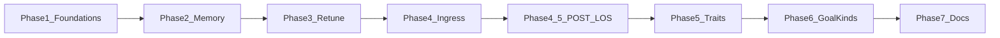
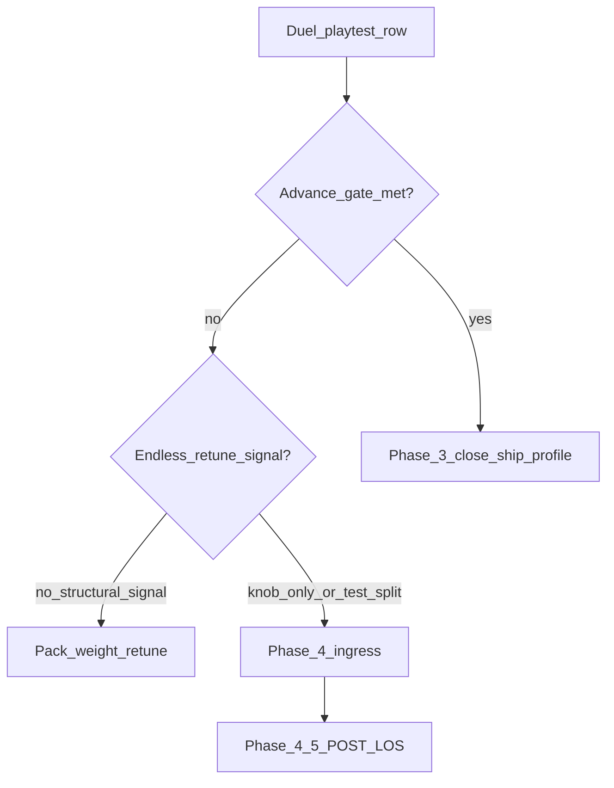

# Hunter Killer — Creature movement V2 / unified motor (draft)

> **Purpose:** **Maintainer roadmap and technical spec** for the **movement + motivation refactor**. This file is the **source of truth for refactor phasing** (§**Refactor phases** below). **Sibling contracts:** motivation tree, traits, habitual replay — **[CREATURE_GOAL_DRIVERS.md](CREATURE_GOAL_DRIVERS.md)**; belief tiers, locale priors, **`goal_*`** keys — **[CREATURE_MEMORY.md](CREATURE_MEMORY.md)**; navigation / seek-cycle planner — **[POST_LOS_MOVEMENT.md](POST_LOS_MOVEMENT.md)** (Phase **4.5**). **This file** owns pack-scoped **`creature_motor`**, unified **`SeekCandidate`** ingress, **`MotorContext`** / scorer wiring, awareness/LoS, and **phase exit criteria** (§G).
>
> **Tier:** Draft (tier II) — **3D production motor is live** on [`main_3d.tscn`](../../main_3d.tscn). Supersedes branching in [Definitive_Features/CREATURE_MOVEMENT.md](../Definitive_Features/CREATURE_MOVEMENT.md) for **active** design; the definitive inventory doc retains **2D historical** fork detail until Phase 7 trim.
>
> **Doc lifecycle (on refactor completion):** Move **this file** → [`Completed_Features/`](../Completed_Features/) (implementation snapshot). Move **[CREATURE_GOAL_DRIVERS.md](CREATURE_GOAL_DRIVERS.md)** and **[CREATURE_MEMORY.md](CREATURE_MEMORY.md)** → [`Definitive_Features/`](../Definitive_Features/) (ongoing contracts). Update [PROJECT_DOC_INDEX.md](../PROJECT_DOC_INDEX.md) in the same coordinated change — no redirect stubs.
>
> **Refactor scope (ENGINE):** This phase **defines and implements scripted ENGINE motor only** (`creature_motor` weights, unified intent, motivation tree). **LLM / AI motor mode is out of scope** until ENGINE behavior is solid. When LLM motor is implemented later it must consume **motivation traits** at minimum; optionally share flattened motor params or read the species **`pack_resources.json`** so completions stay aligned with the same weighing story.
>
> **References:** [.cursor/rules/focus/asset_management.md](../../.cursor/rules/focus/asset_management.md) (`pack_resources.json`), [`creature_definition.gd`](../../creature/definition/creature_definition.gd), [CREATURE_MODEL_PLAN.md](CREATURE_MODEL_PLAN.md), [game_config_merge.gd](../../AI_int_lib/game_config_merge.gd).
>
> **Co-development:** **Tier / trait semantics** — **[CREATURE_GOAL_DRIVERS.md](CREATURE_GOAL_DRIVERS.md)**; **belief keys, hooks, tier belief tables** — **[CREATURE_MEMORY.md](CREATURE_MEMORY.md)** + code (**`goal_memory_*`**, **`_goal_belief`**). This file focuses on **routing** remembered targets into **`SeekCandidate[]`**, **`creature_motor`**, and scorer plumbing. **Archived** `[Completed_Features/](../Completed_Features/)** may still show older `food_memory_*` — ignore for implementation.

---

## Refactor phases (source of truth)

**Phases 1–2 are shipped** (§G.1–G.4 `[x]`). **Phases 3–7** and **Phase 4.5 (POST_LOS)** are the remaining work, in dependency order. Cross-cutting backlog items live in [ENHANCEMENT_BACKLOG_PLAN.md](../ENHANCEMENT_BACKLOG_PLAN.md).

### Phase status

| Phase | Name | Status | Exit criterion (summary) |
|-------|------|--------|--------------------------|
| **1** | ENGINE movement foundations | **Done** | §G.1–G.2 — pack merge, unified builder, single cardinal path |
| **2** | Generalized goal-memory | **Done** | §G.4 — `_goal_belief`, `LocalePriorMap`, salient writes, replay |
| **3** | Retune and ship baseline | **Next** | Playable duel; real **`creature_motor_profile_ship`**; pack tuning |
| **4** | Ingress cleanup | Pending | One `SeekCandidate[]` at scorer; **`weight_seek_remembered_goal`** per target |
| **4.5** | POST_LOS navigation planner | **Pilot** | Obstructed-seek step goals via navmesh; goal table + explore/backtrack deferred — **[POST_LOS_MOVEMENT.md](POST_LOS_MOVEMENT.md)** |
| **5** | Personality depth | Pending | Non-stub trait Tier-2; full Slot B **`current_fit`** |
| **6** | New goal kinds and backends | Pending | **`shelter`** writes; mate/combat/ring when systems land |
| **7** | Doc promotion | Pending | Sibling docs → tier III; **this file** → tier A snapshot |



**Shipped stack (Phases 1–2):** [`game_config_merge.gd`](../../AI_int_lib/game_config_merge.gd), [`motor_target_builder.gd`](../../creature/motor/motor_target_builder.gd), [`tier2_dominance.gd`](../../creature/motor/tier2_dominance.gd), [`goal_seek.gd`](../../creature/motor/goal_seek.gd), [`goal_belief_memory.gd`](../../creature/motor/goal_belief_memory.gd), [`goal_source_memory.gd`](../../creature/motor/goal_source_memory.gd), [`motor_tactic_classifier.gd`](../../creature/motor/motor_tactic_classifier.gd) (partial — see Phase 5), [`trait_tier2_mapper.gd`](../../creature/motor/trait_tier2_mapper.gd) (stub), 3D duel on [`main_3d.tscn`](../../main_3d.tscn).

### Phase 3 — Retune and ship baseline (§A.1)

**Goal:** Turn the dev-profile wiring detector into playable duel behavior.

1. Playtest duel loop (rabbit vs fox) — log rows in [CREATURE_GOALS_PLAYTEST_LOG.md](../Completed_Features/CREATURE_GOALS_PLAYTEST_LOG.md).
2. Finalize **`creature_motor_profile_ship`** in [`game_config_merge.gd`](../../AI_int_lib/game_config_merge.gd) — today stub/empty; ship numerics per species after baseline playtest.
3. Per-species **`pack_resources.json`** tuning — Preserve/Find band, awareness, seek weights, belief radii ([CREATURE_MEMORY.md §10](CREATURE_MEMORY.md)).
4. Ship executable CI (**B-10**) — deferred until ship profile has real numerics ([ENHANCEMENT_BACKLOG_PLAN.md](../ENHANCEMENT_BACKLOG_PLAN.md)).

**Phase 3 playtest boost (temporary — revert Phase 7):** Duel **body scale** and **awareness zone** are **2× ship baseline** so fox–rabbit contact and chase fire more often during retune. **Not** release tuning — log playtest rows with this caveat.

| Asset | Ship baseline | Playtest (2×) |
|-------|---------------|---------------|
| [`rabbit_archetype.tres`](../../creature/species/rabbit_archetype.tres) — `creature_size` | **0.85** | **1.7** |
| same — `collision_capsule_radius` / `height` | **0.3** / **1.0** | **0.6** / **2.0** |
| [`fox_archetype.tres`](../../creature/species/fox_archetype.tres) — `creature_size` | **1.0** | **2.0** |
| same — `collision_capsule_radius` / `height` | **0.35** / **1.1** | **0.7** / **2.2** |
| [`rabbit/pack_resources.json`](../../assets/creatures/rabbit/pack_resources.json) + [`fox/pack_resources.json`](../../assets/creatures/fox/pack_resources.json) — `awareness_radius` | **75** | **150** |
| same — `awareness_cone_extra` (§E.1 hybrid zone) | **200** | **400** |
| [`rabbit_archetype.tres`](../../creature/species/rabbit_archetype.tres) + [`fox_archetype.tres`](../../creature/species/fox_archetype.tres) — `caloric_needs` (start + max pool) | **30** | **60** |

**Primary files:** [`game_config_merge.gd`](../../AI_int_lib/game_config_merge.gd), `assets/creatures/*/pack_resources.json`, duel archetypes above.

### Phase 3 — exit tiers and gates (resolved)

**Do not conflate three tiers:**

| Tier | Name | Blocks | Summary |
|------|------|--------|---------|
| **1** | **Advance gate** (Phase 3 → 4 / 4.5) | Starting structural ingress / POST_LOS expansion | Both duel species win at least once under valid playtest setup (below). |
| **2** | **Phase 3 close** (§G.5.1) | Marking Phase 3 done | Advance gate **plus** `creature_motor_profile_ship` finalized (§A.1 key ownership) and duel pack deltas tuned. |
| **3** | **Product balance** | Release polish only | ~50% win share per [CREATURE_GOALS.md](../Completed_Features/CREATURE_GOALS.md) — **not** a phase gate. |

**Advance gate (tier 1 — confirmed):**

1. ≥1 logged **fox** win — cause tag **`predation_carn_win`**.
2. ≥1 logged **rabbit** win — cause tag **`starvation_carn_herb_win`**.
3. Rows on **`main_3d`** duel with Phase 3 **2× playtest boost** active (table above).
4. Playtest preconditions: `hunter_killer_debug/use_ship_motor_profile = true` **or** pack overlays that restore seek ([PHASE1_MOTOR_BASELINE.md](../AI_Notes/PHASE1_MOTOR_BASELINE.md)); each row in [CREATURE_GOALS_PLAYTEST_LOG.md](../Completed_Features/CREATURE_GOALS_PLAYTEST_LOG.md).

Structural phases (4 / 4.5) may unblock retune dead-ends that weight tweaks cannot — but **do not replace** this gate; **both sides must win at least once before Phase 3 closes** (tier 2).

**Ship-profile viability gate (tier 1 — confirmed):** ≥1 logged duel win (**fox or rabbit**, either cause tag above) with **`use_ship_motor_profile()`** active (`hunter_killer_debug/use_ship_motor_profile = true` or export feature **`creature_motor_ship`**). Proves the ship profile merge is a viable default, not only pack overlays on dev. **2× playtest boost** satisfies this gate for tier 1 **and** tier 2 — **no** ship-baseline body scale / awareness smoke row required before Phase 3 close (later phases will tune max calories per creature and food density per area; Phase 7 reverts playtest boost).

**Dev-profile negative gate (tier 1 — confirmed):** With **dev** profile active (default editor, setting off) and duel packs loaded, duel behavior must remain **obviously misconfigured** — e.g. no sustained food/prey seek, aberrant looping — per [PHASE1_MOTOR_BASELINE.md](../AI_Notes/PHASE1_MOTOR_BASELINE.md). **CI:** `_test_creature_motor_v2_profiles` (merge keys — zero seek + high chaos) is **sufficient**; a headless duel aberrance harness is **not** required before Phase 3 close. **Manual:** live editor duel under dev profile remains the acceptance path for *visible* aberrance — the gate’s purpose is human-observable misconfiguration, not automated locomotion replay.

**Regression policy (confirmed):** Any **major** motor merge / profile / duel-pack change in this area must re-run **advance gate**, **ship viability**, and **dev negative** before merge — same checklist as §G.5.1 tier-1 rows.

**Endless-retune signals** (watch during Phase 3 retune):

| Signal | Meaning |
|--------|---------|
| **Stuck motif** | ≥5 consecutive log rows with the same failure pattern (e.g. fox east-wall hug, 0 cal both sides) and no new cause tags after a tuning change |
| **Test/playtest split** | Headless scenario matrix green ([PHASE1_MOTOR_BASELINE.md](../AI_Notes/PHASE1_MOTOR_BASELINE.md) scenarios 1–5) but duel still 100% `timeout` / `end_ai` |
| **Knob-only loop** | ≥2 retune PRs that only change pack weights/chaos with no change in failure motif |

**Pivot rule:** When **test/playtest split** or **knob-only loop** applies to the **same motif**, **stop pack numerics** and treat Phase **4** (ingress — `weight_seek_remembered_goal`, single `goal_seek_targets` path) or Phase **4.5b–d** (POST_LOS goal table, explore/backtrack, retire `ai_driver` escape overrides) as the next lever — **even if advance gate not yet met**, but **only after** confirming playtest setup (ship profile, spawn settlement) is valid. Checklist: §G.5.1.



**Occlusion at cone edge (playtest row 27) — resolved (§A.1.1):** Seek and patrol scoring should **maximize visible open terrain** within the zone of awareness. When LoS to the active seek goal or synthetic explore hint is blocked, cardinal steps **into** the occluded heading are penalized; lateral / flank headings that **increase unobstructed awareness coverage** are rewarded (`seek_occlusion_step_cost`, `motor_patrol_occlusion_active`). Applies to **active seek** and **no-goal patrol** when hunt-motivated and occlusion context is armed — not gated on `stuck_n`.

**Patrol occlusion residual — rows 27–34 (resolved):**

| Decision | Policy |
|----------|--------|
| **Phase 3 close gate** | **Not** blocked on Phase **4.5c** explore/backtrack owning patrol occlusion. |
| **First lever** | Phase 3 **pack tuning** — `motor_patrol_occlusion_penalty_weight`, `predator_patrol_blocked_backtrack_mul`, related patrol keys (§A.1.1). |
| **Escalation** | If south-facing jitter persists after tuning and blocks advance gate / duel wins, pull **no-goal patrol explore/backtrack** (today scoped to **4.5c** in [POST_LOS_MOVEMENT.md](POST_LOS_MOVEMENT.md)) into **Phase 3 playtest scope** *before* Phase 3 close — **not** deferred behind 4.5c. Maintainer approved forward pull when tuning alone fails. |
| **4.5c remainder** | Full seek-cycle explore/backtrack tree + incremental `ai_driver` override retirement stays **4.5c–d** after ingress (Phase 4) and **4.5b** goal table land. |

<<Question: Pre-emptive pull — should we implement no-goal patrol explore/backtrack **now** (before advance-gate wins) given rows 27–34, or **tune-first** and only pull forward if endless-retune / pivot signals fire?>>**Resolved (2026-06-13 — rows 35–36):** Ship **open-ground no-prey patrol** first ([`_predator_open_ground_patrol_hint`](../../AI_int_lib/ai_driver.gd), [`_predator_compose_no_prey_expand_hint`](../../AI_int_lib/ai_driver.gd), expanding **8-way segment** rotation, wall-in-awareness **`motor_patrol_occlusion_active`**, weak duel prey-sector prior). Phase **4.5c** explore/backtrack pull remains escalation if rows **37+** still show endless south lock after this pass.

**Playtest row 35/36 — why South wins (not a constant):** No hardcoded south default. At duel start the fox is usually on the **east rim** with empty `prey_pts_live`. [`_predator_patrol_edge_expand_hint`](../../AI_int_lib/ai_driver.gd) sets a heavy **`expanding_explore_hint`** (fox pack **`predator_patrol_interior_expand_weight`: 8.0). East-wall **rim peel** often fails **`predator_patrol_rim_peel_min_gain`**, so **N/S wall tangents** win; from the **north half** of the east wall, **`toward_center`** favors **South (+Z)**. **`Explore.pick_cardinal`** was previously wired only when **`prey_engaged`**, so no-prey patrol lacked **8-way segment rotation**. Chaos (~13 no-goal) cannot break a stable hint at weight **8** plus **`motor_no_goal_patrol_lock_sec`** (0.5 s). **`motor_patrol_occlusion_active`** was pinch-only, not **wall-in-awareness**.

**Open-ground no-prey patrol (2026-06-13 — rows 35–36 fix):**

| Priority | Mechanism |
|----------|-----------|
| **Primary** | [`_predator_open_ground_patrol_hint`](../../AI_int_lib/ai_driver.gd) — 8-way score: edge-margin gain, static clearance, playfield center, wall-inward peel; segment RNG (`body_id ^ round_salt ^ segment_index`). |
| **Variance** | [`_predator_compose_no_prey_expand_hint`](../../AI_int_lib/ai_driver.gd) blends **segment** [`Explore.pick_cardinal`](../../creature/motor/expanding_cardinal_explore.gd), open-ground, rim peel, and demotes **pure E/W tangents** when wall is in awareness. |
| **Occlusion** | **`motor_patrol_occlusion_active`** also when hunt-motivated, no active goal, and **playfield edge within awareness** ([`_predator_patrol_wall_in_awareness`](../../AI_int_lib/ai_driver.gd)); synthetic patrol goal on **`motor_seek_goal_pos`** for [`seek_occlusion_step_cost`](../../creature/motor/cardinal_avoidance.gd). |
| **Secondary** | Weak duel bias: [`_predator_duel_prey_sector_hint`](../../AI_int_lib/ai_driver.gd) toward registered prey / remembered centroid — **`predator_duel_patrol_prey_prior_weight`**, **`predator_duel_patrol_prior_blend`**. |
| **Patrol lock** | Guided lock resets when latched heading is **pure wall tangent** but open-ground offers better interior heading on E/W rim. |

**Fox pack keys (2026-06-13):** **`predator_patrol_open_ground_weight`** (7.5), **`motor_patrol_wall_occlusion_penalty_weight`** (14.0), **`predator_duel_patrol_prey_prior_weight`** (2.2), **`predator_duel_patrol_prior_blend`** (0.28); **`predator_patrol_rim_peel_min_gain`** retuned (0.30; toward-center peel keeps full threshold during no-prey patrol).

**South-lock retune (2026-06-13 — rows 35–37, post open-ground pass):** Row **37** confirmed south wall-slide persisted. Second pass: **pack** lowers **`predator_patrol_interior_expand_weight`** (8.0 → **4.5**), raises no-goal **chaos** (`motor_intent_cost_chaos` **4.4**, `motor_no_goal_chaos_mul` **4.0**), shortens **`motor_no_goal_patrol_lock_sec`** (**0.35**), strengthens open/occlusion weights; **code** makes open-ground scoring **rim-aware** (pack keys below), decouples expand weight from **`interior_expand`** when wall-in-awareness, sets patrol **`motor_seek_goal_pos`** to **wall-inward** (not expand-hint tangent) when rim is in awareness, and adds **`motor_patrol_edge_margin_gain_weight`** rim reward in [`cardinal_avoidance.gd`](../../creature/motor/cardinal_avoidance.gd). **Escalation:** if row **38+** still south-locks, pull Phase **4.5c** no-goal explore/backtrack.

| Priority | Mechanism |
|----------|-----------|
| **Open-ground scorer** | Pack-driven **`predator_patrol_open_*`** weights; when **`wall_in_aware`**: halve toward-center on E/W rim, double wall-inward, penalize pure wall tangents (`predator_patrol_open_rim_tangent_penalty`). |
| **Compose weight** | When wall-in-awareness: **`w_out`** from **`predator_patrol_open_ground_weight`** + segment blend — not **`interior_expand`**. Segment hint blended when it disagrees with open hint. |
| **Occlusion goal** | Wall-in-awareness: **`motor_seek_goal_pos = pos + wall_inward × max(ar×0.65, 18)`** (fallback: playfield center). Pinch path unchanged (expand-hint goal). |
| **Execution rim term** | **`motor_patrol_edge_margin_gain_weight`** (fox **6.0**): subtract cost for steps that increase footprint edge margin while patrol occlusion active. |

**Fox pack keys (2026-06-13 retune):**

| Key | Value | Measures |
|-----|-------|----------|
| `predator_patrol_interior_expand_weight` | **4.5** | Mid-field / coverage expand fallback (was 8.0 — south lock lever) |
| `predator_patrol_open_ground_weight` | **11.0** | Expand pull when open-ground hint wins |
| `predator_patrol_open_toward_center_weight` | **10.0** | Open-ground center pull (halved on E/W rim when wall-in-awareness) |
| `predator_patrol_open_wall_inward_weight` | **28.0** | Open-ground inward peel bonus |
| `predator_patrol_open_edge_gain_weight` | **14.0** | Open-ground edge-margin gain |
| `predator_patrol_open_rim_tangent_penalty` | **12.0** | Open-ground pure tangent penalty when wall-in-awareness |
| `motor_patrol_wall_occlusion_penalty_weight` | **22.0** | Patrol occlusion step cost amplitude |
| `motor_patrol_edge_margin_gain_weight` | **6.0** | Cardinal rim-peel reward during patrol occlusion |
| `predator_patrol_blocked_backtrack_mul` | **1.6** | Backtrack boost while patrol occlusion active |
| `predator_patrol_rim_peel_min_gain` | **0.22** | Rim peel threshold (was 0.30) |
| `motor_intent_cost_chaos` | **4.4** | Intent roulette noise |
| `motor_no_goal_chaos_mul` | **4.0** | No-goal chaos multiplier (~17.6 effective) |
| `motor_no_goal_patrol_lock_sec` | **0.35** | Patrol heading lock TTL |
| `weight_expanding_explore_hint` | **2.4** | Segment rotation pull |

**Regression:** `_test_predator_open_ground_patrol_east_rim`, `_test_predator_no_prey_expanding_explore_segments`, `_test_predator_patrol_wall_occlusion_active`, `_test_predator_no_prey_patrol_heading_spread`, `_test_predator_duel_weak_prey_prior` ([`tests/run_all.gd`](../../tests/run_all.gd)).

### Phase 4 — Ingress cleanup (§A.2.2)

**Goal:** Finish unified **`SeekCandidate`** ingress; remove parallel legacy scorer lists.

**Known gap (code today):** [`cardinal_avoidance.gd`](../../creature/motor/cardinal_avoidance.gd) still scores **`food_seek_targets`**, **`pursuit_targets`**, and **`goal_seek_targets`**. [`goal_belief_memory.gd`](../../creature/motor/goal_belief_memory.gd) merges remembered bushes into **`food_seek_targets`** and bumps **`weight_seek_ready_food`** globally (`w_remember * 0.5`) instead of per-target **`weight_seek_remembered_goal`** on **`goal_seek_targets`** ([ENHANCEMENT_BACKLOG_PLAN.md](../ENHANCEMENT_BACKLOG_PLAN.md) — *Remembered seek weighting*).

1. Route precise remembered stationary targets through **`goal_seek.gd`** → **`goal_seek_targets`** + **`weight_seek_goal`**, using **`weight_seek_remembered_goal`** per merged `SeekCandidate`.
2. Collapse carnivore **`pursuit_targets`** into **`seek_candidates`** metadata where profiling allows (internal peel OK; one builder output).
3. Deprecate **`food_seek_targets`** / **`weight_seek_ready_food`** in [`ai_driver.gd`](../../AI_int_lib/ai_driver.gd) + cardinal scorer once tests pass.
4. Extend [`tests/run_all.gd`](../../tests/run_all.gd) — remembered-bush pull via **`goal_seek_targets`**.

**Primary files:** [`goal_belief_memory.gd`](../../creature/motor/goal_belief_memory.gd), [`goal_seek.gd`](../../creature/motor/goal_seek.gd), [`cardinal_avoidance.gd`](../../creature/motor/cardinal_avoidance.gd), [`ai_driver.gd`](../../AI_int_lib/ai_driver.gd).

### Phase 4.5 — POST_LOS navigation planner

**Goal:** Add the **planning layer** between goals and cardinal execution so stuck/path decisions consolidate into one seek cycle instead of growing `ai_driver` escape overrides. **Authoritative design:** **[POST_LOS_MOVEMENT.md](POST_LOS_MOVEMENT.md)**. **Does not replace** [`cardinal_avoidance.gd`](../../creature/motor/cardinal_avoidance.gd) — execution substrate unchanged.

**Dependency:** Phase **4** ingress cleanup should land first (single `goal_seek_targets` ingress clarifies ultimate vs step goal). Phase 4.5 **pilot (4.5a)** may proceed in parallel where ingress gaps do not block obstructed-seek wiring.

**Architecture (three layers):**

| Layer | Module | Cadence |
|-------|--------|---------|
| Motivation | `tier2_dominance`, `goal_seek` | Slow loop (every **n** ticks — full table deferred) + per-tick weights today |
| POST_LOS planner | [`seek_planner.gd`](../../creature/motor/seek_planner.gd) | Path replan when obstructed; step goal every tick |
| Execution | `cardinal_avoidance` + kinematic body | Every physics tick |
| Fast path | flee / jeopardy | Every tick — bypasses planner |

**Phase 4.5 sub-phases:**

| Sub-phase | Scope | Status |
|-----------|-------|--------|
| **4.5a** | Obstructed active seek → navmesh first waypoint as `motor_seek_goal_pos`; pack flag `post_los_seek_planner_enabled` | **Pilot** |
| **4.5b** | Active goal table + Observation replan interval **n** | **Next** (POST_LOS design round 4 resolved — [POST_LOS_MOVEMENT.md](POST_LOS_MOVEMENT.md) §§2–4) |
| **4.5c** | Explore / backtrack seek-cycle branches | Deferred |
| **4.5d** | Retire `ai_driver` escape overrides incrementally | Deferred until playtest green |

**Pilot wiring:**

1. [`seek_planner.gd`](../../creature/motor/seek_planner.gd) — `direct_path_clear` (LoS), `resolve_step_goal` (navmesh step).
2. [`nav_path_hint.gd`](../../environment/nav_path_hint.gd) — `first_waypoint_world`.
3. [`ai_driver.gd`](../../AI_int_lib/ai_driver.gd) `_build_motor_context` — when `post_los_seek_planner_enabled` and active seek, set `motor_seek_ultimate_goal` + step `motor_seek_goal_pos`.
4. Duel fox pack enables pilot flag for playtest rows.

**Primary files:** [`seek_planner.gd`](../../creature/motor/seek_planner.gd), [`nav_path_hint.gd`](../../environment/nav_path_hint.gd), [`ai_driver.gd`](../../AI_int_lib/ai_driver.gd), [`line_of_sight.gd`](../../creature/motor/line_of_sight.gd), [`tests/run_all.gd`](../../tests/run_all.gd).

### Phase 5 — Personality depth

**Goal:** Traits affect Tier-2 urgency and tactic replay beyond Slot A tint. Authoritative formulas: **[CREATURE_GOAL_DRIVERS.md §3.3.1, §5.1.4](CREATURE_GOAL_DRIVERS.md)**; code map: **[CREATURE_TRAIT_USAGE.md](../Definitive_Features/CREATURE_TRAIT_USAGE.md)**.

| Item | Module |
|------|--------|
| Trait → Tier-2 urgency deltas | [`trait_tier2_mapper.gd`](../../creature/motor/trait_tier2_mapper.gd) `apply_trait_urgency_channels` |
| Full Slot B **`current_fit`** + **`tactic_lasting_local_change`** | [`goal_source_memory.gd`](../../creature/motor/goal_source_memory.gd), [`motor_tactic_classifier.gd`](../../creature/motor/motor_tactic_classifier.gd) |
| **`anticipated_calories`** motor use | [`goal_belief_memory.gd`](../../creature/motor/goal_belief_memory.gd) — [CREATURE_MEMORY.md §6](CREATURE_MEMORY.md) |
| Compassion / community motor (minimal) | Motor context fields — [CREATURE_GOAL_DRIVERS.md §3.1](CREATURE_GOAL_DRIVERS.md) |

**Constraint:** Jeopardy hard-win and starvation override ([CREATURE_GOAL_DRIVERS.md §3](CREATURE_GOAL_DRIVERS.md)) unchanged unless pack-combat verbs land.

### Phase 6 — New goal kinds and backends

**Goal:** Extend the **same** memory schema. Storage/write contracts: **[CREATURE_MEMORY.md](CREATURE_MEMORY.md)**; **`GoalKind`** registry: **[CREATURE_GOAL_DRIVERS.md §4.1](CREATURE_GOAL_DRIVERS.md)**.

| GoalKind / backend | Status | Phase 6 work |
|--------------------|--------|--------------|
| **`find_food` / `avoid_hostiles`** | Live | Retune (Phase 3) + ingress (Phase 4) |
| **`shelter`** | Registry only | Squeeze fingerprint **`context_hash`**, bolt-hole beliefs, salient writes — [CREATURE_MEMORY.md §7](CREATURE_MEMORY.md), [ENVIRONMENT_MODEL_PLAN.md](../Definitive_Features/ENVIRONMENT_MODEL_PLAN.md) |
| **`find_mate`** | Stub urgency **0** | Blocked on mating vitals / pursuit system |
| Pack **`extra_goal_kinds`** | Merge at spawn | Author in packs + tests (e.g. `nest_defense`) |
| **`ExperienceRing`** | Deferred | Episodic backend + map/ring disagree — [CREATURE_GOAL_DRIVERS.md §5.1 Action 3](CREATURE_GOAL_DRIVERS.md) |
| **`fight` modality** | **`current_fit = 0`** | Blocked on combat; revisit prey-chase vs **`avoid_hostiles`** — [CREATURE_MEMORY.md §5.5](CREATURE_MEMORY.md) |

**LoS / stealth backlog** (post–M4 v1): skill-based occlusion threshold, semantic env fallback — §D–E, [CREATURE_MEMORY.md §7.4](CREATURE_MEMORY.md).

### Phase 7 — Doc promotion

**Trigger:** Phases 3–4 stable in playtest; Phase 5–6 items may still be open but must not block contract promotion of siblings.

| File | Destination | Role after move |
|------|-------------|-----------------|
| **This file** (`CREATURE_MOVEMENT_V2.md`) | [`Completed_Features/`](../Completed_Features/) | Refactor **snapshot** — drift vs code expected |
| [CREATURE_GOAL_DRIVERS.md](CREATURE_GOAL_DRIVERS.md) | [`Definitive_Features/`](../Definitive_Features/) | Ongoing motivation / trait / replay contract |
| [CREATURE_MEMORY.md](CREATURE_MEMORY.md) | [`Definitive_Features/`](../Definitive_Features/) | Ongoing belief / locale-prior contract |
| [CREATURE_TRAIT_USAGE.md](../Definitive_Features/CREATURE_TRAIT_USAGE.md) | *(stay tier III)* | Update §5 deferred table as Phase 5 ships |
| [CREATURE_MOVEMENT.md](../Definitive_Features/CREATURE_MOVEMENT.md) | *(stay tier III)* | Trim 2D fork detail superseded by [CREATURE_3D_ARCHITECTURE.md](../Definitive_Features/CREATURE_3D_ARCHITECTURE.md) |

**Phase 7 cleanup — revert Phase 3 playtest boost:** Restore duel **ship-baseline** body scale, **`caloric_needs`**, and awareness (table under **Phase 3 — playtest boost**): [`rabbit_archetype.tres`](../../creature/species/rabbit_archetype.tres), [`fox_archetype.tres`](../../creature/species/fox_archetype.tres), and **`awareness_radius` / `awareness_cone_extra`** in [`rabbit/pack_resources.json`](../../assets/creatures/rabbit/pack_resources.json) + [`fox/pack_resources.json`](../../assets/creatures/fox/pack_resources.json). Remove playtest notes from pack `notes` fields. Re-run headless tests + one ship-profile duel smoke after revert.

**Out of scope until ENGINE solid:** LLM motor mode (§scope note below); trait heredity / experience-driven drift ([CREATURE_GOAL_DRIVERS.md §3.4](CREATURE_GOAL_DRIVERS.md)).

### Suggested immediate sprint

1. **Phase 3 retune** until **tier-1 gates** met (advance + ship viability + dev negative — **Phase 3 — exit tiers and gates**).
2. **Phase 3 close** — finalize **`creature_motor_profile_ship`** per §A.1 key ownership tables; packs **retain** explicit keys until Phase 7 (dedup at doc promotion).
3. **Phase 4 ingress** in parallel only when **endless-retune pivot** fires — **`weight_seek_remembered_goal`**, single `goal_seek_targets` path; **4.5b** unblocked per [POST_LOS_MOVEMENT.md](POST_LOS_MOVEMENT.md).

---

## A. Refactor stated goals

### A.1 creature_motor per pack + resilient defaults in `game_config_merge.gd`

**Target:** Per-species tuning lives in **`res://assets/creatures/<pack>/pack_resources.json`** — see **canonical shape** below. Root [`game_config.json`](../../game_config.json) and `user://game_config.json` may still hold **other** global knobs; they do **not** participate in the **`creature_motor`** merge stack (no global overlay layer).

**Canonical `pack_resources.json` shape (chosen):**

- **`"creature_motor": { … }`** at the pack root (**inline object**) holds **everything that defines movement weighing** for that species — weights, hold ticks, chaos, thresholds, Tier-2 multipliers once split, optional future keys. **Do not use** a `.tres` indirection unless we explicitly add `"creature_motor_path"` later.
- **`"strategy_class_tags": { … }`** (**optional sibling**, not nested under **`creature_motor`**) — species-specific **Slot B** modality extensions for locale priors / habitual replay (**[CREATURE_GOAL_DRIVERS.md §5.1 — Action 1](CREATURE_GOAL_DRIVERS.md)**):
  - **`extra_modalities`**: `string[]` of **`snake_case`** ids unioned at spawn with the engine **core modality resource** → per-instance **`effective_modality_allowlist`**.
  - Example: `{ "strategy_class_tags": { "extra_modalities": ["ambush_stalk"] } }`.
  - **Pole facet tags** are **not** pack-extensible (fixed eight ids in engine code).
- **`"goal_kinds": { … }`** (**optional sibling**, not nested under **`creature_motor`**) — species-specific **goal-category** extensions for locale priors / write gates (**[CREATURE_GOAL_DRIVERS.md §4.1](CREATURE_GOAL_DRIVERS.md)**):
  - **`extra_goal_kinds`**: array of objects — each adds a **`snake_case`** **`id`** unioned at spawn with engine **core `GoalKind`** ids → per-instance **`effective_goal_kinds`**.
  - Required per entry: **`id`**, **`parent_tier2`** (`find_food` | `avoid_hostiles` | `find_mate` | `preserve_calories`). Optional: **`salient_writes`** (default true), **`context_overlay`** (hint for **`context_hash`** compositor).
  - Example: `{ "goal_kinds": { "extra_goal_kinds": [{ "id": "nest_defense", "parent_tier2": "avoid_hostiles", "context_overlay": "nest_fingerprint" }] } }`.
  - **Core** ids (`find_food`, `avoid_hostiles`, `shelter`, `find_mate`) are **not** pack-overridable; packs only **add** kinds.

**Resolution rule (instantiation):** Every spawned creature gets `creature_motor` as **`default_creature_motor_params()` shallow-merged with the pack overlay** (see below). **`effective_goal_kinds`** and **`effective_modality_allowlist`** merge from the same **`pack_resources.json`** at spawn (**`CreatureDefinition.asset_pack_root`**). **`default_creature_motor_params()`** is the **only** authoritative place that composes (**merged into one dict**):

1. **Species-agnostic spine** — hard defaults so nothing runs with missing dicts.

2. **Exactly one profile** — **`creature_motor_profile_dev`** or **`creature_motor_profile_ship`** (locked identifiers — see selection below): **`default_creature_motor_params()` MUST reference these identifiers explicitly** (e.g. constants or map entries by id) and **select** between them using the build flag (**§Profile selection**). Implementations may extract `apply_creature_motor_profile_*` helpers for tests, but the **ship vs dev blend** observable at runtime originates from **`default_creature_motor_params()`**.

**Per-key precedence (strict):** For each **`creature_motor`** key **`k`**:

1. **Pack layer — first** (`pack_resources.json` → **`creature_motor`**, keyed by **`CreatureDefinition.asset_pack_root`**): if **`k`** is present **here**, that value wins.

2. **Else profile-backed defaults**: use **`default_creature_motor_params()[k]`** (spine ∪ selected profile).

If **all or part** of **`creature_motor`** is absent in the pack file, **missing keys** adopt **`default_creature_motor_params()`** only for those keys — the creature **still runs**; tuning may be **wrong for that species** until the pack is fixed (**acceptable per asset workflow**).

**Two merge profiles in `game_config_merge.gd` (required — locked identifiers):**

| Locked id | Audience | Behavioral intent |
|-----------|----------|-------------------|
| **`creature_motor_profile_dev`** | Editor, CI, builds **without** the ship feature tag below | **Aberrant probe profile:** tune weights/speed/explore/hold toward **extreme ends of each knob's spectrum** so effective behavior **clearly deviates** from acceptable ship norms — e.g. **tight looping / small circles**, excessive idle spin, or other obviously wrong locomotion. Purpose: **detect wiring regressions** (missing pack overlay, broken merge, absent seek/threat builder) — **not** approximate real creature behavior. Per-key guidance: when unsure, pick the **opposite extreme** from the intended ship midpoint for that scalar. |
| **`creature_motor_profile_ship`** | **Ship / release exports** when export feature **`creature_motor_ship`** is enabled | **Partial overlay until Phase 3 close:** finalize per **key ownership** below after advance gate + baseline playtest. **Do not** treat current values as release tuning. |

**Key ownership — `creature_motor_profile_ship` vs pack `creature_motor` (resolved — Phase 3 close task):**

1. **Identical in fox and rabbit packs** → move to **`creature_motor_profile_ship`** at Phase 3 close (species-agnostic duel defaults). Today (2026-06-12, 2× playtest boost values in packs):

| Key | Shared value (playtest) | Measures |
|-----|-------------------------|----------|
| `awareness_radius` | **150** | Base omnidirectional awareness reach (§E.1); **75** at ship baseline before Phase 7 revert |
| `awareness_cone_extra` | **400** | Forward-cone awareness extension (§E.1); **200** at ship baseline |
| `awareness_forward_cone_only` | **false** | Hybrid rear disk + forward wedge (default posture §E.1) |
| `explore_coverage_cell` | **52** | Explore-grid cell size for coverage / trail repulsion |
| `explore_trail_max_cells` | **96** | Trail-repulsion memory cap |
| `geometry_escape_lock_ticks` | **14** | Latched geometry / corner escape hold |
| `motor_playfield_corner_band` | **84** | Playfield corner detection band |
| `motor_stuck_escape_ticks` | **1** | Stuck counter before forced escape intent |
| `motor_tie_cost_epsilon` | **0.55** | Cardinal tie-break noise |
| `weight_explore_trail_repulsion` | **2.35** | Repulsion from recently visited explore cells |
| `weight_stuck_escape_explore` | **2.2** | Explore bias during stuck escape |

2. **Present in both packs but different values** → at Phase 3 close, set **ship default = numeric midpoint** (scalar keys only); document what each measures; species packs keep **deltas** from ship. Tune via playtest focused on that axis:

| Key | Fox | Rabbit | Ship midpoint | Measures / test focus |
|-----|-----|--------|---------------|------------------------|
| `expanding_explore_base_physics_ticks` | 48 | 36 | **42** | Expand-hint segment hold duration |
| `motor_goal_sight_chaos_mul` | 0.2 | 0.25 | **0.225** | Chaos reduction when goal in sight |
| `motor_intent_cost_chaos` | 3.8 | 2.8 | **3.3** | Intent roulette noise (ship overlay may stay **0** until close — see below) |
| `motor_no_goal_chaos_mul` | 3.4 | 2.6 | **3.0** | Patrol chaos multiplier |
| `motor_no_goal_patrol_lock_sec` | 0.5 | 0.65 | **0.575** | No-goal patrol heading lock TTL |
| `weight_expanding_explore_hint` | 1.8 | 0.12 | **0.96** | Pull toward expanding explore hint |
| `weight_explore_turn_bias` | 0.04 | 0.14 | **0.09** | Explore turn preference |
| `weight_obstacle_shield_prey` | 28 | 32 | **30** | Prey uses static obstacle as shield vs threat |

3. **Species-only keys** (fox-only carnivore / rabbit-only herbivore blocks) → **remain in pack** `creature_motor` only — never ship. Examples: `weight_seek_prey`, `weight_seek_ready_food`, flee / pursuit / pinch packs.

4. **Species-divergent boolean keys** — **`motor_exploration_always_enabled`** (**fox true**, **rabbit false**) stays **pack-only** (not promoted to ship). Key may change or be removed when all creatures share a single code path.

**Pack dedup after Phase 3 close (resolved):** When shared keys move into **`creature_motor_profile_ship`**, fox/rabbit packs **retain explicit duplicated values** until **Phase 7** — packs stay diff-visible for tuning variance; Phase 7 cleanup drops duplicates and reverts playtest boost (see **Phase 7 — revert Phase 3 playtest boost**).

**Profile selection (build flag — defaults to dev):**

- **Chosen mechanism:** Godot **export custom feature tag** **`creature_motor_ship`** (set on **production / ship presets only** in the Export dialog → *Features*, or equivalent export metadata).
- **Runtime rule:** **`default_creature_motor_params()`** calls `OS.has_feature(&"creature_motor_ship")` and merges **`creature_motor_profile_ship`** when true; otherwise merges **`creature_motor_profile_dev`** (default for editor runs, unstamped exports, missing tag). Merge helpers keyed by those two identifiers may exist for tests (**e.g.** `apply_creature_motor_profile_ship(base)`) — names must preserve the **_dev** / **_ship** suffixes; **`default_creature_motor_params()`** remains the **single entry** that performs profile selection + spine merge for production codepaths.

**CI / ship executable testing (deferred — B-10):** Strategy for validating **`creature_motor_ship`** builds — export preset vs harness vs both — **deferred until `creature_motor_profile_ship` has real numerics**. Requires broader **automated regression against a ship-tagged executable**, not profile-merge unit tests alone. Track in **[ENHANCEMENT_BACKLOG_PLAN.md](../ENHANCEMENT_BACKLOG_PLAN.md)**.

**LLM note:** **`mode` / inference** tying into `creature_motor` is **out of scope** for this refactor. Packs may still record `mode: "scripted"` for clarity; ENGINE implements scripted path only until LLM motor phase.

#### A.1.1 Playfield distance scaling (3D `main_3d`)

Legacy motor numerics in pack JSON and the spine were tuned against a **reference playfield long edge** of **1890** world units ([`MotorPlane.REFERENCE_MOTOR_PLAYFIELD_EDGE`](../../creature/motor/motor_plane.gd)). On smaller 3D grasslands mains (~40–120 m), distances must shrink or stuck/edge escape probes treat most cardinal steps as out-of-bounds.

**Runtime path:** [`AiDriver._scale_motor_params_for_playfield`](../../AI_int_lib/ai_driver.gd) reads the creature's **`screen_size`** (from [`main_3d.gd`](../../main_3d.gd) `get_motor_playfield_size()`) and applies [`MotorPlane.scale_motor_distance_params`](../../creature/motor/motor_plane.gd):

- **Scale factor:** `min(playfield.x, playfield.y) / REFERENCE_MOTOR_PLAYFIELD_EDGE` when the long edge is below 25% of reference; else **1.0**.
- **Scaled keys:** existing suffix-matched distance keys (`*_radius`, `*_probe`, `*_band`, `awareness_radius`, etc.) — same rules as [`MotorPlane._is_distance_motor_param_key`](../../creature/motor/motor_plane.gd).

**Injected keys (not pack-authored):** merged at scale time via [`MotorPlane._inject_cardinal_probe_mins`](../../creature/motor/motor_plane.gd):

| Key | Baseline (scale = 1) | Consumer |
|-----|----------------------|----------|
| **`motor_cardinal_probe_min`** | **40** | [`cardinal_avoidance.motor_cardinal_probe_step`](../../creature/motor/cardinal_avoidance.gd) — far lookahead for patrol block tests and stuck/edge escape |
| **`motor_cardinal_near_probe_min`** | **10** | [`cardinal_avoidance.cardinal_step_blocked_for_escape`](../../creature/motor/cardinal_avoidance.gd) — near-step tighten test |

**MotorContext:** [`_build_motor_context`](../../AI_int_lib/ai_driver.gd) copies both keys onto ctx (`motor_cardinal_probe_min`, `motor_cardinal_near_probe_min`) so [`CardinalAvoidance.pick_best_move_intent`](../../creature/motor/cardinal_avoidance.gd) and AiDriver escape helpers share the same scaled probes.

**Duel awareness (playfield-scaled — reverted 2026-06-12):**

- Pack **`awareness_radius` / `awareness_cone_extra`** (Phase 3 **2× playtest** values) scale with [`scale_motor_distance_params`](../../creature/motor/motor_plane.gd) on ~105 m grasslands mains like other distance keys — **no** duel-round unscale. Opposite-rim spawns start outside `prey_pts_live`; fox patrols until prey enters cone (PHASE1 scenario 2 / 3).

**No-prey predator patrol coverage (2026-06-10 — playtest rows 31–33):**

- Hunt-motivated carnivore with empty `prey_pts_live` now wires **`weight_explore_trail_repulsion`** + `explore_trail_centers` (pack optional **`predator_patrol_trail_repulsion_mul`**, default **1.0**).
- **`_predator_coverage_seek_hint`** biases `expanding_explore_hint` toward least-visited coverage cells when rim peel is inactive.
- **`_predator_patrol_lock_retread_active`** resets guided patrol lock when the latched heading re-enters a trail cell.
- Rim band: **`predator_chase_edge_band_frac`** (fox pack **0.12**) ∪ scaled **`predator_chase_edge_band`** via [`_predator_chase_edge_band_m`](../../AI_int_lib/ai_driver.gd).
- East/west no-prey patrol lowers pure-tangent score bonus and boosts inward/SW peel in [`_predator_pick_edge_tangent_cardinal`](../../AI_int_lib/ai_driver.gd) / [`_predator_pick_rim_peel_cardinal`](../../AI_int_lib/ai_driver.gd).
- **`predator_patrol_debug`** on MotorContext; **`final_intent`** OLog (`CREATURE_GOALS`) includes `prey_live`, `prey_dist`, `awareness_eff`, `w_seek_prey`, `edge_m`, `expand`, `trail_rep`.

**Predator pinch / pacing trap (2026-06-10):**

- **`predator_geometry_pinch_active`** is set even when **`motor_has_active_goal`** is true (memory chase no longer suppresses pinch detection).
- Pinch escape and pacing-trap overrides apply during active goal when wedged at an edge/boulder corridor.
- Predator no-goal interior stalls apply **`interior_esc`** when edge margin is interior (≥ chase band) and **coverage stall**, **mid-field pinch**, blocked intent, or **`stuck_n ≥ 2`** — no longer requires blocked step when stall/pinch already active (playtest rows 29–30).
- **`_predator_interior_pinch_escape_intent`** — mid-field boulder wedge at **`stuck_n ≥ 1`** (away-dir + latched stuck escape); symmetric to herbivore pinch at interior, distinct from rim **`pinch_esc`**.
- **Rim boulder wedge (2026-06-13 — playtest rows 40–41):** [`_predator_rim_boulder_wedge_escape_intent`](../../AI_int_lib/ai_driver.gd) runs when **`predator_geometry_pinch_active`** + rim band + **`stuck_n ≥ 1`** — prefers [`_predator_open_ground_patrol_hint`](../../AI_int_lib/ai_driver.gd) inward peel (NW/SW off east rim) before [`_predator_edge_pinch_escape_intent`](../../AI_int_lib/ai_driver.gd) wall-tangent slide. **`motor_filter_blocked_cardinals`** set while pinch active; no-goal patrol replaces **blocked** expand hints with open-ground detour; patrol lock drops held headings that become blocked. Test: `_test_predator_east_rim_boulder_wedge_escape`.
- **E/W corridor escape unification (2026-06-13 — playtest rows 42–44):** Patrol occlusion keys off **wall-in-awareness**; escape overrides previously split on **`pred_interior`** (`edge_m ≥ edge_band`) only — after 1–2 cells west along the east rim, **`_predator_interior_pinch_escape_intent`** N/S tangents could override west peel (~30 s oscillation, row 44). **Fix:** [`_predator_wall_aware_east_west_corridor_pinch`](../../AI_int_lib/ai_driver.gd) — E/W rim + pinch + (wall in awareness **or** `edge_m ≤ 1.5 × edge_band`); routes **`pinch_esc` / rim boulder wedge** even when interior-classified; suppresses interior pinch on that path. **Backtrack v1:** escape overrides filtered by [`_predator_filter_backtrack_escape`](../../AI_int_lib/ai_driver.gd); coverage stall + blocked-approach memory resets guided patrol lock. Rim wedge fallback uses static **away-dir** (shrub/boulder footprints from [`motor_obstacle_geometry.gd`](../../creature/motor/motor_obstacle_geometry.gd) `collect_from_scene_tree`). Test: `_test_predator_east_corridor_wall_aware_interior_escape`.
- Fox pack flag **`predator_pinch_debug_log`** emits at **`OLog.info`** (tag **`CREATURE_GOALS`**) — lines tagged **`pinch_esc`**, **`interior_pinch_esc`**, **`pacing_trap`**, **`corner_esc`**, **`interior_esc`**, **`stall_skip`**, **`final_intent`**.

**Terrain drop / valley rim (2026-06-13 — playtest row 42 question):**

| Mechanism | Behavior |
|-----------|----------|
| Normal patrol / open-ground hint | Static AABB + playfield bounds; **plus** [`_terrain_cardinal_blocked`](../../AI_int_lib/ai_driver.gd) (physics cliff ray) and [`_terrain_probe_drop_blocked`](../../AI_int_lib/ai_driver.gd) when probe Y drops ≥ **`terrain_drop_block_m`** (ship default **0.35 m**) |
| [`CardinalAvoidance` terrain term](../../creature/motor/cardinal_avoidance.gd) | Depression: uphill bonus via [`TerrainMotor.elevation_cost_delta`](../../creature/motor/terrain_motor.gd); **drop penalty** via **`elevation_drop_cost`** (`weight_terrain_drop`, default **40**) — independent of depression threshold |
| Playfield bounds | OOB = huge `penalty_oob` — flat XZ rect only |

**Phase 4.5c escalation (rows 42–44):** Row **38+** south-lock / corridor oscillation persisted after open-ground + rim-wedge passes — **minimal backtrack v1** shipped (blocked-approach TTL + patrol lock reset on coverage stall). Full seek-cycle explore/backtrack tree remains **4.5c** scope.

**Predator NE-corner / dual-edge rim (2026-06-10):**

- [`_playfield_wall_edge_info`](../../AI_int_lib/ai_driver.gd) sets **`is_corner`** + **`corner_inward`** when two playfield edges tie within **0.75** world units.
- [`_pick_playfield_corner_interior_cardinal`](../../AI_int_lib/ai_driver.gd) picks an interior diagonal that **increases edge margin** (used by patrol expand hint, edge tangent pick, pacing-trap break at corners).
- [`_predator_pick_edge_tangent_cardinal`](../../AI_int_lib/ai_driver.gd) now scores all **8-way** seek headings (rim tangent slide + diagonal skim + inward peel), ignores wall-diving picks, and resolves near-ties with deterministic RNG (`body_id ^ round_salt ^ physics_tick`).
- [`_predator_latched_corner_escape_intent`](../../AI_int_lib/ai_driver.gd) mirrors herbivore latched corner egress during **no-goal patrol** when **`motor_corner_hugging`** is true; latch TTL **`predator_corner_escape_lock_ticks`** (pack override) or **`geometry_escape_lock_ticks`**.
- No-goal motivated predator patrol is hybrid: `_MOTOR.pick_best_move_intent(ctx)` first, fallback to guided lock patrol only when scorer returns zero or produces a blocked step.
- **East/west rim peel (2026-06-10):** [`_predator_pick_rim_peel_cardinal`](../../AI_int_lib/ai_driver.gd) scores inward headings off vertical playfield rims; [`_predator_patrol_edge_expand_hint`](../../AI_int_lib/ai_driver.gd) prefers peel on east/west walls (wall normal **X-dominant**) while keeping N/S wall-tangent slide on north/south rims. Mid-field **coverage stall** ([`_predator_patrol_coverage_stall_active`](../../AI_int_lib/ai_driver.gd)) nudges toward center and triggers [`_predator_interior_patrol_stall_escape_intent`](../../AI_int_lib/ai_driver.gd).

**Obstructed seek + cone-edge stability (2026-06-10 — fox mid-field runs 26–28):**

- **`motor_seek_filter_wall_hits`** applies to **any** active seek (predator + herbivore), not prey-only — set in [`_build_motor_context`](../../AI_int_lib/ai_driver.gd) when `motor_has_active_goal` and not flee.
- **`motor_los_ctx`** + **`motor_seek_goal_pos`** + **`motor_seek_occlusion_penalty_weight`** on MotorContext; [`cardinal_avoidance.seek_occlusion_step_cost`](../../creature/motor/cardinal_avoidance.gd) penalizes into-goal steps when direct LoS to the seek goal is blocked (>60%), rewards lateral flank headings.
- **Goal visibility latch** — [`goal_visibility_latch.gd`](../../creature/motor/goal_visibility_latch.gd): predator **`predator_prey_visible_latch_ticks`** (consecutive live-prey ticks before full `weight_seek_prey`) + **`predator_prey_engagement_latch_ticks`** (bridges brief cone dropout). Herbivore food latch unchanged (`herbivore_food_awareness_latch_sec`).
- **Seek turn debounce** — no `_rescan_and_patch_goal_ctx` during `seek_direction_commit` turn sweep (facing still updates for awareness).
- **Memory chase flank** — when `predator_lost_visual` and direct path to memory position is blocked, tick path uses `_predator_latched_obstructed_hunt_intent` instead of straight memory snap.
- **`interior_esc`** during **active goal** when `predator_geometry_pinch_active` (mid-field wedge, not only no-goal patrol).
- **Exploration while engaged** — `exploration_blend_multiplier` honors pack **`exploration_blend_min_when_engaged`** during prey pursuit (no longer hard-zeroed).

**No-goal patrol occlusion (2026-06-10 — playtest rows 27–30; wall band 2026-06-13):**

- **`motor_patrol_occlusion_active`** + **`motor_patrol_occlusion_penalty_weight`** / **`motor_patrol_wall_occlusion_penalty_weight`** on MotorContext when carnivore is hunt-motivated, has no active goal, and **`predator_geometry_pinch_active`** **or** **playfield edge in awareness** ([`_predator_patrol_wall_in_awareness`](../../AI_int_lib/ai_driver.gd) + [`_patch_predator_pinch_motor_ctx`](../../AI_int_lib/ai_driver.gd) + [`_build_motor_context`](../../AI_int_lib/ai_driver.gd)).
- [`cardinal_avoidance.pick_best_move_intent`](../../creature/motor/cardinal_avoidance.gd) applies **`seek_occlusion_step_cost`** toward **`expanding_explore_hint`** (synthetic goal along locked patrol heading) so no-goal guided patrol penalizes steps into boulder-occluded explore directions.
- **`predator_patrol_blocked_backtrack_mul`** (default **1.25**) boosts **`weight_blocked_approach_backtrack`** while patrol occlusion is active.
- **Occlusion normative behavior:** §**Phase 3 — exit tiers** (playtest row 27) + `seek_occlusion_step_cost` — maximize open terrain in awareness zone; penalize into-blocked LoS steps.

**Static obstacle corridor gating (2026-06-13 — playtest rows 35–39):**

- [`static_obstacle_step_cost`](../../creature/motor/cardinal_avoidance.gd) replaces blunt full-map repulsion when `pick_best_move_intent` passes a step direction. Each AABB is **awareness-gated** (same `effective_awareness_reach` as mobs).
- **Off-path / peripheral:** observed solids not on the step corridor use **`weight_obstacle × weight_obstacle_peripheral_mul`** (default **0.2**).
- **On-path / squeeze:** full **`weight_obstacle`** when segment `creature → predicted` intersects the padded AABB, predicted clearance is below **`motor_cardinal_block_min_clearance`**, or clearance tightens by ≥ **0.35** (mirrors [`cardinal_step_blocked_for_escape`](../../creature/motor/cardinal_avoidance.gd)).
- **Cone rim:** obstacles only in the forward wedge beyond **`awareness_radius`** multiply peripheral weight by **`weight_obstacle_cone_edge_mul`** (default **0.5**).
- Legacy **`cost_at_prediction`** callers without `step_direction` keep full-weight repulsion (headless regression compatibility).
- MotorContext keys: **`weight_obstacle_peripheral_mul`**, **`weight_obstacle_cone_edge_mul`** (defaults in [`game_config_merge.gd`](../../AI_int_lib/game_config_merge.gd)).

**Duel spawn settlement (2026-06-10):** [`playfield_bounds_3d.settle_creature_spawn_on_floor`](../../environment/playfield_bounds_3d.gd) re-raycasts + nudges creature root down until **`is_on_floor`**; [`main_3d.gd`](../../main_3d.gd) uses it after snap and on deferred settle (12-step default).

**Regression:** [`tests/run_all.gd`](../../tests/run_all.gd) — `_test_seek_planner_replan_interval`, `_test_seek_planner_resolve_disabled_and_no_los`, `_test_nav_path_hint_first_waypoint_invalid_map`, `_test_motor_cardinal_probe_scaled_for_small_playfield`, `_test_static_obstacle_awareness_gated`, `_test_static_obstacle_peripheral_vs_corridor`, `_test_static_obstacle_off_axis_does_not_block_peel`, `_test_predator_south_wall_boulder_pinch_escape`, `_test_predator_northeast_corner_interior_escape`, `_test_predator_rim_patrol_eight_way`, `_test_predator_interior_stuck_escape_midfield`, `_test_goal_visibility_latch_streak_and_engagement`, `_test_seek_occlusion_step_cost_no_los_ctx`, `_test_predator_obstructed_hunt_active_lost_visual`, `_test_predator_east_rim_to_interior_patrol`, `_test_predator_patrol_heading_variance`, `_test_predator_east_rim_peel_prefers_inward`, `_test_predator_patrol_coverage_stall_escape`, `_test_predator_midfield_stall_escape_scaled_playfield`, `_test_predator_east_rim_boulder_wedge_escape`, `_test_predator_east_corridor_wall_aware_interior_escape`, `_test_duel_scaled_awareness_stays_playfield_scaled`, `_test_predator_no_prey_patrol_trail_repulsion`, `_test_east_rim_patrol_heading_mix_scaled`, `_test_predator_open_ground_patrol_east_rim`, `_test_predator_no_prey_expanding_explore_segments`, `_test_predator_patrol_wall_occlusion_active`, `_test_predator_duel_weak_prey_prior`.

**Cross-link:** [CONVERT_TO_3D.md §3.6 / D7](../Completed_Features/CONVERT_TO_3D.md) (world-unit motor distances).

### A.2 Single intent path (herbivore + carnivore logic merged)

**Principle:** There is **one** scripted motor pipeline: **`AiDriver`** builds **one** `MotorContext`; **`CardinalAvoidance.pick_best_move_intent`** scores one cost stack. Species differences are **data** (`CreatureDefinition.feeding_mode`, diet policy, trait multipliers), not parallel `if prey / if mobs` code paths scattered through `ai_driver.gd`.

**Unified target builder (resolved — B-7):** Collapse predator/prey seek/threat forks into **one method on `AiDriver`** in [`ai_driver.gd`](../../AI_int_lib/ai_driver.gd) (name TBD, e.g. `_build_motor_target_lists`). **Inputs:** body, motor params, awareness scan, `CreatureDefinition`, `feeding_mode`. **Outputs:** **`SeekCandidate[]`** + **`ThreatSample[]`**. **`_build_motor_context`** consumes this output — **no** standalone `MotorTargetPolicy.gd` class.

**Unified “targets” ontology (design target):**

| Concept today (V1) | V2 framing |
|--------------------|------------|
| `food_seek_targets`, `prey` positions separately | **`SeekCandidate`** (**one** routed list — see below): entries are **objects of relevance** to “what to pursue / avoid-soft”; **moving vs stationary** is a **subtype** on each object, **not** a separate motor ingress list. |
| `unready_food_avoid_targets` only on plants | **Same list:** edible-but-not-ready → **eligible as “food” shape but `consumable_now = false`** (repulse / low priority seek). |
| Carnivore: prey appended to food list + `pursuit_targets` | **Same list**: pursuit vs idle food is **`SeekCandidate`** metadata + combined **relevance**, not **`pursuit_targets` vs food** forked entry points (internal scorer may peel sub-terms). |
| Herbivore-only forage geom strip | Applies when **the seek list includes stationary plant-class candidates** near same cell — express as **`forage_geom_relief_radius`** keyed to **`SeekCandidate`**, not `is_in_group(&"prey")`. |

**SeekCandidate — single relevance list (resolved):**

- The motor consumes **one routed `SeekCandidate[]`** (possibly empty). Each entry carries **spatial / affordance facts** (`consumable_now`, mover vs stationary; **LoS flags deferred** — **§D**) plus **relevance**.
- **Relevance combines** (**at minimum** interpretation): (**a**) **affinity with the derived dominant Tier-2 leaf** (**§A.2.3** — not a separate authored field on each **`SeekCandidate`**), and (**b**) **proximity to addressing that concern** (distance, reachability placeholders, directional alignment).
- **Do not maintain** parallel first-class seek vs pursuit ingest paths — **ingress normalizes into this one list**; diet / `feeding_mode` only filters **membership or metadata**, not duplicated arrays.

#### A.2.3 Derived dominant Tier-2 leaf (phase-1 resolved)

**`dominant_tier2_leaf`** is **derived each tick** in [`_build_motor_context`](../../AI_int_lib/ai_driver.gd) (or **`trait_tier2_mapper`** output path) — **not** stored on individual **`SeekCandidate`** entries and **not** a persistent config field.

**Derivation order (phase 1):**

| Priority | Condition | `dominant_tier2_leaf` |
|----------|-----------|------------------------|
| **0** | `calorie_ratio < starvation_override_food_ceiling` (default **0.10**) | **Find food** — **overrides** acute threat / jeopardy for dominance + motor urgency |
| 1 | Acute personal threat (imminent mob / **`tactic_jeopardy_egress`** / jeopardy path) | **Avoid hostiles** — skipped when priority **0** active |
| 2 | `calorie_ratio < seek_priority_food_ceiling` (default **~0.80**) | **Find food** |
| 3 | `calorie_ratio ≥ preserve_bias_food_floor` (default **~0.90**) | **Preserve calories** |
| 4 | `find_mate` urgency enabled (stub **0** today) | **Find mate** |
| else | — | **Preserve calories** (idle / low urgency) |

**Write gates vs derived leaf:** Successful **eat** still writes **`find_food`** even in mid Preserve band (**[CREATURE_MEMORY.md §14.4](CREATURE_MEMORY.md)**). Motor **weights** may smoothstep Preserve↔Find in 0.80–0.90; **salient writes** follow **outcome resolution**.

**Consumers (same derived value per tick):**

- **`SeekCandidate` relevance** — filter/boost entries compatible with dominant leaf (**§A.2**).
- **Salient write gates** → **`GoalKind`** routing (**[CREATURE_MEMORY.md §14](CREATURE_MEMORY.md)**, **GOAL_DRIVERS §4.1**).
- **`LocalePriorMap` consult** — projection, **`context_hash`**, threat pass **§14.3**.
- Future: **`goal_seek_targets`** filtered by dominant leaf (**§A.2.2**).

**Phase-1 code note:** Today hunger/jeopardy paths in **`ai_driver.gd`** approximate this stack; formalize as one **`derive_dominant_tier2_leaf(...)`** when refactoring.

**Examples:**

- **Plant, not pickup-ready** → **`food_candidate = true`**, **`consumable_now = false`** (maps to today’s **unready** inverse-distance avoidance or weak seek).
- **Herbivore body to a carnivore** → **`food_candidate = true`** for that species**, **`consumable_now`** subject to gameplay rules (alive, in range, etc.).
- **Rival predator** → **`hostile = true`** (Tier 2 *Avoid hostiles*) — never “food,” separate channel from seek.

**Interaction vs salience (resolved):** [`DietRegistry`](../../creature/capabilities/diet_registry.gd) / [`FoodIntakePolicy`](../../creature/definition/food_intake_policy.gd) classify **interaction** — whether a target is bite-eligible for that species. [`motor_target_builder.gd`](../../creature/motor/motor_target_builder.gd) + dominant Tier-2 leaf classify **salience** — whether the target appears in **`SeekCandidate[]`** or **`ThreatSample[]`** this tick. Eating / calorie resolution stays on policy; motor routing stays on builder + scorer. Do not fold diet rules into cardinal scoring.

#### A.2.1 `MotorContext` tactic classifier flags (phase-1 — salient write)

**Authority:** Full emitter contract — **[CREATURE_GOAL_DRIVERS.md §5.1.1](CREATURE_GOAL_DRIVERS.md)**; write gates — **[CREATURE_MEMORY.md §14](CREATURE_MEMORY.md)**.

When building **`MotorContext`** ([`_build_motor_context`](../../AI_int_lib/ai_driver.gd)), motor / perception **may set** boolean tactic flags for the tick. **`goal_source_memory.gd`** reads them to build **`modality_tags[]`** when **`tactic_classifier_active`** is true. **Do not** write **`LocalePriorMap`** from cardinal code directly.

| Key | Role |
|-----|------|
| `tactic_classifier_active` | **`true`** if any tactic flag below is set |
| `tactic_in_squeeze` | → `squeeze_commit` |
| `tactic_jeopardy_egress` | → `flee_retreat` |
| `tactic_hide_viable` | → `hide_stealth` |
| `tactic_return_home_payoff` | → `return_home` |
| `tactic_lasting_local_change` | → `lasting_local_change` |
| `tactic_fight_active` | → `fight` (stub) |
| `conspecific_aid_count` | Pole inference: `squeeze_commit` → `community` vs `individual` |
| `hide_hold_still` | Pole inference: `hide_stealth` → `stability` vs `change` |

Phase 1: flags may be **stubbed false** until squeeze/threat detectors land; **`find_food`** salient writes still use §5.1.1 **default modality / `explorer` pole** path.

#### A.2.2 Goal seek vs food seek (Phase 4 — ingress cleanup)

**Target (§A.2):** one **`SeekCandidate[]`** ingress and **`goal_seek_cost`** — not parallel **`food_seek_targets`** / **`pursuit_targets`** forks.

**Shipped (Phases 1–2):** [`motor_target_builder.gd`](../../creature/motor/motor_target_builder.gd) — **`build_motor_target_lists()`** emits **`seek_candidates`**, **`threat_samples`**, **`food_split`**, **`prey_positions`**, **`pursuit_targets`** from **`feeding_mode`** + [`FoodIntakePolicy`](../../creature/definition/food_intake_policy.gd) (`DietRegistry`), not **`prey` / `mobs` group forks**. Typed hostile ingress: [`threat_sample.gd`](../../creature/motor/threat_sample.gd). **`_goal_belief_*`** runs when **`supports_plant_belief`** (plant groups on policy). **`goal_seek_targets`** + **`weight_seek_goal`** on **`MotorContext`**, filtered by dominant Tier-2 via [`goal_seek.gd`](../../creature/motor/goal_seek.gd) + [`seek_candidate.gd`](../../creature/motor/seek_candidate.gd).

**Remaining (Phase 4):** [`ai_driver.gd`](../../AI_int_lib/ai_driver.gd) / [`cardinal_avoidance.gd`](../../creature/motor/cardinal_avoidance.gd) still score legacy **`food_seek_targets`**, **`pursuit_targets`**, and **`weight_seek_ready_food`**. [`goal_belief_memory.gd`](../../creature/motor/goal_belief_memory.gd) bumps global seek weight instead of **`weight_seek_remembered_goal`** per remembered target — see **Refactor phases → Phase 4**.

| Layer | Phases 1–2 (shipped) | Phase 4 (pending) |
|-------|----------------------|-------------------|
| Instance targets | **`goal_seek_targets`** + legacy food/pursuit keys mirrored | Drop **`food_seek_targets`** / **`pursuit_targets`** at scorer; per-target **`weight_seek_remembered_goal`** |
| Habitual patches | **`believed_goal_source_bias`** vector + sector costs | Same — **never** merged into seek target list |
| `replay_weight` | Multiplicative on **`weight_believed_goal_pull`** + **`weight_seek_goal`** | — |

### A.3 Motivation tree (framework)

**Canonical tree diagram, Tier-2 leaf semantics, category rollup:** **[CREATURE_GOAL_DRIVERS.md §2 — Motivation tree](CREATURE_GOAL_DRIVERS.md)**. **This section** retains **motor-specific** Preserve-vs-Find thresholds (**§A.3.1**) and **`believed_goal_*`** integration stubs (**§A.3.1** bullets).

#### A.3.1 Preserve calories vs Find food (resolved)

| Rule | Specification |
|------|----------------|
| **Not exploration-only down-weight** | **Preserve calories** may **suppress or strongly reduce** Tier-2 **Find food** weights when **`calorie_ratio`** is above a **per-creature preserve floor** — more than tweaking generic exploration noise alone. |
| **Per creature** | Floors / ceilings ship as **defaults in `default_creature_motor_params()`** (spine ∪ selected **`creature_motor_profile_*`**) and **overrides** in **`pack_resources.json` → `creature_motor`** / future **`CreatureDefinition`** exports so each archetype tunes the band. |
| **Starter thresholds** | **`calorie_ratio ≥ preserve_bias_food_floor`** (**default ~0.90**): bias **Preserve** (less seek, fewer costly detours). **`calorie_ratio < seek_priority_food_ceiling`** (**default ~0.80**): bias **Find food** (seek regains traction). **Mid band (0.80–0.90):** **smoothstep** blend; **`preserve_seek_blend_smoothness`** (**default 0.5**, range **0…1**) = blend **aggressiveness** (higher → sharper Preserve↔Seek transition). **`calorie_ratio < starvation_override_food_ceiling`** (**default 0.10**): **Find food** overrides acute threat (**§A.2.3** priority **0**). **`Avoid hostiles`** / jeopardy **override** hunger band when acute threat applies — **except** starvation priority **0**. |
| **Motor keys** | **`preserve_bias_food_floor`**, **`seek_priority_food_ceiling`**, **`preserve_seek_blend_smoothness`**, **`starvation_override_food_ceiling`** — defaults in **`default_creature_motor_params()`** only; omit from pack **`creature_motor`** unless overriding. |
| **No-goal patrol lock (phase-1 — resolved)** | When **`motor_has_active_goal`** is false, skip per-tick tie roulette; **[`no_goal_patrol_lock.gd`](../../creature/motor/no_goal_patrol_lock.gd)** picks a random **8-way** unit direction or **`Vector2.ZERO`**, holds for **`motor_no_goal_patrol_lock_sec`** (fox duel retune **0.5 s**), re-rolls when expired if still no goal. Motivated predators run scorer-first patrol and only fallback to guided lock when scorer intent is zero/blocked. Goal surfacing clears lock and restores normal motor. Key: **`motor_no_goal_patrol_lock_sec`** (**0** = legacy explore/patrol motor). |

##### Believed goal source / habitual locales (future — overlays goal memory)

Once memory tracks **regions or outcomes that reliably satisfied a Tier-2 goal** (nutrition first — mates, nests, bolt-holes reuse the same façade):

- **Nearby habitual locale** (within **`believed_goal_hotspot_near_radius_px`** — default **250 px**, same as **`locale_prior_projection_radius_px`** — **[CREATURE_MEMORY.md §10 / §14.1](CREATURE_MEMORY.md)**): **vector pull** toward top locale-prior patches (**not** fake seek targets).
- **No nearby habitual source** (no locale prior within **hotspot** **250 px**, but creature still within **`believed_goal_seek_escalate_radius_px`** — default **1000 px**): **elevate urgency** via **`weight_seek_ready_food`** (or future **`weight_seek_goal`**) and Preserve/Find band — **not** via **`pull_dir`** formula.
- **Threat vs escalate ordering:** **[CREATURE_MEMORY.md §14.3](CREATURE_MEMORY.md)** — acute threat does **not** instantly abandon escalate/hotspot evaluation; locale priors inform **replay / modality choice** before **Avoid hostiles** hard-win (**no** separate flee cardinal from priors phase 1).
- **Trait-scaled habitual replay:** **[CREATURE_GOAL_DRIVERS.md §5 — Habitual replay modulation](CREATURE_GOAL_DRIVERS.md)** (trait × strategy-class × **`believed_goal_*`**). Backends and **`context_hash`** overlays: **[CREATURE_MEMORY.md §§2.1–2.2](CREATURE_MEMORY.md)**; tag vocabulary + validation — **GOAL_DRIVERS §5.1** (**Actions 1–3 Resolved**). Same façade, **no forked ingress**.

**Resolved (motor consumption — phase 1):** [`cardinal_avoidance.gd`](../../creature/motor/cardinal_avoidance.gd) adds **additive** cost terms from **`MotorContext.believed_goal_source_bias`** (**[CREATURE_MEMORY.md §14.1](CREATURE_MEMORY.md)**). Per candidate step **`d`** (unit 8-way direction — see definitive [CREATURE_MOVEMENT.md §4.1](../Definitive_Features/CREATURE_MOVEMENT.md)):

```text
effective_pull_weight = weight_believed_goal_pull * replay_weight   // when consult context_hash matches; GOAL_DRIVERS §5.1
cost += -dot(d, pull_dir) * effective_pull_weight * pull_mag
for s in 0..7:
  cost += -sector_weights[s] * align(d, sector_s) * weight_coarse_sector_goal_bias
```

- **`replay_weight`** ([GOAL_DRIVERS §5.1](CREATURE_GOAL_DRIVERS.md)): **`prior_base * (1 + replay_delta/100)`**, **`prior_base = stored_strength`** — **multiplicative** on **`weight_believed_goal_pull`** and optionally **`weight_seek_ready_food`**; **not** a second direction; **not** additive on costs.
- **Hotspot / escalate:** adjust **`weight_seek_ready_food`** and Preserve/Find thresholds above — **not** the vector lines.
- **Precise remembered bushes** stay in **`food_seek_targets`** only — **do not** append centroid to seek lists.

**Shipped (Phase 2):** **`believed_goal_source_bias`** populated by **`goal_source_memory.project_believed_goal_bias(...)`**; rabbit duel pack authors **`weight_believed_goal_pull`**, hotspot / escalate radii, and locale-prior keys in **`creature_motor`** (**[CREATURE_MEMORY.md §10](CREATURE_MEMORY.md)**). Trait replay obeys **[CREATURE_GOAL_DRIVERS.md §3](CREATURE_GOAL_DRIVERS.md)**. Keys remain **goal-generic** (`believed_goal_*`, not `food_*`) so mates / shelter / evasion reuse the same façade in Phase 6.

### A.4 Motivation traits (`CreatureDefinition`)

**Canonical:** polarity table, UI convention, trait application order, survival-plan narrative, Tier subtree scaling — **[CREATURE_GOAL_DRIVERS.md §3](CREATURE_GOAL_DRIVERS.md)**. **Code map (tier III):** **[CREATURE_TRAIT_USAGE.md](../Definitive_Features/CREATURE_TRAIT_USAGE.md)** — spawn read path, Slot A/B live vs stub urgency.

**Code:** read `@export_range(-100, 100)` scalars from [`creature_definition.gd`](../../creature/definition/creature_definition.gd); apply per **GOAL_DRIVERS §3** when blending Tier-2 weights and **`believed_goal_*`** replay (**§A.3.1**).

---

## B. Port from CREATURE_MEMORY (goal-aligned beliefs — still applicable)

*(Sections below summarize [CREATURE_MEMORY.md](CREATURE_MEMORY.md); V2 refactor **does not replace** belief design — it **routes** beliefs through the **[CREATURE_GOAL_DRIVERS.md §2](CREATURE_GOAL_DRIVERS.md)** motivation tree and pack-scoped motor data.)*

### B.1 What memory is for (goal-aligned categories)

Creature memory remains a **working set of salient world facts** keyed to goals — not a telemetry dump.

| Category | Goals | Relation to Tier 2 |
|----------|-------|---------------------|
| **Nutrition (“find food” targets)** | Don’t die | **Find food** |
| **Mates / reproduction** | Reproduce | **Find mate** (stub) |
| **Danger** | Don’t die | **Avoid hostiles** |
| **Evasion / nesting / shelter-like** | Don’t die; reproduce (safe birth); recovery | Matches [CREATURE_MEMORY.md §7](CREATURE_MEMORY.md); intersects **Avoid hostiles** + future **Preserve** / rest comfort |

### B.2 Ingress policy — `feeding_mode` (single motor path)

**V1 shorthand:** predator vs omnivore vs herbivore often implied **Forked routing**.

**V2 wording:** **`feeding_mode`** filters **`SeekCandidate`** **membership / metadata** (**§A.2**) and **consumption / bite rules**. The **motor does not fork** — it consumes one **`SeekCandidate[]`** plus **`ThreatSample[]`** from a builder step (perception façade). **No** separate “archetype memory stack” — all goal kinds share **`goal_*`** configs ([CREATURE_MEMORY.md](CREATURE_MEMORY.md)).

**Phasing stance:** Maintainer-approved order is **Refactor phases** (Phases 1–7). Historical two-step wording (foundations → memory → retune) maps to Phases **1–2** (done) and **3+** (remaining).

### B.3 Implementation order

**Authoritative phasing:** **Refactor phases** section above. Summary:

| Legacy bullet | Phase |
|---------------|-------|
| **`feeding_mode`** ingress-only; predator calorie + locomotion cost prerequisites | **1–2** (done) — [CREATURE_MEMORY.md §4](CREATURE_MEMORY.md) |
| ENGINE movement foundations — pack merge, unified builder, cardinal path | **Phase 1** (done) — §G.1–G.2 |
| Generalized goal-memory — `_goal_belief`, locale priors, salient writes | **Phase 2** (done) — §G.4 |
| Retune ship profile + duel packs | **Phase 3** (next) |
| Unified scorer ingress — drop legacy food/pursuit lists | **Phase 4** |
| Trait depth, new GoalKinds, doc promotion | **Phases 5–7** |

**Movement truth rule (unchanged):** If memory or personality changes degrade locomotion versus the Phase 1 baseline, adjust weights in a focused follow-up before advancing phase exit criteria.

---

## C. Goal-target memory (Phase 2 shipped — Phase 4 ingress pending)

**Objective:** Remember **goal-relevant** targets after they leave awareness — **without omniscient seek**. **Stationary foliage + moving prey** are live ([CREATURE_MEMORY.md §5.5](CREATURE_MEMORY.md)); mates, nests, bolt-holes follow the **same** schema in **Phase 6**.

**Movement refactor scope:** **Authoritative** numerical defaults **and** TTL rules live in [CREATURE_MEMORY.md](CREATURE_MEMORY.md) (**`goal_memory_*`**). Here: how beliefs **fuse** into **`SeekCandidate[]`** (and threats) beside live sense, with **`consumable_now` / payloads** frozen until refreshed.

| Tier | Condition (baseline — sync with CREATURE_MEMORY §5) | Representation | Motor use |
|------|-----------------------------------------------------|----------------|-----------|
| **Precise — stationary** | Distance to `last_world_pos` inside **`goal_memory_precise_radius_px`** (~**1000** px cue in commented merge defaults) | Exact world position + frozen affordability (`consumable_now`, optional payloads) | Merge into **`SeekCandidate`** — **Phase 4:** route via **`goal_seek_targets`** (**§A.2.2**) |
| **Precise — moving** | Last-known position with disk **`goal_memory_moving_last_known_radius_px`** (starter ~**50** px; clamp **`≤ goal_memory_precise_radius_px`** unless waived — **§F**) | Blob + velocity ghost when extrapolating | Same list (**§A.2**) — Phase E shipped |
| **Coarse** | Beyond precise envelope; still remembered under forget/LRU rules | Egocentric 8-way sector each tick (**+Y = N**) | Weak sector bias (**`weight_coarse_sector_goal_bias`**) on matching **8-way seek steps**; **never** spoof full-precision seek |

**Alternative storage:** Mob ghosts, explore-grid keyed by **`instance_id`**, precise-only — **memory-phase** choices only (**§B.3**); **does not block** Foundations.

**Canonical keys** (pack `creature_motor` ∪ merge defaults comments): **`goal_memory_precise_radius_px`**, **`goal_memory_moving_last_known_radius_px`**, **`goal_memory_forget_radius_px`**, **`goal_memory_ttl_sec`**, **`goal_memory_coarse_ttl_sec`**, **`goal_memory_max_entries`**, **`weight_seek_remembered_goal`**, **`weight_coarse_sector_goal_bias`**, plus **`believed_goal_*`** habitual locale knobs (**§A.3.1**).

**Code hooks:** **`_goal_belief_reset()`**, **`_goal_belief_sync_from_scene()`**, **`_goal_belief_maintain()`**, **`_goal_belief_merge_into_motor_context()`** — see [`AI_int_lib/ai_driver.gd`](../../AI_int_lib/ai_driver.gd) and **[CREATURE_MEMORY.md §5.5](CREATURE_MEMORY.md)**. **`goal_source_memory.gd`** for locale priors.

**Examples — stationary bushes:** beliefs key on **`instance_id`** (**`bush_food.gd`** stable **`global_position`**).

---

## D. World geometry & hiding (squeeze / passibility)

**Cross-link (evasion / nesting memory):** [CREATURE_MEMORY.md §7](CREATURE_MEMORY.md).

**Authoritative semantics:** [Definitive_Features/ENVIRONMENT_MODEL_PLAN.md](../Definitive_Features/ENVIRONMENT_MODEL_PLAN.md).

| Topic | Notes |
|-------|-------|
| **Squeeze / fit_size** | Small creatures behind `passible == false` façade — seekers and threats ultimately respect **LOS** alongside distance once pipeline ships (**resolved** below). |
| **Planner opacity** | Conservative motor until squeeze “learned” — unchanged. |

**LOS vs distance-only gates (M4 shipped)**

- **`SeekCandidate` / `ThreatSample`** expose **`occluded` / `line_of_sight_clear` / `occlusion_fraction`**; live ingest uses **combined** distance + cone + ray gate ([§E.2](CREATURE_MOVEMENT_V2.md)).
- **Deferred:** stealth/observation skill checks replacing the hard **>60%** threshold; semantic env fallback ([ENHANCEMENT_BACKLOG_PLAN.md](../ENHANCEMENT_BACKLOG_PLAN.md)).

---

## E. Line of sight & awareness

### E.1 Zone of awareness — radius + forward cone (resolved — phase 1)

**Normative geometry** for live sensory ingest (food plants, mobs, prey, threats, re-awareness promotion — **[CREATURE_MEMORY.md §5.4](CREATURE_MEMORY.md)**). Matches [`CardinalAvoidance.effective_awareness_reach`](../../creature/motor/cardinal_avoidance.gd) and [`ai_driver.gd`](../../AI_int_lib/ai_driver.gd) `_effective_awareness_reach_for_driver`.

| Key | Role |
|-----|------|
| `awareness_radius` | Base omnidirectional reach (px) from creature center to target (footprint gate distance when half-extents apply). When **`≤ 0`**, live **food** ingest returns empty lists; mob cost may treat distance as unbounded (HK legacy). |
| `awareness_cone_extra` | Extra reach (px) when target lies in the **forward sector**. When **`≤ 0`**, half-angle alone does not extend reach beyond `awareness_radius`. |
| `awareness_cone_half_angle_deg` | Forward sector half-angle (degrees); facing = `last_move_direction` (or `Vector2.RIGHT`). |

Let **`u`** = unit vector creature → target, **`f`** = facing. Target is **in forward sector** when **`u·f ≥ cos(θ)`** (`θ` = half-angle).

**Effective reach (default — hybrid zone):**

| Target bearing | Effective reach |
|----------------|-----------------|
| In forward sector | **`awareness_radius + awareness_cone_extra`** |
| Outside forward sector | **`awareness_radius`** |

**Default posture (resolved):** **`awareness_forward_cone_only = false`** — zone = **rear/peripheral disk** plus **forward extended wedge**. Duel packs (rabbit, fox) ship this hybrid unless a species explicitly opts into cone-only legacy.

**Legacy opt-in:** **`awareness_forward_cone_only = true`** restricts live awareness to the forward sector only (reach **`0`** behind the creature). Reserve for strict frontal-sensing species; not the default for ENGINE movement or memory re-awareness.

**Same math, same tick — consumers:**

- `_motor_food_plants_in_awareness_by_readiness` → live food seek + `_goal_belief_sync_from_scene`
- `_motor_mobs_array` → mob repulsion + gated live / ghost memory
- `_herbivore_predator_threat_sample`, `_collect_prey_positions`, `_pursuit_targets_for_predator` (unless `herbivore_threat_awareness_omni` / `predator_prey_awareness_omni`)
- Debug overlay — [`awareness_debug_overlay_3d.gd`](../../creature/awareness_debug_overlay_3d.gd) (base disk + forward extra band)

**Species overrides:** Prey pursuit may use separate **`predator_prey_awareness_cone_extra`** (defaults **0** — does not reuse plant `awareness_cone_extra`).

### E.2 Line of sight (M4 — shipped v1)

**Combined gate:** distance + cone + **physics ray** LoS in [`motor_target_builder.gd`](../../creature/motor/motor_target_builder.gd) via [`line_of_sight.gd`](../../creature/motor/line_of_sight.gd).

| Policy | Value |
|--------|--------|
| Eye height | `creature_motor.los_eye_height` or **`0.9 × collision_capsule_height`** |
| Blocked threshold | **`>60%` occluded** = blocked (live ingest) |
| Ghosts / memory | **Persist** when occluded |
| Semantic fallback | **Deferred** — [ENHANCEMENT_BACKLOG_PLAN.md](../ENHANCEMENT_BACKLOG_PLAN.md) |

Tracking: [CONVERT_TO_3D.md §5.1](../Completed_Features/CONVERT_TO_3D.md), [CREATURE_MEMORY.md §7.4](CREATURE_MEMORY.md).

---

## F. Resolved from CREATURE_MEMORY (coarse tiers / movers — `goal_*` naming)

Carry-forward for ENGINE routing (**Phase 2 shipped**; tune in **Phase 3**). Authoritative policy: [CREATURE_MEMORY.md §5.3–§9](CREATURE_MEMORY.md).

| Topic | Resolution |
|-------|------------|
| **Coarse sectors vs landmarks** | **Egocentric** coarse sectors **for now** (creature-relative). Map-fixed landmarks **deferred** unless revisit. |
| **Forget policy** | **Combine** **`goal_memory_forget_radius_px`**, TTL since live observation (**`goal_memory_ttl_sec`**), TTL while continuously **coarse** (**`goal_memory_coarse_ttl_sec`**), LRU (**`goal_memory_max_entries`**) — ship together; tune interplay in-play. |
| **Moving prey / movers** | **Last-known disk** **`goal_memory_moving_last_known_radius_px`** (starter ~**50** px — same knob as generalized movers). Ghost velocity + intercept — Phase E shipped ([CREATURE_MEMORY.md §5.5](CREATURE_MEMORY.md)). |

**Note:** Tune in **`creature_motor`** packs; **never** resurrect **`food_memory_*`** identifiers.

---

## G. Acceptance criteria — V2 movement refactor slice

**Phases 1–2 (§G.1–G.4):** complete — ENGINE foundations + goal-memory integration shipped. **Phases 3–7:** §G.5 checklists (see **Refactor phases**). Split PRs acceptable; update the matching §G rows when a phase closes.

Motor unification (Phase 4) may proceed in parallel with Phase 3 playtest retune where dependencies allow.

### G.1 Config / packs

- [x] **`creature_motor` object** under **`assets/creatures/<pack>/pack_resources.json`** overlays merged defaults (movement-weighing keys in one nested object).

- [x] **`game_config_merge.gd`** defines **`creature_motor_profile_ship`** (Phase 3 retune) and **`creature_motor_profile_dev`** (extreme aberrant overrides); **`default_creature_motor_params()`** merges spine + profile via **`use_ship_motor_profile()`** (`OS.has_feature(&"creature_motor_ship")` or editor **`hunter_killer_debug/use_ship_motor_profile`**).

- [x] Missing or partial pack `creature_motor` shallow-merges without crash; regression test asserts **dev profile** produces **aberrant** locomotion (wiring detector). **Ship executable CI** deferred until **`creature_motor_profile_ship`** finalized (**§A.1**).

### G.2 Code structure

- [x] **`GameConfig` / instantiation:** motor dict resolved **per creature instance** via **§A.1** (**`default_creature_motor_params()`** ∪ pack overlay — **no** global `creature_motor` layer): **`CreatureDefinition.asset_pack_root`** → **`pack_resources.json`** `creature_motor` keys overlay profile-backed defaults; duel `mob`, duel `player`, resolver smoke scenes, etc. behave the same mechanically; **only the pack pointer on the spawned definition** differs.

- [x] **`AiDriver`**: **`motor_target_builder.build_motor_target_lists()`** from **`feeding_mode`** + policy (**§A.2**); legacy **`_prey_positions_for_predator_motor`** / **`_motor_food_plants_*`** delegate to builder.

- [x] **`CardinalAvoidance`**: single scoring path — optional **subtract** chase pull as one term parameterized by targets, not separate `pursuit_targets` fork unless profiling demands it internally only.

### G.3 Motivation tree

- [x] Explicit **tier weights** structure in code **or** config (stub **mate** = 0).

- [x] **`preserve_bias_food_floor`**, **`seek_priority_food_ceiling`**, **`preserve_seek_blend_smoothness`**: defaults **~0.90 / ~0.80 / 0.5** in **`default_creature_motor_params()`**; **`preserve_seek_blend_smoothness`** = smoothstep aggressiveness **0…1**; jeopardy overrides via **§A.2.3**.

- [x] **`believed_goal_source_bias`** per **[CREATURE_MEMORY.md §14.1](CREATURE_MEMORY.md)** — **`goal_source_memory`**, top-3 centroid, **`cell_x/cell_y`** rows; cardinal additive pull + sector costs (**§A.3.1**); **`weight_believed_goal_pull`**, hotspot/projection **250 px**, escalate **1000 px** + **`escalate_seek_multiplier`** ([MEMORY §10](CREATURE_MEMORY.md)).

- [x] **Traits → Tier-2:** **[CREATURE_GOAL_DRIVERS.md §3.3.1](CREATURE_GOAL_DRIVERS.md)** — **`trait_tier2_mapper.gd`** urgency channels; **phase-1 stub** (zero deltas). Replay traits via **§5** unchanged.

### G.4 Memory prerequisites (subset of CREATURE_MEMORY §13 — after movement slice)

- [x] **Unified ENGINE movement baseline** (**§G.2** / duel smoke) green **before** shipping persistent memory merge that mutates **`SeekCandidate`**.

- [x] Prerequisites **predator calorie + locomotion calorie cost** before claiming pred memory parity ([CREATURE_MEMORY.md §13](CREATURE_MEMORY.md)).

- [x] When memory lands: precise merge respects **consumable_now** freeze; **`goal_memory_coarse_ttl_sec`** enforced; **no** coarse phantom **`Vector2` seek**; **re-tune** if motor quality regresses (**§B.3**).

- [x] **`strategy_class_tags.extra_modalities`** (optional pack sibling, **§A.1**) merged at spawn → **`effective_modality_allowlist`**; salient writes pass **`validate_episode_tags`** per **[CREATURE_GOAL_DRIVERS.md §5.1 — Action 1](CREATURE_GOAL_DRIVERS.md)**.

- [x] **`goal_kinds.extra_goal_kinds`** (optional pack sibling, **§A.1**) merged at spawn → **`effective_goal_kinds`**; salient writes pass **`validate_goal_kind`** per **[CREATURE_GOAL_DRIVERS.md §4.1](CREATURE_GOAL_DRIVERS.md)**.

- [x] **`find_food` `context_hash`** per **[CREATURE_MEMORY.md §2.1.1](CREATURE_MEMORY.md)** (`explore_coverage_cell_px`, world-zero origin, food **`SeekCandidate`** anchor, OOB reject write).

- [x] **`MotorContext` tactic classifier flags** (**§A.2.1**) — default modalities when classifiers stub false; **`goal_source_memory.gd`** salient path live via **`ai_driver`** outcome hooks.

- [x] **`replay_weight` multiplicative** on **`weight_believed_goal_pull`** / seek when consult hash matches — **[CREATURE_GOAL_DRIVERS.md §5.1](CREATURE_GOAL_DRIVERS.md)** (not additive cardinal fork).

### G.5 Phases 3–7 (remaining refactor)

**Update this checklist as phases close.** Full work breakdown: **Refactor phases** section.

#### G.5.1 Phase 3 — Retune and ship baseline

**Tier 1 (advance to Phase 4 / 4.5 structural work):**

- [ ] **Advance gate** — ≥1 `predation_carn_win` + ≥1 `starvation_carn_herb_win` logged (2× boost; **Phase 3 — exit tiers and gates**).
- [ ] **Ship-profile viability** — ≥1 duel win (either species) with `use_ship_motor_profile()` active (**2× playtest boost** OK; ship-baseline scale not required).
- [ ] **Dev-profile negative** — `_test_creature_motor_v2_profiles` green on dev merge keys; manual dev-profile duel confirms visible aberrance (headless duel harness not required).
- [ ] Duel playtest rows logged ([CREATURE_GOALS_PLAYTEST_LOG.md](../Completed_Features/CREATURE_GOALS_PLAYTEST_LOG.md)) **including at least one row per win side** — note **2× playtest boost** active (Phase 3 table).
- [ ] **Endless-retune check** — if pivot rule triggered, log which structural phase (4 / 4.5) was chosen and link playtest row.

**Tier 2 (Phase 3 close):**

- [ ] **`creature_motor_profile_ship`** finalized per §A.1 key ownership (shared + midpoint keys); not stub-only overlay.
- [ ] Duel rabbit/fox **`pack_resources.json`** species-only deltas tuned (forage / flee / pursuit / memory).
- [ ] Ship executable CI strategy (**B-10**) documented or implemented ([ENHANCEMENT_BACKLOG_PLAN.md](../ENHANCEMENT_BACKLOG_PLAN.md)).

#### G.5.2 Phase 4 — Ingress cleanup

- [ ] Remembered precise stationary targets merge via **`goal_seek_targets`** + per-target **`weight_seek_remembered_goal`** (not global **`weight_seek_ready_food`** bump).
- [ ] **`cardinal_avoidance.gd`** scores **`goal_seek_targets`** only — **`food_seek_targets`** / **`pursuit_targets`** deprecated at scorer boundary.
- [ ] [`tests/run_all.gd`](../../tests/run_all.gd) regression for remembered-bush **`goal_seek`** pull.

#### G.5.2.5 Phase 4.5 — POST_LOS navigation planner

**Full design:** [POST_LOS_MOVEMENT.md](POST_LOS_MOVEMENT.md). Design round 4 resolved §§2–4 — **4.5b** ready; **4.5c–d** follow playtest.

**4.5a — Obstructed-seek pilot:**

- [x] [POST_LOS_MOVEMENT.md](POST_LOS_MOVEMENT.md) expanded with data structures, algorithms, code map, first-round `<<Question>>` / `<<Comment>>`.
- [x] [`seek_planner.gd`](../../creature/motor/seek_planner.gd) + [`nav_path_hint.gd`](../../environment/nav_path_hint.gd) `first_waypoint_world` shipped.
- [x] [`ai_driver.gd`](../../AI_int_lib/ai_driver.gd) wires `motor_seek_ultimate_goal`, step `motor_seek_goal_pos`, `motor_seek_planner_mode` when `post_los_seek_planner_enabled`.
- [x] Headless tests: `_test_seek_planner_replan_interval`, `_test_seek_planner_resolve_disabled_and_no_los`, `_test_nav_path_hint_first_waypoint_invalid_map`.
- [x] Fox duel pack enables `post_los_seek_planner_enabled`.
- [ ] Playtest row logged in [CREATURE_GOALS_PLAYTEST_LOG.md](../Completed_Features/CREATURE_GOALS_PLAYTEST_LOG.md) — re-run duel in-editor.

**4.5b–d — Deferred:**

- [ ] Active goal table + Observation replan **n** ([CREATURE_ATTRIBUTES_USAGE.md §3.5](../Definitive_Features/CREATURE_ATTRIBUTES_USAGE.md)).
- [ ] Explore / backtrack seek-cycle branches.
- [ ] Incremental retirement of `ai_driver` escape overrides (pinch, obstructed hunt latch, etc.).

#### G.5.3 Phase 5 — Personality depth

- [ ] **`trait_tier2_mapper.gd`** applies non-zero urgency deltas ([CREATURE_GOAL_DRIVERS.md §3.3.1](CREATURE_GOAL_DRIVERS.md)).
- [ ] **`tactic_lasting_local_change`** detector live; Slot B qualitative **`current_fit`** beyond classifier flags ([CREATURE_GOAL_DRIVERS.md §5.1.4](CREATURE_GOAL_DRIVERS.md)).
- [ ] **`anticipated_calories`** used in merge/scoring or documented waiver ([CREATURE_MEMORY.md §6](CREATURE_MEMORY.md)).

#### G.5.4 Phase 6 — New goal kinds and backends

- [ ] **`shelter`** salient writes + squeeze **`context_hash`** ([CREATURE_MEMORY.md §7](CREATURE_MEMORY.md)).
- [ ] LoS/stealth alignment with **`shelter`** ([CREATURE_MEMORY.md §13](CREATURE_MEMORY.md) open item) — or explicit deferral note in backlog.
- [ ] **`find_mate`**, **`ExperienceRing`**, **`fight`** — shipped or remain backlog-blocked with index update.

#### G.5.5 Phase 7 — Doc promotion

- [ ] [CREATURE_GOAL_DRIVERS.md](CREATURE_GOAL_DRIVERS.md) → `Definitive_Features/`.
- [ ] [CREATURE_MEMORY.md](CREATURE_MEMORY.md) → `Definitive_Features/`.
- [ ] **This file** → `Completed_Features/`; [PROJECT_DOC_INDEX.md](../PROJECT_DOC_INDEX.md) updated (no redirect stubs).
- [ ] [CREATURE_TRAIT_USAGE.md](../Definitive_Features/CREATURE_TRAIT_USAGE.md) §5 deferred table synced.
- [ ] **Revert Phase 3 playtest boost** — ship-baseline duel scale + awareness (Phase 7 cleanup bullet above).

---

## H. Dependencies

- **Refactor phasing (this file)** — **Refactor phases**, §G.5 checklists.
- [Definitive_Features/CREATURE_MOVEMENT.md](../Definitive_Features/CREATURE_MOVEMENT.md) — V1 fork inventory; trim in **Phase 7** where [CREATURE_3D_ARCHITECTURE.md](../Definitive_Features/CREATURE_3D_ARCHITECTURE.md) supersedes.
- [CREATURE_GOAL_DRIVERS.md](CREATURE_GOAL_DRIVERS.md) — motivation tree, traits, habitual replay (**→ `Definitive_Features/`** on Phase 7).
- [CREATURE_MEMORY.md](CREATURE_MEMORY.md) — belief tiers, locale priors, **`goal_*`** keys (**→ `Definitive_Features/`** on Phase 7).
- [CREATURE_MODEL_PLAN.md](CREATURE_MODEL_PLAN.md) — field catalog; traits.
- [CREATURE_EVOLUTION_AND_MOTOR_GENOME.md](CREATURE_EVOLUTION_AND_MOTOR_GENOME.md) — must stay consistent (**heredity out of scope** here; genome doc may evolve separately).
- [ENVIRONMENT_MODEL_PLAN.md](../Definitive_Features/ENVIRONMENT_MODEL_PLAN.md).
- [POST_LOS_MOVEMENT.md](POST_LOS_MOVEMENT.md) — navigation / seek-cycle planner (Phase **4.5**); Observation replan hook.

---

## I. Changelog

| Date | Change |
|------|--------|
| 2026-06-13 | **§A.1.1 Rows 42–44 corridor + terrain:** `_predator_wall_aware_east_west_corridor_pinch` unifies rim wedge vs interior pinch when E/W wall corridor + pinch (incl. soft band `edge_m ≤ 1.5×edge_band`); `_predator_filter_backtrack_escape`; coverage-stall patrol lock reset; terrain drop block/penalty (`terrain_drop_block_m`, `weight_terrain_drop`); open-ground hint filters terrain ray + drop. Test: `_test_predator_east_corridor_wall_aware_interior_escape`. Minimal 4.5c backtrack v1 shipped. |
| 2026-06-13 | **§A.1.1 Rim boulder wedge (rows 40–41):** `_predator_rim_boulder_wedge_escape_intent` peels inward/open-ground off east-rim boulder pinch before wall-tangent `pinch_esc`; pinch sets `motor_filter_blocked_cardinals`; blocked expand-hint detour + patrol lock invalidates blocked holds. Test: `_test_predator_east_rim_boulder_wedge_escape`. |
| 2026-06-13 | **§A.1.1 Static obstacle corridor gating:** `static_obstacle_step_cost` — awareness-gated repulsion, low peripheral weight off step corridor, full weight on squeeze/collision path; `weight_obstacle_peripheral_mul` / `weight_obstacle_cone_edge_mul` in ship defaults + MotorContext. Tests: `_test_static_obstacle_awareness_gated`, `_test_static_obstacle_peripheral_vs_corridor`, `_test_static_obstacle_off_axis_does_not_block_peel` (playtest rows 35–39). |
| 2026-06-12 | **Duel awareness revert:** removed `compensate_duel_awareness_params` — pack `awareness_radius` / `awareness_cone_extra` stay playfield-scaled on ~105 m mains so opposite-rim spawns start outside cone (PHASE1 scenarios 2/3). Test: `_test_duel_scaled_awareness_stays_playfield_scaled`. |
| 2026-06-12 | **Comment resolution pass (2):** ship viability = 2× boost only (no Phase 7 smoke before close); dev negative = merge test sufficient for CI + manual aberrance; `motor_exploration_always_enabled` pack-only; pack dedup deferred to Phase 7; patrol occlusion residual = tune-first, 4.5c not a Phase 3 close blocker, forward-pull if tuning fails; open question on pre-emptive vs tune-first explore/backtrack pull. |
| 2026-06-12 | **Comment resolution pass:** Phase 3 exit tiers + advance/ship/dev gates; occlusion normative (awareness coverage); §A.1 ship-vs-pack key ownership tables; interaction vs salience; Phase 2 `believed_goal_*` shipped note; 4.5b unblocked (POST_LOS round 4); §G.5.1 tier 1/2 split; new open questions for ship-baseline smoke, dev CI, boolean keys, pack dedup, occlusion tuning vs 4.5c. |
| 2026-06-12 | **Phase 3 open questions:** advance gate (`predation_carn_win` + `starvation_carn_herb_win`), endless-retune / pivot-to-Phase-4 signals, occlusion row 27, ship-vs-pack key ownership; §G.5.1 + sprint note synced. |
| 2026-06-10 | **Phase 4.5 POST_LOS:** navigation planner phase added (depends Phase 4); [POST_LOS_MOVEMENT.md](POST_LOS_MOVEMENT.md) as sibling contract; §G.5.2.5 checklist; pilot `seek_planner.gd` + `post_los_seek_planner_enabled` pack gate. |
| 2026-06-10 | **§A.1.1 Mid-field stall regression (rows 29–30):** relaxed `interior_esc` gate; `_predator_interior_pinch_escape_intent`; no-goal **`motor_patrol_occlusion_active`** + explore-hint occlusion in scorer; `stall_skip` debug; duel **`settle_creature_spawn_on_floor`**. Test: `_test_predator_midfield_stall_escape_scaled_playfield`. |
| 2026-06-10 | **§A.1.1 Obstructed seek + cone-edge stability:** shared `motor_seek_filter_wall_hits`, `seek_occlusion_step_cost`, `goal_visibility_latch.gd`, memory-chase flank, `interior_esc` with active goal + mid-field pinch, seek-turn rescan debounce. Fox pack: `predator_prey_visible_latch_ticks`, `motor_seek_occlusion_penalty_weight`. Tests: `_test_goal_visibility_latch_streak_and_engagement`, `_test_seek_occlusion_step_cost_no_los_ctx`, `_test_predator_obstructed_hunt_active_lost_visual`. |
| 2026-06-10 | **East/west rim peel + mid-field stall:** `_predator_pick_rim_peel_cardinal` + coverage-stall anchor break N-S east-wall hugging and mid-field oscillation (playtest rows 22–25); fox pack keys `predator_patrol_stall_window_ticks`, `predator_patrol_rim_peel_min_gain`. Tests: `_test_predator_east_rim_peel_prefers_inward`, `_test_predator_patrol_coverage_stall_escape`. |
| 2026-06-10 | **Predator patrol stall fix:** 8-way rim tangent scoring + deterministic tie-break variance, interior stuck threshold (`motor_stuck_interior_edge_threshold` default from edge/corner bands), one-shot rim-exit interior nudge, hybrid scorer-first no-goal predator patrol fallback, and `interior_esc` debug path. Added tests: `_test_predator_rim_patrol_eight_way`, `_test_predator_interior_stuck_escape_midfield`, `_test_predator_east_rim_to_interior_patrol`, `_test_predator_patrol_heading_variance`. |
| 2026-06-10 | **§A.1.1 Playfield distance scaling:** `scale_motor_distance_params` injects `motor_cardinal_probe_min` / `motor_cardinal_near_probe_min`; ctx passthrough; fixes 3D south-wall N–S pinch when legacy 40-unit cardinal probes exceeded playfield size. Predator pinch active during active goal; `predator_pinch_debug_log` → `OLog.info`. Tests: `_test_motor_cardinal_probe_scaled_for_small_playfield`. |
| 2026-06-09 | **Phase 3 refinement pass:** 3D Vector3 food latch/plateau fix; predator pacing trap + patrol nav escape; rabbit `plant_awareness_requires_los` occluded belief sync; duel pack retune (fox chaos/geometry lock, rabbit seek/hold). |
| 2026-06-09 | **Phase 3 playtest boost:** 2× duel body scale (rabbit/fox archetypes) + 2× `awareness_radius` / `awareness_cone_extra` in duel packs; Phase 7 cleanup to revert before doc promotion. |
| 2026-06-09 | **Refactor phases (source of truth):** Phases 1–2 marked done; Phases 3–7 roadmap (retune, ingress, traits, goal kinds, doc promotion). **Doc lifecycle:** this file → `Completed_Features/`; GOAL_DRIVERS + MEMORY → `Definitive_Features/`. §A.2.2, §B.3, §C, §G.5, §H synced. |
| 2026-05-25 | **Phase 2:** `derive_dominant_tier2_leaf` + `believed_goal_source_bias` projection wired in `ai_driver`; Phase 1 ENGINE movement foundations marked complete. |
| 2026-05-23 | **§A.3.1:** no-goal **patrol lock** — random cardinal + idle, **`motor_no_goal_patrol_lock_sec`** (1s duel default), goal interrupt. |
| 2026-05-23 | **§E.1 Resolved:** zone of awareness = **radius disk + forward cone extension** (default `awareness_forward_cone_only = false`); duel packs + memory re-awareness cross-link. |
| 2026-05-20 | **Tier B closure:** §A.1 dev=aberrant extremes / ship=stub; B-10 ship executable CI deferred; §A.2 **`AiDriver`** unified builder; §D/E LoS phase-1 out of scope; §G.1/G.2 checklist aligned. |
| 2026-05-20 | **§A.2.3 / §A.3.1:** priority **0** starvation override; **`starvation_override_food_ceiling`**; write-gate note; **§C** `_goal_belief_*` hooks → MEMORY §5.5. |
| 2026-05-19 | **§A.2.3 / §A.3.1:** derived **`dominant_tier2_leaf`**; **`preserve_seek_blend_smoothness`** default **0.5** (smoothstep aggressiveness). |
| 2026-05-19 | **§G.3:** trait → Tier-2 stub + **`trait_tier2_mapper.gd`** per **GOAL_DRIVERS §3.3.1**. |
| 2026-05-19 | **§A.3.1:** **`believed_goal_seek_escalate_radius_px`** default **1000 px** (hotspot **250 px**). |
| 2026-05-19 | **§A.3.1 / §A.2.2:** **`believed_goal_source_bias`** cardinal additive costs; **`replay_weight` multiplicative**; hotspot **250 px**; goal-seek vs food-seek phase-1 posture. |
| 2026-05-19 | **§A.2.1:** **`MotorContext`** tactic classifier flags for salient emitter (**GOAL_DRIVERS §5.1.1**). |
| 2026-05-19 | **§G.4:** checklist **`find_food` `context_hash`** (**MEMORY §2.1.1**). |
| 2026-05-19 | **§A.1:** optional pack sibling **`goal_kinds.extra_goal_kinds`** (species GoalKind extensions); spawn merge note for **`effective_goal_kinds`**. §G.4 checklist. |
| 2026-05-19 | **§A.1:** optional pack sibling **`strategy_class_tags.extra_modalities`** (species Slot B extensions); cross-link **GOAL_DRIVERS §5.1 Action 1 Resolved**. §A.3.1 stale **`<<Question>>` Actions 1–3** ref removed. |
| 2026-05-17 | **Three-way split:** motivation tree framework + **§A.4** trait content moved to **[CREATURE_GOAL_DRIVERS.md](CREATURE_GOAL_DRIVERS.md)**; **§A.3** stub + **§A.3.1** motor keys/integration retained; **§A.4** = pointer to **GOAL_DRIVERS §3**; **§G**, **§H**, habitual replay bullets updated. |
| 2026-05-16 | **§A.3.1:** **Trait-scaled habitual replay** — **`believed_goal_*`** from **`context_hash` / LocalePriorMap**, then **§A.4 traits** modulate **reapplication** ([CREATURE_MEMORY §2.2](CREATURE_MEMORY.md)); **`explorer_builder` vs environment-alter vs explore** illustrative; drift **still out-of-scope**. Implementation slots → **MEMORY §§2–2.2**. |
| 2026-05-16 | **Naming alignment (`goal_*`):** generalized belief keys (**`goal_memory_*`**, **`weight_seek_remembered_goal`**, **`believed_goal_*`**, **`_goal_belief`** hooks); **§B**, **§C**, **§F**, **§G** synced with [CREATURE_MEMORY.md](CREATURE_MEMORY.md); **§B.2** retitled (**`feeding_mode` ingress** vs diet-archetype memory). |
| 2026-05-17 | Initial **CREATURE_MOVEMENT_V2**: goals (pack motor, unified intent ontology, motivation tree + mate stub, trait map), ported CREATURE_MEMORY food/env/LOS sections, acceptance criteria — **trait learning & heredity explicitly excluded.** |
| 2026-05-18 | **A.1** merge spine + dual **ship** / **dev** defaults in `game_config_merge`; canonical **`creature_motor` inline JSON**; per-instance pack resolution clarified; **LLM motor** marked out-of-scope — future uses **traits at minimum** + optional JSON read-through; §G checklist updated. |
| 2026-05-18 | Locked profile ids **`creature_motor_profile_dev`** / **`creature_motor_profile_ship`**; selection = export feature **`creature_motor_ship`** + **`OS.has_feature`** — **default dev** when tag absent. |
| 2026-05-18 | **§A.3.1**: Preserve∩Find resolved — **≥~90% Preserve bias**, **&lt;~80% Seek bias**, mid-band blend, per-creature keys; **`believed_goal_*`** / hotspot radii staged for memory; §G.3 checklist updated. |
| 2026-05-18 | **§A.4**: Author **survival-plan vision** — Explorer⇄Builder, Change⇄Stability, Compassion⇄self-interest⇄hoard, Community⇄Individual (incl. decoy herds, sabotage escalation); polarity table + engineering shorthand vs deferred ecology/combat. |
| 2026-05-18 | **§A.4**: Cross-links to [CREATURE_MODEL_PLAN.md](CREATURE_MODEL_PLAN.md) (field catalog motivation table + goals / compassion-vs-hoard) and duplicate pointer under **Compassion** bullet; **CREATURE_MEMORY** for beliefs. |
| 2026-05-18 | Resolved **slider poles** (left = first word / right = second); **player-facing implicit** traits via actions; **Avoid** acute-threat dominance **today** vs **future pack hunt / nest defense** (Builder/Stability/Compassion/Community engage); §A.3.1 + motivation table cross-refs. |
| 2026-05-18 | **Trait→Tier:** canonical **−100…+100**, **0 = midpoint**; Tier weighting uses this scale directly (divide-by-100 optional impl detail); §A.4 **Trait scale into Tier subtrees** replaces old normalize-to-±1 comment. |
| 2026-05-18 | **§B.2/B.3** phasing locked: **movement Foundations → memory full implementation → retune**. **§C** alternatives flagged **memory phase only**. **§D** LOS **resolved** (interim distance+cone; LOS property ASAP after foundations). §E + §G.4 ordering updated. |
| 2026-05-16 | **§F** closed: **egocentric** coarse sectors; **forget** = radius + TTL + LRU together (evaluate in play); **moving prey** last-known **50 px** radius baseline + tune; duplicate §F question removed. |
| 2026-05-16 | **§A.1:** Merge **base + profile inside `default_creature_motor_params()`** (explicit profile refs); **per-key precedence** = pack first, then profile-backed defaults; **removed global `creature_motor` overlay**. **§A.2/`SeekCandidate`:** **one relevance-weighted list** (top concern + proximity). **§A.3.1/`§A.4`:** Locked motor keys **`preserve_bias_food_floor`**, **`seek_priority_food_ceiling`**, **`preserve_seek_blend_smoothness`**; trait application order by **`abs`** with tie **`explorer_builder` → …**. **§G** checklist aligned. |
