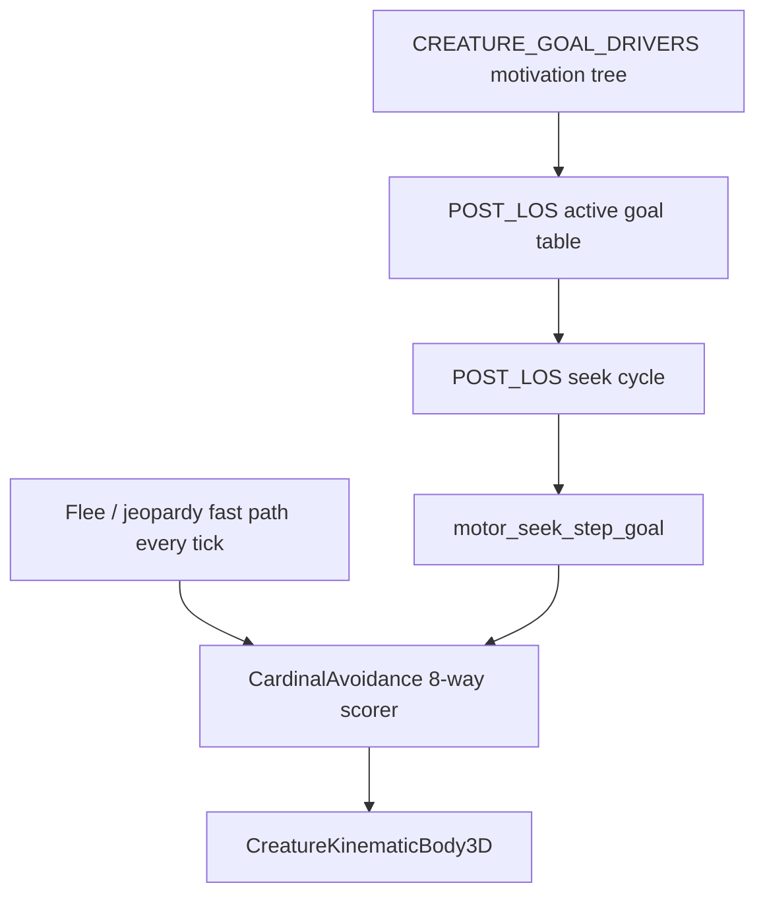

# POST_LOS movement — navigation / seek planner (draft)

> **Purpose:** **Navigation and seek-cycle contract** for the ENGINE motor refactor. This file owns the **planning layer** between motivation/goals and cardinal execution: active goal table, Observation-driven replan cadence, clear-path checks, multistep decomposition, explore/backtrack.
>
> **Parent roadmap:** [CREATURE_MOVEMENT_V2.md](CREATURE_MOVEMENT_V2.md) remains the **source of truth for refactor phasing** (Phases 1–7 + **Phase 4.5** POST_LOS). This doc is the **authoritative design** for Phase 4.5 implementation details; phase exit criteria live in **CREATURE_MOVEMENT_V2 §G.5.2.5**.
>
> **Sibling contracts:** motivation tree — [CREATURE_GOAL_DRIVERS.md](CREATURE_GOAL_DRIVERS.md); beliefs / locale priors — [CREATURE_MEMORY.md](CREATURE_MEMORY.md); Observation stat hook — [CREATURE_ATTRIBUTES_USAGE.md](../Definitive_Features/CREATURE_ATTRIBUTES_USAGE.md) §3.5.
>
> **Tier:** Draft (tier II) — decision trees below are normative intent; §§2–7 add implementable contracts. Resolve `<<Question>>` / `<<Comment>>` markers before expanding pilot beyond obstructed seek.

---

## 1. Architectural placement (three layers)

POST_LOS **does not replace** [`cardinal_avoidance.gd`](../../creature/motor/cardinal_avoidance.gd). It sits **above** execution and **below** motivation.



| Layer | Owner doc | Cadence |
|-------|-----------|---------|
| Motivation / Tier-2 | [CREATURE_GOAL_DRIVERS.md](CREATURE_GOAL_DRIVERS.md) | Slow loop (every **n** ticks) + salient writes on outcomes |
| POST_LOS planner | **This file** | Slow loop (every **n** ticks) for goal table + path replan; **step execution** every physics tick |
| Cardinal motor | [CREATURE_MOVEMENT_V2.md](CREATURE_MOVEMENT_V2.md) §A.2 | Every physics tick |
| Acute threat | [CREATURE_MOVEMENT_V2.md](CREATURE_MOVEMENT_V2.md) §A.2.3 | **Every tick** — bypasses planner |

**Today (pre–Phase 4.5):** per-tick `dominant_tier2_leaf` + `motor_seek_goal_pos` + reactive escape overrides in [`ai_driver.gd`](../../AI_int_lib/ai_driver.gd). POST_LOS consolidates path/stuck decisions those overrides approximate.

---

## 2. Decision trees (normative intent)

### 2.1 Top-level movement tree

```
      -------------------
      | Is active goal  |
      | location known? |
      -------------------
          no |  | Yes
          ___    ___
          |        |
          V        V
      --------  ----------------
      | Seek |  | Is there  a  |
      --------  | clear path   |
                | to the goal? |
                ----------------
                  yes | | no
                ______   ______
                |              |
                V              V
          ------------    -----------------
          | move to  |    | Calculate     |
          | the goal |    | optimal steps |
          ------------    -----------------
                                  |
                                  V
                            ------------------
                            | Make the first |
                            | step the new   |
                            | active goal.   |
                            ------------------
```

### 2.2 Goal consideration cadence

Every **n** physics ticks, the zone of awareness is re-evaluated and **goal consideration** runs on new observations.

- **n** is derived from the creature's **Observation** attribute — higher Observation ⇒ **more frequent** replans ([CREATURE_ATTRIBUTES_USAGE.md §3.5](../Definitive_Features/CREATURE_ATTRIBUTES_USAGE.md)).
- Maintain an **active goal table** (goals + weights). Empty table ⇒ no movement / rest model if applicable.
- **Goal consideration** weighs all candidate goals. When a goal decomposes into steps, the earliest unaccomplished step is the **primary step** for that goal. If another goal's weight exceeds the incumbent, discard the step chain.

<<Question: Should goal consideration replace per-tick `derive_dominant_tier2_leaf` (CREATURE_MOVEMENT_V2 §A.2.3), or run only every n ticks while dominant leaf still drives per-tick motor weights between replans?>>

### 2.3 Seek cycle tree

```
          --------
          | Seek |
          --------
              |
              V
      -----------------
      | Is this seek  |
      | part of a     |
      | larger goal?  |
      -----------------
        yes|    | no
        ----    -------------------------
        |                               |
        V                               |
    -------------                       |
    | Is goal   |                       |
    | target in |                       |
    | sight?    |                       |
    -------------                       |
    yes|      | No                      |
    ---       -------------------       |
    |                            |      |
    V                            V      V
  -----------               -----------------------
  | Is the  |               | Is there a visible  |
  | path    | <----------   | pattern that        |
  | clear?  |           |   | matches believed    |
  -----------           |   | goal targets?       |
  yes|     | No         |   -----------------------
  ----     ----------   |     yes |     | no
  |                 |   -----------     ---------
  V                 V                           |
------------  -------------------               V
| Go there |  | Is there enough |         -------------------------
------------  | information to  |         | Are there unexplored  |
              | calculate a     |         | locations in the      |
              | multistep clear |         | zone of awareness     |
              | path?           |         | with a clear path?    |
              -------------------         -------------------------
                yes |         | no                yes |         | no
                -----         --------                V         -------------
                |                     |             ---------------         |
                V                     V             | Go there    |         V
      ---------------------   -------------------   | and restart |   ---------------------
      | Generate the      |   | Pick path with  |   | Seek cycle  |   | Is there an area  |
      | path. Make first  |   | highest weight  |   ---------------   | behind that opens |
      | step the          |   | for getting     |                     | clear paths to    |
      | active goal.      |   | around blocker. |                     | unexplored areas? |
      ---------------------   -------------------                     --------------------
                |                      |                                 yes |      | no
                V                      V                                ------      -------
          ------------          ---------------                         |                 |
          | Go there |          | Go there    |                         V                 V
          ------------          | and restart |                   ---------------   ---------------
                                | Seek cycle  |                   | Go there    |   | backtrack   |
                                ---------------                   | and restart |   | and restart |
                                                                  | Seek cycle  |   | Seek cycle  |
                                                                  ---------------   ---------------
```

---

## 3. Data structures

### 3.1 `ActiveGoal`

| Field | Type | Role |
|-------|------|------|
| `goal_kind` | `String` | Engine `GoalKind` id ([CREATURE_GOAL_DRIVERS.md §4.1](CREATURE_GOAL_DRIVERS.md)) |
| `weight` | `float` | Goal consideration score this replan tick |
| `ultimate_pos` | `Vector3` | World target (prey, bush, remembered belief, patrol anchor) |
| `step_chain` | `PackedVector3Array` | Multistep path waypoints; empty = direct seek |
| `step_index` | `int` | Index of current step in `step_chain` |
| `source` | `String` | `live` \| `belief` \| `locale_prior` \| `explore` \| `backtrack` |

### 3.2 `StepPlan` (per-tick output to motor)

| Field | Type | Role |
|-------|------|------|
| `ultimate_goal` | `Vector3` | Original target before decomposition |
| `step_goal` | `Vector3` | Cardinal pull target this tick (first nav waypoint or ultimate) |
| `step_mode` | `String` | `direct` \| `navmesh` \| `detour_weighted` \| `explore` \| `backtrack` \| `none` |
| `path_valid` | `bool` | Multistep chain available when direct path blocked |

### 3.3 Replan scheduler

| Key | Default | Consumer |
|-----|---------|----------|
| `post_los_replan_base_ticks` | **8** | [`seek_planner.gd`](../../creature/motor/seek_planner.gd) `observation_replan_interval_ticks` |
| Observation input | `stat_observation` or `curr_point_observ` | <<Question: Which Observation field drives n — base stat, current pool, or max pool?>>

**Formula (pilot — subject to tuning):**

```text
n = max(1, round(post_los_replan_base_ticks * lerp(2.0, 0.5, observation_clamped / 100)))
```

Higher Observation ⇒ smaller **n** ⇒ more frequent goal/path replans.

<<Comment: Pools not wired today ([SHARED_STATTOPOINT_PLAN.md](SHARED_STATTOPOINT_PLAN.md)); pilot uses `stat_observation` from body definition until pools land.>>

---

## 4. Algorithms (Phase 4.5 pilot scope)

### 4.1 Clear-path test

**Pilot (shipped v0):** physics-ray LoS from creature eye to goal centroid — same threshold as live ingest (**>60%** occluded = blocked) via [`line_of_sight.gd`](../../creature/motor/line_of_sight.gd).

<<Question: Should clear-path also require a capsule sweep along the direct corridor (static AABB footprint test as in `_predator_hunt_chase_blocked`), or is LoS ray sufficient for Phase 4.5 pilot?>>

When `motor_los_ctx.enabled` is false (no `space_state`), **pilot assumes direct path clear** and skips navmesh decomposition.

<<Comment: Headless tests without physics world rely on this fallback; duel mains always have space_state.>>

### 4.2 Multistep path (pilot)

When direct path is **not** clear and navmesh map RID is valid:

1. `NavigationServer3D.map_get_path(map, from, to, optimize=true)` ([`nav_path_hint.gd`](../../environment/nav_path_hint.gd)).
2. If `path.size() >= 2`, set `step_goal = path[1]` (first waypoint after start).
3. Expose on `MotorContext`: `motor_seek_ultimate_goal`, `motor_seek_goal_pos` (= step), `motor_seek_planner_mode`.

<<Question: Navmesh-only for multistep, or also support static-obstacle detour picker (`_predator_obstructed_hunt_intent`) when navmesh path empty?>>

**Pack gate (pilot):** `post_los_seek_planner_enabled` in `creature_motor` (default **false** in spine; fox duel pack enables for playtest).

### 4.3 Explore / backtrack (deferred past pilot)

| Branch | Existing primitive | POST_LOS target |
|--------|-------------------|-----------------|
| Unexplored + clear path | `explore_coverage_cell`, `_predator_coverage_seek_hint` | Seek cycle "unexplored locations" branch |
| Weighted detour around blocker | `_predator_obstructed_hunt_intent`, `seek_occlusion_step_cost` | "Pick path with highest weight" branch |
| Backtrack | [`blocked_approach_memory.gd`](../../creature/motor/blocked_approach_memory.gd) | Explicit backtrack + restart seek cycle |

<<Question: Does backtrack push a position onto a stack, or only flip heading via blocked-approach TTL memory?>>

### 4.4 Fast vs slow loop contract

| Event | Cadence | Bypass planner? |
|-------|---------|-----------------|
| Flee / `tactic_jeopardy_egress` | Every tick | **Yes** — existing flee locks |
| Starvation override (Tier-2 priority 0) | Every tick | No — but seek target may change per tick via hunger |
| Goal table + path replan | Every **n** ticks | — |
| Step execution toward `step_goal` | Every tick | No — cardinal scorer consumes `motor_seek_goal_pos` |

<<Question: During flee, should the active goal table freeze or clear entirely?>>

---

## 5. Code map (Phase 4.5)

| Module | Role | Status |
|--------|------|--------|
| [`creature/motor/seek_planner.gd`](../../creature/motor/seek_planner.gd) | `resolve_step_goal`, `direct_path_clear`, `observation_replan_interval_ticks` | **Pilot** |
| [`environment/nav_path_hint.gd`](../../environment/nav_path_hint.gd) | `first_waypoint_world` — nav polyline first step | **Pilot** |
| [`AI_int_lib/ai_driver.gd`](../../AI_int_lib/ai_driver.gd) | `_build_motor_context` wires step goal; future goal table + replan tick | **Pilot** |
| `creature/motor/post_los_goal_table.gd` | Active goal table + consideration | **Deferred** |
| [`cardinal_avoidance.gd`](../../creature/motor/cardinal_avoidance.gd) | Unchanged execution scorer | Live |
| [`goal_visibility_latch.gd`](../../creature/motor/goal_visibility_latch.gd) | Seek cycle "target in sight?" stability | Live — fold into seek cycle Phase 4.5b |

### 5.1 MotorContext keys (pilot)

| Key | Type | Meaning |
|-----|------|---------|
| `motor_seek_goal_pos` | `Vector3` | Step goal for cardinal pull (may differ from ultimate) |
| `motor_seek_ultimate_goal` | `Vector3` | Original seek target before planner decomposition |
| `motor_seek_planner_mode` | `String` | `direct` \| `navmesh` \| `none` |
| `post_los_seek_planner_enabled` | `bool` | Pack flag — gate pilot path |

### 5.2 Overrides to retire (incremental — Phase 4.5d)

After pilot proves out in playtest + headless tests, deprecate in batches:

1. `_predator_latched_obstructed_hunt_intent` when `motor_seek_planner_mode == navmesh`
2. Duplicate occlusion flank when planner owns detour
3. Species-specific pinch/patrol escape pickers as explore/backtrack branches land

<<Comment: Do not delete overrides until [CREATURE_GOALS_PLAYTEST_LOG.md](../Completed_Features/CREATURE_GOALS_PLAYTEST_LOG.md) rows for south-wall pinch + mid-field obstructed hunt regress green with planner enabled.>>

---

## 6. Phase 4.5 exit criteria

Tracked in [CREATURE_MOVEMENT_V2.md §G.5.2.5](CREATURE_MOVEMENT_V2.md).

**Pilot (4.5a — obstructed seek):**

- [x] `seek_planner.gd` + `nav_path_hint.first_waypoint_world` shipped
- [x] `ai_driver` sets `motor_seek_ultimate_goal` / step goal when `post_los_seek_planner_enabled`
- [x] Headless tests: `_test_seek_planner_replan_interval`, `_test_seek_planner_resolve_disabled_and_no_los`, `_test_nav_path_hint_first_waypoint_invalid_map`
- [x] Fox pack enables pilot flag
- [ ] Playtest row logged — editor re-run pending

**Follow-on (4.5b–d):** goal table, Observation replan scheduler, explore/backtrack branches, override retirement — blocked on resolving §2–§4 `<<Question>>` items.

---

## 7. Playtest symptoms → POST_LOS mapping

| Symptom ([CREATURE_GOALS_PLAYTEST_LOG.md](../Completed_Features/CREATURE_GOALS_PLAYTEST_LOG.md)) | Current patch | POST_LOS branch |
|----|-----|-----|
| Fox N–S oscillation at south-wall boulder | `pinch_esc`, latched escape | Multistep path or weighted detour |
| Fox NE corner / off-playfield | 8-way rim tangent, corner latch | Clear path + step toward interior |
| Rabbit torn N boulder / S food | Occlusion flank + food latch | Goal table weight + path to primary step |
| Fox never reaches opposite rim | Patrol coverage, trail repulsion | Explore unexplored + clear path |
| Cone-edge prey flicker | `goal_visibility_latch` | Seek cycle "target in sight?" |

---

## 8. Changelog

| Date | Change |
|------|--------|
| 2026-06-10 | **Phase 4.5 spec:** architectural placement, data structures, pilot algorithms, code map, `<<Question>>` / `<<Comment>>` for first design round; parent link to CREATURE_MOVEMENT_V2. |
